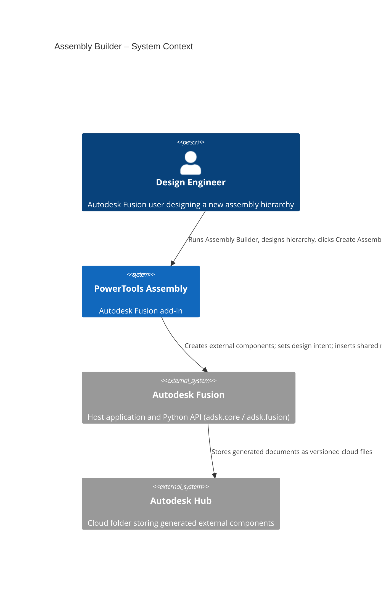
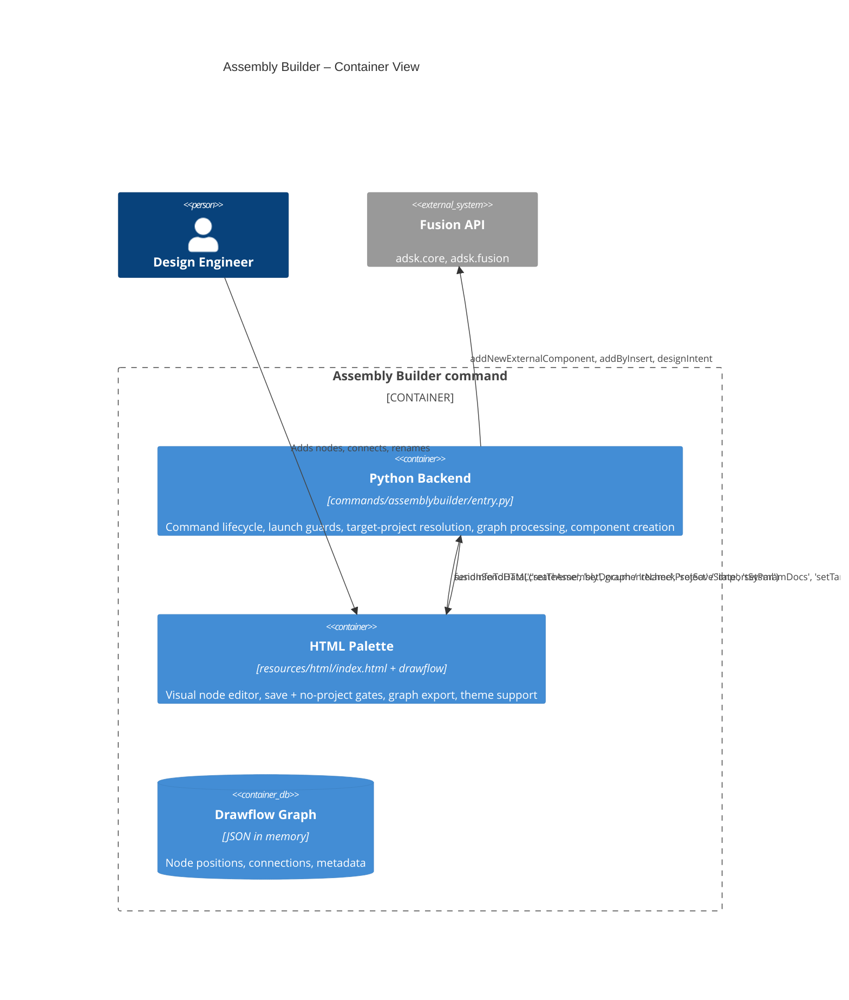
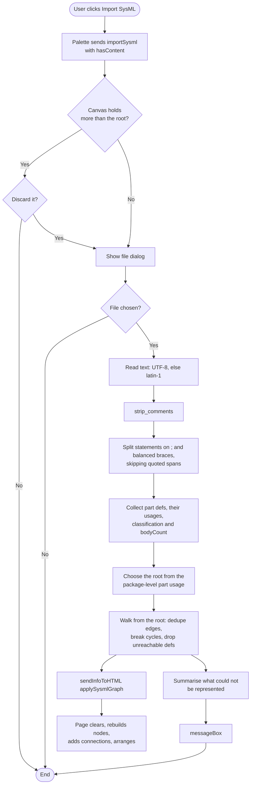
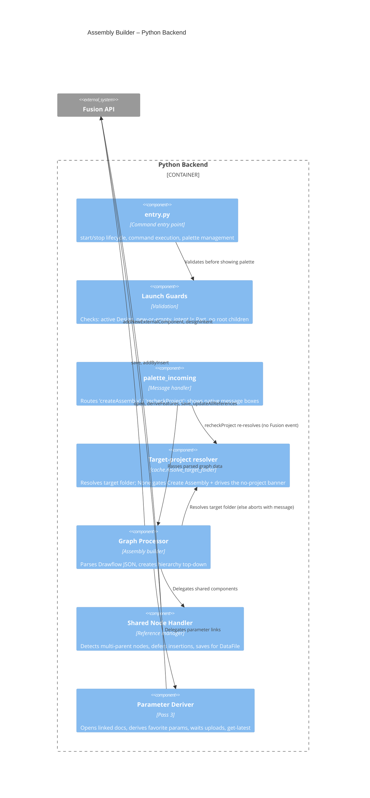
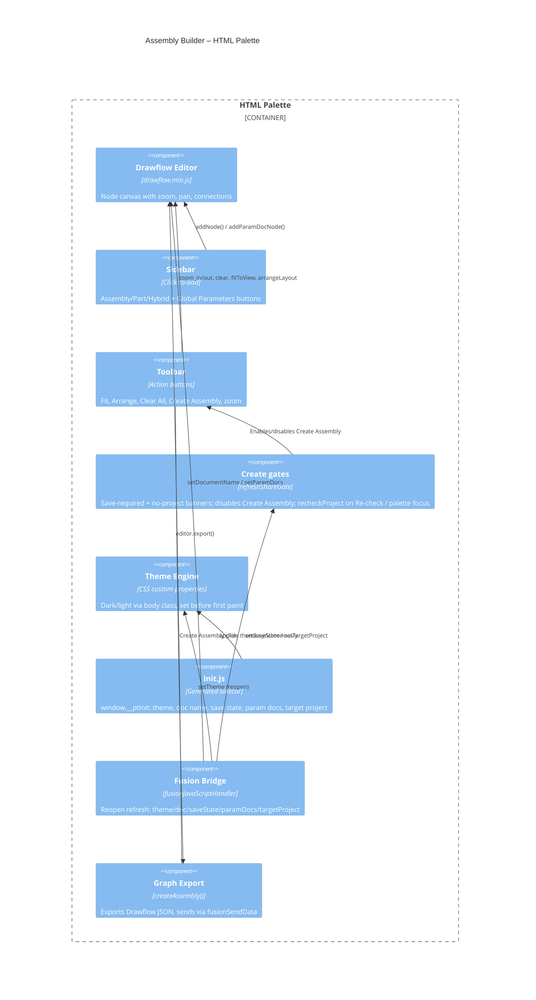
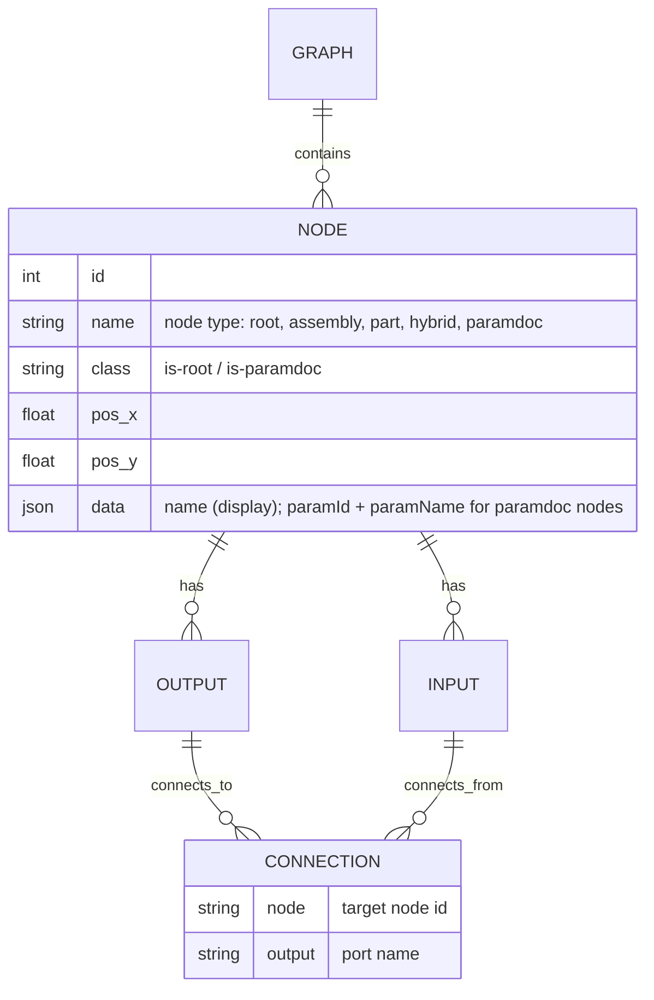

# Assembly Builder — Architecture
[← Assembly Builder guide](../Assembly%20Builder.md)

## Architecture

Assembly Builder bridges an HTML/JS palette (running in Fusion's QT WebEngine) and the Fusion Python API. The palette hosts the Drawflow node editor; the Python backend validates launch conditions, receives the exported graph, and creates documents.





### SysML physical view import

`sysml_import.py` is the inverse of the Export SysML Architecture Document
command: it reads `part def` blocks and their nested `part` usages back into the
node graph. It imports no `adsk` — `entry.py` supplies the dialogs and the file
read, and everything about parsing, kind inference, root selection and graph
shape is decided in the pure module and unit tested
(`tests/test_assemblybuilder_sysml_import.py`).



The round trip is pinned by a test that generates its fixture with the export
renderer rather than transcribing one, so a change to either side that breaks
the pair fails.





### Assembly creation sequence

```mermaid
sequenceDiagram
    participant User
    participant Palette as HTML Palette
    participant Python as Python Backend
    participant Fusion as Fusion API

    opt No target project (activeProject raises id.size())
        Palette->>Palette: Show no-project banner, disable Create Assembly
        User->>Palette: Select project in Data Panel; Re-check / palette focus
        Palette->>Python: fusionSendData('recheckProject')
        Python->>Palette: sendInfoToHTML('setTargetProject') (clears banner, enables Create)
    end

    User->>Palette: Click "Create Assembly"
    Palette->>Palette: editor.export() -> JSON graph
    Palette->>Python: fusionSendData('createAssembly', graph)

    Python->>Python: Parse JSON, find root, detect shared + param links
    Python->>Python: cache.resolve_target_folder() [else abort with message]

    rect rgb(238,244,250)
    note right of Python: Pass 1 — build
    loop For each structural child (top-down)
        Python->>Fusion: addNewExternalComponent(name, folder, transform)
        Python->>Fusion: design.designIntent = type
    end
    end

    rect rgb(238,244,250)
    note right of Python: Pass 2 — flush + shared inserts
    Python->>Fusion: doc.save() [flush external docs]
    loop For each deferred shared insert
        Python->>Fusion: addByInsert(dataFile, transform, true)
    end
    end

    opt Parameter links exist
    rect rgb(238,244,250)
    note right of Python: Pass 3 — derive params (progress dialog)
    loop For each linked component
        Python->>Fusion: documents.open(dataFile)
        Python->>Fusion: deriveFeatures (favorite params)
        Python->>Fusion: doc.save("Updated with Assembly Builder")
        Python->>Fusion: wait_for_upload(...)
    end
    Python->>Fusion: root.updateAllReferences() + save
    end
    end

    Python->>Palette: Hide palette
    Python->>Fusion: ui.messageBox (native result/warnings)
    Fusion-->>User: Result message
```

### Drawflow graph data model



## Design decisions

### Why Drawflow over Flowy?
Flowy only supports tree structures with connections made at drop time. Drawflow supports arbitrary connections between existing nodes, shared components (multi-parent), built-in zoom/pan, and a simpler API.

### Why click-to-add instead of drag-and-drop?
Fusion's QT WebEngine palette intercepts native HTML5 drag events at the widget level before they reach the Chromium rendering layer. Click-to-add uses standard mouse events, which work reliably across Windows and macOS.

### Why top-down creation with `addNewExternalComponent`?
Top-down creation builds the structural tree first. A single flush save then establishes the cloud `DataFile` references that `addByInsert` (shared parts) and document-open (parameter derive) both require — without ever surfacing Fusion's save-as dialog mid-run.

### Why gate Create Assembly on a target project?
Every node is built with `addNewExternalComponent(name, folder, transform)`, so the run needs a target `DataFolder`. That folder came from `app.data.activeProject.rootFolder`, which raises `InternalValidationError('id.size()')` when the Data Panel has no project in context — previously aborting the whole build. Resolution now goes through the shared `cache.resolve_target_folder()` (the same helper the Assembly Palette command uses), and the palette gates *Create Assembly* behind a **no target project** banner alongside the existing save-required banner (the project gate takes precedence). Fusion emits no active-project-changed event, so the banner re-checks on demand — a **Re-check** button and automatically when the palette regains focus (`recheckProject`). The Create path also re-resolves defensively and returns an actionable message if the gate was somehow bypassed.

### Why a separate parameter-derive pass?
Deriving favorite parameters requires opening each target component as its own document (the same mechanism used by **Link Global Parameters**). Doing this after the tree is built and flushed means every target already has a `DataFile`. Each per-document save is awaited (cloud uploads are asynchronous) before the root runs `updateAllReferences()`, so the assembly references the freshly-derived versions rather than stale ones.

### Why direct global-parameter links instead of a global toggle?
A `paramdoc` node's output connects to the input of each component that should derive it, so the graph itself records exactly which components get which parameter set — parts included (parts have no output port, so the link is made into the part's input). Each parameter document can be added only once; its sidebar button reflects whether the node is on the canvas.

### Why a generated `init.js` instead of a message handshake?
Fusion's palette loads asynchronously, and `palettes.add()` rejects a query string on the URL. Writing `resources/html/init.js` (theme, document name, save state, parameter docs) **before** creating the palette lets the page read `window.__ptInit` synchronously and apply the theme before the first paint — deterministic, with no round-trip and no flicker. A reopened palette (page already loaded) is refreshed via `sendInfoToHTML` instead.

### Why does the parser track an "owner" rather than just reading definitions?
SysML v2 records composition in two places and real models use both. The export command puts children inside each `part def`, because it writes one definition per unique component. A hand-authored physical architecture instead nests usages under one top-level usage — `part rm500 : MowerProduct { part mower : MowerAssembly { part chassis : ChassisAssembly { … } } }` — so the definitions are empty declarations and every containment fact lives in the tree.

The first version read only the definition form. Against a real 1312-line architecture it found 56 definitions, zero children, and imported a single node while reporting 55 components as "not contained by the root assembly". Tracking the enclosing component instead — from a `part def` header *or* from the type of an enclosing usage — reads both forms with one rule, and takes that same file to 52 components and 51 links.

### Why is `item` excluded from composition?
SysML uses items for things that flow and for material definitions. The sample architecture declares `item def Material` and `item pa6gf30 : Material`, and binds them with `ref item :>> primaryMaterial = pa6gf30`. Accepting `item` as a component would import glass-filled nylon and 6082-T6 aluminium as parts of the mower.

### Why are variation points left out?
`variation part guidance : PhysicalItem { variant part rtkMast : …; variant part wireReceiver : …; }` says the product carries *either* an RTK mast *or* a wire receiver. Importing both would overstate the assembly, and picking one would be a guess. Neither is imported and the summary names them, so the choice stays with the person who knows which configuration they are building.

### Why prefer a top-level usage whose type has contents?
The root is normally the single package-level `part` usage that names the design. But a stakeholders package legitimately declares `part chiefEngineer : Role;` and seven more like it, all at package level and all contentless. Taking the first would import one empty node and discard the assembly. Preferring a candidate with contents, then the largest subtree, picks the design in every file tested; each fallback carries a warning because getting the root wrong silently reparents everything.

### Why does the import replace the graph instead of merging into it?
A merge would have to decide what a name collision means — same component, or two components that happen to share a name — and either answer is wrong half the time. Replacing is predictable, and Fusion asks for confirmation first whenever there is anything to lose. The import is also a starting point rather than an end state: the graph is meant to be reviewed and adjusted before **Create Assembly** runs.

### Why are quantities above one collapsed?
Drawflow's `addConnection` explicitly refuses a duplicate parent-to-child link (it scans the output's existing connections for the same target and port and returns without adding), so `part shaft : 'Shaft'[2]` cannot be represented as two edges. The alternatives were worse: emitting two *nodes* would create two differently-named external components rather than two instances of one, and dropping the count silently would leave the user believing the built assembly matches the model. So the link is made once and every collapsed quantity is named in the summary dialog.

### Why is reachability from the root the filter for what gets imported?
`create_assembly_from_graph` only walks down from the root node, so a definition nothing contains would sit on the canvas looking imported and never be built. Reporting it as *not imported* is the honest outcome. The same reasoning covers a usage whose type has no definition in the file.

### Why can the structure override the `classification` attribute?
A `part` node has no output port, so if a definition claims `classification = "part"` while nesting usages, its children would have nothing to attach to and the import would produce a silently broken graph. Where the two disagree the structure wins, becoming Hybrid when the definition also reports bodies and Assembly otherwise.

### Why does the imported root keep the document's name?
The root node *is* the active document — the assembly is generated into it — and renaming the node would not rename the document. Applying the model's root name would therefore only mislead. The imported root's children attach to the existing root node instead.

### Why top-to-bottom node layout?
Assembly hierarchies read naturally as trees flowing downward. Input ports at 12 o'clock (parent connection) and output ports at 6 o'clock (child connections) match this mental model.
