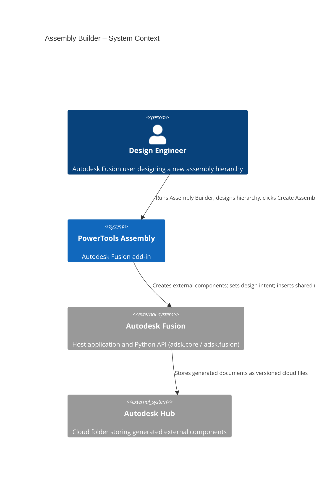
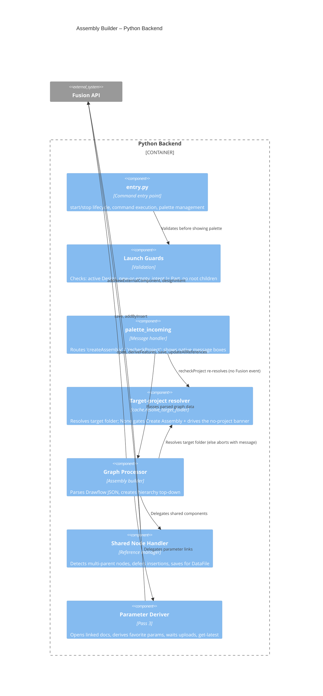
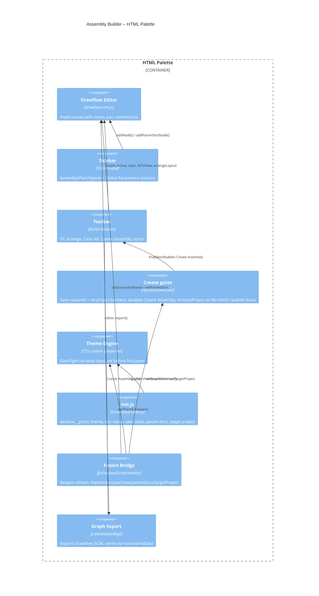
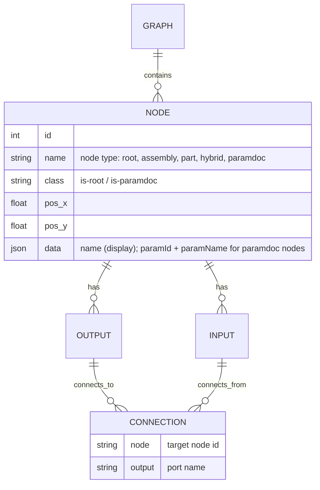

# Assembly Builder — Architecture
[← Assembly Builder guide](../Assembly%20Builder.md)

## Architecture

Assembly Builder bridges an HTML/JS palette (running in Fusion's QT WebEngine) and the Fusion Python API. The palette hosts the Drawflow node editor; the Python backend validates launch conditions, receives the exported graph, and creates documents.








### Assembly creation sequence

```mermaid
sequenceDiagram
    participant User
    participant Palette as HTML Palette
    participant Python as Python Backend
    participant Fusion as Fusion API

    opt No target project (activeProject raises id.size())
        Palette->>Palette: Show no-project banner, disable Create Assembly
        User->>Palette: Select project in Data Panel; Re-check / palette focus
        Palette->>Python: fusionSendData('recheckProject')
        Python->>Palette: sendInfoToHTML('setTargetProject') (clears banner, enables Create)
    end

    User->>Palette: Click "Create Assembly"
    Palette->>Palette: editor.export() -> JSON graph
    Palette->>Python: fusionSendData('createAssembly', graph)

    Python->>Python: Parse JSON, find root, detect shared + param links
    Python->>Python: cache.resolve_target_folder() [else abort with message]

    rect rgb(238,244,250)
    note right of Python: Pass 1 — build
    loop For each structural child (top-down)
        Python->>Fusion: addNewExternalComponent(name, folder, transform)
        Python->>Fusion: design.designIntent = type
    end
    end

    rect rgb(238,244,250)
    note right of Python: Pass 2 — flush + shared inserts
    Python->>Fusion: doc.save() [flush external docs]
    loop For each deferred shared insert
        Python->>Fusion: addByInsert(dataFile, transform, true)
    end
    end

    opt Parameter links exist
    rect rgb(238,244,250)
    note right of Python: Pass 3 — derive params (progress dialog)
    loop For each linked component
        Python->>Fusion: documents.open(dataFile)
        Python->>Fusion: deriveFeatures (favorite params)
        Python->>Fusion: doc.save("Updated with Assembly Builder")
        Python->>Fusion: wait_for_upload(...)
    end
    Python->>Fusion: root.updateAllReferences() + save
    end
    end

    Python->>Palette: Hide palette
    Python->>Fusion: ui.messageBox (native result/warnings)
    Fusion-->>User: Result message
```

### Drawflow graph data model



## Design decisions

### Why Drawflow over Flowy?
Flowy only supports tree structures with connections made at drop time. Drawflow supports arbitrary connections between existing nodes, shared components (multi-parent), built-in zoom/pan, and a simpler API.

### Why click-to-add instead of drag-and-drop?
Fusion's QT WebEngine palette intercepts native HTML5 drag events at the widget level before they reach the Chromium rendering layer. Click-to-add uses standard mouse events, which work reliably across Windows and macOS.

### Why top-down creation with `addNewExternalComponent`?
Top-down creation builds the structural tree first. A single flush save then establishes the cloud `DataFile` references that `addByInsert` (shared parts) and document-open (parameter derive) both require — without ever surfacing Fusion's save-as dialog mid-run.

### Why gate Create Assembly on a target project?
Every node is built with `addNewExternalComponent(name, folder, transform)`, so the run needs a target `DataFolder`. That folder came from `app.data.activeProject.rootFolder`, which raises `InternalValidationError('id.size()')` when the Data Panel has no project in context — previously aborting the whole build. Resolution now goes through the shared `cache.resolve_target_folder()` (the same helper the Assembly Palette command uses), and the palette gates *Create Assembly* behind a **no target project** banner alongside the existing save-required banner (the project gate takes precedence). Fusion emits no active-project-changed event, so the banner re-checks on demand — a **Re-check** button and automatically when the palette regains focus (`recheckProject`). The Create path also re-resolves defensively and returns an actionable message if the gate was somehow bypassed.

### Why a separate parameter-derive pass?
Deriving favorite parameters requires opening each target component as its own document (the same mechanism used by **Link Global Parameters**). Doing this after the tree is built and flushed means every target already has a `DataFile`. Each per-document save is awaited (cloud uploads are asynchronous) before the root runs `updateAllReferences()`, so the assembly references the freshly-derived versions rather than stale ones.

### Why direct global-parameter links instead of a global toggle?
A `paramdoc` node's output connects to the input of each component that should derive it, so the graph itself records exactly which components get which parameter set — parts included (parts have no output port, so the link is made into the part's input). Each parameter document can be added only once; its sidebar button reflects whether the node is on the canvas.

### Why a generated `init.js` instead of a message handshake?
Fusion's palette loads asynchronously, and `palettes.add()` rejects a query string on the URL. Writing `resources/html/init.js` (theme, document name, save state, parameter docs) **before** creating the palette lets the page read `window.__ptInit` synchronously and apply the theme before the first paint — deterministic, with no round-trip and no flicker. A reopened palette (page already loaded) is refreshed via `sendInfoToHTML` instead.

### Why are pre-existing components locked nodes rather than a two-way model?
The Assembly Palette's **Assembly Builder…** handoff was a dead end: the palette creates external components with `addNewExternalComponent`, and the Builder's launch guard refused any design whose root had occurrences. Those components are real occurrences whose *documents* exist only in memory until the parent is saved, so the fix is not to ignore them but to show them.

The guard now turns on save state instead of emptiness — an **unsaved** document may hold child components (its root still may not hold bodies or sketches, which the graph cannot represent), while a **saved** document must still be completely empty. `_snapshot_existing` walks the occurrences and the page seeds one node per entry.

They are **locked** — no rename, no delete, no re-parent, no second parent — because re-parenting is not an operation available here. `addByInsert` needs a cloud `DataFile` that a transient external component does not have, and Fusion exposes no move-between-parents call the add-in could use instead. A node the user can drag but that silently refuses to move is worse than one that visibly cannot. What a locked node *can* do is be a parent, and only when its document is still in memory and owned by this design: `create_children` already recursed into freshly-made external components (that is how multi-level trees were built pre-save all along), so adding a child to a palette-created component is a path the command has always exercised. A *saved* referenced component is seeded without an output port — its contents belong to its own document.

Nodes are keyed by **index path from the root**, not `entityToken` or `fullPathName`. Tokens are not persistent for entities in an unsaved document, and the document may well be saved mid-session to clear the shared-part gate; `fullPathName` breaks on rename. An index path is stable under everything the palette permits, precisely *because* restructuring is forbidden. Correctness does not rest on the key alone: `_resolve_existing_nodes` re-walks the design at create time and aborts with "the design changed, reopen the Builder" if a path or name no longer matches, rather than trusting an occurrence proxy captured when the palette opened.

Two smaller consequences. `find_shared_nodes` skips seeded ids (both in Python and in the JS mirror) — a locked node cannot gain a second parent, so counting it would trip the save-required banner for a hierarchy the user never built. And the root node is locked too: deleting it used to orphan the whole graph and quietly recreate it with a new id, which with seeded nodes present would strand every one of them.

### Why wrap `removeNodeId` and `removeConnection` specifically?
Drawflow is vendored and minified, so locking had to be pinned to something stable. Reading the bundle, both delete routes it offers — the Delete/Backspace key handler and the context menu's `drawflow-delete` button — funnel through exactly those two methods, so wrapping the pair covers every case rather than chasing DOM events. `removeConnection` reads `connection_selected.parentElement.classList`, whose entries are `[connection, node_in_node-<child>, node_out_node-<parent>, …]`; the guard checks the *child* end, and lets the removal through when the source is a `paramdoc` so parameter links stay editable.

Three layers, because Drawflow's internals are not a contract: the locked node's input port is styled dashed and unfilled to read as "not a drop target"; the context menu is suppressed on locked nodes in the capture phase; and `connectionCreated` repairs (on a `setTimeout(…, 0)`, so Drawflow's own pointer-up bookkeeping finishes first) any structural connection that still lands on a locked input. Pointer events are deliberately *not* disabled on that port — a global-parameter wire is dropped on the same target and must still work.

### Why top-to-bottom node layout?
Assembly hierarchies read naturally as trees flowing downward. Input ports at 12 o'clock (parent connection) and output ports at 6 o'clock (child connections) match this mental model.
