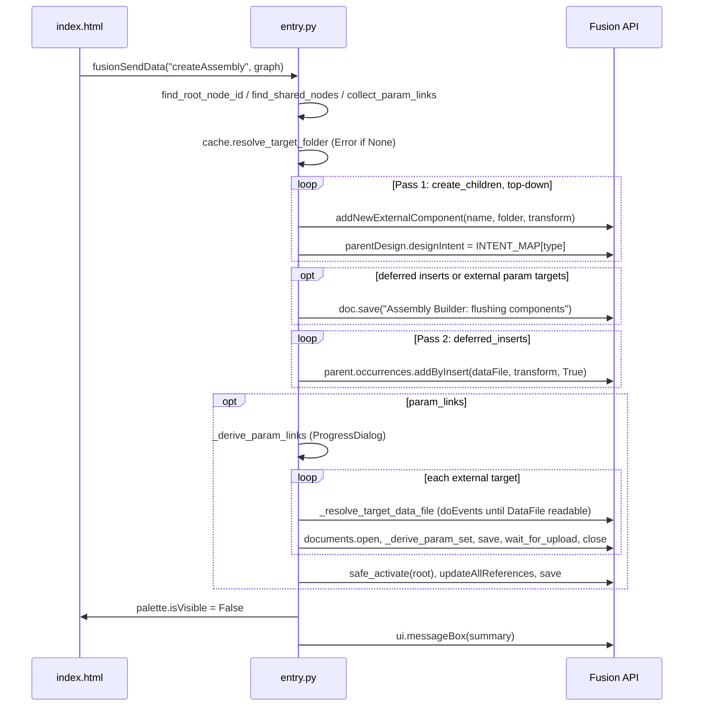
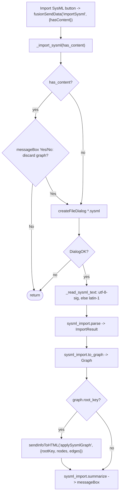

# Assembly Builder — Architecture

[← Assembly Builder guide](../Assembly%20Builder.md)

| | |
|---|---|
| **Command ID** | `PTAT_AssemblyBuilder` |
| **Registry** | group `assembly` (`Assembly`); enabled by default |
| **UI location** | Power Tools panel (`config.my_panel_id`, Design workspace, Tools tab) via [`_ui_bootstrap.get_power_tools_panel`](architecture.md#_ui_bootstrap); not promoted. Opens the palette `config.assembly_builder_palette_id`, docked right, 800 × 600 |
| **Files** | `commands/assemblybuilder/entry.py` (Fusion contact), `commands/assemblybuilder/sysml_import.py` (`adsk`-free parser), `resources/html/index.html` (Drawflow node editor, `drawflow.min.js` / `drawflow.min.css`), `resources/html/init.js` (generated per open, git-ignored) |
| **Shared helpers** | [`ptutil.add_handler`](architecture.md#event_utils); [`ptutil.log`, `handle_error`, `require_document`](architecture.md#general_utils); [`ptutil.wait_for_upload`](architecture.md#upload_utils); [`cache_utils.get_active_project`, `list_param_docs`, `resolve_target_folder`, `target_project_label`, `safe_activate`](architecture.md#cache_utils); [`config`](architecture.md#config) palette id and panel ids |
| **Tests** | `tests/test_assemblybuilder_sysml_import.py` |

## Purpose

The user lays out an assembly hierarchy as nodes in a Drawflow canvas (root,
assembly, part, hybrid, plus global-parameter document nodes), optionally seeds
it from a SysML v2 physical view, and clicks **Create Assembly**. The backend
then creates every node as an external component with the right design intent,
inserts shared (multi-parent) components by reference, and derives linked
global-parameter sets into the components that link them. The constraint that
shapes the command is that `addByInsert` and opening an external component both
need a cloud `DataFile`, which only exists after a save — so creation runs in
three passes around one flush save.

## How it is wired

- `start()`: `addButtonDefinition(CMD_ID, …)`, `commandCreated -> command_created`,
  control added to the Power Tools panel. `stop()`: deletes the palette by id,
  then the panel control, then the definition.
- `command_created`: registers `execute -> command_execute` and
  `destroy -> command_destroy`. There are no `CommandInputs`, so Fusion runs
  `command_execute` straight away.
- `command_execute` — launch guards, each a `messageBox` and return: the active
  product must be a `Design` (`ptutil.require_document(CMD_NAME, "design")`,
  see [Document preconditions](architecture.md#document-preconditions)); a saved document is accepted only when
  `_design_is_empty` (no occurrences, bodies, sketches or timeline entries);
  intent must not be Part; the root must have no occurrences. Then, if the
  palette does not exist yet, `_write_init_js(_gather_palette_state())` runs
  **before** `palettes.add(...)` and the handlers `closed -> palette_closed`,
  `navigatingURL -> palette_navigating`, `incomingFromHTML -> palette_incoming`
  and `app.documentSaved -> document_saved` are attached. A floating palette is
  re-docked right; `isVisible` is set. A palette that already exists is
  refreshed with `_send_palette_init` instead (page already loaded, so an
  immediate push has no race).
- `_gather_palette_state`: theme (`userInterfaceTheme`, Device theme resolved by
  `_os_is_dark`), document name and `isSaved`, the global-parameter documents of
  the active project (`cache.get_active_project` + `cache.list_param_docs`,
  cached in `_param_doc_map`), and the target folder via
  `cache.resolve_target_folder` (`hasTargetProject`, `targetProject` label).
- `palette_incoming` routes three actions and answers `"OK"` for every one so
  the page never raises a browser alert:
  - `recheckProject` — `_send_target_project` re-resolves only the folder and
    pushes `setTargetProject` (banner Re-check button and page focus /
    visibility handlers).
  - `importSysml` (`{hasContent}`) — `_import_sysml`; exceptions are logged via
    `handle_error` and reported in a native dialog because a raise inside
    `incomingFromHTML` would otherwise vanish.
  - `createAssembly` (Drawflow export JSON) — `create_assembly_from_graph`;
    the returned message is shown as a native `messageBox` (critical icon when
    it starts with `Error:`).
- `document_saved`: reads only `activeDocument.isSaved` and pushes
  `setSaveState`, which drives the page's save-required gate.
- `palette_navigating`: `http*` URLs open externally. `command_destroy` clears
  `local_handlers`.

Page → Python messages: `createAssembly`, `importSysml`, `recheckProject`.
Python → page (`sendInfoToHTML`): `setDocumentName`, `setTheme`, `setSaveState`,
`setParamDocs`, `setTargetProject`, `applySysmlGraph`. The pattern is described
in [Palette to Python RPC](architecture.md#palette-to-python-rpc).

## Data and state

- Module state: `_param_doc_map` (`name -> DataFile`) and `_active_project_ref`,
  rebuilt by every `_gather_palette_state`; `local_handlers`.
- `resources/html/init.js` — written on every first-open with
  `window.__ptInit = {docName, theme, saved, paramDocs, hasTargetProject, targetProject}`.
- Param-doc discovery writes the project's parameter-docs cache through
  `cache_utils` (see [cache_utils](architecture.md#cache_utils)).
- No settings keys, no custom events, no temp files.

## Palette state handshake

`palettes.add()` rejects a query string on the URL and the page loads
asynchronously, so state is handed over as a generated sidecar script loaded
with `` inside a document name cannot break it. A reopened
palette (page already loaded) gets the same state through `sendInfoToHTML`.

## Create gates

`refreshShareGate()` in the page disables **Create Assembly** behind two banners.
The **no target project** banner (from `hasTargetProject`) takes precedence: every
node is built with `addNewExternalComponent(name, folder, transform)`, so without
a folder nothing can be created. Fusion has no active-project-changed event, so
the page re-checks on demand (Re-check button, window focus, visibility change).
The **save required** banner appears only when the graph has shared nodes or
parameter-document nodes and the document is unsaved, because both need the
root's `DataFile`. `create_assembly_from_graph` repeats both checks and returns
an actionable `Error:` message if either gate was bypassed.

## Assembly creation (`create_assembly_from_graph`)

The Drawflow export is read from `graph_data["drawflow"]["Home"]["data"]`, a
`node id -> node` map. Each node carries `name` (type: `root`, `assembly`,
`part`, `hybrid`, `paramdoc`), `class` (`is-root` / `is-paramdoc`), `data`
(`name`; `paramId` + `paramName` for `paramdoc`), and `inputs` / `outputs`
whose `connections` hold the target node ids. Helpers: `find_root_node_id`
(`is-root` class, else the first non-paramdoc node with no input connections),
`get_child_ids` / `get_parent_ids`, `is_param_node`,
`get_structural_child_ids` / `get_structural_parent_ids` (paramdoc links land
on the same input port as the structural parent, so they must be filtered
before counting parents), `find_shared_nodes` (more than one structural
parent) and `collect_param_links` (`target node id -> [paramdoc nodes]`).

- **Pass 1 — build.** `create_children` recurses top-down from the root
  component, calling `addNewExternalComponent(child_name, folder, transform)`
  and setting `parentDesign.designIntent` from `INTENT_MAP`. The first
  encounter of a shared node creates it; every later encounter is appended to
  `deferred_inserts`. `assembly` / `hybrid` children recurse.
- **Flush.** If there are deferred inserts or param links targeting external
  components, one `doc.save("Assembly Builder: flushing components")` turns
  every new external document into a `DataFile`. Root-only param links do not
  need it.
- **Pass 2 — shared inserts.** For each deferred entry the parent component is
  re-derived from `created_map` (or the root) rather than reusing the pass-1
  proxy, and `addByInsert(dataFile, transform, True)` inserts the reference.
  A missing `DataFile` is logged and skipped.
- **Pass 3 — parameters.** `_derive_param_links` shows a cancellable
  `ProgressDialog`, resolves each `paramdoc` node to a `DataFile`
  (`_resolve_param_data_file`: `_param_doc_map`, then `findFileById` on the
  project and `app.data`, then a rescan), and for each target component waits in
  `_resolve_target_data_file` until `parentDocument.dataFile` /
  `designDataFile` is readable — the flush save uploads asynchronously and the
  property raises until it lands, so the loop spins on `adsk.doEvents()` with a
  120 s cap, a 5 s heartbeat and the dialog's Cancel. It keeps the `DataFile`
  object, not its id: a just-flushed document's id is not yet resolvable
  through `findFileById`, whereas the object survives open/close. Each target
  is opened, `_derive_param_set` derives favorite parameters (mirrors Link
  Global Parameters: derive input at timeline position 0, params doc closed
  afterwards), the target is saved with `"Updated with Assembly Builder"` and
  the upload awaited with `ptutil.wait_for_upload`, then closed. Finally the
  root is re-activated (`cache.safe_activate`), `updateAllReferences()` pulls
  the derived versions, and the root is saved.
- The palette is hidden and a summary counts created components, shared
  references inserted, parameter sets derived, and any warnings.

This sequence shows the three passes and the one flush save between them.

```mermaid
sequenceDiagram
    participant Page as index.html
    participant Py as entry.py
    participant F as Fusion API
    Page->>Py: fusionSendData("createAssembly", graph)
    Py->>Py: find_root_node_id / find_shared_nodes / collect_param_links
    Py->>Py: cache.resolve_target_folder (Error if None)
    loop Pass 1: create_children, top-down
        Py->>F: addNewExternalComponent(name, folder, transform)
        Py->>F: parentDesign.designIntent = INTENT_MAP[type]
    end
    opt deferred inserts or external param targets
        Py->>F: doc.save("Assembly Builder: flushing components")
    end
    loop Pass 2: deferred_inserts
        Py->>F: parent.occurrences.addByInsert(dataFile, transform, True)
    end
    opt param_links
        Py->>Py: _derive_param_links (ProgressDialog)
        loop each external target
            Py->>F: _resolve_target_data_file (doEvents until DataFile readable)
            Py->>F: documents.open, _derive_param_set, save, wait_for_upload, close
        end
        Py->>F: safe_activate(root), updateAllReferences, save
    end
    Py->>Page: palette.isVisible = False
    Py->>F: ui.messageBox(summary)
```

## SysML physical view import

`sysml_import.py` is the inverse of the Export SysML Architecture Document
command and imports no `adsk`. `entry._import_sysml` does only the Fusion
parts: a Yes/No confirmation when the canvas holds more than the root, the file
dialog (`*.sysml`), `_read_sysml_text` (UTF-8 with BOM stripping, latin-1
fallback so a cp1252 file still imports), then `sysml_import.parse` →
`to_graph` → `summarize`, pushes `applySysmlGraph` with `{rootKey, nodes,
edges}` when a root was found, and shows the summary in a `messageBox`
(warning icon when nothing was imported). The page clears the canvas, rebuilds
the nodes, adds the connections, runs `arrangeLayout()` and refreshes the gate.

This flowchart shows the import path and its two early exits.

```mermaid
flowchart TD
    A["Import SysML button -> fusionSendData('importSysml', {hasContent})"] --> B["_import_sysml(has_content)"]
    B --> C{"has_content?"}
    C -- yes --> D{"messageBox Yes/No: discard graph?"}
    D -- No --> Z([return])
    C -- no --> E["createFileDialog *.sysml"]
    D -- Yes --> E
    E --> F{"DialogOK?"}
    F -- no --> Z
    F -- yes --> G["_read_sysml_text: utf-8-sig, else latin-1"]
    G --> H["sysml_import.parse -> ImportResult"]
    H --> I["sysml_import.to_graph -> Graph"]
    I --> J{"graph.root_key?"}
    J -- yes --> K["sendInfoToHTML('applySysmlGraph', {rootKey, nodes, edges})"]
    K --> L["sysml_import.summarize -> messageBox"]
    J -- no --> L
```

Parser design, each decided in the pure module and pinned by a test:

- **Composition is read from an owner, not only from definitions.** SysML v2
  records containment inside `part def` bodies (what the export command writes)
  and in a nested usage tree (`part rm500 : MowerProduct { part mower :
  MowerAssembly { … } }`, how a hand-authored architecture reads). `parse`
  tracks the enclosing component — from a `part def` header or from the type of
  an enclosing usage — so one rule reads both forms.
- **Only `part` contributes structure.** `item` is used for things that flow and
  for materials (`item pa6gf30 : Material`, bound by `ref item :>>`), so
  accepting it would import materials as components.
- **Variation points are left out and named in the summary.** `variation part
  guidance { variant part rtkMast … variant part wireReceiver … }` means
  *either*; importing both overstates the assembly, choosing one is a guess.
- **Root choice** prefers the single package-level `part` usage whose type has
  contents, then the largest subtree; each fallback carries a warning, because a
  wrong root silently reparents everything. A stakeholders package of
  contentless `part chiefEngineer : Role;` usages must not win.
- **The import replaces the graph.** A merge would have to decide what a name
  collision means; replacing is predictable and the page asks first when there
  is anything to lose. The imported root keeps the active document's name, since
  the root node *is* the document being generated into; the model's root
  children attach under it.
- **Multiplicities above one collapse to one edge** and are reported. Drawflow's
  `addConnection` refuses a duplicate parent→child link; two *nodes* would create
  two differently named external components rather than two instances.
- **Reachability from the root is the filter.** `create_assembly_from_graph` only
  walks down from the root, so a definition nothing contains is reported as not
  imported rather than left on the canvas looking built.
- **Structure overrides `classification`.** A `part` node has no output port, so
  a definition classified `part` that nests usages becomes Hybrid when it also
  reports bodies and Assembly otherwise; `CLASSIFICATION_KINDS` maps the export's
  spellings (`leaf`, `empty`, `subassembly`, …) onto the editor's three kinds.
- Cycles are broken (`MAX_DEPTH = 64` and an ancestor set), duplicate edges are
  emitted once, and the summary caps its lists at `SUMMARY_LIST_CAP = 20`.

## Editor choices

Drawflow supports arbitrary connections between existing nodes, which shared
(multi-parent) components need; tree-only editors cannot express them. Nodes are
added by click, not drag: Fusion's Qt WebEngine palette intercepts HTML5 drag
events before they reach the page. Global-parameter links are explicit edges
from a `paramdoc` node's output into each consumer's input (parts included, which
have no output port), so the graph itself records which components derive which
set; each parameter document can be on the canvas once and its sidebar button
reflects that (`refreshParamDocButtons`). Layout is top-to-bottom
(`arrangeLayout`).

## Tests

- `tests/test_assemblybuilder_sysml_import.py` — the parser end to end:
  comment stripping, name unquoting, definitions and usages, classification
  and structural kind inference, root selection, cycles, multiplicity
  collapsing, `item` / variation / metadata / interface exclusions, CRLF and
  encoding handling (`_read_sysml_text`), summary capping; a round trip that
  generates its fixture with `commands/exportsysml/render` so a change on
  either side fails; and page-contract checks that `importSysml` /
  `applySysmlGraph` strings, the `nodeTypes` keys and `entry.INTENT_MAP` agree.
- `entry.py` is Fusion-bound and is not exercised by the suite beyond
  `_read_sysml_text` and `INTENT_MAP`; nothing here is verified in Fusion on
  this branch except by the AST guards in `tests/test_command_contract.py` and
  `tests/test_command_abort.py`, which import it under the `adsk` stub. The
  icon set is not pinned in `tests/test_command_icons.py`.

## Learnings

- **Read SysML composition from the enclosing owner, not only from `part def`
  bodies.** The first parser read the definition form only; against a real
  1312-line architecture it found 56 definitions, zero children, and imported a
  single node while reporting 55 components as "not contained by the root".
  Tracking the owner takes the same file to 52 components and 51 links
  (`tests/test_assemblybuilder_sysml_import.py`, `USAGE_TREE` fixture).
- **A freshly flushed external document's `DataFile` is not readable until its
  upload lands.** `parentDocument.dataFile` raises "Failed to get temporary
  file" until then, and `app.data.findFileById` reports "file not found" for the
  new id. That race — not a stale proxy — is why only the first parameter target
  used to derive; `_resolve_target_data_file` waits for the property and keeps
  the `DataFile` object across open/close.
- **`app.data.activeProject.rootFolder` raises `InternalValidationError('id.size()')`
  with no project in context, and a raise inside `incomingFromHTML` is
  swallowed.** It aborted whole builds as "nothing happens"; resolution goes
  through `cache.resolve_target_folder` and the page gates Create (7535954).

---

*Copyright © 2026 IMA LLC. All rights reserved.*
