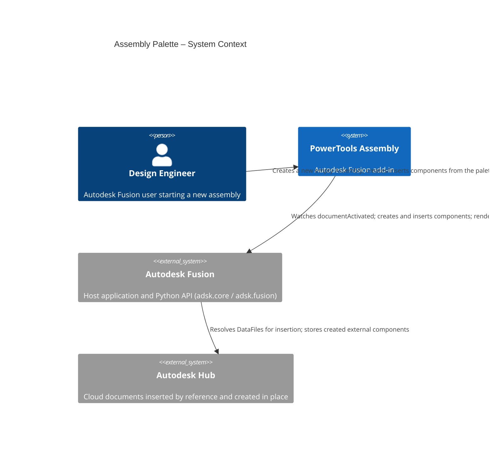
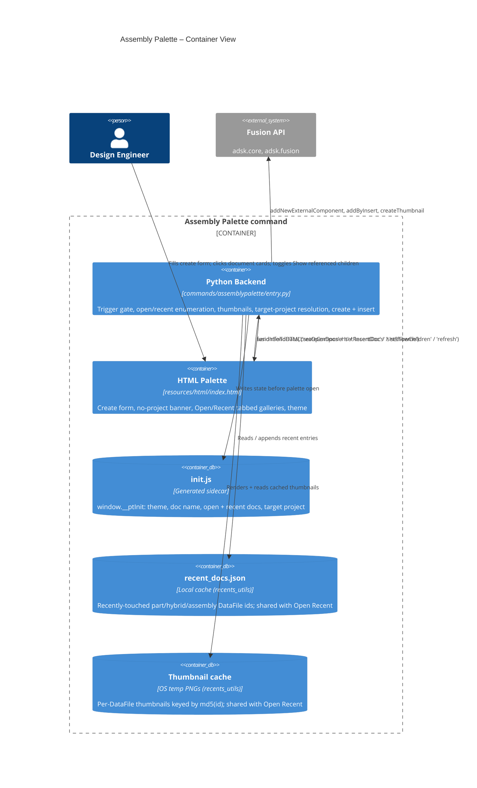
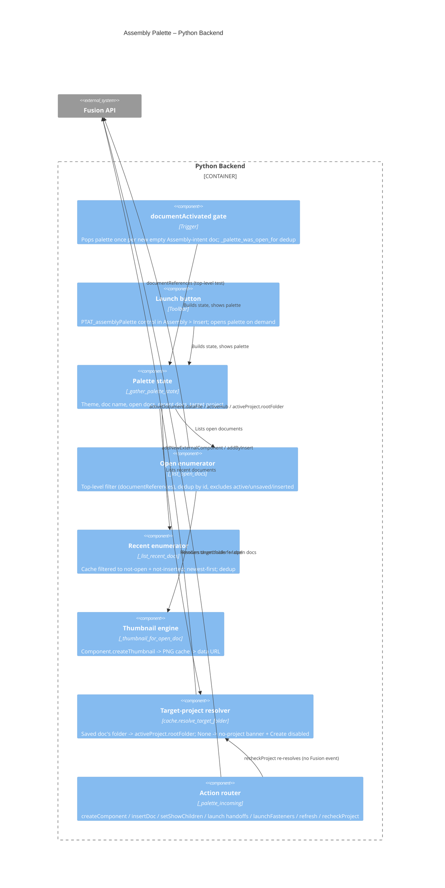

# Assembly Palette — Architecture
[← Assembly Palette guide](../Assembly%20Palette.md)

## Architecture

Assembly Palette bridges an HTML/JS palette (running in Fusion's QT WebEngine) and the Fusion Python API. The palette hosts the three quick-start sections; the Python backend watches for new empty Assembly documents, enumerates open and recent documents, renders thumbnails, and performs component creation and insertion.







### User flow

```mermaid
sequenceDiagram
    autonumber
    actor User
    participant Fusion
    participant Trigger as documentActivated gate
    participant Python as Python Backend
    participant Palette as HTML Palette

    User->>Fusion: File > New Design (Assembly intent)
    Fusion->>Trigger: documentActivated
    Trigger->>Trigger: Empty + unsaved + Assembly? not already shown?
    Trigger->>Python: _show_palette()
    Python->>Python: _gather_palette_state() (open + recent docs, thumbnails, target project)
    Python->>Palette: write init.js + palettes.add()

    opt No target project (activeProject raises id.size())
        Palette->>Palette: Show "no target project" banner + disable New Component
        User->>Palette: Select project in Data Panel; return to palette (focus) or click Re-check
        Palette->>Python: fusionSendData('recheckProject')
        Python->>Palette: sendInfoToHTML('setTargetProject') (clears banner, enables Create)
    end

    alt Create a component
        User->>Palette: Name + intent + New Component
        Palette->>Python: fusionSendData('createComponent')
        Python->>Python: cache.resolve_target_folder()
        Python->>Fusion: addNewExternalComponent + designIntent
    else Insert an open / recent document
        opt Show referenced children
            User->>Palette: Toggle checkbox
            Palette->>Python: fusionSendData('setShowChildren')
            Python->>Palette: sendInfoToHTML('setOpenDocs')
        end
        User->>Palette: Click document card
        Palette->>Python: fusionSendData('insertDoc', dataFileId)
        Python->>Fusion: occurrences.addByInsert(dataFile)
    else Hand off
        User->>Palette: Assembly Builder… / Global Parameters…
        Palette->>Python: fusionSendData('launch…')
        Python->>Fusion: commandDefinition.execute()
    else Fasteners
        User->>Palette: Fasteners ↗
        Palette->>Python: fusionSendData('launchFasteners')
        Python->>Fusion: itemById('FusionFastenersCommand').controlDefinition.isEnabled
        alt Enabled
            Python->>Fusion: commandDefinition.execute()
        else Disabled for this document
            Python->>User: messageBox explaining why
        end
    end

    Python->>Palette: sendInfoToHTML refresh (open + recent)
```

## Design decisions

### Why `documentActivated` instead of `documentOpened`?
`documentOpened` is not reliably emitted for **File > New** across Fusion builds (notably on macOS), while `documentActivated` fires consistently. It also fires on every tab switch, so a `_palette_was_open_for` gate (compared by Python object identity, not `id()`) suppresses re-popping the palette for a document it already handled. `documentOpened` is attached as a harmless backup when the running build exposes it.

### How does an insert continue into Edit Initial Position?
Fusion's own **Insert Component** is not one command but a chain: `FusionImportCommand` → `CommitCommand` → `SelectCommand` → `FitCommand` → `FusionMoveCommand`. `addByInsert` is only the import and commit, so a palette insert would otherwise land the component unselected at the origin.

`_finish_insert_like_fusion` adds the remaining three steps — select the new occurrence, `fit()` the viewport, then start the position command — and `_end_active_command` ends that command when a second card is clicked, so back-to-back inserts never call `addByInsert` from inside a running command. The final step is **Edit Initial Position** (`FusionDcEditInitialPositionCommand`) rather than Move/Copy: it edits the placement the insert itself recorded instead of stacking a separate Move feature on top of it. `FusionEditInitialPositionCommand` — Fusion ships two definitions with the same label and identical HUD and marking-menu entries, the `Dc` ("double click") variant and the plain one — is kept as a fallback in case a build ever differs; both resolve to the same command for the user.

**The whole difficulty was *when* the command is started, not which one.** Three false leads cost real time, so they are recorded here rather than re-derived:

- **Deferral, in two stages.** Running the chain straight from the palette's `incomingFromHTML` handler did nothing visible. Deferring it through a `customEvent` (`PTAT_assemblyPalette_finishInsert`, the same trick `commands/externalize/entry.py` needs for its `saveCopyAs` pipeline) was *still* not enough: fired inline, Fusion dispatches the handler within the same event turn, and the command that started was torn down again when the HTML event finished and the palette repainted — visible on screen as a dialog that flashed up and died together with the selection. The fire is therefore delayed on a `threading.Timer` (`_FINISH_DELAY_SECONDS`, 0.35s), which lands the handler on a later main-loop turn. `fireCustomEvent` is the one `Application` call documented as safe off the main thread and is all the worker does — **not** `ptutil.log`, which calls `Application.log`.
- **`controlDefinition.isEnabled` is not a usable gate for these two.** Both report `False` even when the command starts perfectly well, because they exist only in the marking menus and Fusion resolves that kind of command's availability while it builds the menu. The Fasteners handoff *does* gate on `isEnabled`, but that one is a real ribbon button where the flag means something; copying the pattern here skipped both ids outright. `execute()`'s own return value is no better — it answers `True` whether or not the command appears. `_try_start_command` therefore **observes** `ui.activeCommand`, and only falls back on `execute()`'s answer when activeCommand cannot be read at all.
- **`ui.activeCommand` does not update in the turn a command starts.** Read after a single `doEvents()` it reported `SelectCommand` for a command that visibly came up. `_active_command_id` pumps for `_COMMAND_START_WAIT_SECONDS` (0.4s) via `ptutil.pump_events_for` before believing an idle answer.

Two more Fusion behaviours worth knowing, both caught in `cache/powertools-debug.log`:

- `fireCustomEvent` is documented to return `True` on success but **returns `False` even when the event fires**. Treating `False` as "never fired" and clearing `_pending_finish` on it starved the handler that was already on its way — it arrived to an empty slot and returned. The return value is now ignored; only a raise counts as a failure to schedule.
- `Selections.add` returns a bool as well as being able to raise, so a selection can fail *silently* and leave every downstream command reading nothing. `_select_only` logs that return.

Things that turned out **not** to matter: `groundToParent` is `False` on a fresh insert and the dialog opens on it anyway, despite Fusion's tips text scoping the command to a grounded component; `isEnabled` is `False` on the id that works. `Occurrence.isVaildForEditInitialPosition` — spelled with the API's own typo — is still read first and blocks only when it answers `False` outright, since Fusion does refuse the edit for some occurrences such as patterned ones. Selecting the insert's **timeline node** instead of the occurrence was tried and is a dead end: `Selections.add` rejects a `TimelineObject` with `3 : invalid argument entity`.

### How are top-level documents told apart from referenced children?
Fusion answers this directly and instantly: `Document.documentReferences` raises *"Cannot get documentReferences of a non-top-level document"* for a reference-loaded child and returns the reference collection for a top-level document. The Open tab uses that in-memory check (no cloud round-trip) to show only the documents you opened directly. **Show referenced children** simply skips the filter.

### Why a generated `init.js` instead of a message handshake?
As with Assembly Builder, the palette loads asynchronously and `palettes.add()` rejects a query string on the URL. Writing `resources/html/init.js` (theme, document name, open docs, recent docs) **before** creating the palette lets the page read `window.__ptInit` synchronously and apply the correct theme before the first paint. A reopened palette is refreshed via `sendInfoToHTML` instead.

### Why render thumbnails with `Component.createThumbnail`?
The DataFile-backed cloud thumbnail did not resolve reliably in the target build. Rendering the live root component is dependable while a document is open, so thumbnails are generated for open documents and cached on disk (keyed by `md5(dataFileId)` in the OS temp folder). The Recent gallery — whose documents are closed and cannot be rendered — reuses whatever PNG was cached while the document was last open, falling back to a placeholder.

### Why is the recents cache shared with Open Recent?
The recents cache (`cache/recent_docs.json`) and the per-document thumbnail store were originally private to this command. The [Open Recent](./Open%20Recent.md) File-menu flyout surfaces the same list, so the data layer — cache format/location, thumbnail key scheme and rendering, and the `read`/`write`/`touch`/`list`/`remember` helpers — was extracted into `lib/ptAddInUtils/recents_utils` (mirroring how `cache_utils` owns the Global Parameters cache formats). Assembly Palette now delegates its recents helpers to that module, keeping one source of truth so the palette gallery and the File-menu flyout can never drift.

### Why a "no target project" banner (and manual re-check)?
A new external component needs a target `DataFolder` for its eventual save. The backend resolves one via `cache.resolve_target_folder()` — the active document's own folder when it is already saved, otherwise `app.data.activeProject.rootFolder`. That `activeProject` access raises `InternalValidationError('id.size()')` when the Data Panel has no project in context. Because a raise inside the palette's `incomingFromHTML` handler is swallowed by the `DEBUG`-gated `handle_error()`, this previously read to the user as **nothing happening** on *New Component*. The palette now surfaces an unresolved project as a banner and disables *New Component* until one is available. Fusion exposes **no active-project-changed event** (`Data.activeProject` is a plain property with no event), so the palette can't observe the user picking a project: it re-checks on demand instead — via a **Re-check** button on the banner and automatically when the palette page regains focus (a lightweight `recheckProject` message that re-resolves only the target folder). The same resolver and banner back the Assembly Builder's *Create Assembly* gate.

### Why does the Fasteners link execute a native command id, and why the `isEnabled` check?
Fasteners has no public insert API — `FastenerOccurrenceDefinition` is a preview class exposing only `updateSize()` / `isSizeUpToDate` for occurrences that already exist — so the only route is executing Fusion's own command definition. Its id, `FusionFastenersCommand`, is the button Fusion itself places in the `InsertAssemblePanel` (confirmed in Fusion's shipped `Resources/Toolbar/TabToolbars.xml` and `Resources/CommandDefinitions/CommandDefinitions.xml`); the editing variants use a bare `Fasteners*` prefix instead, so the naming is not symmetric and the insert id should not be guessed from them. Unlike the two PowerTools handoffs, this command is often legitimately **present but disabled** — Fusion blocks it for part-intent and direct-modeling designs, in the Form environment, for library and AnyCAD-derived components, and off-hub. `execute()` on a disabled definition is a silent no-op, which reads as a dead link, so `controlDefinition.isEnabled` is read first and the palette is left open with an explanation when it is false. The check is wrapped in `try/except` and defaults to *enabled* so a build that does not expose the control definition still lets Fusion make the call.

### Why a per-session "inserted" filter?
A document inserted from the palette is not "open in a tab," so the next refresh would re-list it under Recent and a second click would silently add a duplicate occurrence. Inserted DataFile ids are tracked for the current palette session and hidden from both galleries; the set is cleared each time the palette is opened so deliberate re-insertion is still possible in a fresh session.
