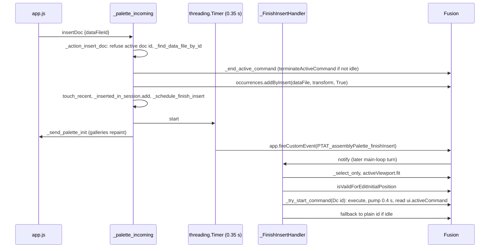

# Assembly Palette — Architecture

[← Assembly Palette guide](../Assembly%20Palette.md)

| | |
|---|---|
| **Command ID** | none — this is a palette. Its launch button is `LAUNCH_CMD_ID = "PTAT_assemblyPalette"`; the palette id is `config.assembly_palette_id` |
| **Registry** | group `assembly` (`Assembly`); enabled by default. `settings_store.RENAMED_COMMANDS` maps the former key `assemblyintent` to this module so stored preferences carry over |
| **UI location** | Launch button in two places (`LAUNCH_PLACEMENTS`): ASSEMBLY tab › INSERT panel (`InsertAssemblePanel`, created if missing, positioned after `PTAT_insertSTEP`) and SOLID tab › ASSEMBLE panel (`AssemblePanel`, Fusion's own, looked up only, after `FusionCreateNewComponentCommand`). Palette docked left, 420 × 720. Also pops automatically for a new, empty, unsaved Assembly-intent document |
| **Files** | `commands/assemblypalette/entry.py`; `resources/html/index.html`, `app.js`, `style.css`; generated per open and git-ignored: `resources/html/init.js`, `resources/html/intent-icons.css` |
| **Shared helpers** | [`ptutil.add_handler`](architecture.md#event_utils); [`ptutil.log`, `handle_error`, `pump_events_for`](architecture.md#general_utils); [`cache_utils.resolve_target_folder`, `target_project_label`, `get_active_project`](architecture.md#cache_utils); [`recents_utils`](architecture.md#recents_utils) (`THUMB_DIR`, `design_intent`, `intent_name`, `list_recent`, `touch_recent`, `remember_recent_if_eligible`, `cached_thumbnail_data_url`, `render_thumbnail_for_doc`, `store_thumbnail_object`, `png_to_data_url`); [`intent_icons.write_stylesheet`](architecture.md#intent_icons); [`config`](architecture.md#config) |
| **Tests** | `tests/test_assemblypalette_open_docs.py`, `tests/test_assemblypalette_thumbnails.py`, `tests/test_assemblypalette_edit_initial_position.py`, `tests/test_assemblypalette_fasteners.py`, `tests/test_assemblypalette_builder_gate.py` |

## Purpose

A docked quick-start palette for populating a new assembly: create an external
Part / Hybrid / Assembly component in place, insert an open or recent document
from a thumbnail gallery, or hand off to Assembly Builder, Global Parameters or
Fusion's Fasteners. It opens on its own when a new, empty Assembly-intent
document is activated and on demand from the launch button. The constraint that
shapes it is that everything here starts from a palette event: any Fusion
command it launches, and any cloud future it waits on, has to be moved to a
later main-loop turn through a timer-fired custom event.

## How it is wired

- `start()`: `app.documentActivated -> _on_document_activated` (primary trigger)
  and, when the build exposes it, `app.documentOpened -> _on_document_opened`
  (backup; the dedup gate handles overlap). The launch definition is reused if
  it already exists, otherwise `addButtonDefinition(LAUNCH_CMD_ID, …)`;
  `commandCreated -> _launch_command_created`; one control per
  `LAUNCH_PLACEMENTS` entry (`addCommand(cmd_def, position_ref, False)`, not
  promoted). Two custom events are unregistered-then-registered so a reload
  without a Fusion restart cannot stack handlers: `PTAT_assemblyPalette_finishInsert`
  (`_FinishInsertHandler`) and `PTAT_assemblyPalette_thumbTick`
  (`_ThumbTickHandler`).
- `stop()`: deletes the palette, removes the launch controls (panels and tabs
  are left: `insertSTEP` owns the shared INSERT panel's cleanup, the ASSEMBLE
  panel is Fusion's), deletes the definition, unregisters both events, resets
  the thumbnail pump, clears `_inserted_in_session` and `_palette_was_open_for`.
- `_launch_command_created` (no inputs, so the work is done here): toggles —
  a visible palette is torn down with `_tear_down_palette`, otherwise
  `_show_palette()`.
- `_maybe_show_palette_for(doc, source)` (both document events): a saved
  document is only passed to `recents.remember_recent_if_eligible`; an unsaved
  one must have a Design product with Assembly intent, be empty
  (`_design_is_empty`), and not be the object in `_palette_was_open_for`
  (compared with `is`), then `_show_palette()`.
- `_show_palette()`: clears `_inserted_in_session`, `_reset_thumb_pump()`,
  `deleteMe()` on any existing palette (a palette left in `ui.palettes` after
  `closed` can be internally torn down, and `isVisible` on it no-ops),
  `_write_init_js(_gather_palette_state())`, `_write_intent_icons_css()`,
  `palettes.add(...)`, handlers `closed -> _palette_closed`,
  `navigatingURL -> _palette_navigating`, `incomingFromHTML -> _palette_incoming`,
  re-dock left if floating, `isVisible = True`.
- `_gather_palette_state()`: `docName`, `theme` (`_theme_str`, Device theme via
  `_os_is_dark`), `showChildren`, `openDocs` (`_list_open_docs`), `recentDocs`
  (`_list_recent_docs`), `hasTargetProject` / `targetProject`
  (`cache.resolve_target_folder`, `cache.target_project_label`),
  `activeDocSaved` (`_active_doc_is_saved`, reads only `isSaved`).
- The page paints from `window.__ptInit`, then sends `htmlReady`; the backend
  answers with `_send_palette_init` (`setDocumentName`, `setTheme`,
  `setOpenDocs`, `setRecentDocs`, `setTargetProject`, `setActiveDocSaved`),
  because the embedded browser on Windows can serve a cached `init.js`.
- `_palette_incoming` actions (every one sets `returnData = "OK"`):

  | Action | Handler | Effect |
  |---|---|---|
  | `htmlReady` | `_send_palette_init` | full state push after page load |
  | `createComponent` `{name, intent}` | `_action_create_component` | `addNewExternalComponent` into `cache.resolve_target_folder()`, sets `designIntent`; then `_send_palette_init` |
  | `insertDoc` `{dataFileId, intent}` | `_action_insert_doc` | see the insert chain below; then `_send_palette_init` |
  | `setShowChildren` `{showChildren}` | sets `_show_children` | re-sends only `setOpenDocs` |
  | `requestThumbs` `{ids}` | `_action_request_thumbs` | answers from cache / live render, queues the rest for the pump |
  | `recheckProject` | `_send_target_project` | re-resolves the folder only; from the banner's Re-check button and the page's focus / visibility handlers |
  | `recheckDocSaved` | `_send_active_doc_saved` | from the same focus / visibility handlers |
  | `launchAssemblyBuilder` | `_execute_command("PTAT_AssemblyBuilder")` | refused with a message and a fresh `setActiveDocSaved` when the document is saved; otherwise hides the palette first |
  | `launchGlobalParameters` | `_execute_command("PTAT_globalParameters")` | hides the palette first |
  | `launchFasteners` | `_action_launch_fasteners` | `FusionFastenersCommand`; see below |
  | `refresh` (↻) | `_send_palette_init` | the only gallery repaint besides `htmlReady`, create and insert |

- `_palette_closed` → `_tear_down_palette`: clears the session set, pins
  `_palette_was_open_for = app.activeDocument` (so a spurious
  `documentActivated` right after close does not re-pop), `deleteMe()`.
- `_palette_navigating`: `http*` opens externally.

### The insert chain

`_action_insert_doc` refuses the active document's own `DataFile` id
(`_active_data_file_id`), resolves the `DataFile` (`_find_data_file_by_id`:
`findFileById` on `cache.get_active_project()` then `app.data`), ends any
running command (`_end_active_command`: `ui.terminateActiveCommand()` unless
`ui.activeCommand` is in `_IDLE_CMD_IDS`; safe here because a palette event has
no command of its own on the stack), calls
`rootComponent.occurrences.addByInsert(data_file, transform, True)` — which
returns `None` rather than raising, most often for a document in another
project — then `recents.touch_recent`, adds the id to `_inserted_in_session`
and calls `_schedule_finish_insert(occurrence)`.

`_schedule_finish_insert` stores the occurrence in `_pending_finish` and starts
a `threading.Timer(_FINISH_DELAY_SECONDS = 0.35, _fire_finish_event)`; the
worker calls only `app.fireCustomEvent(_FINISH_EVENT_ID)` and ignores its
return value. `_FinishInsertHandler.notify` (main thread, a later turn) runs
`_finish_insert_like_fusion`: `_select_only(occurrence)` (logs the bool
`Selections.add` returns), `activeViewport.fit()`, reads
`isVaildForEditInitialPosition` (the API's own spelling; only an explicit
`False` blocks), then `_start_edit_initial_position` tries
`_EDIT_POSITION_CMD_IDS` in order (`FusionDcEditInitialPositionCommand`, then
`FusionEditInitialPositionCommand`) through `_try_start_command`, which calls
`execute()` and *observes* the outcome with `_active_command_id()` —
`pump_events_for(_COMMAND_START_WAIT_SECONDS = 0.4)` then `ui.activeCommand` —
falling back to `execute()`'s return only when `activeCommand` is unreadable.
Each step degrades independently; the component is already in the assembly.
The pattern is written up in
[Insert and position a component from a palette](../dev/Insert%20and%20position%20a%20component%20from%20a%20palette.md)
and [Deferring work to a later main-loop turn](architecture.md#deferring-work-to-a-later-main-loop-turn).

This sequence shows the insert and the deferred chain, with the delay that
separates them.

```mermaid
sequenceDiagram
    participant Page as app.js
    participant In as _palette_incoming
    participant T as threading.Timer (0.35 s)
    participant H as _FinishInsertHandler
    participant F as Fusion
    Page->>In: insertDoc {dataFileId}
    In->>In: _action_insert_doc: refuse active doc id, _find_data_file_by_id
    In->>F: _end_active_command (terminateActiveCommand if not idle)
    In->>F: occurrences.addByInsert(dataFile, transform, True)
    In->>In: touch_recent, _inserted_in_session.add, _schedule_finish_insert
    In->>T: start
    In->>Page: _send_palette_init (galleries repaint)
    T->>F: app.fireCustomEvent(PTAT_assemblyPalette_finishInsert)
    F->>H: notify (later main-loop turn)
    H->>F: _select_only, activeViewport.fit
    H->>F: isVaildForEditInitialPosition
    H->>F: _try_start_command(Dc id): execute, pump 0.4 s, read ui.activeCommand
    H->>F: fallback to plain id if idle
```

### The thumbnail pump

Galleries are metadata only (`dataFileId`, `name`, `intent`). The page watches
cards with an `IntersectionObserver` and asks for a batch shortly before each
scrolls into view. `_action_request_thumbs` answers in the same turn what is on
disk (`recents.cached_thumbnail_data_url`) or renderable from an open document
(`_open_docs_by_data_file_id` built once per batch, then
`recents.render_thumbnail_for_doc`), queues the rest in `_thumb_queue` and
arms a tick. `_schedule_thumb_tick` starts a
`threading.Timer(_THUMB_TICK_SECONDS = 0.15, _fire_thumb_event)` unless a tick
is already pending and younger than `_THUMB_TICK_STALE_SECONDS = 2.0`.
`_ThumbTickHandler.notify` → `_pump_thumbs`: bail and reset if the palette is
gone or hidden; `_collect_finished_thumbs` (a `FinishedFutureState` future's
`dataObject` goes through `recents.store_thumbnail_object`; any other settled
state, or `ProcessingFutureState` older than `_THUMB_FUTURE_TIMEOUT_SECONDS =
20`, lands in `_thumb_missing`); `_start_queued_thumbs` starts at most
`_THUMB_START_PER_TICK = 3` downloads (`_find_data_file_by_id` is the cloud
round-trip; reading `.thumbnail` only starts the download) while
`len(_thumb_inflight) < _THUMB_MAX_INFLIGHT = 12`; `_send_thumbs` pushes
`setThumbs {id: dataURL}`; re-arm only while work remains. The page memoises
answers, so filtering and tab switches repaint from memory.

## Data and state

- Module state: `_palette_was_open_for` (Document object, `is`-compared),
  `_inserted_in_session` (DataFile ids, cleared on every open and close),
  `_show_children` (persists for the session), `_pending_finish`,
  `_finish_event_handler`, thumbnail pump state (`_thumb_queue`,
  `_thumb_inflight` `id -> (future, started)`, `_thumb_missing`,
  `_thumb_event_handler`, `_thumb_tick_pending`, `_thumb_tick_scheduled_at`).
  All pump state is touched only on the main thread.
- Constants: `RECENT_PAYLOAD_LIMIT = 300`, `_IDLE_CMD_IDS = ("", "SelectCommand")`,
  `_FUTURE_PROCESSING = 0`, `_FUTURE_FINISHED = 1`.
- Custom events: `PTAT_assemblyPalette_finishInsert`, `PTAT_assemblyPalette_thumbTick`.
- Disk, all owned by `recents_utils`: `cache/recent_docs.json`
  (`RECENT_CACHE_PATH`); thumbnails in `cache/thumbs/<md5(dataFileId)>.png`
  (`THUMB_DIR`, chosen once at import by writing a probe file, with
  `<tempdir>/powertools_assembly_thumbs` as the fallback and still read on a
  miss). Both stores are shared with Open Recent.
- Generated files: `resources/html/init.js` (`window.__ptInit`),
  `resources/html/intent-icons.css` (data-URI CSS variables from the SVGs in
  `lib/ptAddInUtils/assets`).
- No settings keys.

## Design notes

### Why `documentActivated` is the trigger
`documentOpened` is not reliably emitted for **File > New** on every build
(notably macOS); `documentActivated` is, but it also fires on every tab
switch, so `_palette_was_open_for` suppresses re-popping for a document already
handled. It holds the `Document` object and is compared with `is`, not `id()`:
`id()` of a garbage-collected wrapper can be reused.

### Why the active document is matched by `DataFile` id everywhere else
`app.activeDocument` and `Documents.item(i)` return different Python wrappers
around the same native document, so `id()` / `is` never match across two API
calls. `_list_open_docs` and `_list_recent_docs` both exclude
`_active_data_file_id()` (guarded: an unsaved document has no `DataFile`), and
`_action_insert_doc` re-checks at click time because the galleries repaint only
on ↻ and a Fusion tab switch can leave a stale card on screen. Without the
guard `addByInsert` returns `None` and the error path reports the misleading
"same project" message.

### Open tab: top-level documents
`Document.documentReferences` raises "Cannot get documentReferences of a
non-top-level document" for a reference-loaded child and returns the collection
for a document the user opened directly; `_is_top_level_doc` touches `.count`
so the accessor evaluates. It is an in-memory check with no cloud round-trip.
**Show referenced children** (`_show_children`) skips the filter. Unsaved
documents are excluded (`addByInsert` needs a `DataFile`), non-design and
non-part/hybrid/assembly documents are skipped, and cards are deduplicated by
`DataFile` id.

### Recent tab
`_list_recent_docs` is `recents.list_recent(exclude_ids, limit=300,
file_types=("f3d",))` — Fusion's own recents file overlaid with the shared
cache — so the gallery and the Open Recent flyout are the same list. Only the
active document and the session's inserts are excluded; open documents are
listed. The 300-entry payload lets the page filter across everything while
rendering the newest slice.

### Why a per-session "inserted" filter
A document inserted from the palette is not open in a tab, so the next refresh
would re-list it and a second click would silently add a duplicate occurrence.
Inserted ids are hidden from both galleries until the palette is reopened, so
deliberate re-insertion stays possible.

### Why thumbnails come from two sources and a pump
`Component.createThumbnail` renders a live root component — local and instant,
but only for an open document. `DataFile.thumbnail` downloads the 256 × 256 PNG
Fusion holds in the cloud and is the only route for a closed document, which is
most of the Recent gallery and all of it after a hub switch; a
`FailedFutureState` is the documented answer for "no thumbnail", a per-file
miss. That call returns a `DataObjectFuture`, and `adsk.core.Future` exposes only
`state` — no completion event — so a result can only be polled. Reference
Manager polls inline behind a modal progress bar; a palette the user is
scrolling cannot, hence one poll per timer-fired custom event with the
per-tick and in-flight throttles above. `_thumb_missing` is cleared on every
palette open because Fusion generates cloud thumbnails after a save.

### Why Edit Initial Position, and why it is observed rather than asked
Fusion's own Insert Component is a chain — `FusionImportCommand`,
`CommitCommand`, `SelectCommand`, `FitCommand`, `FusionMoveCommand`.
`addByInsert` is the import and commit; `_finish_insert_like_fusion` adds
select, fit and a position command, choosing Edit Initial Position over
Move/Copy because it edits the placement the insert recorded instead of
stacking a Move feature. Both Edit Initial Position definitions report
`controlDefinition.isEnabled == False` even when they start: they exist only in
marking menus and Fusion resolves their availability while building the menu.
`execute()` returns `True` whether or not the command appears. So
`_try_start_command` reads `ui.activeCommand` after a 0.4 s pump; read after a
single `doEvents()` it still says `SelectCommand` for a command that visibly
started. `isGroundToParent == False` is not a blocker despite the tips text.

### Fasteners
There is no public insert API (`FastenerOccurrenceDefinition` exposes only
`updateSize()` / `isSizeUpToDate`), so the palette executes Fusion's own
`FusionFastenersCommand`, the ASSEMBLY › INSERT button. Unlike the marking-menu
commands above it is a ribbon button whose `isEnabled` means something, and it
is often legitimately disabled (part intent, direct modeling, Form environment,
library or AnyCAD components, off-hub); `execute()` on a disabled definition is
a silent no-op, so `_action_launch_fasteners` reports the state and leaves the
palette open instead. An unreadable `controlDefinition` defaults to enabled.

### No target project banner
`addNewExternalComponent` needs a `DataFolder`. `cache.resolve_target_folder`
tries the saved active document's own folder, then `activeProject.rootFolder`
(which raises `InternalValidationError('id.size()')` with no project in the
Data Panel). Fusion has no active-project-changed event, so the page re-checks
on focus, on visibility change and via the banner's Re-check button, and
`_action_create_component` re-resolves and returns an actionable message if the
gate was bypassed.

### Assembly Builder only for an unsaved document
`activeDocSaved` disables the handoff button and swaps its hint. No
`documentSaved` handler exists (see Learnings), so the state is refreshed where
the palette already refreshes — open, `htmlReady`, ↻, after create — and on
every focus / visibility return via `recheckDocSaved`; `launchAssemblyBuilder`
re-checks at click time. Assembly Builder itself also accepts a saved-but-empty
document; the palette deliberately does not.

### Galleries repaint only on ↻
No application document event refreshes the galleries; a tab switch while the
palette is open leaves them stale until ↻, `htmlReady`, a create or an insert.
The reason is recorded under Learnings.

## Tests

- `tests/test_assemblypalette_open_docs.py` — `_list_open_docs`: active
  document excluded by `DataFile` id (distinct and same wrapper), unsaved and
  non-design documents skipped, every intent listed, dedup, session-insert
  filter, `_show_children` behaviour; `_action_insert_doc` refuses the active
  document and passes another.
- `tests/test_assemblypalette_thumbnails.py` — `_pump_thumbs` turn by turn with
  fake futures: cache hits answer immediately, open documents render locally,
  queueing and dedup, per-tick cap, finished / failed / wedged futures, negative
  cache, stop when the palette is gone, idempotent and stale-tick re-arm,
  `_reset_thumb_pump` clears the negative cache.
- `tests/test_assemblypalette_edit_initial_position.py` — `_try_start_command`
  routing (Dc preferred, `isEnabled False` ignored, fallbacks, unreadable
  `activeCommand`), the select → fit → position chain and its degradation, and
  `_schedule_finish_insert` (delayed fire, `False` return keeps the occurrence
  pending, a raising fire stays quiet on the worker thread).
- `tests/test_assemblypalette_fasteners.py` — `_action_launch_fasteners`:
  enabled hides and executes, disabled reports and leaves the palette open,
  missing definition, unreadable control definition, missing palette.
- `tests/test_assemblypalette_builder_gate.py` — `launchAssemblyBuilder` and
  `recheckDocSaved` routing on saved / unsaved / no document.
- `tests/test_command_abort.py` pins `_launch_command_created` in its guarded
  set; `tests/test_command_contract.py` lists this module in `KNOWN_NO_CMD_ID`
  and allows the two custom-event ids and `LAUNCH_CMD_ID`.
- Everything else in `entry.py` is Fusion-bound and not exercised by the suite;
  nothing here is verified in Fusion on this branch except by the AST guards in
  `tests/test_command_contract.py` and `tests/test_command_abort.py`, which
  import it under the `adsk` stub. The icon set is not pinned in
  `tests/test_command_icons.py`.

## Learnings

- **Starting a Fusion command from `incomingFromHTML` needs a later main-loop
  turn, and firing the custom event inline is not enough.** Fired inline, Fusion
  dispatched the handler in the same turn and the position command was torn down
  when the HTML event finished and the palette repainted — visible as a dialog
  that flashed and died with the selection. The 0.35 s `threading.Timer` is what
  buys the deferral (c440ad3).
- **Off the main thread, call only `app.fireCustomEvent`, and ignore its return
  value.** It returns `False` even when the event fires; clearing
  `_pending_finish` on that return starved a handler that was already on its
  way. `ptutil.log` calls `Application.log` and is not thread-safe (266e2c2).
- **`controlDefinition.isEnabled` is meaningless for marking-menu commands and
  `ui.activeCommand` does not update in the turn a command starts.** Gating on
  `isEnabled` skipped both Edit Initial Position ids; reading `activeCommand`
  after one `doEvents()` reported idle for a command that came up. Selecting the
  insert's timeline node instead of the occurrence is a dead end:
  `Selections.add` rejects a `TimelineObject` with `3 : invalid argument entity`.
- **`DataFile.thumbnail` does work; a `FailedFutureState` is a per-file miss.**
  An earlier belief that it "did not resolve reliably" left the gallery on
  `createThumbnail` alone, so a card only had a thumbnail if that document had
  been opened on this machine since the cache was last wiped; a hub switch gave
  a gallery of placeholders. `commands/refrences/entry.py` had it working the
  whole time (14f42ca).
- **Do not keep the thumbnail cache only in the OS temp dir.** macOS purges
  `/var/folders/…/T` on its own schedule and the cache could only be refilled by
  reopening each document; `recents_utils` prefers `cache/thumbs` and probes by
  writing, because `os.access` lies on Windows network shares.
- **Do not ship thumbnails inline with the gallery payload.** Data URIs for
  every cached PNG made a 300-entry Recent list scale with the cache rather than
  with the dozen cards on screen.
- **A two-wrapper comparison by `id()` never matches.** The original
  `if id(doc) == active_key` in `_list_open_docs` never fired, so the document
  being assembled into was listed in its own gallery and inserting it returned
  `None`, misreported as the "different project" cause (6772f31).
- **Do not read the document model from application event handlers; the
  gallery auto-refresh built on them is parked because it took Fusion down.**
  A refresh driven by `documentActivated` / `Opened` / `Closing` / `Closed` /
  `Saved` read `documentReferences` and `dataFile` on the main thread while
  Fusion's background saver serialised the document, and the CER dump aborted
  on the autosave thread (`Ns::_AutoSaveTask -> SegmentSaver::save ->
  PassiveRefMetaType::doSave -> std::terminate`) during insert + Edit Initial
  Position. Any revival must: (1) drop the `documentSaved` handler; (2) route
  every refresh through `fireCustomEvent` + `threading.Timer`, never inside a
  Fusion event or `incomingFromHTML`; (3) drop the focus-driven flush — clicking
  back into the palette while Edit Initial Position was open is what crashed;
  (4) guard `addByInsert` itself, since `_pending_finish` is set only after it
  returns; (5) log through `ptutil.log` (`_diag` wraps it) so decisions reach
  `cache/powertools-debug.log`. Push only `setDocumentName` / `setOpenDocs` /
  `setRecentDocs` (never `setTargetProject`, a cloud call), look the palette up
  by id first (`PowerTools.stop()` clears handlers before `commands.stop()`),
  and on `documentClosing` exclude the closing document by `DataFile` id. The
  parked diff predates the rename from `assemblyintent` (7dee722); port, do not
  merge.

---

*Copyright © 2026 IMA LLC. All rights reserved.*
