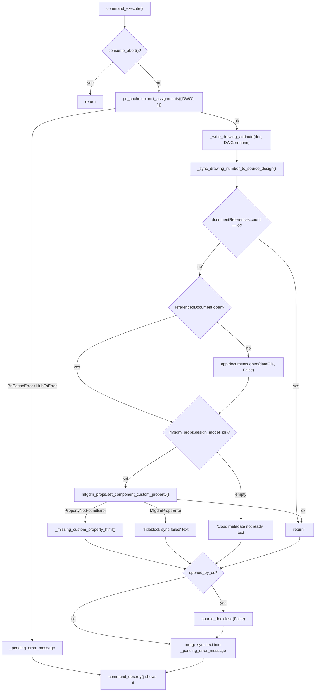

# Assign Drawing Number — Architecture

[← Assign Drawing Number guide](../Assign%20Drawing%20Number.md)

| | |
|---|---|
| **Command ID** | `PTND_assignDrawingNumber` |
| **Registry** | group `document` (`Document Tools`); enabled by default; not beta |
| **UI location** | Drawing workspace (`FusionDocumentationEnvironment`) → built-in tab `FusionDocTab` → panel `PT_DrawingPowerTools` ("Power Tools"), shared with Document Information through [`_drawing_panel`](architecture.md#_drawing_panel) and appended at the end of the tab (`config.drawing_panel_after = ""`); promoted button |
| **Files** | `commands/assigndrawingnumber/entry.py`; `resources/` (16/32/64 px light + dark icons) |
| **Shared helpers** | [`partnumber_shared`](architecture.md#partnumber_shared) (`hub_fs`, `pn_cache`, `schemes`, `mfgdm_props`); [`_command_abort`](architecture.md#_command_abort) (`abort_before_dialog`, `consume_abort`, `clear_abort`); [`_drawing_panel`](architecture.md#_drawing_panel); [`ptutil.add_handler`](architecture.md#event_utils); [`ptutil.require_document`, `log`, `handle_error`](architecture.md#general_utils); `config.drawing_*` ids ([config](architecture.md#config)) |
| **Tests** | `tests/test_command_icons.py` (icon set pin); `tests/test_command_contract.py`; `tests/test_command_abort.py`; `tests/test_partnumber_shared_design_model_id.py` |

## Purpose

Reserves the next `DWG-NNNNNN` number from the hub-wide Pn-Cache counter file and stamps it on the active 2D drawing document. The number is written twice: as an `adsk.core.Attribute` on the `DrawingDocument` (the canonical local record, because `adsk.drawing` exposes no `partNumber` and `DataFile.description` is read-only) and, best-effort, into the source 3D design's `Drawing Number` custom property through MFGDM GraphQL so a titleblock bound to that property fills itself in. The design constraint is ordering: the hub counter must be durably bumped before anything is stamped, so the cache and the stamps never disagree.

## How it is wired

- `start()`: `addButtonDefinition(CMD_ID, ...)` with the resources folder; `ptutil.add_handler(cmd_def.commandCreated, command_created)`; `_drawing_panel.add_to_drawing_panel(cmd_def, CMD_NAME, True)`, which finds or creates the panel on the built-in `FusionDocTab` and adds the promoted control. If the Drawing workspace or the tab is missing, the definition stays registered but no control is placed (logged).
- `stop()`: `_drawing_panel.remove_from_drawing_panel(CMD_ID, CMD_NAME)` removes the control and the panel only once it is empty (Document Information shares it); then deletes the definition. The tab is never touched.
- `command_created(args)`:
  1. `ptutil.require_document(CMD_NAME, "drawing", saved=True)` is `None` (it shows the standard message: "Assign Drawing Number needs a drawing open. Open a drawing, then retry." or "Assign Drawing Number needs a saved drawing. Save the drawing, then retry."; see [Document preconditions](architecture.md#document-preconditions)) → `abort_before_dialog(CMD_ID, CMD_NAME, "no saved drawing")` and return. `doc = app.activeDocument`.
  2. `_read_existing_drawing_number(doc)` reads attribute group `PowerTools.PartNumber`, name `assigned`.
  3. `_peek_next_drawing_number()` shows `ui.progressBar.showBusy`, pumps once with `adsk.doEvents()`, and reads the hub counter: `hub_fs.find_assets_project` → `hub_fs.find_or_create_pn_cache_folder` → `pn_cache.download_snapshot(folder, pn_cache.default_tmp_dir())`; returns `(last_used("DWG") + 1, True)`, or `(1, False)` on any failure (preview then carries the suffix "(baseline unavailable — actual number may differ)").
  4. Builds the dialog with `okButtonText = "Assign"`: `ad_info` text box (scheme label), and only when a number already exists a read-only `ad_current` string input plus an `ad_overwrite_note` HTML warning (this replaces any modal confirmation); then the read-only `ad_preview` "Will assign" string input.
  5. Registers `command_execute` and `command_destroy` on `local_handlers`.
- `command_execute(args)`: `consume_abort(CMD_ID, CMD_NAME)` returns early on the aborted paths (this matters on the unsaved path, where the document can still be a drawing). Then re-checks the document type, logs an overwrite if one exists, and behind the progress bar calls `pn_cache.commit_assignments(app, increments={"DWG": 1}, updated_by=_current_user_id(), tmp_dir=pn_cache.default_tmp_dir())`. The assigned number is `result.snapshot_before.last_used("DWG") + 1`, formatted by `schemes.format_number`. `_write_drawing_attribute` stamps the document (`doc.attributes.add(group, name, value)`, which replaces an existing value with the same group and name). `_sync_drawing_number_to_source_design` runs next and returns "" or an error string. Any error text (`PnCacheError`, `HubFsError`, stamp failure, sync failure, or a traceback) is stored in `_pending_error_message`; nothing is shown from `execute`.
- `command_destroy(args)`: `clear_abort(CMD_ID)`, drops `local_handlers`, then shows `_pending_error_message` (if any) in a Warning message box. Fusion renders the HTML sync error, so the setup-guide link is clickable.
- Aborting before the dialog follows [the abort pattern](architecture.md#aborting-a-command-before-its-dialog); no `doExecute` is called from `command_created`.

### Titleblock sync (`_sync_drawing_number_to_source_design`)

1. `drawing_doc.documentReferences` empty → log and return "" (no source design; not an error).
2. `refs.item(0)` — Fusion drawings reference at most one 3D design. `ref.referencedDocument` is used when the design is already open; otherwise `app.documents.open(ref.dataFile, False)` opens it invisibly and `opened_by_us` is set.
3. `Design.cast(source_doc.products.itemByProductType("DesignProductType"))`; `mfgdm_props.design_model_id(source_design)` (`rootDataComponent.mfgdmModelId`, falling back to `rootComponent.mfgdmModelId`) empty → return the "cloud metadata not ready — save the source design and retry" text.
4. `mfgdm_props.set_component_custom_property(model_id, "Drawing Number", number_str)`. `PropertyNotFoundError` → `_missing_custom_property_html()` (HTML with a link to `DRAWING_NUMBER_SETUP_URL`, which is still the placeholder `https://example.com/drawing-number-setup`); `MfgdmPropsError` → short text; anything else → `ptutil.handle_error` + generic text.
5. `finally`: when `opened_by_us`, `source_doc.close(False)`.

Step 5 closes a document from inside `command_execute`. Non-negotiable 6 (never close a document inside a command event) says that is unsafe; this is the one such site in this command and it has not been re-examined against that rule on this branch.

### The MFGDM write (`partnumber_shared/mfgdm_props.py`)

| Symbol | Role |
|---|---|
| `MFGDM_URL = "mfgdm://v3"` | Fusion-internal URL scheme; `adsk.core.HttpRequest.create(url, PostMethod)` + `executeSync()` attaches the signed-in user's credentials |
| `_gql(query, variables)` / `gql(...)` | POST, raise `MfgdmPropsError` on non-200 or a GraphQL `errors` array, return `data` |
| `_Q_FETCH_COMPONENT` | `model(modelId) { component { id isWritableByUser hub { id } allProperties { results { name value definition { id name isReadOnly } } } } }` |
| `_Q_HUB_PROPERTY_DEFINITIONS` | `hub(hubId) { propertyDefinitionCollections { results { definitions { results { id name isReadOnly isArchived } } } } }` |
| `_M_SET_PROPERTIES` | `setProperties(input: { targetId, propertyInputs: [{ propertyDefinitionId, value }] })` |
| `_find_definition_in_hub(hub_id, name)` | First non-archived definition with that name across the hub's collections, or `None` |
| `set_component_custom_property(model_id, property_name, value)` | Fetch component → require `isWritableByUser` → definition id from `allProperties` (fast path) else from the hub walk (fallback) → reject read-only → mutation → return the echoed value |
| `PropertyNotFoundError` (subclass of `MfgdmPropsError`) | Both lookups missed: the hub has no such custom property |

The two-tier lookup exists because `Component.allProperties` returns only properties that already have a value on that component plus the base properties; a hub-defined custom property that has never been set on this design is absent from it, which is the normal state on a first write.

## Data and state

- Module state: `local_handlers`, `_pending_error_message`.
- Hub file: `<active hub> / Assets / Pn-Cache / pn-cache.json` (`hub_fs.ASSETS_PROJECT_NAME`, `PN_CACHE_FOLDER_NAME`, `PN_CACHE_FILENAME`). The `Assets` project must exist; the folder and file are created on first use.
- Scratch dir: `pn_cache.default_tmp_dir()` = `<add-in root>/cache/pn-cache/`, holding the downloaded and the to-be-uploaded `pn-cache.json`.
- Drawing attribute: group `PowerTools.PartNumber`, name `assigned`, value e.g. `DWG-000042`.
- Source-design custom property: `Drawing Number` (`DRAWING_NUMBER_PROPERTY_NAME`) on the root component's `mfgdmModelId`.
- No settings keys, no custom events.

## Counter commit

`pn_cache.commit_assignments` is shared with Assign Part Numbers and documented in [Assign Part Numbers — Counter commit and concurrency](Assign%20Part%20Numbers.md#counter-commit-and-concurrency). For this command `increments` is always `{"DWG": 1}`; `schemes.DRAWING_PREFIX` is reserved for drawings and never appears in the design command's dropdowns.

## Diagram

Execute path, from the cache commit to the deferred error, with the titleblock-sync branches.

## Tests

- `tests/test_command_icons.py` — pins the `assigndrawingnumber` icon set (16/32/64 px, light + dark; no `-disabled` variant) and that it differs from every other pinned set.
- `tests/test_command_contract.py` — registry row, `CMD_Description`, docs pair, `CMD_ID` shape; also pins the two `time.sleep` calls in `partnumber_shared/pn_cache.py` as known exceptions to rule 2 (`KNOWN_TIME_SLEEP_SITES`).
- `tests/test_command_abort.py` — the AST guard that `command_created` never calls `doExecute`, and the abort-flag semantics this command relies on.
- `tests/test_partnumber_shared_design_model_id.py` — `mfgdm_props.design_model_id` falls back to `rootComponent.mfgdmModelId` when `rootDataComponent` is `None`, the case that skipped the titleblock sync on a source design that had an id.

Nothing exercises the hub, the attribute write, or the MFGDM mutation. `entry.py` and every `partnumber_shared` module except `schemes.py` and `mfgdm_props.design_model_id` are Fusion-bound and are not exercised by the suite; nothing here is verified in Fusion on this branch except by the AST guards in `tests/test_command_contract.py` and `tests/test_command_abort.py`, which import it under the `adsk` stub.

## Learnings

- **`setProperties` works from the desktop API against the user's own custom-property collection, despite Autodesk's documentation saying it is blocked.** It succeeds when `targetId` is the time-specific `Component.id` (from `model(modelId).component.id`), the component's `isWritableByUser` is true and the definition's `isReadOnly` is false. Passing the timeless `mfgdmModelId` as `targetId` fails with "The targetId is not a valid Component or Drawing ID."
- **`Component.allProperties` does not list an unset custom property.** The first write to a fresh design looked like "property missing" until the hub's `propertyDefinitionCollections` were walked as a fallback; only a miss in both raises `PropertyNotFoundError`.
- **Custom properties are not reachable through `Component.propertyGroups`.** That desktop surface covers only the built-in General group (Part Name, Part Number, Description); anything user-defined lives in MFGDM.
- **Show errors from `destroy`, not `execute`.** A message box raised during `execute` races the dialog teardown and leaves the command looking stuck; the text is parked in `_pending_error_message` and shown once the dialog is gone.

---

*Copyright © 2026 IMA LLC. All rights reserved.*
