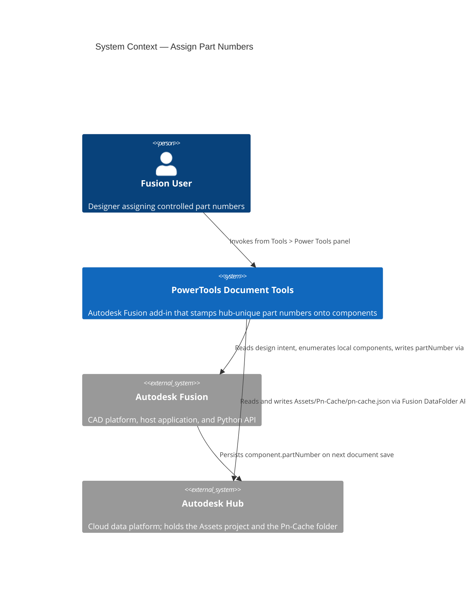
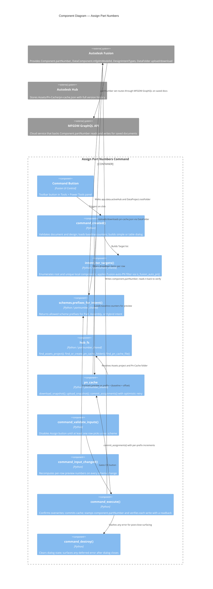
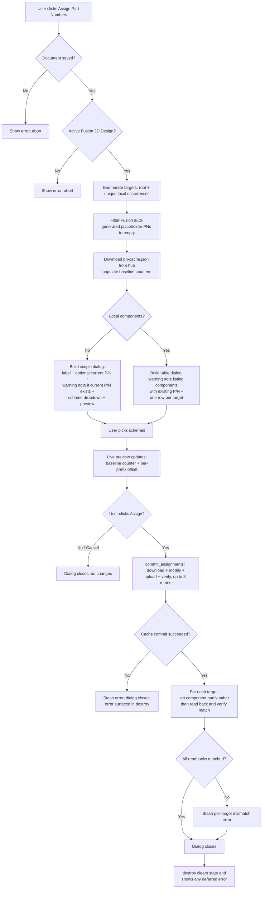
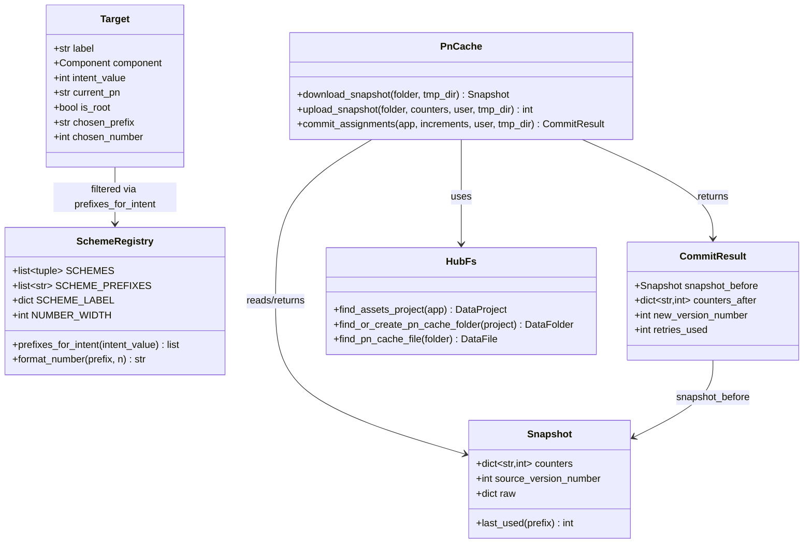

# Assign Part Numbers — Architecture

[← Assign Part Numbers guide](../Assign%20Part%20Numbers.md)

## Architecture

### Command ID

`PTND_assignPartNumbers`

### System context

The following diagram shows the relationship between the user, the Assign Part Numbers command, Autodesk Fusion, and the Autodesk Hub.



### Component diagram

The following diagram shows how the internal components interact during a command invocation.



### Execution flow

The following diagram shows the step-by-step flow when the user runs the command.



### Data model

The following diagram shows the relationships between the core data structures used by the command and the shared `partnumber_shared` package.



### Pn-Cache JSON

The shared counter file at `Assets / Pn-Cache / pn-cache.json` has the following shape. All six schemes are always written back, missing counters default to zero.

```json
{
  "version": 1,
  "schemes": {
    "PRT": { "lastUsed": 42 },
    "ASY": { "lastUsed": 7 },
    "WLD": { "lastUsed": 0 },
    "COT": { "lastUsed": 15 },
    "TOL": { "lastUsed": 3 },
    "DWG": { "lastUsed": 9 }
  },
  "updatedAt": "2026-04-19T18:22:10Z",
  "updatedBy": "<user-id>"
}
```

### Concurrency

The cache commit flow is a read-modify-write with optimistic retry, gated so `component.partNumber` is only stamped after the hub cache upload has been verified:

1. Download the latest `pn-cache.json` and remember the baseline counters.
2. Compute the new counters in memory by adding the per-prefix increments.
3. Upload the new JSON (creates a new version of the DataFile).
4. Re-download and verify the live counters match what we just wrote.
5. If another user raced us (the live counters disagree with ours), retry from step 1.
6. Cap at three retries. On the fourth failure, abort without stamping any component.
7. Only after the cache is durable: set `component.partNumber` on each target.

This guarantees the cache and the component stamps never diverge: either the cache records the number and the component is stamped, or neither happens.

### Cloud metadata (MFGDM) readiness

Autodesk's `Component.partNumber` setter routes through the MFGDM GraphQL API for saved documents. The cloud service keys each component by a timeless `mfgdmModelId` that is generated by the cloud when the component is first saved. Two known states produce an empty `mfgdmModelId` and cause the legacy setter to **silently fail**:

- A local component was added to a saved design but the design has not been saved since. Internal components get their cloud ID only on the next parent-document save.
- The document was just opened or saved and the `MFGDMDataReady` event hasn't fired yet — cloud ingestion lag.

**Detection strategy**: the command detects these failures after-the-fact via **readback verification** in `command_execute`. After every `component.partNumber = value`, the property is read back. A mismatch is recorded as a stamp error and surfaced to the user through the post-close warning message — even when the setter call itself did not raise an exception. Affected components are listed by name so the user can save the document and re-run the command.

**Why not pre-flight?** An earlier iteration of this command attempted a synchronous pre-flight that read `component.dataComponent.mfgdmModelId` from inside `command_created`. Autodesk's own sample code only ever accesses this property from inside an `MFGDMDataReady` event callback — the property is part of a preview API and reading it outside that event is not supported. In practice, reading it synchronously followed by a `ui.messageBox` + `args.command.doExecute(True)` cancel sequence crashed Fusion on dismiss. The readback gate covers the same failure mode without entering that fragile code path.

The MFGDM GraphQL API also exposes a direct `assignModelPartNumber` mutation that bypasses the legacy setter. This command deliberately does **not** call it today — the legacy setter remains the canonical path Autodesk is optimizing, and the readback gate covers the documented silent-failure mode. A future migration to direct GraphQL stamping — gated on an `MFGDMDataReady`-driven worker — is straightforward if field testing shows the readback gate is insufficient.

**Trade-off**: because the pre-flight is gone, a silent stamp failure now consumes the cache counter the stamp would have used. The number is not written to the component, but the next successful stamp will use the number after it. Numbers are cheap; a crash is not.
