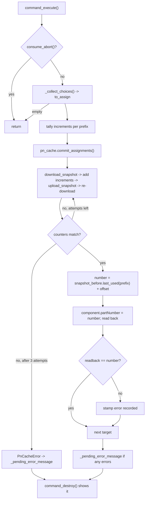

# Assign Part Numbers — Architecture

[← Assign Part Numbers guide](../Assign%20Part%20Numbers.md)

| | |
|---|---|
| **Command ID** | `PTND_assignPartNumbers` |
| **Registry** | group `document` (`Document Tools`); enabled by default; not beta |
| **UI location** | Design workspace → Tools tab → shared "Power Tools" panel (`config.my_panel_id`, `PT_Power Tools`) via `_ui_bootstrap.get_power_tools_panel()`; promoted button |
| **Files** | `commands/assignpartnumbers/entry.py`; `resources/` (16/32/64 px light + dark icons, `generate_icons.py` — the generator is stripped from the release zip) |
| **Shared helpers** | [`partnumber_shared`](architecture.md#partnumber_shared) (`hub_fs`, `pn_cache`, `schemes`, `intent`); [`_ui_bootstrap.get_power_tools_panel`](architecture.md#_ui_bootstrap); [`_command_abort`](architecture.md#_command_abort); [`ptutil.add_handler`](architecture.md#event_utils); [`ptutil.require_document`, `log`, `handle_error`](architecture.md#general_utils) |
| **Tests** | `tests/test_command_icons.py`; `tests/test_release_build.py`; `tests/test_command_contract.py`; `tests/test_command_abort.py` |

## Purpose

Stamps hub-unique, sequential part numbers (`PRT`, `ASY`, `WLD`, `COT`, `TOL`) onto the active design's root component and each of its top-level local components, drawing the numbers from one shared counter file in the hub. The dialog is one dropdown when the root is the only target and a per-row table otherwise. The constraint that shapes it: the counter file is bumped once, durably, for every row in the invocation before any `component.partNumber` is set, so numbers are contiguous and never diverge from the cache.

## How it is wired

- `start()`: `addButtonDefinition` with the resources folder; `ptutil.add_handler(cmd_def.commandCreated, command_created)`; `panel.controls.addCommand(cmd_def)` on the shared panel when it exists, `isPromoted = True`.
- `stop()`: deletes the control from the shared panel and the definition. The panel belongs to `_ui_bootstrap` and is not deleted here.
- `command_created(args)`:
  1. Clears the per-dialog state (`_row_scheme_inputs`, `_row_preview_inputs`, `_baseline_counters`, `_baseline_loaded`).
  2. `design = ptutil.require_document(CMD_NAME, "design", saved=True)` is `None` (it shows the standard message, see [Document preconditions](architecture.md#document-preconditions)) → `abort_before_dialog(CMD_ID, CMD_NAME, "no saved design")`.
  3. `_targets = intent.iter_targets(design)`; `_mode_is_table = len(_targets) > 1`.
  4. `_load_baseline_counters()`: progress bar + one `adsk.doEvents()`, then `hub_fs.find_assets_project` → `find_or_create_pn_cache_folder` → `pn_cache.download_snapshot`; on success `_baseline_counters` holds the hub's `lastUsed` per prefix and `_baseline_loaded = True`; on failure previews start at 1 and carry a suffix.
  5. Builds the dialog (`okButtonText = "Assign"`): `ap_info` text box with `_intent_label(intent.intent_of_design(design))`, then `_build_simple_inputs` or `_build_table_inputs`, then `_recompute_previews(inputs)`.
  6. Registers `command_input_changed`, `command_validate_inputs`, `command_execute`, `command_destroy`.
- `_build_simple_inputs(inputs, target)`: `ap_root_label`; when `target.current_pn` is set, `ap_root_current` and an `ap_overwrite_note` HTML warning; `ap_scheme_simple` dropdown whose first item is `SKIP_LABEL = "(skip)"` (selected) followed by `schemes.SCHEME_LABEL[p]` for `p in schemes.prefixes_for_intent(target.intent_value)`; read-only `ap_preview_simple`.
- `_build_table_inputs(inputs, targets)`: an `ap_overwrite_note` listing every target that already has a number; a `GroupCommandInput` `ap_group` whose `children` hold a 3-column `TableCommandInput` `ap_table` (`"4:3:3"`, 2–10 visible rows, max 12). Per row: `ap_row_name_<i>` text box (root marked *(root)*), `ap_row_scheme_<i>` dropdown (same items as above), `ap_row_preview_<i>` text box; the dropdown and preview objects are kept in `_row_scheme_inputs` / `_row_preview_inputs` by row index. All cells are created on the group's `children`, not the outer inputs.
- `command_input_changed(args)` → `_recompute_previews(args.inputs)`: simple mode shows `baseline[prefix] + 1`; table mode walks rows in target order keeping a per-prefix running offset, so two `PRT` rows preview `+1` and `+2`. `_prefix_from_label` maps a dropdown label back to its prefix (`(skip)` → `None`).
- `command_validate_inputs(args)`: `areInputsValid` is true only when `_collect_choices` finds at least one row with a real scheme; on an internal error it fails open.
- `command_execute(args)`:
  1. `consume_abort(CMD_ID, CMD_NAME)` → return on the aborted paths.
  2. `_collect_choices(inputs)` → `[(Target, prefix_or_None)]`; rows at `(skip)` are dropped; nothing left → return.
  3. Increments tallied per prefix; behind the progress bar `pn_cache.commit_assignments(app, increments, updated_by=_current_user_id(), tmp_dir=pn_cache.default_tmp_dir())`.
  4. Each target's number is `result.snapshot_before.last_used(prefix) + running offset`, in the same row order as the preview.
  5. For each assignment: `target.component.partNumber = number_str`, then read back; a readback that differs is recorded as a stamp error even though the setter did not raise. Failures are collected, not raised.
  6. Errors (`PnCacheError`, `HubFsError`, stamp mismatches, or a traceback) go to `_pending_error_message`. No message box is shown here and no save is performed — saving is left to the user so the dialog closes at once.
- `command_destroy(args)`: `clear_abort(CMD_ID)`, resets all module state, shows `_pending_error_message` in a Warning box if set.

## Data and state

- Module state: `_targets`, `_mode_is_table`, `_row_scheme_inputs`, `_row_preview_inputs`, `_baseline_counters`, `_baseline_loaded`, `_pending_error_message`, `local_handlers` — all rebuilt per dialog.
- Hub file: `<active hub> / Assets / Pn-Cache / pn-cache.json`; scratch copies in `<add-in root>/cache/pn-cache/` (`pn_cache.default_tmp_dir()`).
- Written to the design: `Component.partNumber` on each chosen target. Persisted by the user's next save.
- No settings keys, no custom events.

## Targets and schemes

`intent.iter_targets(design)` returns the root component first, then each top-level occurrence whose `isReferencedComponent` is false, de-duplicated by `Component.entityToken` so a local component placed several times appears once. Referenced (linked) occurrences are skipped: they carry their own source design's number. `Target.current_pn` comes from `_safe_pn`, which returns "" for Fusion's auto-generated placeholder (`YYYY-MM-DD-HH-MM-SS-mmm`, optionally prefixed `Name: `, matched by `_FUSION_AUTO_PN_RE`), so a placeholder never triggers the overwrite warning. `Target.intent_value` is `design.designIntent` for the root and is inherited by every local (`intent_of_component` returns the parent intent; the API exposes intent on `Design`, not `Component`).

`schemes._INTENT_TO_PREFIXES` decides what each row may pick:

| `DesignIntentTypes` | Prefixes offered |
|---|---|
| Part (0) | `PRT`, `COT`, `TOL` |
| Assembly (1) | `ASY`, `WLD`, `TOL` |
| Hybrid (2) or unknown | `PRT`, `ASY`, `WLD`, `COT`, `TOL` |

`DWG` is reserved for [Assign Drawing Number](Assign%20Drawing%20Number.md). `schemes.format_number(prefix, n)` yields `PRT-000042` (`NUMBER_WIDTH = 6`).

## Pn-Cache JSON

`pn_cache._serialize` always writes every prefix in `schemes.SCHEME_PREFIXES`; a missing counter reads as zero.

```json
{
  "version": 1,
  "schemes": {
    "PRT": { "lastUsed": 42 },
    "ASY": { "lastUsed": 7 },
    "WLD": { "lastUsed": 0 },
    "COT": { "lastUsed": 15 },
    "TOL": { "lastUsed": 3 },
    "DWG": { "lastUsed": 9 }
  },
  "updatedAt": "2026-04-19T18:22:10Z",
  "updatedBy": "<user id or user name>"
}
```

`download_snapshot` uses the synchronous form `DataFile.download(local_path, None)` and returns a `Snapshot(counters, source_version_number, raw)`; a missing file is an empty snapshot with version 0. Invalid JSON raises `PnCacheError` with a hint to repair the file in the Fusion Team web UI.

## Counter commit and concurrency

`pn_cache.commit_assignments(app, increments, updated_by, tmp_dir)` is a read-modify-write with optimistic verification:

1. Resolve the folder, `download_snapshot`, remember the baseline.
2. Add the increments in memory (`new_counters`). All-zero increments return immediately without an upload.
3. `upload_snapshot`: write the JSON to the scratch file with a fixed name (Fusion keys versions on the file name), `folder.uploadFile(path)`, then `_wait_for_upload` polls `future.uploadState` every `UPLOAD_POLL_INTERVAL_SECONDS = 0.15` for up to `UPLOAD_TIMEOUT_SECONDS = 15`, refreshing the progress-bar text every 2 s.
4. Re-download and compare counters (`_counters_match`). A mismatch means another writer landed after us — start again from step 1.
5. `MAX_RETRIES = 2`, so three attempts in total, with `time.sleep` back-off of 0.5 s then 1.0 s between them. After the third failure `PnCacheError` is raised and nothing is stamped.
6. Returns `CommitResult(snapshot_before, counters_after, new_version_number, retries_used)`; the caller derives numbers from `snapshot_before`.

The poll loop uses `adsk.doEvents()` + `time.sleep` rather than `ptutil.pump_events_for`; those two `time.sleep` sites are pinned as known exceptions in `tests/test_command_contract.py` (`KNOWN_TIME_SLEEP_SITES`).

## Stamp verification

`Component.partNumber` is set through Fusion's own setter, which for a saved document routes through MFGDM and can fail silently when the component has no cloud metadata yet (a local component added since the last save; a document whose `MFGDMDataReady` has not fired). The command does not pre-flight this. It reads the property back after every set and reports a mismatch by component name with "save the document and retry". A failed stamp has already consumed its counter: the number is skipped, not reused, on the next run.

`intent.mfgdm_model_id` and `intent.targets_missing_model_id` exist in `partnumber_shared/intent.py` with a warning that they are only safe inside an `MFGDMDataReady` handler; nothing calls them.

## Diagram

The execute path, showing where the shared commit can fail and where a stamp can fail without raising.


```mermaid
flowchart TD
    A["command_execute()"] --> B{"consume_abort()?"}
    B -- yes --> Z["return"]
    B -- no --> C["_collect_choices() -> to_assign"]
    C -- empty --> Z
    C --> D["tally increments per prefix"]
    D --> E["pn_cache.commit_assignments()"]
    E --> F["download_snapshot -> add increments -> upload_snapshot -> re-download"]
    F --> G{"counters match?"}
    G -- no, attempts left --> F
    G -- no, after 3 attempts --> ERR["PnCacheError -> _pending_error_message"]
    G -- yes --> H["number = snapshot_before.last_used(prefix) + offset"]
    H --> I["component.partNumber = number; read back"]
    I --> J{"readback == number?"}
    J -- no --> K["stamp error recorded"]
    J -- yes --> L["next target"]
    K --> L
    L --> M["_pending_error_message if any errors"]
    ERR --> N["command_destroy() shows it"]
    M --> N
```

## Tests

- `tests/test_command_icons.py` — pins the `assignpartnumbers` icon set (16/32/64 px, light + dark) and that it differs from every other pinned set.
- `tests/test_release_build.py` — pins that `commands/assignpartnumbers/resources/generate_icons.py` is excluded from the release zip.
- `tests/test_command_contract.py` — registry row, `CMD_Description`, docs pair, `CMD_ID` shape; `KNOWN_TIME_SLEEP_SITES` pins `pn_cache.py`'s two sleeps.
- `tests/test_command_abort.py` — the `doExecute`-in-`commandCreated` AST guard and the abort-flag semantics.

`schemes.py` is the only `adsk`-free module in `partnumber_shared` and has no dedicated test; `intent.is_fusion_auto_pn` is exercised indirectly by `tests/test_syncitempartnumber_logic.py`. `entry.py` is Fusion-bound and is not exercised by the suite; nothing here is verified in Fusion on this branch except by the AST guards in `tests/test_command_contract.py` and `tests/test_command_abort.py`, which import it under the `adsk` stub.

## Learnings

- **Do not read `component.dataComponent.mfgdmModelId` from a synchronous command callback.** An earlier pre-flight did so from `command_created`, then showed a modal and called `args.command.doExecute(True)`; Fusion crashed on dismiss. The `doExecute` re-entry was the crash mechanism (rule 20, `commands/_command_abort.py`), but Autodesk's samples only read `mfgdmModelId` inside an `MFGDMDataReady` callback, so that timing rule stands on its own. The readback in `command_execute` covers the same failure from a plain `try/except`.
- **A silent `partNumber` set is a real failure mode.** The setter returned without raising and the component kept its old value when cloud metadata was missing; verify by reading back, and tell the user which components to save and retry.
- **Show errors from `destroy`, not `execute`.** A message box during `execute` races the dialog teardown and makes the command look stuck.
- **Table cells go on the group's `children`.** The table lives inside a `GroupCommandInput` and every row cell is created on `group.children`, the recipe that `refrences` and `globalParameters` use; creating them on the outer `commandInputs` does not work.

---

*Copyright © 2026 IMA LLC. All rights reserved.*
