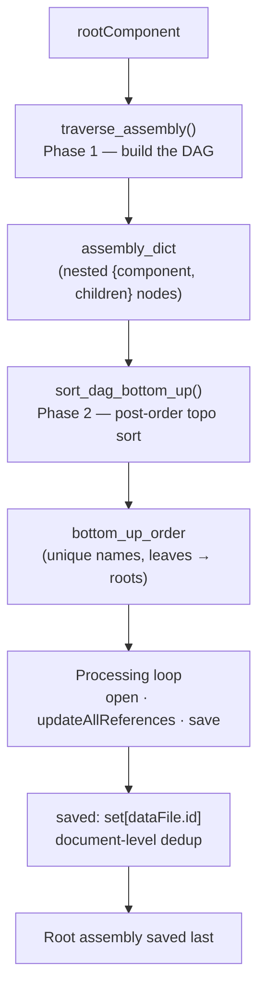
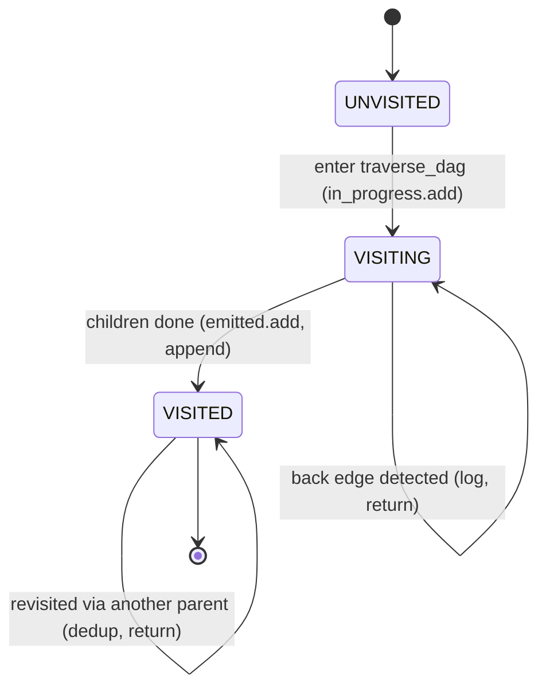
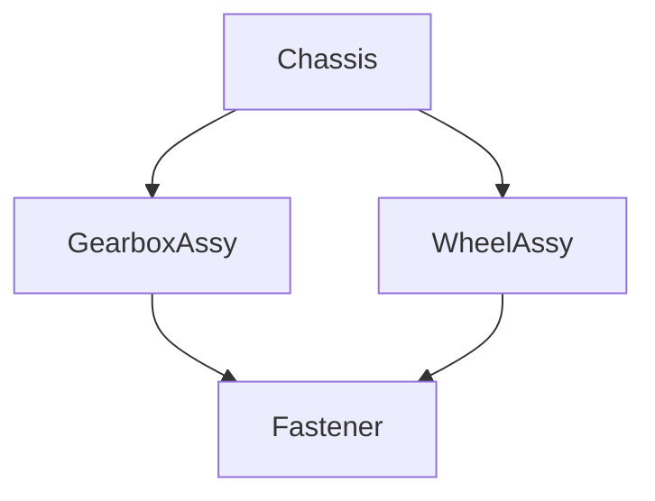

# Bottom-Up Update — Dependency Ordering (DAG)

[← Bottom-Up Update architecture](Bottom-Up%20Update.md) · [← Bottom-Up Update guide](../Bottom-Up%20Update.md)

This note is the deep dive on the **dependency-ordering engine** behind the
Bottom-Up Update command: how the assembly is turned into a directed acyclic
graph (DAG), how that DAG is topologically sorted so that **every part is saved
before any parent that references it**, and the invariants that keep the order
correct and cheap. It documents the code in
`commands/bottomupupdate/entry.py` — `traverse_assembly()` and
`sort_dag_bottom_up()`.

---

## 1. The invariant we must guarantee

Autodesk Fusion resolves a document's external references **against whatever
version of each child is current at save time**. If a parent assembly is saved
before its children have been updated and saved, the parent locks onto stale
child versions. The command exists to prevent exactly that.

> **Ordering invariant** — For every reference edge *parent → child*, the child
> document is opened, updated, and saved **before** the parent. Equivalently:
> the processing list is a *reverse topological order* of the reference graph
> (a leaves-first / bottom-up order).

Everything below is in service of producing and preserving that order.

---

## 2. Two units of work: components vs. documents

There are two different graphs in play, and keeping them straight is what makes
the design correct:

| | **Component graph** (build/sort operates here) | **Document graph** (the actual save unit) |
|---|---|---|
| Node | `adsk.fusion.Component` (by `name`) | A saved `dataFile` (by `id`) |
| Source | `component.occurrences` | Reference relationship between documents |
| Includes | Internal sub-components too | Only externalized/referenced documents |
| Dedup key | component `name` | `dataFile.id` |

The ordering engine builds and sorts the **component graph** (it is what the
Fusion API exposes cheaply via `occurrences`). The processing loop then maps
each component to its owning document and **deduplicates by `dataFile.id`** using
the module-level `saved` set, so that a document backing several components — or
reached along several component paths — is opened and saved exactly once. The
component-level sort and the document-level `saved` set are two complementary
dedup layers; the sort keeps the *list* clean, `saved` keeps the *side effects*
clean.

---

## 3. The pipeline



---

## 4. Phase 1 — build the DAG (`traverse_assembly`)

Starting at `rootComponent`, the function walks `component.occurrences`
depth-first and records each component as a node:

```python
node = {"component": <adsk.fusion.Component>, "children": {<name>: <node>, ...}}
```

A single `_memo` dict keyed by component **name** guarantees each distinct
component's subtree is walked **once**. The node is inserted into `_memo`
*before* its children are walked, which is what makes the build itself
**cycle-safe** — a component that (pathologically) contained itself would find
its own half-built node in `_memo` and stop, rather than recurse forever.

- **First time a name is seen:** build the node, cache it, recurse into its
  occurrences.
- **Every later occurrence of that name:** reuse the *same* node object under
  the new parent. Shared sub-assemblies become **shared node references**, not
  copies — this is what turns the tree into a DAG.

Complexity: **O(V + E)** over the component graph (V = distinct components,
E = occurrence edges), instead of O(number of root-to-node paths) if subtrees
were re-walked per occurrence.

---

## 5. Phase 2 — reverse-topological sort (`sort_dag_bottom_up`)

The sort is a **depth-first, post-order traversal**: a node is appended to the
output **only after all of its children have been appended**. That post-order
discipline is precisely a reverse topological sort, and it is what satisfies the
ordering invariant in §1.

Two sets harden the walk:

- **`emitted`** — names already appended. A shared component (a *diamond*
  dependency reached through more than one parent) is appended **exactly once**,
  and the walk stays **O(V + E)** instead of re-descending a shared subtree once
  per path that reaches it (worst case *exponential* for stacked diamonds).
- **`in_progress`** — the names currently on the DFS stack (the classic
  *VISITING* state of tri-color DFS). Fusion assemblies are acyclic, but if a
  malformed graph ever presented a back edge, this **breaks and logs it**
  instead of recursing until Python raises `RecursionError`.

```python
def traverse_dag(node):
    name = node["component"].name
    if name in emitted:      # diamond already placed — don't re-walk
        return
    if name in in_progress:  # back edge — impossible for Fusion, guard anyway
        ptutil.log(f"Cycle detected at component '{name}'; skipping re-entry.")
        return
    in_progress.add(name)
    for child in node["children"].values():
        traverse_dag(child)
    in_progress.discard(name)
    emitted.add(name)
    sorted_components.append(name)
```

### Tri-color states of a node during the sort



---

## 6. Worked example — a diamond

Assembly: a `Chassis` root references `GearboxAssy` and `WheelAssy`; **both**
reference the same `Fastener` part. That shared child is the diamond.


*Edges point parent → child (dependency direction). `Fastener` has two parents.*

Post-order walk from the roots (`GearboxAssy`, `WheelAssy` are the top-level
entries under the root's occurrences):

```
traverse(GearboxAssy)
  traverse(Fastener)      → append "Fastener"          emitted={Fastener}
  append "GearboxAssy"                                 emitted={Fastener,GearboxAssy}
traverse(WheelAssy)
  traverse(Fastener)      → already emitted, return    (no duplicate, no re-walk)
  append "WheelAssy"
```

Result: `["Fastener", "GearboxAssy", "WheelAssy"]`.

- `Fastener` appears **once** and **before both** parents — invariant holds.
- Before hardening, the same walk produced
  `["Fastener", "GearboxAssy", "Fastener", "WheelAssy"]` — a duplicate that
  inflated `docCount`, muddied the resume index math (`list.index()` returns the
  *first* occurrence), and, for deeper stacked diamonds, re-walked shared
  subtrees super-linearly.

The `Chassis` root is intentionally **excluded** from `bottom_up_order` and saved
separately at the very end, after all children are current.

---

## 7. Why post-order DFS here (rather than Kahn's algorithm)

Both DFS post-order and Kahn's algorithm (repeatedly emit in-degree-zero nodes)
are valid topological sorts. This command uses **DFS post-order** because:

1. The graph is already materialized as a **nested parent→children structure**
   from `occurrences`; recursion over it is the natural fit and needs no
   in-degree bookkeeping or reverse-edge index.
2. It yields the leaves-first order **directly** (a Kahn's emit-order over
   parent→child edges would need reversing).
3. `emitted` gives O(V + E) and diamond-dedup for free; `in_progress` gives
   cycle detection for free — the same tri-color scheme a from-scratch DFS topo
   sort uses.

Kahn's algorithm would be the better choice if we needed **explicit cycle
reporting** (leftover nodes = the cycle) or **deterministic tie-breaking**
across independent branches. Neither is required here: Fusion guarantees
acyclicity, and branch order simply follows `occurrences` order.

---

## 8. Complexity summary

| Stage | Metric | Before | After hardening |
|---|---|---|---|
| Build (`traverse_assembly`) | time | O(V + E) (memoized) | O(V + E) |
| Sort (`sort_dag_bottom_up`) | time | O(paths) — worst case exponential | **O(V + E)** |
| Sort output | length | V + duplicates | **V (unique)** |
| Malformed cycle | behavior | `RecursionError` / hang | **logged + skipped** |
| Progress `docCount` | accuracy | inflated by duplicates | **exact** |

*V = distinct components, E = occurrence edges.*

---

## 9. Resume interaction

`bottom_up_order` is written verbatim into the checkpoint log. On the next run,
`_analyze_resume_state()` compares the freshly computed order with the logged
one (`dag_matches`) and resumes from the component after the last
`SAVE_UPLOAD_COMPLETE` checkpoint via `list.index()`. Because the order is now
**duplicate-free**, `index()` is unambiguous and the resume start point is
exact. A log produced by an older (pre-dedup) build simply fails the
`dag_matches` equality and triggers a safe full run — never an incorrect resume.

---

## 10. Recommended further hardening

These are deliberately **not** applied yet because they ripple beyond the two
ordering functions (into `components_by_name`, the resume log format, and
checkpoint parsing) and warrant their own change with fresh test coverage. They
are recorded here so the next pass has a clear target.

1. **Key the graph by a stable identity, not `name`.** Component names are not
   guaranteed unique across referenced external documents. Two distinct
   components sharing a name currently collapse to one node (the second is
   silently skipped). Keying `traverse_assembly`'s memo and the `emitted`/
   `in_progress` sets by `component.entityToken` (or resolving straight to
   `dataFile.id`) removes that latent skip. *Trade-off:* the processing loop,
   logs, and resume checkpoints are name-oriented today and would need to move
   to the stable key in lockstep.
2. **Build a document-level DAG directly.** The true work unit is the *document*,
   not the component. Constructing nodes keyed by `dataFile.id` — collapsing
   internal sub-components into their owning document up front — yields a smaller
   graph, makes `docCount` count real save operations, and folds the runtime
   `saved` dedup into the graph itself.
3. **Iterative traversal for very deep assemblies.** The sort recurses to a depth
   equal to the assembly nesting depth. Real Fusion assemblies nest far below
   Python's ~1000-frame default limit, so this is low priority; an explicit-stack
   post-order removes the ceiling entirely if it ever matters.
4. **Explicit cycle *reporting*.** The guard prevents runaway recursion but only
   logs. If diagnosing a malformed reference graph ever becomes a need, switch
   this phase to Kahn's algorithm so the leftover (never-emitted) set *is* the
   cycle, and surface it to the user.

---

## 11. Testing

Pure-logic coverage lives in `tests/test_bottomupupdate_dag.py` (runs outside
Fusion via the `PowerTools.*` scaffolding in `tests/conftest.py`, with fake
component/occurrence objects). It locks in:

- children-before-parents ordering on a simple tree,
- a shared sub-assembly emitted **once** and **before every** parent (diamond),
- dependency order preserved across **nested** diamonds,
- a hand-built **cyclic** graph terminating with each node emitted once.

---

## Sources

Background on the DAG / topological-sort patterns this engine implements:

- [Topological sorting — Wikipedia](https://en.wikipedia.org/wiki/Topological_sorting)
- [Kahn's Algorithm vs DFS Approach: A Comparative Analysis — GeeksforGeeks](https://www.geeksforgeeks.org/dsa/kahns-algorithm-vs-dfs-approach-a-comparative-analysis/)
- [Graph Topological Sort Patterns: Kahn's, DFS Post-Order, and Cycle Detection — techinterview](https://www.techinterview.org/post/3233465614/graph-topological-sort-patterns/)
- [Graph Topological Sorting — Build System Order Example — GyanBlog](https://www.gyanblog.com/coding-interview/graph-topological-sort-build-system-example/)
- [Resolving dependencies in a DAG with a topological sort — IPython Cookbook](https://ipython-books.github.io/143-resolving-dependencies-in-a-directed-acyclic-graph-with-a-topological-sort/)

---

*Copyright © 2026 IMA LLC. All rights reserved.*
