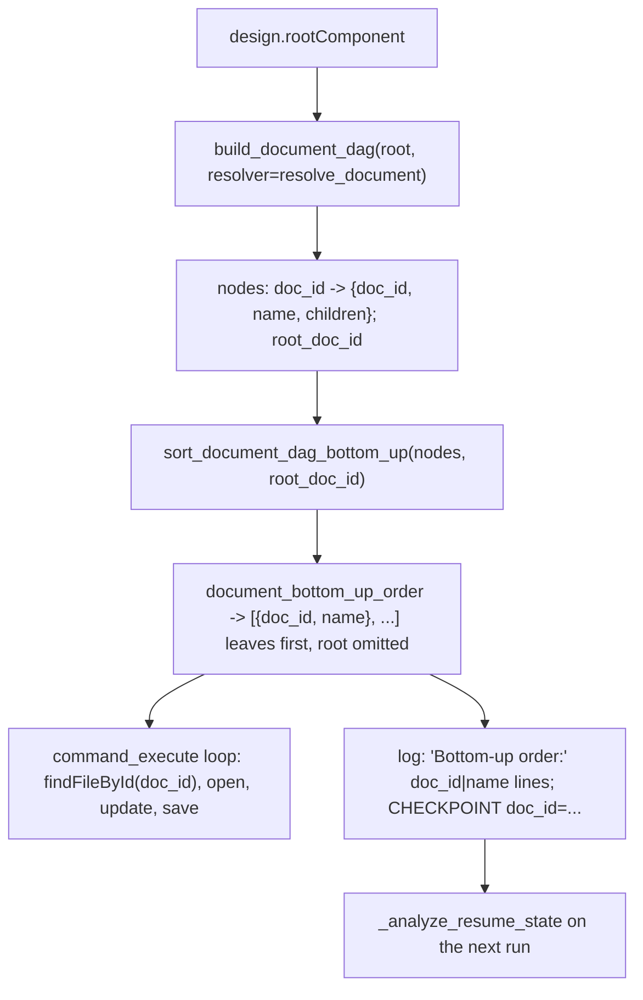
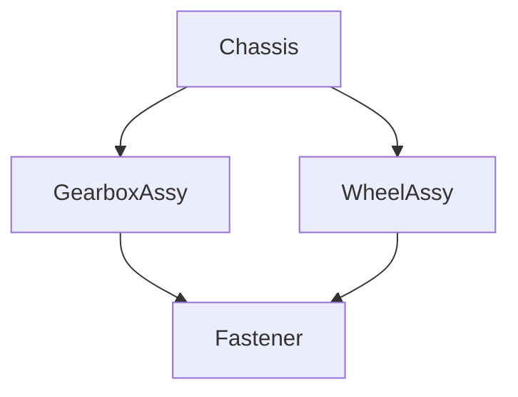

# Bottom-Up Update — Dependency Ordering (DAG)

[← Bottom-Up Update architecture](Bottom-Up%20Update.md) · [← Bottom-Up Update guide](../Bottom-Up%20Update.md)

| | |
|---|---|
| **Scope** | Companion note to [Bottom-Up Update](Bottom-Up%20Update.md); no command of its own, so no Command ID, registry or UI rows |
| **Files** | `commands/bottomupupdate/document_dag.py` (`resolve_document`, `build_document_dag`, `sort_document_dag_bottom_up`, `document_bottom_up_order`, `document_bottom_up_names`); in `commands/bottomupupdate/entry.py`: the reference `traverse_assembly` / `sort_dag_bottom_up`, and the resume helpers `_extract_latest_bottom_up_order`, `_extract_last_checkpoint`, `_analyze_resume_state` |
| **Shared helpers** | none — the pure module imports nothing from the add-in (see [the pure-logic split](architecture.md#the-pure-logic-split)); the reference sort in `entry.py` logs through [`ptutil.log`](architecture.md#general_utils) |
| **Tests** | `tests/test_bottomupupdate_document_dag.py`, `tests/test_bottomupupdate_dag.py`, `tests/test_bottomupupdate_resume.py` |

## Purpose

Turns the active assembly into a directed acyclic graph of *documents* and sorts
it so that every document is saved before any document that references it. The
graph is keyed by `dataFile.id`, so a component name that happens to repeat in
two distinct documents cannot collapse them, and the same ids drive the
checkpoint log that makes a run resumable.

## The invariant

Fusion resolves a document's external references against whichever version of
each child is current at save time. If a parent is saved before its children
have been updated and saved, it locks onto stale child versions.

> **Ordering invariant** — for every reference edge *parent → child*, the child
> document is opened, updated and saved **before** the parent. The processing
> list is a reverse topological order (leaves first) of the reference graph.

## Two graphs

| | Component graph (reference implementation) | Document graph (live path) |
|---|---|---|
| Functions | `entry.traverse_assembly`, `entry.sort_dag_bottom_up` | `document_dag.build_document_dag`, `sort_document_dag_bottom_up` |
| Node | `adsk.fusion.Component`, keyed by `name` | a saved document, keyed by `dataFile.id` |
| Edge source | `component.occurrences` | `component.occurrences`, crossing into a component owned by another document |
| Includes | internal sub-components as nodes | only documents; internals fold into their owner |
| Used by | `tests/test_bottomupupdate_dag.py` only | `command_created` and `command_execute` |

The component-name pair is retained as the tested reference implementation and
is not on the live path; the module comment above it says it can be removed once
the id path is verified in Fusion.

## Pipeline

This flowchart shows the live path from root component to processing loop.

```mermaid
flowchart TD
    A["design.rootComponent"] --> B["build_document_dag(root, resolver=resolve_document)"]
    B --> C["nodes: doc_id -> {doc_id, name, children}; root_doc_id"]
    C --> D["sort_document_dag_bottom_up(nodes, root_doc_id)"]
    D --> E["document_bottom_up_order -> [{doc_id, name}, ...] leaves first, root omitted"]
    E --> F["command_execute loop: findFileById(doc_id), open, update, save"]
    E --> G["log: 'Bottom-up order:' doc_id|name lines; CHECKPOINT doc_id=..."]
    G --> H["_analyze_resume_state on the next run"]
```

## Resolving a component to its document

`resolve_document(component)` walks
`component.parentDesign.parentDocument.designDataFile` and returns
`(doc_id, component.name)`, or `None` when there is no reachable design data
file (internal or never-externalised geometry). This is the same ownership path
the processing loop reads for its skip checks, so the module adds no API
assumption of its own; it is the only Fusion contact in the file and tests
inject a fake resolver in its place.

## Building the DAG (`build_document_dag`)

The walk is depth-first over `component.occurrences`, carrying
`current_doc_id`, the document that owns the position in the walk:

- A child whose resolved id differs from `current_doc_id` is a **reference to
  another document**: `get_node` creates or reuses its node, an edge
  `nodes[current]["children"][child_id] = node` is recorded, and the child's
  internals are walked once (`expanded_docs`) with the child's id as owner.
- A child that resolves to `None` or to the same id is **internal**: the owner
  is unchanged, the walk continues to find outgoing edges, and
  `walked_components` (keyed by `(doc_id, name)`) stops a shared internal
  component from being re-walked.

Shared documents therefore become shared node references, not copies, which is
what makes the structure a DAG rather than a tree. Complexity is O(V + E) over
documents and reference edges because each document's internals are expanded
once.

## Sorting (`sort_document_dag_bottom_up`)

Depth-first post-order from the root node (or from every node when the root is
unresolved): a node is appended only after all of its children. Two sets guard
the walk:

- `emitted` — a document reached through several parents (a diamond) is
  appended exactly once, and shared subtrees are not re-descended (without it
  the walk is O(paths), exponential for stacked diamonds).
- `in_progress` — the nodes on the DFS stack (the VISITING colour of tri-colour
  DFS). A back edge, impossible for a real Fusion assembly, returns instead of
  recursing until `RecursionError`. The document sort returns silently; the
  component-name reference sort logs `Cycle detected at component '<name>'`.

The root document is excluded from the result because the command saves it
separately at the end.

### Worked example — a diamond

Root document `Chassis` references `GearboxAssy` and `WheelAssy`; both reference
the same `Fastener` document.

```mermaid
flowchart TD
    Chassis --> GearboxAssy
    Chassis --> WheelAssy
    GearboxAssy --> Fastener
    WheelAssy --> Fastener
```

Post-order from `Chassis`: visit `GearboxAssy` → visit `Fastener` → append
`Fastener` → append `GearboxAssy`; visit `WheelAssy` → `Fastener` already
emitted → append `WheelAssy`; `Chassis` is the root and is not appended.
Result: `[Fastener, GearboxAssy, WheelAssy]` — `Fastener` once, before both
parents, and `docCount` equals the number of real save operations.

### Why DFS post-order rather than Kahn's algorithm

The graph is already a nested parent → children structure, so recursion over it
needs no in-degree bookkeeping or reverse-edge index, and post-order yields the
leaves-first order directly (Kahn's emit order over parent → child edges would
need reversing). `emitted` and `in_progress` give diamond dedup and cycle
termination for free. Kahn's would be the better fit only for explicit cycle
*reporting* (the never-emitted set is the cycle) or deterministic tie-breaking
across independent branches; Fusion guarantees acyclicity and branch order
follows `occurrences` order.

## Resume interaction

`command_execute` writes the order to the log as `doc_id|name` lines under
`Bottom-up order:` and each per-document checkpoint as
`CHECKPOINT|SAVE_UPLOAD_COMPLETE|doc_id=…|component=…|saved_index=…|…`.
On the next run `_analyze_resume_state`:

1. requires the logged `Fusion client version:` to equal `app.version`;
2. treats a `Bottom-up Update completed successfully` line as a finished run
   (log cleared, full run);
3. compares `_extract_latest_bottom_up_order` (the last order section, `doc_id`
   column) with the fresh id list — any difference is a full run;
4. takes `_extract_last_checkpoint` — the last checkpoint carrying `doc_id`;
   the root's final checkpoint has none and is skipped — and resumes at
   `current_doc_ids.index(doc_id) + 1`, clamped to the list length.

Keying on ids makes resume rename-robust and unambiguous; a log written by a
name-keyed build fails the equality in step 3 and triggers a safe full run.

## Known limits

- **Recursion depth.** Both sorts recurse as deep as the assembly nests. Real
  assemblies stay far below Python's default limit; an explicit stack would
  remove the ceiling.
- **Cycles are terminated, not reported.** The guard prevents runaway recursion
  and (in the document sort) says nothing. Explicit reporting would mean a
  Kahn-style pass whose leftover set is surfaced to the user.
- **The order is computed twice per invocation** — in `command_created` for the
  Run status text and again in `command_execute` — and each build resolves
  `dataFile` per component, which is heavier than a name-only walk. Caching the
  records for the active design across the two phases would remove the
  duplicate.
- **`document_bottom_up_names`** projects the id-keyed order back to names for
  A/B comparison and is not used by the loop; consuming it would re-expose the
  name collision at that boundary.

## Tests

- `tests/test_bottomupupdate_document_dag.py` — loads `document_dag.py` from
  its file path with a fake component / occurrence pair and an injected
  resolver: a multi-component document collapses to one entry, an internal
  component without a document folds into its owner, a shared document diamond
  is emitted once before both parents, same-named distinct documents stay
  distinct (and the `document_bottom_up_names` projection collapses them, made
  explicit), a cyclic graph terminates.
- `tests/test_bottomupupdate_dag.py` — the reference `traverse_assembly` /
  `sort_dag_bottom_up`: children precede parents, a shared sub-assembly is
  emitted once before all parents, a deep shared chain keeps order, a cycle is
  broken.
- `tests/test_bottomupupdate_resume.py` — the `doc_id` column is extracted from
  the last order section, the root checkpoint is skipped, resume after the last
  saved document and past the last document, full run on changed order and on
  version mismatch, cleared after a completed run.
- `resolve_document` against real `adsk` objects, and the loop that consumes
  the order, are not exercised by the suite; nothing here is verified in Fusion
  on this branch except by the AST guards in `tests/test_command_contract.py`
  and `tests/test_command_abort.py`, which import `entry.py` under the `adsk`
  stub.

## Learnings

- **Deduplicate the sort output, not just the side effects.** Before `emitted`
  was added the component-name walk produced
  `["Fastener", "GearboxAssy", "Fastener", "WheelAssy"]`: the duplicate inflated
  `docCount`, muddied the resume index (`list.index()` returns the first hit)
  and re-walked shared subtrees super-linearly.
- **Key the graph on `dataFile.id`, never on component name.** Component names
  are not unique across referenced documents; a name-keyed graph silently
  skipped one of two same-named documents. Keeping the loop on ids end to end is
  what realises the fix — any path that maps a name back to a component
  reintroduces the collision.

## Sources

- [Topological sorting — Wikipedia](https://en.wikipedia.org/wiki/Topological_sorting)
- [Kahn's Algorithm vs DFS Approach — GeeksforGeeks](https://www.geeksforgeeks.org/dsa/kahns-algorithm-vs-dfs-approach-a-comparative-analysis/)

---

*Copyright © 2026 IMA LLC. All rights reserved.*
