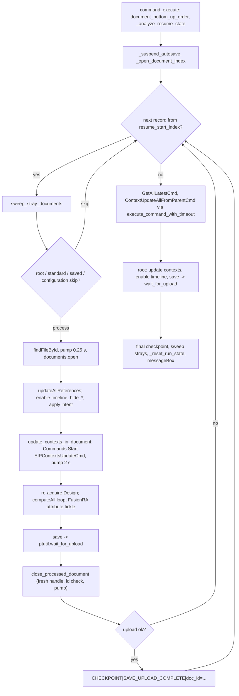

# Bottom-Up Update — Architecture

[← Bottom-Up Update guide](../Bottom-Up%20Update.md)

| | |
|---|---|
| **Command ID** | `PTAT_bottomupupdate` |
| **Registry** | group `assembly` (`Assembly`); enabled by default |
| **UI location** | Power Tools panel (`config.my_panel_id`, Design workspace, Tools tab) via [`_ui_bootstrap.get_power_tools_panel`](architecture.md#_ui_bootstrap); not promoted. Three-tab command dialog (Main, Visibility, Logging) plus a `ProgressDialog` during the run |
| **Files** | `commands/bottomupupdate/entry.py` (dialog, processing loop, resume log), `commands/bottomupupdate/document_dag.py` (`adsk`-free document DAG — see [Bottom-Up Update Dependency Ordering](Bottom-Up%20Update%20Dependency%20Ordering.md)); `resources/` PNG set |
| **Shared helpers** | [`ptutil.add_handler`](architecture.md#event_utils); [`ptutil.log`, `isSaved`, `pump_events_for`, `handle_error`](architecture.md#general_utils); [`ptutil.wait_for_upload`](architecture.md#upload_utils); [`default_log_directory`, `open_live_log_viewer`](architecture.md#log_utils) |
| **Tests** | `tests/test_bottomupupdate_document_dag.py`, `tests/test_bottomupupdate_dag.py`, `tests/test_bottomupupdate_resume.py`, `tests/test_bottomupupdate_autosave.py`, `tests/test_bottomupupdate_config_label.py`, `tests/test_bottomupupdate_stray_docs.py`, `tests/test_bottomupupdate_update_contexts.py`, `tests/test_bottomupupdate_enable_timeline.py`, `tests/test_bottomupupdate_hide_ucs.py` |

## Purpose

Opens every referenced document of the active assembly in leaves-first order,
updates its references, optionally updates assembly contexts, applies design
intent, hides clutter, enables the timeline and rebuilds, saves it and waits for
the upload to land, closes it, and finally refreshes and saves the root. A
checkpoint log lets an interrupted run resume after the last uploaded document.
The shaping constraint is that the loop opens, saves and closes many documents
while pumping events, which is exactly the situation in which Fusion faults
natively on stale handles and concurrent autosaves — most of the code is the
mitigation for that.

## How it is wired

- `start()`: deletes any stale definition, `addButtonDefinition(CMD_ID, …)`,
  `commandCreated -> command_created`, control added to the Power Tools panel.
  `stop()`: removes the control and the definition.
- `command_created`: registers `execute -> command_execute`,
  `inputChanged -> on_input_changed`, `destroy -> command_destroy`; stores the
  globals `product`, `design`, `title`. Guards, each a `messageBox` and return
  before any input is added: no `Design`; `activeDocument.documentReferences.count
  == 0`; `ptutil.isSaved()` false. Then computes the resume plan —
  `document_bottom_up_order(design.rootComponent)` → doc-id list →
  `_analyze_resume_state(_default_temp_log_path(), app.version, ids)` — and
  builds the dialog:
  - **Main**: `update_contexts` (on), `rebuild_all` (on), `skip_standard` (on),
    `skip_saved` (off), `skip_configurations` (on), `apply_intent` (on),
    `enable_timeline` (off), read-only `resume_status` text box showing the
    plan's `status_message`, and an `Advanced` group with `pause_time`
    (upload poll interval, default `0.5`).
  - **Visibility**: `hide_origins`, `hide_joints`, `hide_sketches`,
    `hide_jointorigins`, `hide_canvases`, `hide_ucs` (all off).
  - **Logging**: `enable_log` (on), read-only `log_path`, `browse_log`
    momentary button, `open_log_view` (on); the last three follow `enable_log`.
- `on_input_changed`: `enable_log` toggles the three logging inputs;
  `browse_log` resets itself and opens a save dialog (initial directory
  `ptutil.default_log_directory()`, filename `_propose_default_log_filename()`
  = `<document>.txt`) into `log_path`.
- `command_execute`: the run, described below. Every exit path calls
  `_reset_run_state` (restores autosave, clears `saved`, `resume_plan`,
  globals); failures show `traceback` in a `messageBox`.
- `command_destroy`: clears `local_handlers` and calls `_reset_run_state()`
  again (idempotent).

## The run (`command_execute`)

1. Reads every input; `pause_time` falls back to 0.5 on bad input.
2. Order: `document_bottom_up_order(root_component)` gives
   `[{"doc_id", "name"}, …]`, leaves first, root omitted; `docCount` is its
   length. `_analyze_resume_state` decides full run vs resume; a log from a
   completed run is truncated. `resume_start_index` is clamped to
   `[0, docCount]`.
3. Log: when `enable_log`, the file is `log_path` or
   `_default_temp_log_path()`; mode `a` on resume (with a `----- Resume attempt
   -----` line) else `w`; header lines `Fusion client version:`, project, id,
   options, `Bottom-up order:` followed by one `doc_id|name` line per record,
   then `Document save log:`. `open_log_view` calls
   `ptutil.open_live_log_viewer` (Console.app / PowerShell `Get-Content -Wait`).
   `emit()` writes to both `ptutil.log` and the file.
4. `ProgressDialog` with Cancel, `show(..., 0, docCount, 1)` then
   `progressValue = resume_start_index` (the minimum is always 0 — see Learnings).
5. `_suspend_autosave(write_log_entry)`: turns off
   `generalPreferences.isAutomaticVersioningEnabled` and
   `isAutomaticSaveOnCloseEnabled`, remembering the prior values in
   `_autosave_prior_state`; `_restore_autosave` puts them back on every exit.
6. `initial_open_doc_ids = _open_document_index(app.documents)` snapshots what
   is open (including invisible reference documents) so the stray sweep never
   closes anything the user had open.
7. `components_by_docid`: first component per document id from
   `design.allComponents` via `resolve_document`, so the per-document skip
   checks are O(1).
8. Per record from `resume_start_index`:
   - `sweep_stray_documents("before <name>")` closes documents Fusion opened
     implicitly since the snapshot (`_collect_stray_documents`), never the top
     document, then pumps 0.25 s.
   - skip the root (`docid == top_document_id`), a document with no component,
     `parentProject.name == "Standard Components"` when `skip_standard`,
     `parentDocument.version == app.version` when `skip_saved`, and anything in
     `saved`; add to `saved`; advance the progress bar.
   - `app.data.findFileById(docid)`; `_configuration_label(data_file)` skips
     configuration members / configured designs when `skip_configurations`;
     `pump_events_for(0.25)`; `app.documents.open(document, True)`.
   - `opened_doc.updateAllReferences()`; activate `FusionSolidEnvironment` if
     needed; `des = Design.cast(app.activeProduct)`.
   - Options in order: `enable_timeline_in_document` (Direct → Parametric,
     re-acquire `des`), `hide_origins_in_document`, `hide_joints_in_document`,
     `hide_joint_origins_in_document`, `hide_sketches_in_document`,
     `hide_canvases_in_document`, `hide_user_coordinate_systems_in_document`
     (all operate on `design.activeComponent` and return a log string, never
     raise), `apply_intent` (no occurrences → Part; occurrences plus sketches or
     bodies → Hybrid; else Assembly), `update_contexts_in_document` (below;
     re-acquire `des`), `rebuild_all` (`while not des.computeAll():
     pump_events_for(0.1)`).
   - Re-acquire `des`; add and delete a `FusionRA` attribute so the document
     registers a change.
   - `active_doc.save("Auto save in Fusion: <version>, by rebuild assembly.")`
     → `ptutil.wait_for_upload(result, name, poll_interval_seconds=pause_time,
     document=active_doc, pre_save_version=…, log_fn=write_log_entry)`.
   - `close_processed_document(docid, name)`: re-acquires `app.activeDocument`,
     closes it only if it is not the top document and its `dataFile.id` equals
     the expected id, then pumps 0.25 s. On a failed upload the document is
     closed and the loop continues without a checkpoint.
   - `CHECKPOINT|SAVE_UPLOAD_COMPLETE|doc_id=…|component=…|saved_index=…|total=…|timestamp=…`.
9. Root: `GetAllLatestCmd` then `ContextUpdateAllFromParentCmd` through
   `execute_command_with_timeout` (retries `execute()` with pumped waits, 120 s
   cap; failure raises and ends the run); `update_contexts_in_document("main
   assembly")` and `enable_timeline_in_document` when selected; save +
   `wait_for_upload`; a final checkpoint line without `doc_id`;
   `sweep_stray_documents("final cleanup")`; `_reset_run_state`; the line
   `Bottom-up Update completed successfully` (the marker
   `_analyze_resume_state` looks for); completion `messageBox`.

This flowchart shows the per-document loop and its exits.

## Data and state

- Module globals: `saved` (doc ids processed this run), `resume_plan`,
  `_autosave_prior_state`, `product` / `design` / `title`, `local_handlers`.
- Run log: `_default_temp_log_path()` =
  `ptutil.default_log_directory()/<dataFile name>.log` (the OS temp directory
  on macOS and Windows, `~/Documents` elsewhere); a custom `log_path` may be
  chosen. The resume check always reads the default path.
- Constants: `CONTEXT_UPDATE_CMD_ID = "EIPContextsUpdateCmd"`,
  `_CONTEXT_UPDATE_SETTLE_SECONDS = 2.0`.
- No settings keys, no custom events.

## Ordering and resume

The order is a document-level DAG keyed by `dataFile.id`
(`document_dag.document_bottom_up_order`): internal sub-components fold into
their owning document, multi-component documents collapse to one save unit, the
root is omitted, and every document appears once. The `saved` set is defence in
depth. `traverse_assembly` / `sort_dag_bottom_up` in `entry.py` are the
component-name reference implementation kept for `tests/test_bottomupupdate_dag.py`
and are not on the live path. Details, invariants and the diamond example are in
[Bottom-Up Update Dependency Ordering](Bottom-Up%20Update%20Dependency%20Ordering.md).

`_analyze_resume_state(log_path, fusion_client_version, current_doc_ids)` reads
the default log and decides: no log → full run; `Fusion client version:` differs
→ full run; `Bottom-up Update completed successfully` present → log cleared,
full run; `_extract_latest_bottom_up_order` (the last `Bottom-up order:`
section, `doc_id` column) differs from `current_doc_ids` → full run; else the
last `CHECKPOINT|SAVE_UPLOAD_COMPLETE|doc_id=…` (`_extract_last_checkpoint`;
the root's checkpoint has no `doc_id` and is skipped) gives
`resume_start_index = index(doc_id) + 1` and `last_saved_index`. The order is
computed twice per invocation (dialog preview, then execution).

## Updating contexts

Fusion exposes no API for assembly contexts. `update_contexts_in_document` runs
`app.executeTextCommand("Commands.Start EIPContextsUpdateCmd")`, then
`ptutil.pump_events_for(2.0)` because the command keeps doing cloud round-trips
after the text command returns and has no completion event; the caller must
re-acquire its `Design` afterwards. The returned line reports only that the
command was *started*; a real run shows up as `Workflow start: UpdateEIPContext`
in Fusion's own app log.

## Crash mitigations

- **Autosave suspended for the run** (`_suspend_autosave` / `_restore_autosave`):
  Fusion's automatic-versioning thread and save-on-close can save a dirty
  document inside one of the loop's event pumps and invalidate objects the loop
  still holds.
- **Fresh handles after every pumped wait**: `des` is re-acquired after the
  timeline switch, after the context update and before the attribute tickle;
  `close_processed_document` closes only a freshly acquired `activeDocument`
  whose `dataFile.id` matches.
- **Configuration documents skipped by default** (`_configuration_label`,
  `skip_configurations`): opening configuration members / configured designs in
  bulk faults inside Fusion's configuration data model.
- **Stray documents swept** (`_open_document_index`, `_collect_stray_documents`):
  opening a parent or updating its references pulls related documents open and
  nothing closes them.
- **Never `ui.terminateActiveCommand()` and never poll `ui.activeCommand` here**:
  inside `command_execute` the active command is this command.

## Tests

- `tests/test_bottomupupdate_document_dag.py` — `document_dag.py` loaded from
  its path: multi-component collapse, internal fold, diamond once, same-named
  distinct documents stay distinct, cycle terminates.
- `tests/test_bottomupupdate_dag.py` — the reference `traverse_assembly` /
  `sort_dag_bottom_up`: children before parents, diamond once, deep shared
  chain, cycle broken.
- `tests/test_bottomupupdate_resume.py` — `_extract_latest_bottom_up_order`
  (doc-id column), `_extract_last_checkpoint` (skips the root checkpoint),
  `_analyze_resume_state` decisions: resume after last saved, resume past the
  last document, full run on changed order, on version mismatch, cleared after
  a completed run.
- `tests/test_bottomupupdate_autosave.py` — suspend/restore pair: both switches,
  exact prior values, idempotence, failure is a logged no-op.
- `tests/test_bottomupupdate_config_label.py` — `_configuration_label` on
  member, configured design, plain, missing and raising properties.
- `tests/test_bottomupupdate_stray_docs.py` — `_open_document_index` and
  `_collect_stray_documents`: snapshot semantics, top document never a stray,
  unidentifiable documents left alone, broken collection.
- `tests/test_bottomupupdate_update_contexts.py` — text-command route, reply
  carried into the log, settle pump before the save, failure guarded, no
  `activeCommand` / `terminateActiveCommand` use.
- `tests/test_bottomupupdate_enable_timeline.py` — Direct → Parametric switch,
  parametric untouched, missing design, API failure.
- `tests/test_bottomupupdate_hide_ucs.py` — `hide_user_coordinate_systems_in_document`:
  counting, already hidden, empty, unsupported build, per-item failure.
- The dialog, the processing loop and the root save in `entry.py` are
  Fusion-bound and not exercised by the suite; nothing here is verified in
  Fusion on this branch except by the AST guards in
  `tests/test_command_contract.py` and `tests/test_command_abort.py`, which
  import it under the `adsk` stub. The icon set is not pinned in
  `tests/test_command_icons.py`.

## Learnings

- **Handles held across a pumped wait fault natively, they do not raise.** The
  recurring `NsDataModel10.dll` access violation (CER LastCommand
  `PLM360SaveCommand_Spawned` / `CloseDocumentCommand_Spawned`, document flagged
  Needs Autosave) is a background save invalidating objects the loop still held;
  re-acquire after every pump and suspend autosave for the run (a1d22e1,
  0a228c8, 20c0976).
- **`CommandDefinition.execute()` on `EIPContextsUpdateCmd` is a silent no-op
  from inside a running command.** A run logged four "successful" context
  updates while Fusion's app log had no `UpdateEIPContext` workflow;
  `Commands.Start` via `executeTextCommand` is the route that works
  (2026-09-08, ADSKMVG91G2F5W).
- **Never `ui.terminateActiveCommand()` from a command event.** Polling
  `ui.activeCommand` as an idle signal from `command_execute` sees this command
  and never passes; terminating it tore the command stack down under a live
  handler and faulted in `Na::ConfigurationRulesController::commandCreated`
  (2026-09-08 CER).
- **Opening configuration members in bulk crashes Fusion natively.** The
  2026-07-02 CER faulted in `Ns::MFGDMEventConsumer … hubModelIdsForConfiguration`
  while this command opened one; hence `_configuration_label`, the
  `skip_configurations` default and the pre-open event drain.
- **`ProgressDialog.show()` rejects `minimumValue == maximumValue`.** Passing the
  resume index as the minimum made a run whose only remaining work was the root
  save unlaunchable ("invalid argument minimumValue or maximumValue") until the
  temp log was deleted; the minimum is 0 and `progressValue` carries the resume
  point, set after `show()` because `show()` reseats the range.

---

*Copyright © 2026 IMA LLC. All rights reserved.*
