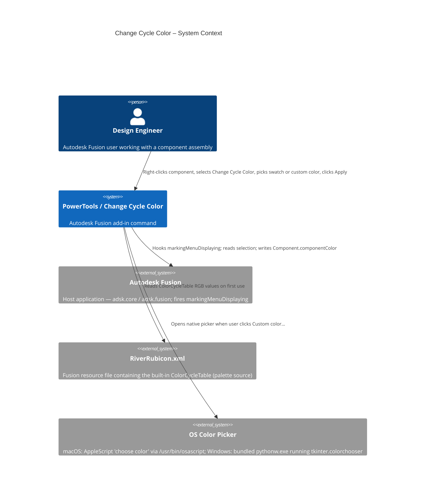
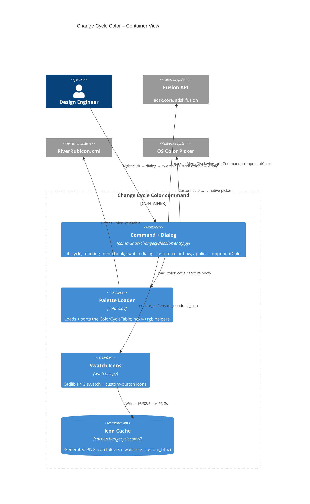
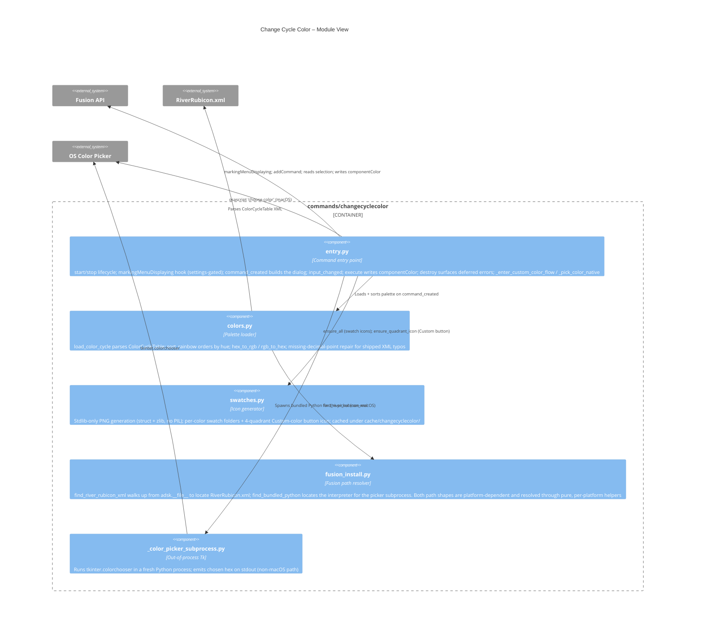
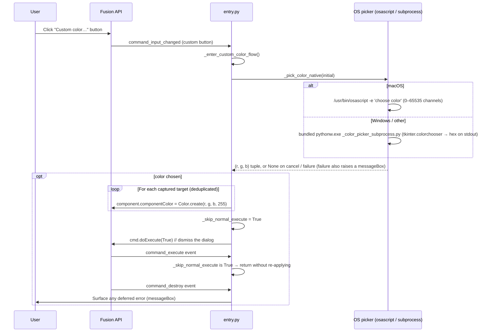

# Change Cycle Color — Architecture

[← Change Cycle Color guide](../Change%20Cycle%20Color.md)

## Architecture

Change Cycle Color is a selection-driven command surfaced only through Fusion's right-click marking menu. It subscribes to the `markingMenuDisplaying` event and, when at least one Component or Occurrence is selected and its preference is enabled, injects its entry into the linear marking menu immediately after Fusion's built-in **Cycle Component Color** command. On invocation it opens a dialog containing rows of rainbow swatch buttons plus a **Custom color…** button. The palette is read live from Fusion's own `ColorCycleTable` in `RiverRubicon.xml` and rendered as cached PNG icons built with only the Python standard library. Applying a color writes `Component.componentColor` (never **Appearance**) through the Fusion Python API for every selected component. The custom-color path opens the OS-native picker, applies the color directly, and dismisses the dialog through Fusion's normal execute path — guarded by a `_skip_normal_execute` flag so the color is not applied twice.







### Main flow — swatch selection

```mermaid
sequenceDiagram
    participant User
    participant Fusion as Fusion API
    participant Entry as entry.py
    participant Colors as colors.py
    participant Install as fusion_install.py
    participant Swatches as swatches.py

    User->>Fusion: Right-click Component or Occurrence
    Fusion->>Entry: markingMenuDisplaying event
    Entry->>Entry: Read "Show in the right-click context menu" setting
    alt setting is ON and a Component/Occurrence is selected
        Entry->>Fusion: linearMarkingMenu.addCommand(CMD_ID) after Cycle Component Color
    end

    User->>Fusion: Click Change Cycle Color
    Fusion->>Entry: command_created event
    Entry->>Entry: _collect_selected_components() (dedupe instances)

    Entry->>Colors: load_color_cycle() → sort_rainbow()
    Colors->>Install: find_river_rubicon_xml()
    Install-->>Colors: Path to RiverRubicon.xml (or None)
    Colors-->>Entry: Sorted [(name, rgb)] swatches (empty if not found)

    Entry->>Swatches: ensure_all() + ensure_quadrant_icon()
    Swatches-->>Entry: Cached PNG icon folders

    Entry->>Fusion: Build swatch rows + Custom color… button; okButtonText = "Apply"
    Fusion-->>User: Dialog displayed

    User->>Fusion: Click a swatch, then Apply
    Fusion->>Entry: command_execute event
    loop For each captured target (deduplicated)
        Entry->>Fusion: component.componentColor = Color.create(r, g, b, 255)
    end
    Fusion->>Entry: command_destroy event
    Entry->>User: Surface any deferred error (messageBox)
```

### Custom color flow



## Module breakdown

- **`entry.py`** — command lifecycle (`start` / `stop`), the swatch dialog (`command_created`, `command_input_changed`, `command_execute`, `command_destroy`), the `markingMenuDisplaying` hook (`_on_marking_menu_displaying`, gated by the show-in-context-menu setting), selection collection (`_collect_selected_components`, instance dedupe), the custom-color flow (`_enter_custom_color_flow`, `_pick_color_native`, `_pick_color_macos`, `_pick_color_subprocess_python`), and the apply step (`_set_component_color`, which writes `componentColor` only).
- **`colors.py`** — `load_color_cycle` parses the `ColorCycleTable` from `RiverRubicon.xml`; `sort_rainbow` orders swatches by hue (pushing pale neutrals to the end); `hex_to_rgb` / `rgb_to_hex` convert between formats. The RGB tokens are 0.0–1.0 floats, and the parser repairs shipped-XML typos where the leading decimal point is missing (e.g. `"5412"` → `0.5412`).
- **`swatches.py`** — stdlib-only PNG generation (no PIL): `ensure_swatch_folder` / `ensure_all` write per-color 16/32/64 px solid swatch PNGs, and `ensure_quadrant_icon` writes the 4-quadrant rainbow icon for the **Custom color…** button. Icons are cached under `cache/changecyclecolor/` (`swatches/` and `custom_btn/`) and regenerated only when missing.
- **`fusion_install.py`** — resolves both of the command's install-relative paths. `find_river_rubicon_xml` discovers `RiverRubicon.xml` by walking up from `adsk.__file__` (falling back to `sys.executable`), trying each candidate prefix in `RIVER_RUBICON_RELS`, so the path tracks Fusion `webdeploy` hash changes automatically. `find_bundled_python` locates the interpreter that runs the picker subprocess, and `is_python_binary` filters the `sys.executable` fallback so the Fusion host binary is never mistaken for an interpreter. The shape-encoding helpers (`_python_candidates`, `RIVER_RUBICON_RELS`) are pure and take the platform as an argument, so the Windows layouts are covered by `tests/test_changecyclecolor_fusion_install.py` from a macOS run.
- **`_color_picker_subprocess.py`** — a tiny standalone script that runs `tkinter.colorchooser` in a fresh Python process (used on non-macOS platforms), emitting the chosen hex on stdout. Running out-of-process avoids the in-process Tk run-loop conflict inside Fusion.

## Integration into PowerTools

- Registered in `command_registry.py` under the **Assembly** group with `settings=True`, so it gets a PowerTools Preferences card.
- Started and stopped with the rest of the add-in by `commands/__init__.py` (`start()` / `stop()`).
- Uses the shared `lib/ptAddInUtils` helpers (`add_handler`, `log`, `handle_error`) for handler registration and logging.
- Reads its **Show in the right-click context menu** toggle through `settings_store.command_setting`; the `markingMenuDisplaying` handler re-reads it live, so the preference takes effect on the next right-click with no restart.

## Design decisions

- **Stdlib-only PNG swatches.** Swatch and custom-button icons are built from raw bytes using only `struct` and `zlib`, producing valid 8-bit RGB PNGs. This avoids bundling PIL/Pillow into Fusion's embedded Python, which cannot reliably `pip install` extra dependencies.
- **Dynamic install-path discovery.** `RiverRubicon.xml` lives under a `webdeploy`-hash directory that changes with every Fusion update. Walking up from `adsk.__file__` (rather than hard-coding a path) keeps the palette pointed at the currently installed version and survives updates silently.
- **osascript on macOS (Gatekeeper workaround).** macOS Sequoia blocks Fusion from re-spawning its bundled `Python.app` GUI helper. `/usr/bin/osascript` is a system-signed binary at a fixed path that Gatekeeper always allows, and AppleScript's `choose color` uses `NSColorPanel` underneath — so macOS uses osascript while other platforms run `tkinter.colorchooser` in a subprocess.
- **Settings-gated, live context-menu entry.** The command surfaces only through the marking menu, gated by a preference the `markingMenuDisplaying` handler re-reads on every right-click. Turning the toggle off suppresses the entry immediately, with no handler re-registration and no Fusion restart.
- **`_skip_normal_execute` to prevent double-apply.** The custom-color flow applies the picked color directly, then calls `cmd.doExecute(True)` to close the dialog through Fusion's normal execute path. The flag tells `command_execute` that the work is already done so it returns without re-applying the (now stale) swatch selection.
- **Per-platform path shapes, tested from either host.** The two install-relative paths this command needs sit at different depths on macOS and Windows: the macOS install wraps everything in an `Autodesk Fusion.app` bundle, and its interpreter is `<exec_prefix>/bin/python3.x`, while Windows has no bundle wrapper and puts `python.exe` directly in `<exec_prefix>`. Encoding only the macOS shape left both lookups failing on Windows — silently, because a missing palette degrades to a Custom-color-only dialog and a missed interpreter fell through to `sys.executable`, which inside Fusion is the host binary (`Fusion360.exe`), not Python. The helpers that encode these shapes are now pure and take the platform as an argument, following `lib/ptAddInUtils/fusion_recents.py`, so the Windows branches are verified from a macOS test run rather than only on Windows.
- **`sys.executable` is filtered, not trusted.** `is_python_binary` requires an interpreter-looking basename before `sys.executable` is accepted as a fallback. Without it, handing the Fusion host executable to `subprocess` produces the worst failure mode available: no picker, no exception, and nothing in the log to distinguish it from the user pressing Cancel.
- **A dead picker reports itself.** The helper script exits non-zero when it cannot show a dialog at all (for example if `tkinter` is absent from a Fusion build's Python). That is now surfaced in a message box, because returning `None` is indistinguishable from a cancel and would leave the **Custom color…** button looking simply inert.
- **Writes `componentColor` only.** The command sets `Component.componentColor` — the value the Color Cycling Toggle reads — and never touches **Appearance** or material, so it has no effect on rendering or physical properties.

---

[← Change Cycle Color guide](../Change%20Cycle%20Color.md)

---

*Copyright © 2026 IMA LLC. All rights reserved.*
