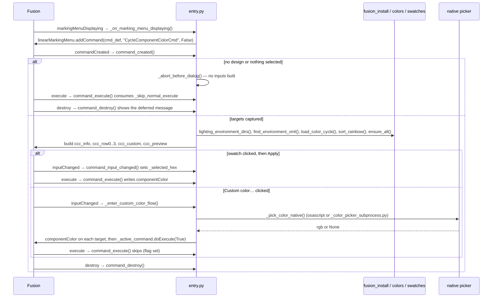

# Change Cycle Color — Architecture

[← Change Cycle Color guide](../Change%20Cycle%20Color.md)

| | |
|---|---|
| **Command ID** | `PTAT_changecyclecolor` |
| **Registry** | group `assembly` (`Assembly`); enabled by default; `settings=True`, so it has a card in the Preferences palette. Setting default: `changecyclecolor.show_in_context_menu = True` ([settings_store](architecture.md#settings_store)) |
| **UI location** | Marking menu only. A `ui.markingMenuDisplaying` handler adds the command to `args.linearMarkingMenu` after Fusion's `CycleComponentColorCmd` when the selection contains a Component or Occurrence. No panel or QAT control, no icon folder on the definition |
| **Files** | `commands/changecyclecolor/entry.py`, `colors.py`, `swatches.py`, `fusion_install.py`, `_color_picker_subprocess.py` |
| **Shared helpers** | [`ptutil.add_handler`](architecture.md#event_utils); [`ptutil.log`](architecture.md#general_utils); `settings_store.command_setting` ([settings_store](architecture.md#settings_store)); `config.CACHE_DIR` ([config](architecture.md#config)). The abort helper in [`commands/_command_abort.py`](architecture.md#_command_abort) is modelled on this command's `_abort_before_dialog` but is not imported here (see below) |
| **Tests** | `tests/test_changecyclecolor_abort.py`, `tests/test_changecyclecolor_colors.py`, `tests/test_changecyclecolor_fusion_install.py`, `tests/test_command_abort.py`, `tests/test_command_contract.py` |

## Purpose

Writes `Component.componentColor` — the value Fusion's **Color Cycling Toggle** reads — on every selected Component or Occurrence, from a swatch palette or the OS colour picker, without touching Appearance or material. The shaping constraint is that the palette must be the one Fusion is actually cycling through: every lighting environment ships its own `ColorCycleTable`, so the command reads the table of `Application.lightingEnvironment`'s environment out of the running install, and renders its swatches as PNGs with the standard library because Fusion's Python has no Pillow.

## How it is wired

- `start()`: `addButtonDefinition(CMD_ID, CMD_NAME, CMD_Description)` with no icon folder; attaches `command_created`; attaches `_on_marking_menu_displaying` to `ui.markingMenuDisplaying` and keeps the handler in `_marking_menu_handler`. `stop()` removes that handler with `ui.markingMenuDisplaying.remove(...)` and deletes the definition.
- `_on_marking_menu_displaying(args)`: returns unless `settings_store.command_setting("changecyclecolor", "show_in_context_menu", True)` is true (read live on every right-click, so the Preferences toggle takes effect without a restart), unless some entity in `args.selectedEntities` maps to a Component through `_entity_to_component` (Occurrence → `.component`, Component → itself, anything else → `None`), and unless `args.linearMarkingMenu` exists. It then calls `menu.controls.addCommand(cmd_def, "CycleComponentColorCmd", False)`. Every exception is swallowed and logged so the rest of the menu survives.
- `command_created(args)`:
  1. `Design.cast(app.activeProduct)` is `None` → `_abort_before_dialog(...)` and return.
  2. `_collect_selected_components()` walks `ui.activeSelections`, maps each entity with `_entity_to_component`, de-duplicates by `Component.id` (falling back to name) and preserves order. Empty → `_abort_before_dialog(...)` and return.
  3. Palette: `_active_environment_name()` maps `app.lightingEnvironment` through `fusion_install.lighting_environment_dirs(adsk.core.LightingEnvironments)`; if the cached `_swatches` came from a different environment (or nothing is cached) `_load_palette(env)` resolves `find_environment_xml(env)` → `colors.load_color_cycle`, falling back with a log line to `find_river_rubicon_xml()`. The result is `colors.sort_rainbow`-ed and `swatches.ensure_all` writes any missing swatch PNGs.
  4. Dialog: `okButtonText = "Apply"`; `ccc_info` text box naming up to six targets; four `ButtonRowCommandInput`s `ccc_row0…3` from `_split_evenly` (or a `ccc_warn` text box when the palette is empty); the `ccc_custom` button-style `BoolValueInput` with the four-quadrant icon from `swatches.ensure_quadrant_icon`; the `ccc_preview` text box. `_active_command` is kept for the custom flow. Attaches `command_input_changed`, `command_execute`, `command_destroy`.
- `command_input_changed(args)`: `ccc_custom` pressed → `_enter_custom_color_flow()` then the button is reset to `False`; a swatch row change → `_selected_hex` from the picked swatch, every other row's selection cleared so only one swatch is lit across the four rows, `_refresh_preview`.
- `_enter_custom_color_flow()`: no targets → log and return. `_pick_color_native(initial)` dispatches on `sys.platform`: `darwin` → `_pick_color_macos` (`/usr/bin/osascript -e 'choose color …'`, 0–65535 channels, `rc != 0` or empty stdout means cancel); otherwise `_pick_color_subprocess_python` (`fusion_install.find_bundled_python()` runs `_color_picker_subprocess.py`, with `CREATE_NO_WINDOW` on `win32`; a missing interpreter, missing script, launch failure or non-zero exit each raise a message box; exit 0 with empty stdout is a cancel). `None` → return with the dialog still open. Otherwise `_set_component_color` is applied to every target; if none succeeded a message box is shown and the dialog stays; else `_selected_hex` is remembered, `_skip_normal_execute = True` and `_active_command.doExecute(True)` dismisses the dialog. This is one of the three deliberate `doExecute` sites in the repo: it runs from `inputChanged`, outside `createCommand` — see [the doExecute rule](../dev/lessons.md).
- `command_execute(args)`: if `_skip_normal_execute` is set, clears it and returns (both the custom flow and an abort reach here). Otherwise validates `_selected_hex` and `_pending_targets`, applies `_set_component_color` (`Component.componentColor = Color.create(r, g, b, 255)`; a missing property or a raise counts as failure) and records any problem in `_pending_error_message` rather than showing it.
- `command_destroy(args)`: clears `local_handlers`, `_active_command`, `_pending_targets`, resets `_skip_normal_execute`, then shows `_pending_error_message` in a warning message box if one was queued.

### Aborting before the dialog

`_abort_before_dialog(message)` is module-local: it empties `_pending_targets`, sets `_skip_normal_execute`, stores the message in `_pending_error_message` and returns. `command_created` then returns without building inputs, and because `Command.isAutoExecute` defaults to true Fusion executes and terminates the command itself; `command_execute` consumes the flag and does nothing, and `command_destroy` shows the message. The same flag serves the custom-colour dismissal, which is why this command keeps its own implementation rather than the shared `_command_abort` helper ([pattern](architecture.md#aborting-a-command-before-its-dialog)).

## Data and state

- Module globals: `_swatches` and `_swatches_env` (palette memoised per environment for the session), `_selected_hex` (last colour, kept across invocations for the session, not persisted), `_pending_targets`, `_skip_normal_execute`, `_active_command`, `_pending_error_message`, `_marking_menu_handler`, `local_handlers`.
- Files: `cache/changecyclecolor/swatches/<RRGGBB>/{16x16,32x32,64x64}.png` (one folder per swatch colour, shared across environments) and `cache/changecyclecolor/custom_btn/{16x16,32x32,64x64}.png`; both written once and skipped when present.
- Settings key read: `command_settings.changecyclecolor.show_in_context_menu`.
- Custom events, temp files: none. Subprocesses: `/usr/bin/osascript` (macOS) or the bundled Python running `_color_picker_subprocess.py` (elsewhere), each with a 600 s timeout.

## Modules

- **`colors.py`** — `load_color_cycle(xml_path)` parses `<ColorCycleTable><ColorCycle name RGB/>` entries; RGB tokens are 0.0–1.0 floats and `_coerce_unit_float` repairs shipped typos with a missing leading decimal point (`"5412"` → `0.5412`). `sort_rainbow` orders by `(is_neutral, hue, -value)` with saturation < 0.18 counted as neutral and pushed to the end. `rgb_to_hex` / `hex_to_rgb` convert.
- **`swatches.py`** — 8-bit RGB PNGs from `struct` + `zlib` only: `ensure_swatch_folder` / `ensure_all` (solid swatches), `ensure_quadrant_icon` (the four-quadrant Custom button).
- **`fusion_install.py`** — `find_river_rubicon_xml` walks up from `adsk.core.__file__` (then `sys.executable`) trying each `RIVER_RUBICON_RELS` prefix, so the webdeploy hash in the install path is never hardcoded ([rule 11](../dev/lessons.md)); `find_environments_dir` is that file's grandparent; `find_environment_xml(name)` resolves `Environments/<Name>/<Name>.xml` after `is_safe_environment_name`; `lighting_environment_dirs(enum)` derives folder names from `<Folder>LightingEnvironment` member names by introspection rather than hardcoded integers; `find_bundled_python` builds candidates with the pure `_python_candidates(platform, exec_prefix, executable, version_info)` (Windows: `pythonw.exe` then `python.exe` in the prefix and `Scripts/`; POSIX: `bin/python3.14`, `bin/python3`, `bin/python`) and accepts `sys.executable` only when `is_python_binary` says it is an interpreter; `_is_runnable_file` checks `X_OK` on POSIX only ([rule 14](../dev/lessons.md)).
- **`_color_picker_subprocess.py`** — runs `tkinter.colorchooser.askcolor` in a fresh process and prints the hex; exits 2 when `tkinter` is missing and 3 when the chooser raises, so the parent can tell a dead picker from a cancel.

## Design decisions

- **`componentColor` only.** The command never touches Appearance or material, so it has no effect on rendering or physical properties.
- **The palette follows the active lighting environment.** The twelve shipped environments hold three distinct `ColorCycleTable`s; RiverRubicon is the outlier (34 colours under its own names) while the other selectable environments share one 32-colour table. Reading a fixed file would show colours that are not in the active cycle for most users, so the source is `Application.lightingEnvironment`, with RiverRubicon as a logged fallback only.
- **The enum is introspected, not transcribed.** Hardcoding the `LightingEnvironments` integers would load the wrong palette, silently, if Autodesk ever reordered or extended the enum.
- **Palette cache keyed on the environment; PNG cache keyed on colour.** Switching environments mid-session reloads on the next invocation; the swatch PNGs are shared across environments.
- **osascript on macOS.** Gatekeeper on macOS 15 blocks Fusion from re-spawning its bundled `Python.app` GUI helper; `/usr/bin/osascript` is system-signed at a fixed path, and AppleScript's `choose color` is `NSColorPanel` underneath. Other platforms run `tkinter.colorchooser` out of process, because `tk.Tk()` cannot take over the run loop inside Fusion's process.
- **`sys.executable` is filtered, not trusted.** Inside Fusion it is the host binary (`Fusion360.exe`), so handing it to `subprocess` would produce no picker, no exception and nothing in the log.
- **Errors are deferred to `command_destroy`.** No modal dialog runs inside `createCommand` or `execute`; failures are queued in `_pending_error_message`.

## Diagram

The swatch path, including the abort branch and where the one deliberate `doExecute` sits.

```mermaid
sequenceDiagram
  participant F as Fusion
  participant E as entry.py
  participant I as fusion_install / colors / swatches
  participant P as native picker
  F->>E: markingMenuDisplaying → _on_marking_menu_displaying()
  E->>F: linearMarkingMenu.addCommand(cmd_def, "CycleComponentColorCmd", False)
  F->>E: commandCreated → command_created()
  alt no design or nothing selected
    E->>E: _abort_before_dialog() — no inputs built
    F->>E: execute → command_execute() consumes _skip_normal_execute
    F->>E: destroy → command_destroy() shows the deferred message
  else targets captured
    E->>I: lighting_environment_dirs(), find_environment_xml(), load_color_cycle(), sort_rainbow(), ensure_all()
    E->>F: build ccc_info, ccc_row0..3, ccc_custom, ccc_preview
    alt swatch clicked, then Apply
      F->>E: inputChanged → command_input_changed() sets _selected_hex
      F->>E: execute → command_execute() writes componentColor
    else Custom color… clicked
      F->>E: inputChanged → _enter_custom_color_flow()
      E->>P: _pick_color_native() (osascript or _color_picker_subprocess.py)
      P-->>E: rgb or None
      E->>F: componentColor on each target, then _active_command.doExecute(True)
      F->>E: execute → command_execute() skips (flag set)
    end
    F->>E: destroy → command_destroy()
  end
```

## Tests

- `tests/test_changecyclecolor_abort.py` — imports `entry` under the `adsk` stub: `_abort_before_dialog` defers the message, empties stale `_pending_targets`, sets the skip flag; an execute after an abort writes no colour and keeps the specific message; the flag is one-shot; the source of `command_created` and `_abort_before_dialog` contains no `doExecute`.
- `tests/test_changecyclecolor_colors.py` — hex round-trips, `_coerce_unit_float` repair and rejection, `_parse_rgb` arity, `sort_rainbow` hue order with neutrals last.
- `tests/test_changecyclecolor_fusion_install.py` — `RIVER_RUBICON_RELS` layouts, `is_python_binary` accepting versioned/Windows names and rejecting the Fusion host, `_python_candidates` for both platforms, `lighting_environment_dirs` across reordered and extended enums, `is_safe_environment_name`, `find_environment_xml` on a temp tree; when a Fusion install is present it also checks that every enum environment ships a folder with a `ColorCycleTable` and that the palettes are not all identical.
- `tests/test_command_abort.py` — the repo-wide AST guard that no `commandCreated` handler calls `doExecute`, and a self-check that it can see the legitimate site `_enter_custom_color_flow`.
- `tests/test_command_contract.py` — registry, description and ID-shape contract, imported under the stub.

`entry.py`'s Fusion calls — the marking-menu insertion, `activeSelections`, `lightingEnvironment`, `componentColor`, the pickers — are not exercised by the suite and nothing here is verified in Fusion on this branch. The command has no `resources/` folder and is not in `tests/test_command_icons.py`.

## Learnings

- **Never call `doExecute` from `command_created`.** Running the command with nothing selected crashed Fusion outright (2026-09-02): the early return called `args.command.doExecute(True)`, which re-entered the command manager on a half-constructed command inside `CommandDefinition::createCommand`; the CER stack faulted in `Xl::APICommandDefinitionImpl::doOnCreateCommand`. Building no inputs and returning lets `isAutoExecute` end the command. This is [rule 20](../dev/lessons.md); the shared helper `commands/_command_abort.py` and the AST guard in `tests/test_command_abort.py` came out of it (`14871d7`, `a90be46`).
- **The abort has to scrub module state.** Because Fusion auto-executes an input-less command, `command_execute` still fires, and `_pending_targets` / `_selected_hex` outlive an invocation — left alone, the auto-execute silently re-applied the previous run's colour to the previous run's components. The abort clears the targets and sets the skip flag; either suffices, both are set because the failure mode is silent data modification.
- **The palette source had to follow the environment.** The command originally read `RiverRubicon.xml` unconditionally, so anyone not using River Rubicon saw colours that were not in their cycle table. The fix is `_active_environment_name` plus the environment-keyed cache.
- **Per-platform path shapes, tested from either host.** Encoding only the macOS install layout left both the palette lookup and the interpreter lookup failing silently on Windows — a missing palette degrades to a Custom-colour-only dialog, and a missed interpreter fell through to `sys.executable`, the Fusion host. The shape helpers are pure and take the platform as an argument, following `lib/ptAddInUtils/fusion_recents.py`, so the Windows branches run in the macOS test suite.
- **A dead picker must report itself.** Returning `None` when the helper cannot show a dialog at all (for example `tkinter` absent from a Fusion build) is indistinguishable from a cancel and left the Custom colour button looking inert; the non-zero exit is surfaced in a message box.

---

*Copyright © 2026 IMA LLC. All rights reserved.*
