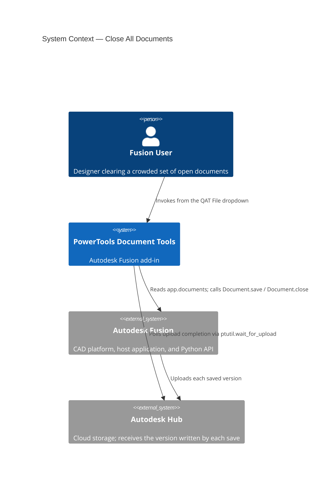
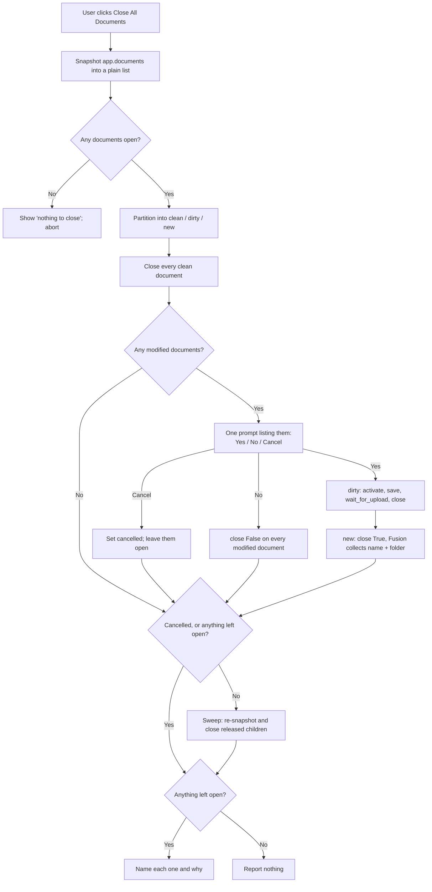

# Close All Documents — Architecture

[← Close All Documents guide](../Close%20All%20Documents.md)

## Architecture

### Command ID

`PTND_closealldocuments`

### System context

### The commandCreated launcher (the load-bearing detail)

The Fusion API states that **closing a document is not supported within any of
the command related events** ([Document.close][close-doc]). An `execute` handler
runs inside a command transaction, so a close attempted there fails.

The whole command therefore runs in `command_created` and returns before any
transaction opens. There is no `execute` handler and no `CommandInputs`; the
button is a launcher. `commands/refresh` (which closes the active document) and
`commands/datatoggle` use the same shape — copy from those, not from a
dialog-based command such as `syncitempartnumber`.

[close-doc]: https://help.autodesk.com/cloudhelp/ENU/Fusion-360-API/files/Document_close.htm

### Handle safety

A document handle held across a pumped wait can be invalidated by background
data-model work, and dereferencing a stale one **faults natively** (0xC0000005 in
`NsDataModel10.dll`) rather than raising something Python can catch. This is the
crash class already recorded for the Bottom-Up Update save/close cycle. Two
mitigations, both in `_close_quietly`:

1. Re-check `doc.isValid` immediately before every close. An already-invalid
   handle counts as closed — the document it referred to is gone either way.
2. `ptutil.pump_events_for(0.25)` after every close, so it drains before the next
   one is queued. Queued Close/Open/Save commands overflowing the message queue
   also appears in the CER data.

### Classification

`app.documents` includes documents Fusion opened **invisibly** as references, so
the sweep sees more than the visible tabs. Each open document is sorted into one
of three buckets, and the bucket decides the close call:

| Bucket | Condition | How it closes |
|---|---|---|
| `CLEAN` | `isModified` is false | `close(False)` immediately, no prompt |
| `DIRTY` | modified, has a `dataFile` | `doc.save()` + `wait_for_upload`, then `close(False)` |
| `NEW` | modified, no `dataFile` | `close(True)` — Fusion's own Save dialog |

`NEW` is a separate bucket because `Document.save()` cannot write a document that
has never been saved: an initial save needs `saveAs` with a name and folder,
which only an interactive dialog can collect. `close(True)` delegates the whole
question to Fusion and returns whether the close went through, so a user who
cancels Fusion's dialog keeps the document. These are **not** counted as saved —
Fusion's prompt also offers Don't Save, and there is no way to tell afterwards
which the user picked.

Unreadable handles fall to the cautious side: an unreadable `isModified` is
treated as `DIRTY` (so the document is never discarded without the prompt
covering it), and an unreadable `dataFile` is treated as `NEW` (so Fusion decides
how to save it).

Each bucket is ordered **visible-first**, because closing a visible parent
releases the invisible children it holds open.

### Execution flow

The snapshot at step B is required: closing mutates `app.documents`, so iterating
it live skips documents.

### The final sweep and its guard

Referenced children are released only when their parent closes, so a second look
at the collection catches leftovers. The sweep runs **only when nothing was left
open** — after a Cancel, or a failed save, a modified parent is still open, and
closing one of its invisible children out from under it is exactly what the sweep
must not do. The guard is `if not tally.left_open and not tally.cancelled:` in
`_close_all_documents`.

### Reporting

A clean sweep reports nothing: the emptied tabs are the confirmation, and a
"closed N documents" box on every run is noise. The counts go to
`cache/powertools-debug.log` via `ptutil.log` instead, which is what matters when
diagnosing a bulk close after the fact.

A message box appears only when `tally.left_open` is non-empty — a save that
failed, a Fusion Save dialog the user cancelled, or a close Fusion refused. Those
are silent failures otherwise: the user sees documents still open with no reason
given. Cancel is tracked on a separate `cancelled` flag rather than as a
`left_open` entry, because the user already knows what they clicked; the flag
exists to suppress the sweep, not to report.

### Pure logic (unit-tested)

`commands/closealldocuments/logic.py` holds the Fusion-free helpers so they can
be tested without the host (`tests/test_closealldocuments_logic.py`). Nothing
there imports `adsk`; the document helpers are duck-typed on the `count` /
`item(i)` collection shape and the `name` / `isModified` / `dataFile` /
`isVisible` document shape, the same approach as
`bottomupupdate._collect_stray_documents`.

| Symbol | Role |
|---|---|
| `snapshot_documents(documents)` | Copy the live collection to a list before the first close; skip unreadable items |
| `classify_document(doc)` | `CLEAN` / `DIRTY` / `NEW`, with the cautious fallbacks above |
| `partition_documents(docs)` | The three buckets, each ordered visible-first |
| `document_name(doc)` | Guarded name read for logging and reporting |
| `format_save_prompt(names)` | The single prompt listing every modified document |
| `format_left_open(left_open)` | Names the documents that did not close, and why |

### UI ownership

The command owns no container. It adds one control to the **existing QAT File
dropdown** via `ptutil.get_qat_file_dropdown()`, anchored after `ExportCommand`
so it lands beside **Refresh Active Document**; `stop()` removes it with
`ptutil.remove_from_qat_file_dropdown(CMD_ID)`. There is no icon — QAT dropdown
entries are text items.

---

[← Close All Documents guide](../Close%20All%20Documents.md)

---

*Copyright © 2026 IMA LLC. All rights reserved.*
