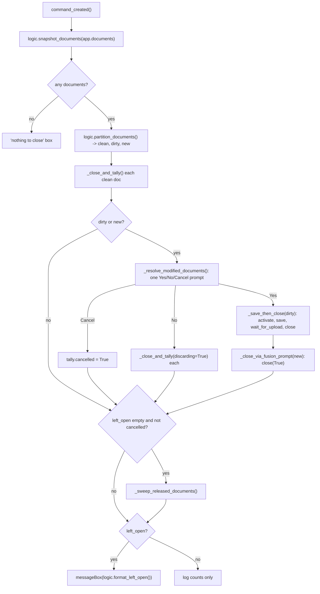

# Close All Documents — Architecture

[← Close All Documents guide](../Close%20All%20Documents.md)

| | |
|---|---|
| **Command ID** | `PTND_closealldocuments` |
| **Registry** | group `document` (`Document Tools`); enabled by default; not beta |
| **UI location** | QAT File dropdown via `ptutil.get_qat_file_dropdown()`, inserted after `ExportCommand` (**Export**); text item, no icon |
| **Files** | `commands/closealldocuments/entry.py`; `logic.py` (`adsk`-free) |
| **Shared helpers** | [`ptutil.get_qat_file_dropdown`, `remove_from_qat_file_dropdown`](architecture.md#ui_utils); [`ptutil.pump_events_for`, `log`, `handle_error`](architecture.md#general_utils); [`ptutil.wait_for_upload`](architecture.md#upload_utils); [`ptutil.add_handler`](architecture.md#event_utils) |
| **Tests** | `tests/test_closealldocuments_logic.py`; `tests/test_command_abort.py`; `tests/test_command_contract.py` |

## Purpose

Closes every open document in one pass: documents with nothing to save close immediately, and the rest are covered by a single Save / Don't Save / Cancel prompt whose answer applies to all of them. The constraint that shapes it is a Fusion API rule — closing a document is not supported inside any command event — so the whole command runs in `commandCreated` and returns before a command transaction opens.

## How it is wired

- `start()`: `addButtonDefinition(CMD_ID, CMD_NAME, CMD_Description)`; `ptutil.add_handler(cmd_def.commandCreated, command_created)`; when `ptutil.get_qat_file_dropdown()` returns a control, `file_dd.controls.addCommand(cmd_def, "ExportCommand", False)`.
- `stop()`: `ptutil.remove_from_qat_file_dropdown(CMD_ID)`; delete the definition.
- `command_created(args)`: `_close_all_documents()` inside a `try`; any exception → `ptutil.handle_error(CMD_NAME, show_message_box=True)`. No `CommandInputs`, no `execute` handler. A `command_destroy` function exists in the file but is not registered anywhere. This is the [acting-from-commandCreated](architecture.md#acting-from-commandcreated-when-there-are-no-inputs) shape shared with `refresh` and `datatoggle`.
- `_close_all_documents()`:
  1. `logic.snapshot_documents(app.documents)` — a plain list, taken before the first close because closing mutates the collection. Empty → "There are no open documents to close." and return.
  2. `logic.partition_documents(docs)` → `(clean, dirty, new)`, each ordered visible-first.
  3. `_close_and_tally(doc, tally)` for every clean document.
  4. If anything is dirty or new, `_resolve_modified_documents(dirty, new, tally)`.
  5. `_sweep_released_documents()` only when `not tally.left_open and not tally.cancelled`.
  6. Log `closed / saved / discarded / left_open` counts with `ptutil.log`; show `logic.format_left_open(tally.left_open)` in a message box only if something is still open.
- `_resolve_modified_documents(dirty, new, tally)`: one Yes/No/Cancel box built by `logic.format_save_prompt(names)`. Cancel → `tally.cancelled = True`. Yes → `_save_then_close(dirty, tally)` then `_close_via_fusion_prompt(new, tally)`. No → `_close_and_tally(doc, tally, discarding=True)` for all of them.
- `_save_then_close(docs, tally)`: per document, progress bar + `adsk.doEvents()`, then `_save_document`: `doc.activate()`, `ptutil.pump_events_for(CLOSE_SETTLE_SECONDS)`, `doc.save(SAVE_DESCRIPTION)`, and `ptutil.wait_for_upload(save_result, name, document=doc, log_fn=ptutil.log)`. A failed or timed-out save leaves the document open (`left_open` reason "could not be saved"); a successful one is closed with `_close_and_tally`.
- `_close_via_fusion_prompt(docs, tally)`: `doc.close(True)` hands each never-saved document to Fusion's own Save dialog; `False` back means the user cancelled (`left_open` reason "save was cancelled"). These are never counted as saved — Fusion's dialog also offers Don't Save and there is no way to tell which was chosen.
- `_close_quietly(doc)`: `doc.isValid` false → treated as already closed; `doc.close(False)`; `ptutil.pump_events_for(CLOSE_SETTLE_SECONDS)` so the close drains before the next is queued. Used by `_close_and_tally` and the sweep.
- `_sweep_released_documents()`: re-snapshot `app.documents` and `_close_quietly` everything `logic.classify_document` classifies as `CLEAN` on that second pass.

## Data and state

- `local_handlers`; a per-run `_Tally(closed, saved, discarded, cancelled, left_open)` dataclass.
- `SAVE_DESCRIPTION = "Saved by PowerTools Close All Documents"` — the version comment for group saves.
- `CLOSE_SETTLE_SECONDS = 0.25` — the pump after every close and before every save.
- Counts go to the debug log (`cache/powertools-debug.log`, only with `.debug` present). No settings keys, no custom events.

## Classification

`app.documents` includes documents Fusion opened invisibly as references, so the sweep sees more than the visible tabs. `logic.classify_document` sorts each into one bucket, and the bucket decides the close call:

| Bucket | Condition | How it closes |
|---|---|---|
| `CLEAN` | `isModified` false | `close(False)`, no prompt |
| `DIRTY` | modified, has a `dataFile` | `save()` + `wait_for_upload`, then `close(False)` |
| `NEW` | modified, no `dataFile` | `close(True)` — Fusion's own Save dialog |

`NEW` is separate because `Document.save()` cannot write a never-saved document: an initial save needs `saveAs` with a name and folder, which only an interactive dialog collects. Unreadable handles fall to the cautious side — an unreadable `isModified` is `DIRTY` (never discarded without the prompt), an unreadable `dataFile` is `NEW` (Fusion decides). Each bucket is ordered visible-first (`logic._visible_first`) because closing a visible parent releases the invisible children it holds open.

## Handle safety

A document handle held across a pumped wait can be invalidated by background data-model work, and dereferencing a stale one faults natively (0xC0000005 in `NsDataModel10.dll`) rather than raising — the crash class recorded for the Bottom-Up Update save/close cycle. `_close_quietly` re-checks `isValid` immediately before every close and pumps `CLOSE_SETTLE_SECONDS` after it; `_close_via_fusion_prompt` does the same. Every attribute read in `logic.py` is guarded so a document that goes stale mid-sweep is skipped, not fatal.

## The final sweep and its guard

Referenced children are released only when their parent closes, so a second look at `app.documents` catches leftovers. The sweep runs only when nothing was left open and nothing was cancelled: after a Cancel or a failed save a modified parent is still open, and closing one of its invisible children out from under it is exactly what must not happen. The guard is `if not tally.left_open and not tally.cancelled:` in `_close_all_documents`.

## Reporting

A clean run reports nothing — the emptied tabs are the confirmation, and the counts go to the log. A message box appears only for `left_open`: a save that failed, a Fusion Save dialog the user cancelled, or a close Fusion refused. `cancelled` is a flag rather than a `left_open` entry because the user already knows what they clicked; it exists to suppress the sweep, not to report.

## Pure logic (`logic.py`)

Nothing here imports `adsk`; the helpers are duck-typed on `count` / `item(i)` for the collection and `name` / `isModified` / `dataFile` / `isVisible` for a document, the same approach as `bottomupupdate._collect_stray_documents`.

| Symbol | Role |
|---|---|
| `snapshot_documents(documents)` | Copy the live collection to a list; skip unreadable or `None` items; a broken collection yields `[]` |
| `classify_document(doc)` | `CLEAN` / `DIRTY` / `NEW` with the cautious fallbacks above |
| `partition_documents(docs)` | The three buckets, each visible-first |
| `document_name(doc)` | Guarded name read: `"(unnamed)"` for blank, `"(unknown document)"` for unreadable |
| `format_save_prompt(names)` | The single prompt listing every modified document and explaining Yes / No / Cancel |
| `format_left_open(left_open)` | Names each document still open, with its reason |

## Diagram

The run, from the snapshot to the conditional report. Branch labels are the user's answer to the one prompt.

```mermaid
flowchart TD
    A["command_created()"] --> B["logic.snapshot_documents(app.documents)"]
    B --> C{"any documents?"}
    C -- no --> C1["'nothing to close' box"]
    C -- yes --> D["logic.partition_documents() -> clean, dirty, new"]
    D --> E["_close_and_tally() each clean doc"]
    E --> F{"dirty or new?"}
    F -- no --> K
    F -- yes --> G["_resolve_modified_documents(): one Yes/No/Cancel prompt"]
    G -- Cancel --> G1["tally.cancelled = True"]
    G -- No --> G2["_close_and_tally(discarding=True) each"]
    G -- Yes --> H["_save_then_close(dirty): activate, save, wait_for_upload, close"]
    H --> I["_close_via_fusion_prompt(new): close(True)"]
    G1 --> K
    G2 --> K
    I --> K{"left_open empty and not cancelled?"}
    K -- yes --> M["_sweep_released_documents()"]
    K -- no --> L
    M --> L{"left_open?"}
    L -- yes --> L1["messageBox(logic.format_left_open())"]
    L -- no --> L2["log counts only"]
```

## Tests

- `tests/test_closealldocuments_logic.py` — 24 cases: snapshot order, empty and broken collections, skipping unreadable or `None` items; the three classifications and both cautious fallbacks; partitioning, visible-first ordering and its stability; `document_name` fallbacks; prompt wording (count, singular/plural, all three buttons); the left-open report.
- `tests/test_command_abort.py` — the tree-wide AST guard names `("commands/closealldocuments/entry.py", "command_created")` among the handlers it must see, and asserts none of them call `doExecute`.
- `tests/test_command_contract.py` — registry row, `CMD_Description`, docs pair, `CMD_ID` shape.

The close calls, the save/upload wait and the sweep are not covered. `entry.py` is Fusion-bound and is not exercised by the suite; nothing here is verified in Fusion on this branch except by the AST guards in `tests/test_command_contract.py` and `tests/test_command_abort.py`, which import it under the `adsk` stub.

## Learnings

- **Closing a document inside a command event fails.** The [`Document.close`](https://help.autodesk.com/cloudhelp/ENU/Fusion-360-API/files/Document_close.htm) reference says so explicitly; an `execute` handler runs inside a command transaction. Do the work in `commandCreated` and return (rule 6); copy this command or `refresh`, not a dialog command.
- **A stale document handle faults natively.** Background data-model work can invalidate a handle held across a pumped wait, and dereferencing it crashes in `NsDataModel10.dll` rather than raising; re-check `isValid` before every close and pump briefly after (rule 3). Queued Close/Open/Save commands overflowing the message queue also appear in the CER data.

---

*Copyright © 2026 IMA LLC. All rights reserved.*
