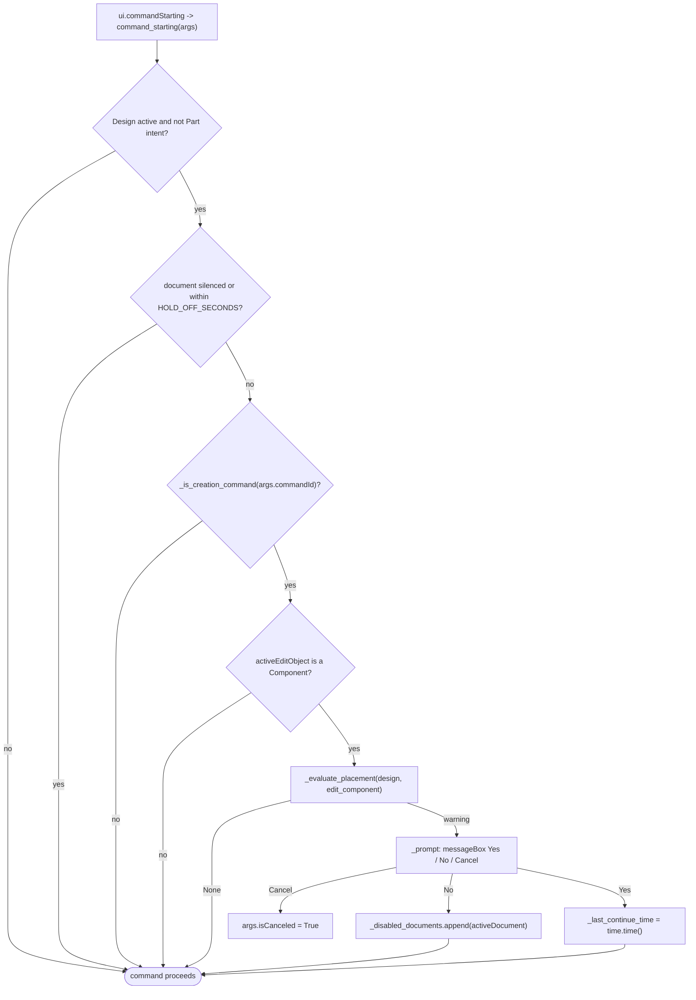

# Component Warning — Architecture

[← Component Warning guide](../Component%20Warning.md)

| | |
|---|---|
| **Command ID** | `PTAT_componentWarn` — declared for the command contract; no button definition or control is created |
| **Registry** | group `assembly` (`Assembly`), `settings=True`; **ships disabled** (`settings_store.DEFAULT_DISABLED_COMMANDS`). Setting `componentwarn.warn_non_leaf` (default `False`, `settings_store.COMMAND_SETTING_DEFAULTS`) |
| **UI location** | none. Enabling the command in Preferences is what loads it; it shows `ui.messageBox` warnings (Yes / No / Cancel) while the Design workspace (`FusionSolidEnvironment`) is active |
| **Files** | `commands/componentwarn/entry.py`; `resources/16x16.png`, `16x16-dark.png`, `32x32.png`, `32x32-dark.png` (no 64 px) |
| **Shared helpers** | [`ptutil.add_handler`](architecture.md#event_utils); [`settings_store.command_setting`](architecture.md#settings_store) |
| **Tests** | none module-specific |

## Purpose

A passive guard: while the Design workspace is active it listens to
`ui.commandStarting` and, when a feature-creation command begins in the wrong
place — directly in the root component, in a non-leaf component (optional), or
with a selection that references another component — shows a modal warning
before the command runs and can cancel it. It is an independent
reimplementation of the behaviour of Thomas Axelsson's MIT-licensed
NoComponentWarn add-in, following PowerTools handler conventions. The shaping
constraint is that the listener must only be attached while the Design
workspace is active, so it never interferes with other environments.

## How it is wired

- `start()`: `ui.workspaceActivated -> workspace_activated` and
  `ui.workspacePreDeactivate -> workspace_pre_deactivate` (persistent, in
  `local_handlers`). If `app.isStartupComplete` and `ui.activeWorkspace.id ==
  SOLID_WORKSPACE_ID`, `_attach_monitor()` runs at once; during Fusion startup
  the workspace event does it instead.
- `stop()`: `_detach_monitor()`, clears `local_handlers`.
- `workspace_activated`: `_attach_monitor()` when the workspace is
  `FusionSolidEnvironment`. `workspace_pre_deactivate`: `_detach_monitor()`.
- `_attach_monitor()`: no-op if already attached; reads
  `settings_store.command_setting("componentwarn", "warn_non_leaf", False)` into
  `_warn_non_leaf` once (re-entering the workspace re-reads it), then
  `ptutil.add_handler(ui.commandStarting, command_starting, local_handlers=_monitor_handlers)`
  and keeps the returned handler in `_starting_handler`. `_detach_monitor()`:
  `ui.commandStarting.remove(_starting_handler)` (guarded for shutdown), clears
  `_monitor_handlers`.
- `command_starting(args)` — every early return lets the command proceed:
  1. `Design.cast(app.activeProduct)` is `None` → return.
  2. `designIntent == PartDesignIntentType` → return (features belong in the
     root of a part; the property is guarded because it is experimental on some
     builds).
  3. `app.activeDocument in _disabled_documents` → return (silenced by "No").
  4. `time.time() - _last_continue_time < HOLD_OFF_SECONDS` (3.0 s) → return.
  5. `_is_creation_command(args.commandId)` false → return.
  6. `Component.cast(app.activeEditObject)` is `None` → return.
  7. `_evaluate_placement(design, edit_component)` returns `None` → return.
  8. `_prompt(warning)`: Cancel → `args.isCanceled = True`; No →
     `_disabled_documents.append(app.activeDocument)`; Yes →
     `_last_continue_time = time.time()`.

This flowchart shows the decision path of `command_starting`.

## Data and state

- `CREATION_COMMANDS`: tuples `(command_id, is_prefix)`; prefix entries
  (`Primitive`, `WorkPlane`, `WorkAxis`, `WorkPoint`) match with `startswith`,
  the rest exactly (`SketchCreate`, `Extrude`, `Revolve`, `Sweep`, `SolidLoft`,
  rib, web, emboss, hole, thread, the three patterns, `MirrorCommand`, thicken,
  and the surface-family commands).
- Module state: `_starting_handler`, `_monitor_handlers`, `_disabled_documents`
  (Document objects, in-memory for the session), `_last_continue_time`,
  `_warn_non_leaf`.
- Setting read: `componentwarn.warn_non_leaf`. Changing it in Preferences takes
  effect the next time the monitor attaches (workspace re-entry or Fusion
  restart); enabling or disabling the command itself applies at the next
  `commands.start()`.
- No cache, no custom events.

## Placement evaluation

`_evaluate_placement` returns the first matching warning:

1. `edit_component == design.rootComponent` → "directly in the root component,
   outside of any component".
2. `_warn_non_leaf and edit_component.occurrences.count > 0` → "in a non-leaf
   component".
3. Any `ui.activeSelections` entry whose `entity.assemblyContext.component` is
   not `app.activeEditObject` → "references another component".

The hold-off exists because one press of the Sketch button can emit two
`SketchCreate` starting events back to back; after "create anyway" the second
one must not prompt again.

## Tests

- No module-specific test. `tests/test_command_contract.py` checks the
  registry entry, `CMD_ID` literal and description casing. Nothing pins the
  `warn_non_leaf` default or `CREATION_COMMANDS`.
- `entry.py` is Fusion-bound and is not exercised by the suite; nothing here is
  verified in Fusion on this branch except by the AST guards in
  `tests/test_command_contract.py` and `tests/test_command_abort.py`, which
  import it under the `adsk` stub. The icon set is not pinned in
  `tests/test_command_icons.py`.

---

*Copyright © 2026 IMA LLC. All rights reserved.*
