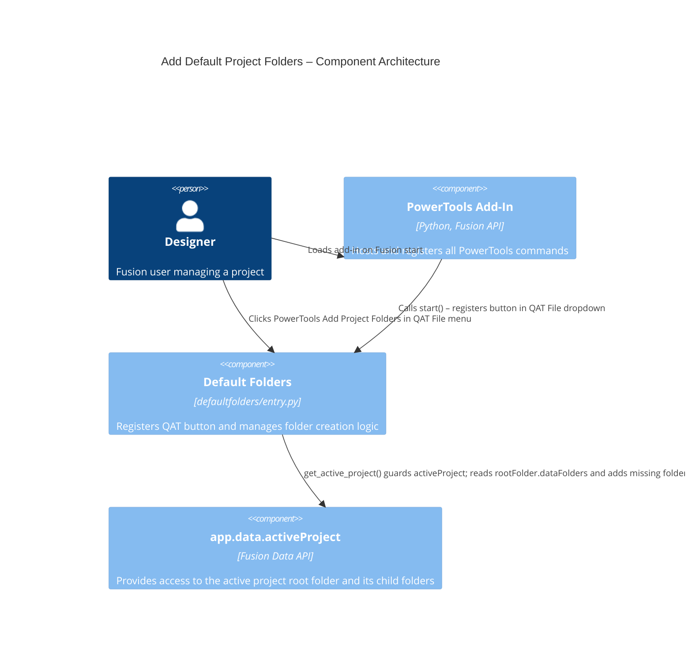

# Add Default Project Folders — Architecture

[← Add Default Project Folders guide](../Default%20Folders.md)

## Architecture

The Add Default Project Folders command registers a button in the QAT File dropdown. On execute, it retrieves the root folder of the active project, reads all existing folder names into a lowercase list, and then iterates through the selected folder set, calling `dataFolders.add()` only for names that are not already present.

### Command ID

`PT_defaultfolders`

### Execution flow

1. The add-in registers the command definition and appends a button to the QAT File dropdown.
2. The user selects **PowerTools Add Project Folders**.
3. A command dialog opens with a **Folder set** dropdown (defaulting to **Basic**) and a read-only **Folders to create** preview.
4. The preview lists every folder in the selected set; folders already present in the project root are shown as `(exists)`.
5. Switching the dropdown immediately refreshes the preview via the `inputChanged` event.
6. The user confirms with **OK**.
7. The `command_execute` handler reads the dropdown selection and resolves the active project through `ptutil.get_active_project()` — which guards `app.data.activeProject` (that raises `InternalValidationError('id.size()')` when the Data Panel has no project in context). If no project resolves, the command shows an actionable message and stops; otherwise it retrieves `rootFolder.dataFolders` and calls `dataFolders.add(name)` only for folder names that are not already present (case-insensitive).

### Component diagram

