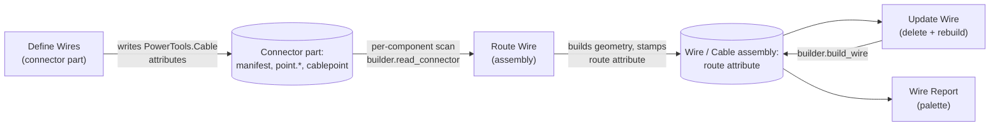

# Define Wires — Architecture
[← Define Wires guide](../Define%20Wires.md)

## Purpose

Author the attribute scheme the cable family consumes: durable, recallable
metadata on part geometry identifying each wire of a connector, its three
anchor points, and the connector's cable breakout point. The command itself
(table dialog, point resolution, recall/rebuild) is the authoring vehicle;
[Route Wire](./Route%20Wire.md) builds geometry from the attributes,
[Update Wire](./Update%20Wire.md) rebuilds it, and
[Wire Report](./Wire%20Report.md) reports it.



## The attribute schema contract (v1)

All attributes live in group **`PowerTools.Cable`** (constants in
`commands/definewires/logic.py` — treat that module as the schema's single
source of truth; it is pure Python with unit tests in
`tests/test_definewires_logic.py`).

### Root component — one manifest attribute

- **name:** `connector`
- **value** (JSON):

```json
{"schema": 1,
 "connector_id": "PigtailConn-3f9a2b1c",
 "name": "Pigtail Conn v3",
 "wires": [
   {"wire_id": "7c1d2e3f", "pin": "1", "awg_min": 16, "awg_max": 24},
   {"wire_id": "9ab04d12", "pin": "2", "awg_min": 16, "awg_max": 24}
 ]}
```

`connector_id` = slugified component name + `-` + 8-hex-char uuid slice. It is
generated **once** and never regenerated — component renames refresh `name`
only. A uuid (not `entityToken`) because tokens are not stable across document
copies; the component-name prefix keeps the id human-meaningful. The `wires`
array order is the user's display order.

### Each wire point — one attribute per (wire, role)

The point is a **work point or sketch point**. Attribute **name** is
`point.<wire_id>.<role>` with role one of `start` | `strip` | `exit`, so a
point's wire membership is readable without parsing values. **value** (JSON):

```json
{"schema": 1, "connector_id": "PigtailConn-3f9a2b1c", "wire_id": "7c1d2e3f",
 "role": "start", "pin": "1", "awg_min": 16, "awg_max": 24}
```

The redundancy between manifest and point payloads is deliberate: a routing
command holding only a point knows everything about its wire; the manifest is
the cheap set-level index. Pin and gauge duplicated per point means a partial
recovery (manifest lost) still reconstructs the set — `logic.wire_fields`
prefers point payloads and falls back to the manifest entry.

### The cable point — one attribute per connector

Multi-pin connectors also carry a **cable breakout point** (where a
multi-conductor cable ends and its wires fan out to the pins). Attribute
**name** `cablepoint` on the point entity (work point or sketch point),
**value** (JSON):

```json
{"schema": 1, "connector_id": "PigtailConn-3f9a2b1c", "role": "cable"}
```

`logic.group_attributes_into_wires` buckets it under `"cable"` — crucially
NOT under `"bad"`, whose entries the command's execute deletes as garbage.
Define Wires requires it whenever the connector has more than one wire;
Route Wire's cable mode requires it on both connectors.

### Query story for consumers

The shipped consumers scan narrowly: Route Wire reads the two *selected*
components (`builder.read_connector`), Update Wire and Wire Report walk the
root occurrences for `route` attributes (`builder.collect_routes`). The
design-wide wildcard queries below remain the intent for future tooling:

- `design.findAttributes("PowerTools.Cable", "connector")` — enumerate every
  connector in scope.
- `design.findAttributes("PowerTools.Cable", "")` — everything in the group;
  bucket by `logic.parse_point_attr_name` / `attribute.parent.entityToken`
  (the orphan-tolerant pattern from `lib/ptAddInUtils/attributes_utils.py`).
- `attribute.parent` is None (or raises) when the owning point was deleted —
  callers must treat those as orphans, exactly as this command's recall does.

> **OPEN QUESTION (verify when building the routing command):** whether
> `findAttributes` on an *assembly* design surfaces attributes stored inside
> referenced (XRef) component documents, and how parents are proxied through
> occurrences. This prove-out only exercises the single-document case.

## Design decisions

- **JSON in attribute values** is a first for this add-in (existing attributes
  are scalar strings). Justified here: six correlated fields per point, ~150
  bytes, versioned via `"schema": 1` so a v2 can migrate. `logic.parse_payload`
  is tolerant (returns None on damage), and attributes whose NAME this build
  does not recognize are reported but never deleted — they may belong to a
  future schema version or a sibling feature, and destroying them on every OK
  would silently eat that data.
- **Point resolution** (`entry._resolve_point`): sketch/work points pass
  through; a sketch circle/arc contributes its existing `centerSketchPoint`
  (no redundant geometry); a circular BRep edge gets a work point via
  `ConstructionPointInput.setByCenter(edge)` (accepts circular edges and
  sketch arcs/circles per the API docs). Work points created for edge picks
  are **not** deleted on wire removal/re-pick — accepted prove-out residue;
  only attributes are removed, so recall is unaffected.
- **Recall/edit** rebuilds the dialog from `findAttributes` in
  `command_created`; unchanged rows rewrite onto the same points (idempotent —
  `attributes.add` overwrites same-name), moved points get the stale attribute
  deleted first, deleted rows remove all their attributes (deletion wins over
  re-addition via `logic.diff_wires`). A wire whose points FAIL to resolve
  during execute is *kept*, not removed: its stored attributes stay and its
  manifest entry is re-emitted, so a transient resolution failure can never
  destroy a stored definition (only explicit row deletion removes wires).
- **Selection UX**: Fusion does not support SelectionCommandInputs in table
  cells, so per-wire selections live in a "Wire editor" group that always
  edits the active row; rows activate via a per-row Edit button (bare table
  row-selection does not reliably fire inputChanged). Editor edits write
  straight into the wire record — no commit step, so switching rows cannot
  lose data.
- **Dialog state is the truth for selection inputs.** Fusion clears
  selection inputs during focus/visibility churn and re-fires inputChanged;
  honoring those events once silently wiped the stored cable point (the
  next OK then deleted its attribute). Empty-selection events on the cable
  input re-seed it from module state instead of erasing it, and activating
  a row explicitly focuses the first editor input so canvas picks land on
  the intended wire rather than auto-advancing into the cable input.
- **Pin defaults auto-increment** (`logic.next_pin`): highest numeric pin
  plus one, "1" for the first wire; non-numeric names are ignored. int() is
  the numeric arbiter — `str.isdigit()` alone accepts unicode digits
  (superscripts, circled numbers) that int() rejects, and pins are free
  text. Duplicate pins are rejected by `logic.validate_wires`; duplicate
  POINTS are compared by their *resolved* identity (a circle and its own
  center sketch point are the same point).
- **No executePreview**: attributes are invisible and preview would churn
  work-point create/rollback on every input change for nothing.
- **Icons are placeholders** copied from `roundsketchdimensions` — replace
  before this graduates from beta.

---

[← Define Wires guide](../Define%20Wires.md)
