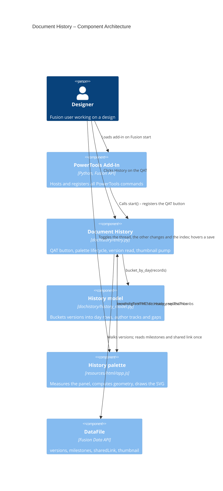

# Document History — Architecture

[← Document History guide](../Document%20History.md)

## Architecture

A QAT button that opens an HTML palette. The palette draws the active document's version history as a stack of day rows — one row per local calendar day, newest first, split into a track per author, with saves placed on a 00:00–24:00 clock axis and the elapsed time called out between rows.

It replaces the original behaviour, which selected the root component and ran Fusion's built-in `ShowHistoryCmd`. That panel is a single undifferentiated strip: it cannot say who saved what, how a working day was shaped, or how long the design sat untouched, which are the questions this view exists to answer. The presentation is a port of the History timeline in the adjacent FusionOnPremServer web app, so the same history reads the same way in both places.

### Command ID

`PTND_history` — unchanged from the `ShowHistoryCmd` version, deliberately: renaming a `CMD_ID` orphans every user's saved QAT pin (6789216).

### Files

| File | Holds |
|---|---|
| `entry.py` | Fusion contact only: lifecycle, reading the versions, serving the page, the thumbnail pump. |
| `history_model.py` | The bucketing — day rows, author tracks, gaps, the calendar arithmetic — plus the merge of MFGDM's two version views and the index numbering. `adsk`-free and unit-tested. |
| `mfgdm_history.py` | The GraphQL read: one paginated request over `mfgdm://v3`, through the transport `partnumber_shared/mfgdm_props.gql` already owns. |
| `resources/html/{index.html,style.css,app.js}` | The drawing, plus the width-dependent geometry. |
| `tests/test_dochistory_history_model.py` | A port of the vitest suite covering the same bucketing in the web app, so the two presentations cannot drift apart in what they claim about a history. |

### Where the layout maths lives, and why it is split

The bucketing is in Python because it is where a plausible wrong number would come from — which day a save belongs to, which track, how many days two rows are apart — and the repo rule is that such logic lives in an `adsk`-free module with tests.

The geometry is in `app.js` because all of it depends on the panel width the browser measures (`ResizeObserver` on the scroll container). Sending a width to Python and a layout back would put a round trip in the middle of a drag. Its port was verified locally against the same vitest cases; CI cannot run it, because CI installs nothing but ruff and pytest.

Constants therefore live on exactly one side: `TRACKS_PER_DAY_CAP` with the bucketing, `DAY_ROWS_CAP` and every pixel value with the drawing.

`RAIL_FRAC` puts a track's rail at 80% of its own height rather than the middle, and `ROW_PAD_Y` is the lead-in above the first one. Both exist for the angled index labels: the rail is low so the labels have somewhere to rise, and the lead-in is the top track's share of that room. Because the labels lean sideways rather than rising straight up, that room is less than their full height — with `AXIS_H` trimmed to match, a one-track day row is back at the 66px it stood at before it carried any labels. The avatar disc is offset by the same fraction with a `translateY`, not padding, so the gutter meets the rail it labels without any cell changing height and pushing the next one down.

The **Index** toggle splits on the same line. `history_model.stamp_index_labels` decides the numbers — a release counts up major, a save or milestone minor, any other change patch, each resetting what sits below it — because a version number that is quietly wrong is worse than one that is missing. `app.js` owns only where the label goes, which needs the measured width. `indexLabelNodes` draws it at `INDEX_ANGLE` rising from just above its dot: rotated, two neighbours slide past each other diagonally and need only their line height over sin(angle) of horizontal clearance — about 12px at 45 degrees — which fits inside `MIN_DOT_GAP`, so a day view run can label every dot. Flat labels needed their full ~30px width and most of a busy day's had to be dropped. `INDEX_MIN_GAP` is left as a guard for the one case the axis cannot separate at all: `declutter` spaces a run evenly once there are more dots than the width can hold, and past that the labels would pile up unreadably.

The label rises *left*, ending at its dot (`INDEX_ANCHOR` of `end` with a positive `INDEX_ANGLE`), so the number reads into the event rather than away from it; the cost is that a save near midnight has its label clipped by the left edge of the plot, and rising right only moves that problem to the right edge. The two constants flip together.

`indexLabelColor` keeps a label to two colours: accent for a release, `C.secondary` for everything else. It first took the author's rail colour for a change, to pair a number with its mark, and that had to be reverted after a screenshot of a five-track day — the author hues are chosen to tell *people* apart across a hub, not to be legible as 9px text, and a label lands beside a rail drawn in the same hue, so it competed with the line instead of pointing at the dot. Which author a number belongs to is already said by which track it sits on.

`INDEX_DY` is likewise gone, replaced by `markerRadius(v) + INDEX_CLEAR`. Sizing every label off `HALO_R` floated the common cases — a plain save, and a change ring at little more than half that radius — six to eight pixels out for a ring they do not wear.

`TRACK_H` and `TRACK_H_INDEXED` are the reason `trackHeight()` exists. A label rises about 25px out of its dot and the tight track pitch is 30, so most of every label sat in the band of the track *above* it: on that same five-track day the numbers on one author's dots read as the author above's, which is misattribution rather than clutter. Rows therefore open while the toggle is on and close again when it is off, by however much `indexedTrackPitch` works out the labels in *this* history need — the widest label and deepest marker across the rendered stack, plus `NODE_R` of tail clearance off the dots above. It was a flat 44px constant, sized for the longest label the numbering can produce and so for a history most documents never have: a two-digit major needs nine pixels of rise a single-digit one does not, and that was nine pixels off every track of every row for nothing. Derived, a typical history lands at 35 to 38 against the unindexed 30, and only the rare `10.10.10` case reaches the old 44. Only computed when the toggle is on, since `render` runs on every pixel of a resize drag. Everything vertical — `rowHeight`, `trackY`, the avatar cells, and `layoutStack`/`threadOverlay` through them — reads that one function, because mixing the two heights inside a single render is what would drift the thread polyline off its dots.

**The hover reveal is what keeps that cost optional.** Opening every row is only worth paying for when every number is on screen at once; with the toggle off, resting the pointer in a track shows that track's numbers alone, at the tight pitch. One track at a time has nothing to be confused with, so the misattribution the roomy pitch exists to prevent cannot arise, and a label crossing the rail above is handled by masking instead of by space.

Three details make it work. The labels are always built and live in their own `<g>`, revealed by one `display` attribute rather than by a re-render — re-rendering on hover would replace the DOM under the cursor and drop the very hover that asked for them. The `mouseenter`/`mouseleave` pair is bound to the whole **track group**, not to the transparent hit rect inside it: the dots are siblings of that rect, so moving onto a dot counts as leaving the rect and would blink the numbers off exactly when a reader reached for one. And the hit rect spans the full band rather than the 3px rail, so the pointer does not have to find the line.

Each label paints its own mask: a `C.paper` rect, plus a `C.band` rect over it on a banded row, because `--band` is translucent and cannot be flattened into a single fill — the same two-layer approach `.gutter.band` takes in the stylesheet. `indexLabelWidth` sizes that mask from an estimate rather than a `getBBox` measurement, which is affordable only because the alphabet is ten digits and a dot, whose advances are known; dots are counted separately at about half a digit's width, since a label is a third dots by character count.

`rowNode` places every track before it draws any of it, which is not incidental ordering. Whether the axis can carry its interior hour markers depends on where `declutter` actually put the dots, so the layout has to exist before that decision — the tracks loop then reads the stored placement rather than recomputing it.

`driftCrossesMarker` is that decision, and it is the one piece of this view that guards against the drawing telling a lie. `declutter` trades clock accuracy for legibility, and in its worst branch — more dots than the axis can ever separate — it abandons clock position and spaces the run evenly. The markers do not move with it, so a 9 AM save can end up drawn right of 12 PM, where the only honest reading of the picture is "afternoon". The axis therefore gives up its precision rather than assert it: the quarter-day markers come off, the row keeps its own two bounds, and it claims order instead of time.

The test is a **crossing**, not a distance, and that distinction is the whole design. A dot nudged from 09:00 to 10:30 still reads as morning and costs nothing; one nudged from 11:59 to 12:01 has changed which half of the day it appears to be in on a twentieth of the movement. Any distance threshold would have been a guess at where those cases divide and would have got both wrong — a run drifting 4.9 hours but staying before noon keeps its markers correctly, which no distance rule would allow. The crossing must also clear `DRIFT_VISIBLE`: below that the code already judges a nudge too small to be worth a hairline, so it is too small to strip an axis over. The check is row-level because one axis stands behind every track in the row.

`indexLabelText` is the one place that answers what a label prints, shared by the drawing, the width measurement behind the track pitch, and the hover card. It prints all three figures. For one commit it dropped the major while that was still zero, on the grounds that the digit could not vary and the angled labels would be shorter for it; testing rejected that — a two-figure number beside a three-figure one is ambiguous to read whatever the arithmetic says about the information in a leading zero, and a three-number presentation is worth more than the pixels. The card prints it unconditionally: gating it on `showIndex` made sense while the toggle was the only way to see a number, but once hovering a track revealed them it meant the one place a reader was already pointing at an event was the place that would not name it.

`INDEX_MIN_GAP` is `MIN_DOT_GAP`, not a number of its own. Two parallel labels clear each other by their horizontal separation times sin(angle), so an ~11px line box needs about 16px of separation; the 14 it was set to let the dense runs overlap. Landing exactly on `MIN_DOT_GAP` is the useful part: any dot `declutter` managed to separate keeps its label, and only a genuinely unseparable pile loses one.

Both share one ordering. `_ordered_oldest_first` is the history's canonical sequence; `bucket_by_day` numbers a dot's thread-axis `index` from it and `stamp_index_labels` counts along it, so a label can never disagree with a position. It was inlined in `bucket_by_day` before the numbering needed it too.

The numbering runs once, over the saves and the changes together, before either `bucket_by_day` call — the labels ride on record dicts both stacks share by reference. Resetting patch on a save is what makes that safe: a save's label depends only on the releases and saves before it, so the two stacks agree about every save and `showChanges` adds patch labels without renumbering a dot.

### Execution flow

1. `start()` registers the command definition and inserts the button before the QAT **Save** control, then registers the custom event that drives the thumbnail pump.
2. `command_created` opens the palette directly. Not from `execute`: this command has no `CommandInputs`, and `execute` only fires when Fusion runs a command through its document-scoped pipeline, so with no document open the button would be live and nothing would happen (f18b911, 11cfc51). It bails out on no document and on an unsaved one (`ptutil.isSaved`).
3. `command_created` opens nothing. It validates and calls `_schedule_load()` — a `threading.Timer` → `app.fireCustomEvent` hop.
4. `_LoadHistoryHandler` runs on the next main-loop turn: `_gather_history()` reads the history behind `ui.progressBar.showBusy`, then `_open_palette(state)` writes that state into `init.js` and creates the palette from it.
5. The page requests a thumbnail only for the version the pointer rests on, and the pump answers it.

### init.js is the only channel to this page

The page must be able to paint from `init.js` alone, because nothing else has been shown to work.

Two builds proved it. The first opened the palette with a "Reading version history…" banner and waited for the page to ask for the data over `adsk.fusionSendData`; the palette sat on the banner forever. The second read the history on a deferred event and pushed it with `sendInfoToHTML` to an already-open palette; the palette came up empty even though the log recorded a successful 27-version read.

The DEBUG log explains both. `_palette_incoming` logs every action the page sends, and the count of `htmlReady` across every session to date is **zero** — the handshake the page fires at parse time never arrives. `requestThumbs`, sent later from a hover, does. So the page→Python channel only works after the page has been up a while, and the Python→page direction has never been independently demonstrated at all: every time this palette has shown a history, the data came from `init.js`.

Hence the order: read first, write `init.js`, then create the palette. An already-open palette is torn down and rebuilt rather than refreshed, because a live page cannot be made to re-read `init.js`; that costs the thread toggle and scroll position on a re-click. The `htmlReady` → `setHistory` path is still wired and answers from `_last_state` rather than re-reading, so it costs nothing if the handshake ever does start arriving.

### Reading the history

The history comes from **MFGDM over GraphQL**, with the desktop Data API as a fallback. `mfgdm_history.py` owns the query; the merge is pure and tested in `history_model.merge_cloud_history`.

**Why not the desktop API.** It cannot attribute versions. `DataFile` exposes exactly two `User` properties and there is no per-version type; on a 27-version design saved by nine people, `createdBy` returned "Jeremy Lambert" for all 27 and `lastUpdatedBy` returned "Myron Oakley" for all 27 — one file-level name each, and different names from each other. Fusion's own history panel shows all nine. Swapping one property for the other only trades one wrong constant for another, so the source had to change.

**Where the data actually is.** Two halves of one request:

| Field | Carries |
|---|---|
| `model.designItem.versions` → `DesignItemVersion` | `versionNumber`, `createdOn`, `createdBy` — the only per-version author Fusion exposes |
| `model.history` → `ModelWrittenHistoryChange` | the `description` typed at save time; `DesignItemVersion.description` comes back empty |

`ModelWrittenHistoryChange` is the save event — a 27-version design produced exactly 27 of them. (`VersionCreatedHistoryChange` is a *milestone*: its id decodes to `…~milestone`.) The two lists are joined **by position, not timestamp**: MFGDM stamps the same save up to 35 seconds apart in its two views. Position is trusted only when the lengths match; otherwise every version keeps its author and date and loses its comment, because a save wearing someone else's comment is worse than a bare one.

**Cost.** One request, 1.4s, against 21s for the walk it replaces — that walk was ~160 cloud round trips, because every `DataFile` property read is one. Thumbnails stay off the query deliberately: `DesignItemVersion.thumbnail.signedUrl` costs ~1.4s per row, five rows took 8.3s and thirty aborted the transport at 30s.

**Timing.** `rootDataComponent.mfgdmModelId` must not be read from `commandCreated` — doing so and then showing a modal crashed Fusion (234b043). The read runs from a timer-fired custom event instead, which also means the palette appears immediately and fills in, rather than freezing Fusion before it is on screen.

**Other changes.** The history query is unfiltered, so it also returns the entries that produced no version: on the test design, 11 `PropertiesUpdatedHistoryChange` ("Estimated Cost: 100"), 3 `ComponentPrimaryHistoryChange` and the milestone, against 27 saves. `history_model.change_records` turns them into records marked `kind == "change"`, and they are worth keeping because **two of that design's nine contributors never saved a version at all** — a saves-only history credits it to eight.

Two of those types are dropped, though — `history_model.DUPLICATE_CHANGE_TYPES`. `RevisionCreatedHistoryChange` and `VersionCreatedHistoryChange` are the audit-trail entries for *creating* a release or a milestone, and the same release or milestone already decorates the save it was made against by way of `DataFile.milestones` (`entry._decorate_cloud_records`). Drawing both put a release on screen twice: an accent dot with its ring, and a bare open ring beside it labelled "Release". The save dot is the one that carries the version number and the revision name, so it wins. The cost is that a person who only named a release and never saved is credited nowhere; `CHANGE_LABELS` keeps both names because `change_label` is a general typename→display mapping and is tested as one.

The gather buckets twice and ships both stacks (`rows`, `rowsWithChanges`), because the bucketing is tested Python and the toggle is on the page; sending both costs a little JSON and keeps the arithmetic out of the browser. The DataFile fallback cannot see these entries, so it leaves `changeCount` at zero and the page hides the checkbox rather than offering a dead one.

**Still on the desktop API**, because each is one read for the whole file rather than one per version: milestones (`DataFile.milestones`), the public share (`DataFile.sharedLink`), and the version `DataFile` behind a hover thumbnail — resolved lazily by version number, index guess verified rather than trusted.

Two things are read once for the whole file rather than per version, because both are cloud calls:

- **Milestones and releases** come from `DataFile.milestones`, mapped version number → name. A milestone whose name Fusion generated (`Milestone V7`, `Item Update`) is drawn as a milestone; anything else is a revision the user typed, drawn as a release. `history_model.is_release_name` owns that rule, shared in spirit with `commands/versiondiff`.
- **The public share** comes from `DataFile.sharedLink.isShared`. Fusion exposes the link on the file rather than per version, so the ring marks the current version. Reading it per version would be one round trip per dot.

Every per-version read is guarded individually: one unreadable version costs its own dot, not the whole history.

### Thumbnails

`DataFile.thumbnail` returns a `DataObjectFuture`, and `adsk.core.Future` has no completion event, so a thumbnail can only be collected by polling. Polling inline would hold the UI thread while the palette is on screen, so each poll is one turn of a `threading.Timer` → `app.fireCustomEvent` → handler hop, the same shape `commands/assemblypalette` uses (14f42ca). The timer thread touches nothing but `fireCustomEvent` (266e2c2).

The page asks only for the version the pointer has rested on for 400 ms, so this is a trickle rather than a gallery load. Results are cached on disk through `recents_utils`, keyed by `versionId`; the pump reports `""` for a version with no thumbnail so the hover card can tell "still downloading" from "there is no preview".

### Notes

- The palette docks right at `PALETTE_WIDTH` (400 px), like the other PowerTools palettes. That leaves about 310 px of plot, over `hourTicks()`'s 260 px threshold, so the axis is six-hourly with every tick named. Drag the dock narrower and it thins to twelve-hourly, then drops out entirely below ~200 px of plot — the designed degradation, not a fault. Narrowing drops whole ticks rather than falling back to unlabelled gridlines: nothing is drawn on that axis that cannot say what hour it is. The author gutter is sticky precisely so the thread view stays readable at any of those widths.
- Marker vocabulary: the accent ring means "marked", and filling that ring in means "released". A milestone is therefore a save's grey dot with an accent ring; a release is the same ring with an accent fill. One step to learn rather than two hues, and a release still reads as the heavier mark.
- Day buckets are **local** calendar days. A 23:30 save must stay on the day its author saw on their own clock, not the UTC day it lands in east of Greenwich.
- The palette shows a snapshot. There is deliberately no auto-refresh: reading the document model from an application event handler (`documentSaved` above all) can abort Fusion's background saver — see [Assembly Palette](Assembly%20Palette.md), "Attempted and parked".
- The author colour is the one thing in the page not taken from the theme. It has to be a function of *who*, so the same person is the same colour in every row and in every session; the initials on top are solved against it, because HSL lightness is not perceptual.

### Component diagram

