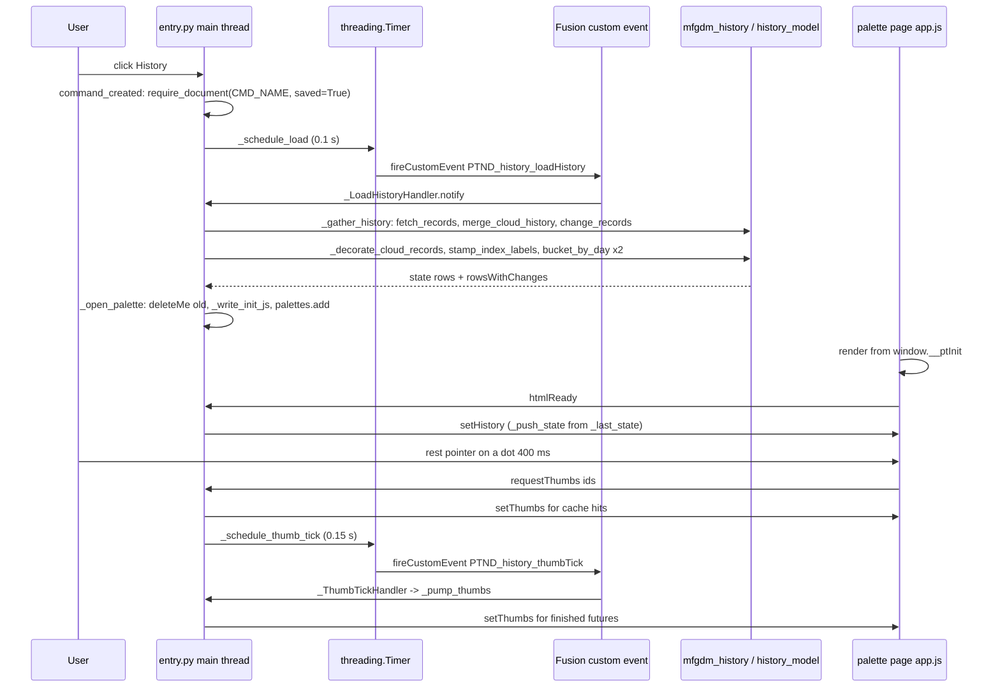

# Document History — Architecture

[← Document History guide](../Document%20History.md)

| | |
|---|---|
| **Command ID** | `PTND_history` (`CMD_NAME = "History"`) |
| **Registry** | module `dochistory`, group `document` (`Document Tools`); enabled by default; not beta |
| **UI location** | QAT button inserted before the `save` control (`qat.controls.addCommand(cmd_def, "save", True)`); opens the palette `config.document_history_palette_id` (`IMA_LLC_<ADDIN_NAME>_document_history_palette`), docked right, 400 × 720 px, `useNewWebBrowser=True` |
| **Files** | `commands/dochistory/entry.py` (Fusion contact only); `history_model.py` (`adsk`-free bucketing and numbering); `mfgdm_history.py` (the GraphQL read); `resources/html/{index.html, style.css, app.js}`; generated `resources/html/init.js` (git-ignored); `resources/generate_icons.py` and the 16/32/64 px light, dark and disabled icons |
| **Shared helpers** | [`partnumber_shared.mfgdm_props.gql`](architecture.md#partnumber_shared) (transport); [`recents_utils`](architecture.md#recents_utils) (`cached_thumbnail_data_url`, `store_thumbnail_object`, `png_to_data_url`); [`ptutil.add_handler`](architecture.md#event_utils); [`ptutil.require_document`, `log`, `handle_error`](architecture.md#general_utils); `config.DEBUG` and the palette id ([config](architecture.md#config)) |
| **Tests** | `tests/test_dochistory_history_model.py`; `tests/test_dochistory_doc_switch.py`; `tests/test_command_contract.py`; `tests/test_command_icons.py` |

## Purpose

Draws the active document's version history as a stack of day rows, newest first: one row per local calendar day, a track per author, each save a dot on a 00:00–24:00 clock axis, and the elapsed time called out between rows. It answers what Fusion's own history strip cannot — who saved, how a day was shaped, how long the design sat untouched. Two constraints shape it: the only per-version author Fusion exposes is in MFGDM, so the read is a cloud call that must not run on the click; and the page can only be fed through a generated `init.js`, so the read happens before the palette is created.

## How it is wired

- `start()`: `addButtonDefinition` with the resources folder; `ptutil.add_handler(cmd_def.commandCreated, command_created)`; the QAT button before `save`. Then, for each of `PTND_history_thumbTick`, `PTND_history_loadHistory`, `PTND_history_docSwitch`: `app.unregisterCustomEvent` (so a re-run without a Fusion restart does not stack handlers), `app.registerCustomEvent`, and `.add()` of `_ThumbTickHandler`, `_LoadHistoryHandler`, `_DocSwitchHandler` respectively, kept in module globals. Finally `application_document_changed` is added to `app.documentActivated`, `app.documentOpened` and `app.documentCreated` (`local_handlers`, for the add-in's lifetime).
- `stop()`: deletes the QAT control, the definition and the palette; unregisters the three custom events; clears the handlers, the thumbnail pump and `_version_files`.
- `command_created(args)`: [`ptutil.require_document(CMD_NAME, saved=True)`](architecture.md#document-preconditions) is `None` → return (it shows "History needs a document open. Open or create a document, then retry." or "History needs a saved document. Save the document, then retry."). Otherwise `_schedule_load()`. The palette is not opened here and nothing is read here: this is the [deferral pattern](architecture.md#deferring-work-to-a-later-main-loop-turn), and the handler runs from `commandCreated` because the command has no `CommandInputs` (rule 1).
- `_schedule_load()` → `threading.Timer(0.1, _fire_load_event)` (daemon) → `app.fireCustomEvent("PTND_history_loadHistory")`, the only API call on the timer thread (rule 7).
- `_LoadHistoryHandler.notify` → `_open_palette(_gather_history())`; a raise → `ptutil.handle_error(CMD_NAME, show_message_box=True)`.
- `_gather_history()` builds the page state (`theme`, `docName`, `docId`, `status`, `message`, `versionCount`, `changeCount`, `rows`, `rowsWithChanges`); see [Reading the history](#reading-the-history).
- `_open_palette(state)`: `_last_state = state`; deletes any existing palette with this id; `_reset_thumb_pump()`; `_write_init_js(state)` writes `window.__ptInit = <state JSON>;`; `ui.palettes.add(...)`; `ptutil.add_handler(palette.closed, _palette_closed)` and `(palette.incomingFromHTML, _palette_incoming)`; docks right if Fusion opened it floating.
- The page (`app.js`) reads `S = window.__ptInit`, renders, then `send("htmlReady")`. `_palette_incoming` logs every action, answers `htmlReady` with `_push_state(palette)` — `sendInfoToHTML("setHistory", json.dumps(_last_state))`, a re-send from memory, never a re-read — and `requestThumbs` with `_action_request_thumbs`. Actions the page sends: `htmlReady`, `requestThumbs`; messages Python sends: `setHistory`, `setThumbs`. This is the [palette RPC](architecture.md#palette-to-python-rpc) shape.
- `_palette_closed` → `_close_palette("closed by the user")`: reset the pump, clear `_version_files` and `_last_state`, `palette.deleteMe()`.
- `application_document_changed(args)` → `_schedule_switch_check()` → `threading.Timer(0.1, _fire_switch_event)` → `fireCustomEvent("PTND_history_docSwitch")` → `_DocSwitchHandler.notify` → `_close_palette_if_stale()`. The application handler touches nothing else.
- Thumbnails: `_action_request_thumbs` → `_schedule_thumb_tick()` → `threading.Timer(0.15, _fire_thumb_event)` → `fireCustomEvent("PTND_history_thumbTick")` → `_ThumbTickHandler.notify` → `_pump_thumbs()`; see [Thumbnails](#thumbnails).

## Data and state

- Module state: `_last_state` (the state last written to `init.js`; also the "is our palette open" flag), `_version_files` (`versionId` → version `DataFile`, for thumbnails only), `_thumb_queue`, `_thumb_inflight` (`versionId` → `(future, started)`), `_thumb_missing`, `_thumb_tick_pending`, `_thumb_tick_scheduled_at`, the three handler references, `local_handlers`.
- Custom events: `PTND_history_loadHistory` (0.1 s), `PTND_history_docSwitch` (0.1 s), `PTND_history_thumbTick` (0.15 s tick, `_THUMB_MAX_INFLIGHT = 8`, `_THUMB_FUTURE_TIMEOUT_SECONDS = 20`, `_THUMB_TICK_STALE_SECONDS = 2`).
- Disk: `commands/dochistory/resources/html/init.js`, rewritten on every open and git-ignored (`commands/*/resources/html/init.js`). Thumbnails in `<add-in root>/cache/thumbs/<md5(versionId)>.png` (falling back to the OS temp dir when `cache/` is not writable), shared with the Assembly Palette and Open Recent through `recents_utils`. The key is `<DataFile.id>:v<number>` on the MFGDM path and `DataFile.versionId` on the fallback path.
- Read flags: `config.DEBUG` enables the author-property probe on the fallback path.
- No settings keys.

## Reading the history

`_gather_history` tries MFGDM first and falls back to the desktop Data API. Both paths produce the same record shape (`number`, `createdOnMs`, `createdBy`, `createdById`, `comment`, `isMilestone`, `revision`, `publicShare`, `versionId`), and everything after that is `history_model`.

**MFGDM (`mfgdm_history.fetch_records(model_id)`).** `_model_id(doc)` reads `rootDataComponent.mfgdmModelId` — from the deferred event only, never from `commandCreated`. One paginated GraphQL document over `mfgdm_props.gql` fetches two lists with independent cursors (`VERSIONS_PAGE_LIMIT = 100`, `HISTORY_PAGE_LIMIT = 50`, `MAX_PAGES = 60`):

| Field | Carries |
|---|---|
| `model.designItem.versions` → `DesignItemVersion` | `versionNumber`, `createdOn`, `createdBy` — the only per-version author Fusion exposes |
| `model.history` → `ModelWrittenHistoryChange` | the `description` typed at save time (`DesignItemVersion.description` comes back empty) |
| `model.history` → every other `HistoryChange` type | property edits, component changes, milestones, releases — entries that produced no version |

`history_model.merge_cloud_history(versions, writes)` joins the first two **by position, newest first**, and only when the lengths agree; otherwise every version keeps its author and date and loses its comment. `history_model.change_records(others)` turns the rest into `kind == "change"` records via `change_label` (`CHANGE_LABELS`, with a de-camel-cased fallback for unmapped types) and drops `DUPLICATE_CHANGE_TYPES` (`RevisionCreatedHistoryChange`, `VersionCreatedHistoryChange`), because the release or milestone they record is already drawn on its save dot via `DataFile.milestones`. Thumbnails are deliberately not requested from MFGDM. A failure of any kind raises `HistoryUnavailable` and the gather falls through to the fallback.

`_decorate_cloud_records(records, data_file)` adds what MFGDM's version list lacks, each one desktop read for the whole file: `_milestone_labels` (`DataFile.milestones` → version number → name), `_shared_version` (`DataFile.sharedLink.isShared` → `latestVersionNumber`, so the ring marks the current version), and the thumbnail key `<file id>:v<number>`. `history_model.is_release_name` splits a user-typed revision (drawn as a release) from Fusion's auto-named milestones (`AUTO_MILESTONE_PREFIXES = ("Milestone ", "Item Update")`).

Then `model.stamp_index_labels(records + changes)` numbers everything once, `rows = bucket_by_day(records)` and `rowsWithChanges = bucket_by_day(records + changes)`. Two stacks ship because the bucketing is tested Python and the **Show other changes** toggle is on the page.

**Fallback (`DataFile.versions` walk).** `_version_record(version, labels, shared_version)` flattens each version: `dateCreated` (then `dateModified`), `_user_fields` (`createdBy`, then `lastUpdatedBy`), `isMilestone`, `versionId`, `description`. Every per-version read is guarded so one unreadable version costs its own dot. `_version_files[versionId] = version` is kept for thumbnails. This path cannot see non-version changes, so `changeCount` stays 0 and the page hides the toggle; it reports one file-level author name for every version (see Learnings). Under `config.DEBUG`, `_probe_indexes` samples up to six versions and logs the distinct names each author property yields.

## Where the layout maths lives

The bucketing is in Python because that is where a plausible wrong number would come from — which day a save belongs to, which track, how many days apart two rows are — and the repo rule is that such logic lives in an `adsk`-free module with tests ([the pure-logic split](architecture.md#the-pure-logic-split)). The geometry is in `app.js` because all of it depends on the panel width the browser measures (one `ResizeObserver` on the scroll container); a Python round trip in the middle of a resize drag is not acceptable. Constants therefore live on exactly one side: `TRACKS_PER_DAY_CAP = 6` with the bucketing; `DAY_ROWS_CAP = 60` and every pixel value with the drawing.

`history_model` in brief:

| Symbol | Role |
|---|---|
| `_ordered_oldest_first(versions)` | The one canonical order (undated last, stable); both the thread-axis `index` and the index labels count along it, so a label can never disagree with a position |
| `bucket_by_day(versions)` | Local calendar days, newest first; undated versions collect in one trailing bucket; each row carries `gap` to the row above |
| `tracks_for_day(dots)` | One track per `author_key` (user id, else display name), ordered by who saved first; past the cap the tail merges into one overflow track, losing no dots |
| `gap_between` / `calendar_breakdown` / `add_months` | `nextDay` / `days` / `wide` tiers and a years-months-days breakdown with an end-of-month clamp |
| `stamp_index_labels(records)` | Semantic labels from 0.0.0: a release bumps major, a save or milestone minor, a no-version change patch, each resetting what sits below it |
| `iso_to_epoch_ms`, `person_name`, `is_release_name` | Parsing and naming helpers |

Days are **local** calendar days: a 23:30 save stays on the day its author saw on their own clock.

## The index labels

`stamp_index_labels` decides the numbers; `app.js` decides only where they go. Resetting patch on every save is what lets the labels survive the changes toggle: a save's label depends only on the releases and saves before it, so both stacks (which share the record dicts by reference) agree about every save and `showChanges` adds patch labels without renumbering a dot.

On the page:

- `indexLabelNodes` draws each label rising to the **left** at `INDEX_ANGLE = 45` with `INDEX_ANCHOR = "end"`, ending at its own dot so the number reads into the event. Angled, two neighbours need only their line height over sin(angle) of horizontal clearance, which fits inside `MIN_DOT_GAP`, so a day-view run can label every dot that `declutter` managed to separate; `INDEX_MIN_GAP = MIN_DOT_GAP` drops labels only in a genuinely unseparable pile. The cost is a clipped label for a save near midnight; rising right would move that to the other edge.
- `RAIL_FRAC = 0.8` puts a track's rail low in its band so the labels have room to rise; `ROW_PAD_Y = 10` is the top track's share of that room; `AXIS_H = 16` is trimmed to match, so a one-track day row is 66 px tall.
- `trackHeight()` returns `indexPitch` while the toggle is on and `TRACK_H = 30` otherwise, and is the single reader for `rowHeight`, `trackY`, the avatar cells, `layoutStack` and `threadOverlay`, so one render cannot mix the two heights and drift the thread polyline off its dots. `indexedTrackPitch(rows)` computes `indexPitch` from the widest label and deepest marker actually in this history plus `NODE_R` of tail clearance — typically 35–38 px, only the rare `10.10.10` case reaching 44. It runs only when the toggle is on, because `render` runs on every pixel of a drag.
- Each label's clearance is `markerRadius(v) + INDEX_CLEAR`, from the marker's own radius rather than the widest one any dot draws.
- **Hover reveal.** With the toggle off, resting the pointer in a track shows that track's numbers alone at the tight pitch. The labels are always built in their own `<g>` and revealed by a `display` attribute — a re-render would replace the DOM under the cursor and drop the hover. `mouseenter` / `mouseleave` are bound to the whole track group, not the hit rect (the dots are siblings of the rect, so moving onto a dot would otherwise count as leaving). The hit rect spans the full band, not the 3 px rail.
- Each label paints its own mask (a `C.paper` rect, plus a `C.band` rect on a banded row, because `--band` is translucent) sized by `indexLabelWidth` from known digit and dot advances rather than a `getBBox` pass.
- `indexLabelColor` uses two colours only: accent for a release, `C.secondary` for everything else. `indexLabelText` prints all three figures and is shared by the drawing, the pitch measurement and the hover card.

## The clock axis and honest drift

`rowNode` places every track before drawing any of it, because whether the axis can carry its interior markers depends on where `declutter` put the dots. `declutter` trades clock accuracy for legibility, and in its worst branch — more dots than the axis can separate — abandons clock position and spaces the run evenly. `driftCrossesMarker(placements, ticks)` then decides per row: if any dot nudged by more than `DRIFT_VISIBLE = 3` px crossed an interior hour marker, `hourTicks(plotW, endpointsOnly=true)` keeps only the day's two bounds and the row claims order rather than time. The test is a crossing, not a distance: a dot moved 09:00 → 10:30 still reads as morning; one moved 11:59 → 12:01 has changed which half of the day it appears in.

`hourTicks(plotW)` returns six-hourly ticks at ≥ 260 px of plot, twelve-hourly below that, and none below 200 px; every tick carries its hour. At the docked `PALETTE_WIDTH = 400` the plot is about 310 px, so the axis is six-hourly with every tick named. (The `PALETTE_WIDTH` comment in `entry.py` describes three-hourly gridlines; `app.js` is the source of truth.)

## Following the active document

`application_document_changed` does nothing but start a timer, and that emptiness is the point: reading the document model from inside an application event can walk the document graph while Fusion's background saver is serialising it and abort the saver thread — even `args.document.dataFile` is off limits there. `_close_palette_if_stale` runs a main-loop turn later: return if `_last_state` is empty (no palette of ours) or the palette is gone; otherwise compare `_document_identity(app.activeDocument)` with `_last_state["docId"]` and `_close_palette("active document changed")` on a mismatch.

`_document_identity(doc)` is `dataFile.id`, falling back to `"unsaved:" + name` for a document without one and to `""` when the read raises. Comparing identities rather than `Document` objects matters because two API calls return different wrappers around the same native document, and comparing rather than closing unconditionally keeps a re-activation of the same document from churning the palette.

The palette is **closed, not reloaded**: a reload is a ~1.4 s cloud read behind a busy indicator plus a teardown and rebuild (a live page cannot re-read `init.js`) on every tab switch. Hiding is not an option either — Fusion can leave a torn-down palette in `ui.palettes`, and toggling `isVisible` on that husk silently no-ops. All three document events are wired even though activation alone would likely cover them, because the failure mode is a wrong answer rather than a missing one.

## Thumbnails

`DataFile.thumbnail` returns a `DataObjectFuture` and `adsk.core.Future` has no completion event, so a thumbnail can only be collected by polling, and polling inline would hold the UI thread while the palette is on screen. Each poll is one turn of `threading.Timer` → `fireCustomEvent` → `_ThumbTickHandler`, the same shape `commands/assemblypalette` uses.

The page asks only for the version the pointer has rested on for `HOVER_DELAY_MS = 400`. `_action_request_thumbs` answers disk hits immediately (`recents.cached_thumbnail_data_url`) and queues the rest. `_pump_thumbs`: resets and stops if the palette is gone or hidden; `_collect_finished_thumbs` harvests settled futures (`FinishedFutureState` → `recents.store_thumbnail_object` → `png_to_data_url`; a failed or timed-out future → `""` and `_thumb_missing`); `_start_queued_thumbs` starts more up to eight in flight via `_start_thumb_download` (`_version_files` hit, else `_resolve_version_file` finds the version `DataFile` behind a `<fileId>:v<number>` key by guessing `latest - number` and verifying `versionNumber` before falling back to a scan); `_send_thumbs` pushes the batch; `_schedule_thumb_tick` re-arms only while work remains. `""` is sent for a version with no thumbnail so the hover card can tell "still downloading" from "no preview". `_reset_thumb_pump` also clears `_thumb_missing`, so a negative result never outlives the palette.

`_fire_thumb_event` may touch nothing but `fireCustomEvent` — not even `ptutil.log`, which is not thread-safe. Its return value is ignored (it returns `False` even when it works); `_THUMB_TICK_STALE_SECONDS` re-arms a tick that was scheduled but never ran.

## Visual vocabulary

- The accent ring means "marked" and a filled ring means "released": a milestone is a save's grey dot with an accent ring, a release the same ring filled. One step to learn rather than two hues.
- The author colour is the only colour not taken from the theme. It is a function of *who*, so the same person is the same colour in every row and session; the initials are solved against it because HSL lightness is not perceptual.
- Narrowing the dock drops whole ticks rather than falling back to unlabelled gridlines; the author gutter is sticky so the thread view stays readable at any width.
- The palette is a snapshot; there is no auto-refresh, for the saver-thread reason above.

## Diagram

The click-to-palette sequence with its three deferrals, then a thumbnail round trip.

```mermaid
sequenceDiagram
    participant U as User
    participant E as entry.py main thread
    participant T as threading.Timer
    participant F as Fusion custom event
    participant M as mfgdm_history / history_model
    participant P as palette page app.js
    U->>E: click History
    E->>E: command_created: require_document(CMD_NAME, saved=True)
    E->>T: _schedule_load (0.1 s)
    T->>F: fireCustomEvent PTND_history_loadHistory
    F->>E: _LoadHistoryHandler.notify
    E->>M: _gather_history: fetch_records, merge_cloud_history, change_records
    E->>M: _decorate_cloud_records, stamp_index_labels, bucket_by_day x2
    M-->>E: state rows + rowsWithChanges
    E->>E: _open_palette: deleteMe old, _write_init_js, palettes.add
    P->>P: render from window.__ptInit
    P->>E: htmlReady
    E->>P: setHistory (_push_state from _last_state)
    U->>P: rest pointer on a dot 400 ms
    P->>E: requestThumbs ids
    E->>P: setThumbs for cache hits
    E->>T: _schedule_thumb_tick (0.15 s)
    T->>F: fireCustomEvent PTND_history_thumbTick
    F->>E: _ThumbTickHandler -> _pump_thumbs
    E->>P: setThumbs for finished futures
```

## Tests

- `tests/test_dochistory_history_model.py` — 46 cases, a port of the vitest suite for the web view this palette mirrors: `author_key` preference and fallbacks; local-day bucketing (including a late-evening save east of UTC), newest-first order, oldest-first `index`, the undated bucket; track splitting, ordering by first save, the overflow cap; gap tiers and the calendar breakdown with its end-of-month clamp; `is_release_name`; every `stamp_index_labels` rule including that save labels do not move when changes are added and that labels line up with the thread index; `person_name`, `iso_to_epoch_ms`; `merge_cloud_history` by-position join and its refusal on a length mismatch; `change_label`, `change_records`, the duplicate drop, and that changes surface people who never saved.
- `tests/test_dochistory_doc_switch.py` — 12 cases: `_document_identity` for saved, unsaved, missing, unreadable and empty-id documents; `_close_palette_if_stale` on a switch, a re-activation, a new unsaved document, the last document closing, no palette open, the palette already gone, and an offline document. `_close_palette_if_stale` is split out of the handler for exactly this reason: a `CustomEventHandler` subclass cannot be instantiated with `adsk` stubbed.
- `tests/test_command_contract.py` — registry row, `CMD_Description`, docs pair, `CMD_ID` shape; the three custom event ids are pinned in `KNOWN_NON_COMMAND_PT_LITERALS`.
- `tests/test_command_icons.py` — pins the `dochistory` icon set (16/32/64 px, light, dark and disabled) and that it differs from every other pinned set.

Not covered: the GraphQL read and pagination, `_decorate_cloud_records`, the DataFile fallback, `init.js` generation, the palette lifecycle, the thumbnail pump, and all of `app.js` (its port of the geometry was verified locally against the same vitest cases; CI installs nothing that can run it). `entry.py` is Fusion-bound; apart from the two functions above it is not exercised by the suite, and nothing here is verified in Fusion on this branch except by the AST guards in `tests/test_command_contract.py` and `tests/test_command_abort.py`, which import it under the `adsk` stub.

## Learnings

- **Do not read `rootDataComponent.mfgdmModelId` from `commandCreated`.** Doing so and then showing a modal crashed Fusion (234b043, `commands/partnumber_shared/intent.py`). The read runs from a timer-fired custom event, which also keeps a multi-second cloud read off the click.
- **`init.js` is the only channel proven to feed this page its first paint.** A build that opened the palette and waited for the page to ask over `adsk.fusionSendData` sat on its banner forever; a build that pushed the history with `sendInfoToHTML` to an already-open palette came up empty despite a logged 27-version read. The log counted zero `htmlReady` arrivals across every session while `requestThumbs`, sent later from a hover, did arrive. Hence read first, write `init.js`, then create the palette; `htmlReady` → `setHistory` stays wired as a cheap re-send because Fusion's embedded browser caches `init.js` by URL across palette recreations on Windows.
- **The desktop Data API cannot attribute versions.** On a 27-version design saved by nine people, `DataFile.createdBy` returned one name for all 27 and `lastUpdatedBy` a different single name for all 27; there is no third `User` property. Per-version authorship exists only in MFGDM's `DesignItemVersion.createdBy`.
- **MFGDM's two views stamp the same save up to 35 s apart, and page at different limits.** Join `designItem.versions` and `model.history` by position, only when the counts agree. `model.history` caps pagination at 50 while `designItem.versions` accepts 100; a shared limit of 100 was rejected outright and cost the whole cloud read.
- **One request beats ~160 round trips.** The MFGDM read took 1.4 s against 21 s for the `DataFile` walk (every property read is a cloud call). Per-row `DesignItemVersion.thumbnail.signedUrl` cost ~1.4 s each — thirty rows aborted the transport at 30 s — so thumbnails stay lazy, one per hover.
- **Never read the document model from an application event.** `documentActivated` and friends can run while Fusion's background saver is serialising the document graph and abort the saver thread — the reason the Assembly Palette gallery refresh is parked ([Assembly Palette](Assembly%20Palette.md)). Defer to a custom event and read there.
- **A torn-down palette can linger in `ui.palettes`.** Toggling `isVisible` on that husk silently no-ops, so a stale palette is deleted, not hidden.
- **A palette showing the wrong document's history is worse than no palette** (#8). It read correctly and named the wrong design; `_document_identity` compares `dataFile.id` because `Document` wrappers cannot be compared with `is`.
- **Do not rename `CMD_ID`.** `PTND_history` predates the palette; renaming it would orphan every user's saved QAT pin (6789216).
- **Index-label tuning that was tried and rejected.** Labels in the author's rail colour were illegible beside a rail of the same hue (two colours replaced them). A flat 44 px indexed pitch sized every row for the longest possible label (`indexedTrackPitch` derives it instead). Dropping the leading `0.` while major was zero made two- and three-figure labels ambiguous side by side (all three figures print). `INDEX_MIN_GAP` at 14 px let dense runs overlap by a pixel or two; an ~11 px line box at 45° needs ~16 px, which is `MIN_DOT_GAP`.

---

*Copyright © 2026 IMA LLC. All rights reserved.*
