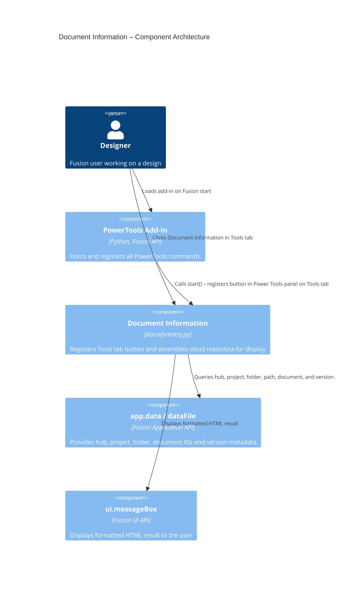

# Document Information — Architecture

[← Document Information guide](../Document%20Information.md)

## Architecture

The Document Information command registers a button in a custom **Power Tools** panel on the **Tools** tab of the **Design** workspace. On execute, it queries the Fusion Application API for cloud data identifiers at the hub, project, folder, and document levels, resolves the full folder path, then presents all information in a formatted HTML message box.

### Command ID

`PTND_docinfo`

### Execution flow

1. The add-in registers the command definition and inserts a promoted button into the **Power Tools** panel under the **Tools** tab of the Design workspace. The tab and panel are created if they do not exist.
2. The user selects **Document Information**.
3. The `command_execute` handler verifies that the active document is saved using `futil.isSaved()`.
4. The handler queries hub, project, folder, and document metadata from `app.data` and `app.activeDocument.dataFile`.
5. The handler traverses `parentFolder` references iteratively to build the full document path.
6. Version numbers and Fusion build numbers are compared to detect schema migration risk.
7. The result is displayed as a formatted HTML string in a native Fusion message box.

### Component diagram

