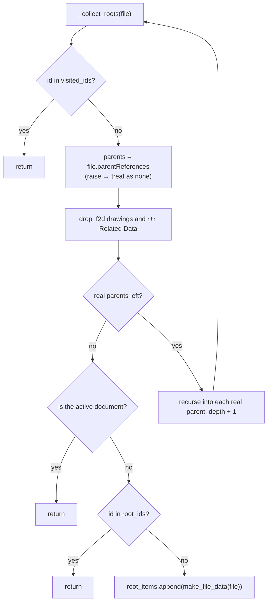

# Document References — Architecture

[← Document References guide](../Document%20References.md)

| | |
|---|---|
| **Command ID** | `PTAT_docrefs` |
| **Registry** | group `assembly` (`Assembly`); enabled by default. Module folder `commands/refrences/` — the misspelling is the registry key and stays ([rule 9](../dev/lessons.md)) |
| **UI location** | Shared **Power Tools** panel ([`_ui_bootstrap.get_power_tools_panel`](architecture.md#_ui_bootstrap)), appended with no anchor, `isPromoted = False` |
| **Files** | `commands/refrences/entry.py`; `resources/` (button icons), `resources/open/` and `resources/web/` (row-button icons), `resources/doc_thumb.png` (thumbnail placeholder) |
| **Shared helpers** | [`ptutil.add_handler`](architecture.md#event_utils); [`ptutil.log`, `isSaved`, `handle_error`](architecture.md#general_utils); `config.design_workspace` and friends ([config](architecture.md#config)) are imported but placement goes through `_ui_bootstrap` |
| **Tests** | `tests/test_command_contract.py` |

## Purpose

Shows every document related to the active design in six collapsible groups — Roots, Used In, Uses, Drawings, Fasteners, Related Data — each row with a thumbnail tooltip and buttons to open the document in Fusion or in the browser. Roots are found by walking the full `parentReferences` graph, so a part buried several assemblies deep still reports the top-level assemblies that ultimately contain it. The shaping constraint is that everything, including the recursive walk and all thumbnail downloads, runs inside `commandCreated` before the dialog can appear.

## How it is wired

- Import time: `THUMB_DIR = <tempdir>/PTAT_thumbs` is created with `os.makedirs`.
- `start()`: `addButtonDefinition` with the `resources/` icon folder, attaches `command_created`, adds the control to the Power Tools panel. `stop()` removes the control and deletes the definition.
- `command_created(args)`: attaches `command_execute`, `on_input_changed`, `command_destroy` first, resets the button maps, then inside one `try` (failures go to [`ptutil.handle_error`](architecture.md#general_utils) with a message box):
  1. Preconditions — `app.isOffLine` → message box and return; no `app.activeProduct` → message box and return; [`ptutil.isSaved()`](architecture.md#general_utils) false → it has already shown its own message box; return. Each of these returns with the handlers attached and no inputs, so Fusion auto-executes and ends the command.
  2. Reads `doc.designDataFile.parentReferences` and `.childReferences`. Parents are classified by `make_file_data` into Related Data (name contains ` ‹+› `), Drawings (`fileExtension == "f2d"`), otherwise Used In. Children whose `parentProject.name == "Standard Components"` are Fasteners; the rest are Uses, with ` (configuration)` appended when `isConfiguration` is set.
  3. `make_file_data(file)` records name, id, `fusionWebURL`, the `DataFile` itself and a display path built by walking `parentFolder` up to ten levels to the project root; a file from another project gets a `⚠️ … (Cross Project Reference)` path.
  4. `ui.progressBar.showBusy(...)` plus `adsk.doEvents()` per item while `fetch_thumbnail` runs for every row (see below).
  5. `_collect_roots` runs for each Used In parent (see [Roots](#roots--recursive-parent-walk)); roots get thumbnails too. The progress bar is hidden.
  6. Dialog: `okButtonText = "Close"`. `_add_table(title, items, prefix)` creates a `GroupCommandInput` `<prefix>_group` titled `Title  (n)`, expanded only when non-empty, holding a three-column table `<prefix>_table` (`10:1:1`, up to 8 visible rows). Each row is a read-only `TextBoxCommandInput` with the HTML-escaped name, an `<prefix>_open_<i>` button-style `BoolValueInput` (icons from `resources/open/`) registered in `_fusion_btns`, and an `<prefix>_web_<i>` button (`resources/web/`) registered in `_browser_btns`; a missing file or URL is shown as `–`. `_set_row_tooltip` puts the action text in `tooltip`, the project path in `tooltipDescription` and the thumbnail file in `toolClipFilename`.
- `on_input_changed(args)`: ignores the release half of a button press (`value == False`). An open button first ends this command — `ui.commandDefinitions.itemById("SelectCommand").execute()`, or `args.input.parentCommand.doExecute(False)` when `SelectCommand` is missing — then `adsk.doEvents()` and `app.documents.open(data_file)`. The `doExecute` fallback is one of the three deliberate sites in the repo; it runs from `inputChanged`, not `commandCreated` ([the doExecute rule](../dev/lessons.md)). A web button rejects anything not starting with `http://` or `https://`, then `os.startfile(url)` on Windows or `subprocess.Popen(["open", url])` elsewhere.
- `command_execute(args)`: logs only — the dialog is read-only.
- `command_destroy(args)`: clears `local_handlers`, both button maps and `_thumb_cache`, and deletes every file in `_thumb_paths`.

### Thumbnails

`fetch_thumbnail(data_file)` returns a PNG path or `THUMB_PLACEHOLDER`, caching by file id in `_thumb_cache` for the invocation:

1. If a component in `design.allComponents` has the same name as the file, `component.createThumbnail(32, 32, "PNG")` and `_save_data_object` (tries `saveToFile`, then the `imageData` / `data` / `bytes` / `content` attributes, and logs the object's attributes when none works).
2. Otherwise `data_file.thumbnail` returns a future that is polled — `adsk.doEvents()` then `time.sleep(0.05)` — for up to 5 s until `state != 0`; `state == 1` yields a `dataObject` saved the same way.

The poll is a `doEvents` loop with `time.sleep` on the UI thread, which [rule 2](../dev/lessons.md) forbids; it is recorded, not fixed, in `tests/test_command_contract.py` (`KNOWN_TIME_SLEEP_SITES`), and `ptutil.pump_events_for` is the replacement when it is touched.

## Data and state

- Module globals: `_fusion_btns` (input id → `DataFile`), `_browser_btns` (input id → URL), `_thumb_cache` (file id → path), `_thumb_paths`, `local_handlers`; all reset per invocation.
- Temp files: `<tempdir>/PTAT_thumbs/<uuid>_<safe urn>.png`, deleted in `command_destroy`. The directory itself persists.
- No cache files, settings keys or custom events.

## Roots — recursive parent walk

`_collect_roots(data_file, visited_ids, root_ids, root_items, depth)` is a depth-first walk starting from each immediate parent:

1. A file already in `visited_ids` is skipped, which terminates on cyclic and diamond-shaped graphs.
2. Its `parentReferences` are filtered: `.f2d` drawings and ` ‹+› ` Related Data documents are dropped and never treated as roots; a `parentReferences` call that raises is logged and the file treated as having no parents.
3. A file with no remaining real parents is a root, added once (`root_ids`) unless it is the active document itself.
4. Otherwise the walk recurses into each real parent with `depth + 1`.

Every decision is logged through [`ptutil.log`](architecture.md#general_utils) with a `[Roots]` prefix indented by depth (`Visiting`, `raw parents`, `SKIP parent (drawing)`, `KEEP parent`, `ROOT FOUND`, …). `ptutil.log` is a no-op unless the `.debug` marker is present; with it, the lines go to the Text Commands window and the debug log file.

## Diagram

The root walk, with each branch that ends or continues the recursion.

## Tests

- `tests/test_command_contract.py` — registry/description/ID contract; `PTAT_thumbs` is allow-listed as a `PTAT_` literal that is a temp-folder name rather than a command id; `commands/refrences/entry.py` is pinned with exactly one `time.sleep` call in `KNOWN_TIME_SLEEP_SITES`.
- `tests/test_command_abort.py` — the AST guard confirms the `doExecute` in `on_input_changed` is outside any `commandCreated` handler.

`entry.py` is Fusion-bound and is not exercised by the suite; nothing here is verified in Fusion on this branch except by the AST guards in `tests/test_command_contract.py` and `tests/test_command_abort.py`, which import it under the `adsk` stub. The classification rules and `_collect_roots` are nested closures inside `command_created` and have no `adsk`-free module or unit tests ([the pure-logic split](architecture.md#the-pure-logic-split)). The icon sets are not pinned in `tests/test_command_icons.py`.

---

*Copyright © 2026 IMA LLC. All rights reserved.*
