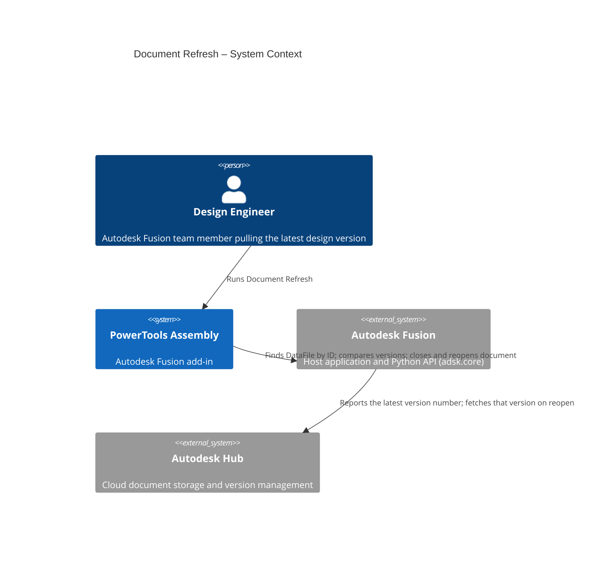
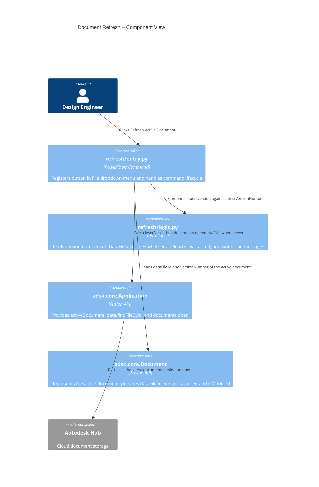

# Document Refresh — Architecture
[← Document Refresh guide](../Document%20Refresh.md)

## Architecture

The following diagram shows how the Document Refresh command interacts with Autodesk Fusion and the Autodesk Hub.





### The version check

The close-and-reopen is the whole cost of this command: a full document load, and
`close(False)` discards any unsaved edits on the way out. Doing that when the
document is already current buys nothing, so `entry.py` compares versions first
and only reloads when the Hub has something newer.

Two DataFiles describe the same file at that moment, and `logic.latest_version`
takes the **highest version either one reports**:

| Source | Why it is consulted |
|---|---|
| `app.data.findFileById(id)` | Freshly looked up, so it normally carries the current Hub state |
| `activeDocument.dataFile` | Populated when the document was opened, but can be *fresher* than a cached lookup |

Reading both means a single stale read cannot hide a new version. Only both being
stale can, and that degrades to "already at the latest version", which leaves the
user exactly where they were. `versionNumber` is included alongside
`latestVersionNumber` in the comparison because a file's own version is a floor:
it cannot be newer than the newest version on the Hub.

Version numbers are read through a guard that maps anything unusable —
a missing or unreadable attribute, a non-numeric value, or Fusion's `0` for
version information that has not been populated — to `None` ("unknown"). An
unknown version deliberately answers **yes, reload**: the command's job is to pull
the latest version, so a number Fusion will not report falls back to the
unconditional close-and-reopen this command did before the check existed rather
than silently doing nothing.

### Which prompt the user sees

`close(False)` is destructive, so the confirmation depends on what the reload
would actually accomplish:

| Newer version? | Modified? | Behavior |
|---|---|---|
| Yes | No | Reloads immediately, no prompt (the pre-existing fast path) |
| Yes | Yes | Confirms first, quoting the open version and the Hub version |
| No | No | Reports the current version; the document is left untouched |
| No | Yes | Offers to reload anyway, which only reverts the local changes |

The last row keeps a capability the version check would otherwise have removed:
before the check existed, running Refresh on an up-to-date document was how a user
discarded local edits and reverted to the Hub version. It is still available, but
never without asking, since nothing new comes down from the Hub in that case.

### Testability

Everything above except the Fusion calls lives in `refresh/logic.py`, which
imports no `adsk` and is duck-typed on the `DataFile` shape (`name`,
`versionNumber`, `latestVersionNumber`) — the same split
`commands/closealldocuments` uses. `tests/test_refresh_logic.py` drives it with
stand-ins, covering the version reads, the stale-cache fallback, the
reload/no-reload decision, and the wording of all three messages.

### User flow

```mermaid
sequenceDiagram
  autonumber
  actor User
  participant QAT as QAT › File menu
  participant Cmd as Refresh Active Document
  participant API as Fusion API
  participant Hub as Autodesk Hub

  User->>QAT: Click Refresh Active Document
  QAT->>Cmd: command_created fires
  Cmd->>API: Read activeDocument.dataFile.id and versionNumber
  Cmd->>API: app.data.findFileById(id)
  API->>Hub: Look up the file
  Hub-->>API: DataFile with latestVersionNumber
  API-->>Cmd: DataFile reference
  Cmd->>Cmd: logic.newer_version_available(current, latest)
  alt Already at the latest version
    Cmd-->>User: "Already at the latest Team Hub version (version N)"
    Note over Cmd,User: Document stays open; nothing is closed
  else Newer version on the Hub
    opt Document has unsaved changes
      Cmd-->>User: Confirm discarding changes (reports both versions)
      User-->>Cmd: Yes
    end
    Cmd->>API: activeDocument.close(False)
    Cmd->>API: app.documents.open(DataFile)
    API->>Hub: Fetch latest document version
    Hub-->>API: Document content
    API-->>User: Document reopens at latest Hub version
  end
```
