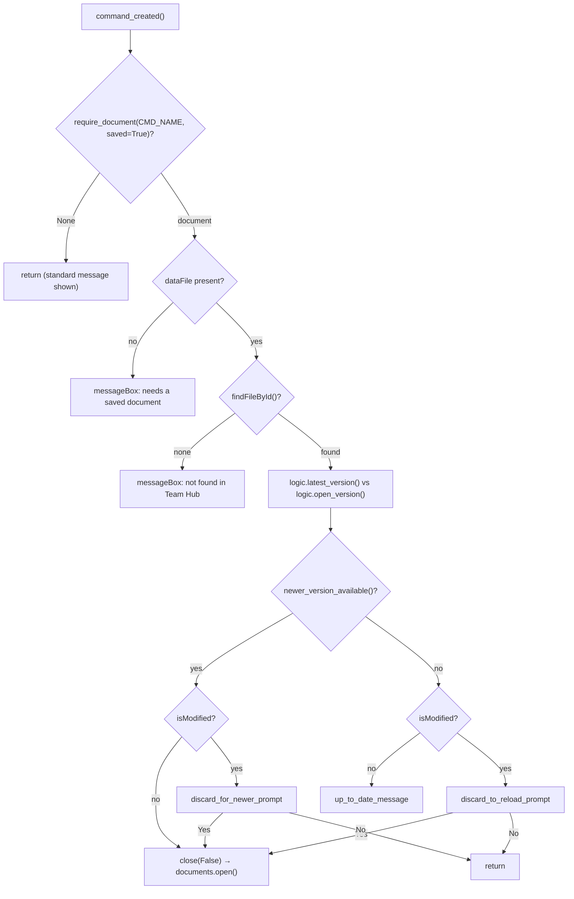

# Document Refresh — Architecture

[← Document Refresh guide](../Document%20Refresh.md)

| | |
|---|---|
| **Command ID** | `PTAT_refresh` (command name **Refresh Active Document**) |
| **Registry** | group `assembly` (`Assembly`); enabled by default |
| **UI location** | QAT **File** dropdown, obtained with [`ptutil.get_qat_file_dropdown`](architecture.md#ui_utils); `addCommand(cmd_def, "ExportCommand", False)` — directly after Fusion's Export entry. The definition is created without an icon folder, so the PNGs in `resources/` are not used |
| **Files** | `commands/refresh/entry.py`, `commands/refresh/logic.py` (`adsk`-free) |
| **Shared helpers** | [`ptutil.get_qat_file_dropdown`, `remove_from_qat_file_dropdown`](architecture.md#ui_utils); [`ptutil.add_handler`](architecture.md#event_utils); [`ptutil.log`, `handle_error`, `require_document`, `document_required_message`](architecture.md#general_utils) |
| **Tests** | `tests/test_refresh_logic.py` |

## Purpose

Loads the newest Team Hub version of the active document in one step by closing it and reopening it from the Hub. Closing first is what forces Fusion to fetch rather than re-activate the stale open copy — and `close(False)` also discards unsaved edits — so the command compares the open version with the Hub before doing anything and asks first whenever the reload would cost the user something.

## How it is wired

- `start()`: `addButtonDefinition(CMD_ID, CMD_NAME, CMD_Description)` (no icon folder), attaches `command_created`, adds the control to the QAT File dropdown after `ExportCommand` when the dropdown resolves. `stop()`: [`ptutil.remove_from_qat_file_dropdown(CMD_ID)`](architecture.md#ui_utils) and deletes the definition.
- `command_created(args)` does all the work; the command has no inputs ([pattern](architecture.md#acting-from-commandcreated-when-there-are-no-inputs)):
  1. `doc = ptutil.require_document(CMD_NAME, saved=True)` is `None` → return (it shows the standard message, see [Document preconditions](architecture.md#document-preconditions)); `doc.dataFile is None` → the same "Refresh Active Document needs a saved document. Save the document, then retry." message box and return.
  2. `app.data.findFileById(doc.dataFile.id)` → `None` → message box and return.
  3. `logic.display_name(source_file)`, `logic.open_version(doc.dataFile)`, `logic.latest_version(source_file, doc.dataFile)`; the comparison is logged with `logic.refresh_log_message`.
  4. Prompt selection (table below) with `logic.newer_version_available`, `doc.isModified`, `logic.discard_for_newer_prompt`, `logic.discard_to_reload_prompt`, `logic.up_to_date_message`. A Yes/No prompt that is not answered Yes returns.
  5. `doc.close(False)` then `app.documents.open(source_file)`; if the open raises, [`ptutil.handle_error`](architecture.md#general_utils) and a message box telling the user to reopen from the Data Panel, since the original is already closed.
- No `execute` handler is attached; `command_destroy` is defined but never registered, so it does not run.
- The close and reopen happen inside the `commandCreated` event of this command.

## Data and state

None beyond `local_handlers`. No files, settings keys, custom events or temp files.

## The version check

Two `DataFile`s describe the same file at that moment, and `logic.latest_version` takes the **highest** of `latestVersionNumber` and `versionNumber` across both:

| Source | Why it is consulted |
|---|---|
| `app.data.findFileById(id)` | Freshly looked up, so it normally carries the current Hub state |
| `activeDocument.dataFile` | Populated when the document was opened, but can be fresher than a cached lookup |

A single stale read therefore cannot hide a new version; only both being stale can, and that degrades to "already at the latest version", leaving the user where they were. `versionNumber` participates because a file's own version is a floor — it cannot be newer than the newest version on the Hub.

`logic._version_number` maps anything unusable — a missing or raising attribute, a non-numeric value, or Fusion's `0` for version information not yet populated — to `None`. `newer_version_available` answers **True** for an unknown version on either side: the command's job is to pull the latest version, so a number Fusion will not report falls back to the unconditional close-and-reopen rather than silently doing nothing.

## Which prompt the user sees

| Newer version? | Modified? | Behaviour |
|---|---|---|
| Yes | No | Reloads immediately, no prompt |
| Yes | Yes | `discard_for_newer_prompt` — quotes the open and Hub versions; Yes reloads |
| No | No | `up_to_date_message` — reports the version; the document is left untouched |
| No | Yes | `discard_to_reload_prompt` — offers a reload whose only effect is reverting the local edits |

The last row is the deliberate way to revert a document to its Hub version; it is never taken without asking, because nothing new comes down in that case.

## Diagram

The decision tree in `command_created`.

```mermaid
flowchart TD
  CC["command_created()"] --> RD{"require_document(CMD_NAME, saved=True)?"}
  RD -->|None| M0["return (standard message shown)"]
  RD -->|document| DF{"dataFile present?"}
  DF -->|no| M1["messageBox: needs a saved document"]
  DF -->|yes| FF{"findFileById()?"}
  FF -->|none| M2["messageBox: not found in Team Hub"]
  FF -->|found| CMP["logic.latest_version() vs logic.open_version()"]
  CMP --> NEW{"newer_version_available()?"}
  NEW -->|yes| MOD1{"isModified?"}
  MOD1 -->|no| GO["close(False) → documents.open()"]
  MOD1 -->|yes| P1["discard_for_newer_prompt"]
  NEW -->|no| MOD2{"isModified?"}
  MOD2 -->|no| M3["up_to_date_message"]
  MOD2 -->|yes| P2["discard_to_reload_prompt"]
  P1 -->|Yes| GO
  P2 -->|Yes| GO
  P1 -->|No| END["return"]
  P2 -->|No| END
```

## Tests

- `tests/test_refresh_logic.py` — drives `logic.py` with `FakeDataFile` / `RaisingDataFile` stand-ins: `open_version` for valid, zero, negative, string and raising values; `latest_version` prefers the highest number, catches a stale lookup, falls back to `versionNumber`, is `None` with nothing readable or no files; the `newer_version_available` truth table including unknowns; `display_name` fallback; the exact wording of `up_to_date_message`, `discard_to_reload_prompt`, `discard_for_newer_prompt` (with and without numbers) and `refresh_log_message`.

`entry.py` is Fusion-bound and is not exercised by the suite; nothing here is verified in Fusion on this branch except by the AST guards in `tests/test_command_contract.py` and `tests/test_command_abort.py`, which import it under the `adsk` stub. The QAT placement, the prompts' wiring and the close-and-reopen are unverified. The icon set is not pinned in `tests/test_command_icons.py` (and is not referenced by the definition).

---

*Copyright © 2026 IMA LLC. All rights reserved.*
