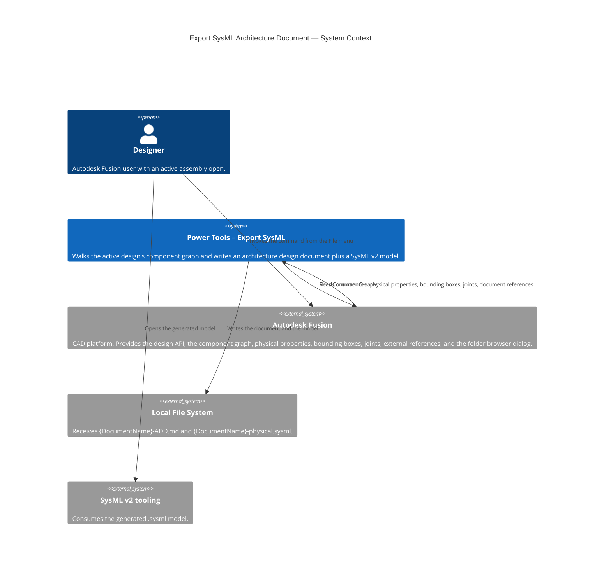
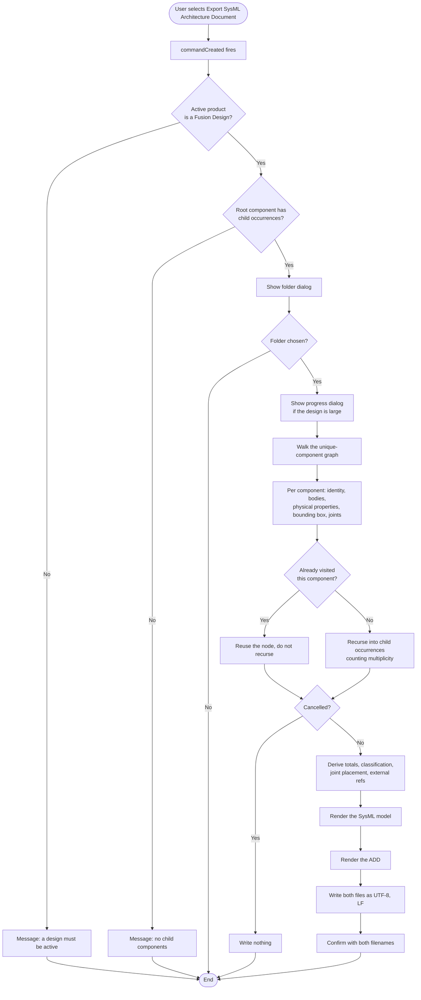

# Export SysML Architecture Document — Architecture

[← Export SysML Architecture Document guide](../Export%20SysML.md)

## Architecture

### Command ID

`PTE_exportsysml`, in the QAT **File** drop-down beside the other two exports.
No icons: that menu renders text, which is why `exportbomcsv`, `exportmermaid`
and `closealldocuments` all ship without a `resources/` folder and none of them
is pinned in `tests/test_command_icons.py`.

### Files

| File | Role |
|---|---|
| `entry.py` | All Fusion contact: placement, the gate, the traversal, the dialogs, the writes |
| `model.py` | `adsk`-free records and derivations: quantities, classification, traversal order, joint placement |
| `render.py` | `adsk`-free renderers: SysML v2 text, the Markdown ADD, escaping, unit conversion, filename sanitising |

The two-module split mirrors `flattensurface`'s `flatten.py` / `report.py`: the
solver and the text renderer are independently testable, and neither imports
`adsk`.

### System context



### Command processing flow



## Design decisions

### The whole command runs in `commandCreated`

`execute` never fires when no document is open, so a QAT File-menu command that
does its work there silently does nothing in exactly the case its precondition
message exists for (f18b911, 11cfc51). `exportbomcsv` and `exportmermaid` both
have that latent bug — their "A Design Must be Active." message box is
unreachable. This command follows `closealldocuments` instead: everything runs
in `command_created`, inside one `try` / `ptutil.handle_error`.

No execute handler is registered, so the auto-execute of an input-less command
is a no-op and the `_command_abort` flag machinery is unnecessary — that flag
exists to stop a *later* execute from acting on a previous run's module state
(5bae0e3). Adding an execute handler here would reintroduce both problems, and
the repo-wide AST guard in `tests/test_command_abort.py` would not catch it
because it only inspects `command_created`.
`tests/test_exportsysml_entry.py::test_no_execute_handler_is_registered` guards
it directly.

### Identity is `Component.id`, not `entityToken`

`entityToken`'s own API documentation states that the token returned for one
entity "can be different over time" and that tokens must never be compared to
decide what they represent. As a dictionary key it would emit the same component
twice and re-evaluate its physical properties once per instance — the exact cost
the memo exists to avoid.

`Component.id` is the persistent id: created with the component, unchanged
thereafter, and documented as unique within a single design. Its one documented
limitation is that it may collide across externally referenced designs that are
different revisions or copies of one another, which is reachable in any assembly
carrying xrefs — so a referenced component's key also carries its source
document id and version. An empty `id` falls back to the component name and
records a collection note, because merging two components would be worse than
saying the identification was weak.

**The id is not unique even within one design, and the suffix does not always
save you.** Verified against a live `Rear Hub ASSY R`: `CVD Pivot Pin` and
`CVD Drive Pin` are two of the seventeen components `design.allComponents`
reports, and they carry the *same* `Component.id`
(`012331ee-63d2-46b6-b607-e74d637af56e`), differing only in `revisionId` and
`partNumber` — the signature of one component having been copied from the other
inside the referenced document. The source-document suffix cannot separate them,
because both come from the same document at the same version. Worse, for an
occurrence nested inside a referenced subassembly, `Occurrence.documentReference`
*raises* `RuntimeError: 3 : Cannot get allDocumentReferences of a non-top-level
document`, which `_read` absorbs, so the suffix is empty for exactly the
components that most need it.

Keying on the id alone therefore recorded sixteen nodes for seventeen
components: the second component never entered the model, and joint `Rigid 5`
— `CVD Drive Pin:1 → Dog Bone - Rear:1` in the design — was emitted as a
connection naming `cvdPivotPin`. A wrong connection, not a missing one.

So the key is `id + reference suffix + name`. `revisionId` would also separate
the two, but it changes every time the component is modified, so as a key it
would make the export differ between runs over an unchanged structure. The name
is stable, and the two together were unique across every component in the
design. When one id does carry two names the scan records a note, because the
remaining failure mode — a rename in the source design collapsing them again —
is one the reader has to know about rather than discover from a wrong joint.

### The walk is over the component graph, not the occurrence tree

A `part def` is emitted once per unique component, so the traversal expands each
component once regardless of how many occurrences reference it. That makes the
cost proportional to distinct components plus distinct parent-child edges, gives
one physical-property evaluation per component by construction, and terminates
on a self-referential graph without a separate cycle set. `MAX_DEPTH` guards a
pathologically deep or corrupt graph and surfaces as a `truncated` row plus a
note, rather than a hang.

Quantities are then pure arithmetic over the edge multiplicities —
`total_counts` multiplies down the graph — rather than a second pass over
`rootComponent.allOccurrences`. That keeps the derivation unit-testable and
costs no further Fusion calls.

### Joints come from each component, not from `allJoints`

`Component.allJoints` returns joints "in the context of" the calling component,
so joints owned by a subassembly come back as proxies whose end occurrences do
not correspond to the native children recorded while walking. Because a
connection is emitted inside the owning component's definition, the ends have to
be nameable in that scope — which means reading `Component.joints` and
`Component.asBuiltJoints` during the same per-component pass.

A joint becomes a connection when both ends are *descendants* of its owner and
the joint is not suppressed. It used to require direct children, which dropped
every joint crossing a subassembly boundary — a third of the two-ended joints in
a real hub assembly. A SysML connection end may name a nested usage by a dotted
path, so a common ancestor is sufficient; `model.usage_path` finds the chain
breadth-first, so the shortest path wins and the output stays stable between
exports, and it is the same function that decides placeability and spells the
path. Everything else is reported with a reason, in the document's interface
table and as comments in the model, rather than being dropped or emitted as a
dangling reference. Suppression is treated as a deliberate exclusion, not a
failure: a suppressed joint is not part of the built configuration, so a
`connect` for it would assert an interface the design denies.

### The joint schema is local, so it needs no library

Joint kinds are emitted as connection definitions specialising a locally
declared `FusionJoint`, whose two ends are typed by a locally declared
`abstract part def FusionComponent` that every component definition specialises.
Typing the ends against a library base such as `SpatialItems::SpatialItem` would
read better but would import the geometry domain library, which is the same
trade rejected below for ISQ. Both names are allocated through `_unclashed`
against every component name in the design, because SysML treats `'FusionJoint'`
and `FusionJoint` as one name and a component genuinely called that would
otherwise redefine the schema out from under the model. The base is emitted only
when the design has at least one connectable joint.

Degrees of freedom live in the definitions rather than on each connection:
they are a property of the kind, so that is one line per kind instead of two per
joint. `model.JOINT_DOF` covers Fusion's seven fixed kinds; `Inferred` is
deliberately absent and `joint_dof` returns `None` for it, so the definition
omits the counts rather than claiming a joint is rigid.

### Joint placement: origin and one axis

A joint's kind says how it moves; its geometry says where it is and which way it
acts. Without the second, the Physical View can tell a reader that two parts are
hinged but not where the hinge is, which was the largest remaining content gap.

The origin comes from `Joint.geometryOrOriginOne` / `Two`, which is either a
`JointGeometry` (carrying `origin`) or a `JointOrigin` (wrapping one), so both
are cast for. An `AsBuiltJoint` has a single `geometry` instead. The first end
that yields a point wins and the second is the fallback, because a joint made to
root-level geometry can have nothing on one side.

The axis is read off the `JointMotion`, and *which* vector to read depends on the
kind — `rotationAxisVector` for revolute and cylindrical, `slideDirectionVector`
for slider, `normalDirectionVector` for planar, `pitchDirectionVector` for ball.
That mapping is data in `model.JOINT_AXIS` rather than a chain of `isinstance`
checks in `entry.py`: it keeps the knowledge testable and reduces the Fusion side
to a single `getattr`. Rigid is absent from the mapping because it permits no
motion, and Inferred because its motion is not fixed by its kind — neither gets
an axis rather than getting a wrong one. A test asserts that every kind carrying
an axis also reports a non-zero degree of freedom, so the two tables cannot
drift apart.

Vectors are normalised in `model.unit_vector`, which returns `None` for a
zero-length vector: an axis of `(0, 0, 0)` is not a direction, and publishing it
would be indistinguishable from a real one. Only the primary axis is exported;
pin-slot and planar joints have a second, and `axisRole` names which one the
reader is looking at.

The attributes are declared once on the abstract `FusionJoint` base and
redefined per connection, the same shape the degree-of-freedom counts already
use. A connection with nothing to place stays a one-line statement rather than
opening an empty body, and an absent origin leaves the inherited attribute unset
rather than zero.

### Definition names are deduplicated, case-sensitively

Two different Fusion components can carry the same display name — that is the
whole reason identity is keyed on `Component.id`. SysML requires the members of
a namespace to be distinguishable by name, so emitting both as
`part def 'Bracket'` produces a model a parser rejects outright with `RES017`.
The second and later collisions are suffixed (`'Bracket (2)'`), and the usages
that reference them are rewritten through the same map — a suffixed definition
nothing points at would be worse than the collision it fixed. The schema names
are then allocated clear of the *emitted* names rather than the raw ones, since
a suffixed name could otherwise land on `FusionComponent`.

Matching is case-sensitive because SysML namespaces are: a validator accepts
`Bracket` and `bracket` side by side, so folding them would rename a pair the
model is entitled to keep apart.

This reached the output and was caught only by running a real validator, which
is why `tests/test_exportsysml_render.py` now asserts the uniqueness invariant
directly — CI has no SysML parser.

### Usage identifiers are assigned once, up front

`render.usage_names` builds `{(parent key, child key): identifier}` for every
declared usage before anything is emitted. The renderer needs each name twice —
to declare the usage, and to spell a dotted path through it for a connection end
further down — and deriving them twice risked the two disagreeing whenever
`identifier` had to disambiguate two same-named children.

### Plain `ScalarValues`, not ISQ quantities

Attributes are `Real` and `String` with the unit in the attribute name
(`massKg`, `bboxLengthMm`) rather than ISQ quantity types with unit literals.
`ScalarValues` is part of the kernel library and always resolves; ISQ comes from
the systems library, and a tool without it on the default path fails to parse
rather than warning. Scalars only, too — no collection literals for the centre
of mass or the envelope, since that is a second syntax surface to get wrong for
no gain. The unit convention is stated in the file's `doc` block and in the
document.

### Everything user-authored is escaped

Component names, part numbers and descriptions come out of documents other
people wrote, so they are untrusted input to a text generator — the same
reasoning as `_csv_cell` in `exportbomcsv`, except that here a bad value
corrupts a model file instead of a spreadsheet. Four contexts, four functions in
`render.py`:

| Function | Context | Guards against |
|---|---|---|
| `quoted_name` | a declared or referenced SysML name | keyword collisions, spaces, quotes, backslashes |
| `sysml_string` | a double-quoted attribute value | an unescaped `"` |
| `comment_text` | inside `//` or `/* */` | `*/` closing the doc block early; a newline appending a second line |
| `md_cell` | a Markdown table cell | `\|` breaking the table, `[..](..)` injecting a link |

Declared names are quoted *unconditionally* rather than only when necessary, so
the reserved-word list cannot be incomplete in a way that breaks a file. It is
kept only to stop the generated usage identifiers colliding with a keyword.

### Absent values are absent, never zero

Every physical field is optional. Where Fusion could not evaluate one, the SysML
omits the attribute and the document prints an em dash; neither writes `0`,
which no reader could distinguish from a measurement (c8c0382). The
`number` helper prefers fixed-point but falls back to exponent notation for a
value too small to show at six decimal places, for the same reason.

## Scope and limits

- **No mass roll-up.** The Fusion API does not document whether a component's
  `physicalProperties` and `boundingBox` include its child components, so the
  document reports per-component figures as returned and computes no total. A
  summed mass that double-counted subassemblies would be a plausible wrong
  answer.
- **Connections name a usage, not an instance.** Sibling occurrences of one
  component collapse to a multiplicity (`part shaft : 'Shaft'[2];`), so a joint
  to one specific instance is modelled as a connection to the collapsed usage.
  Per-occurrence fidelity would need one usage per occurrence and is not done.
- **Two of the five views are scaffolding.** The Logical View and Scenarios
  carry a heading and an explicit statement that they must be authored. This is
  deliberate: a Fusion design records decomposition, not intent.

### Still unverified in Fusion

The command has been run in Fusion on `ADSKMVG91G2F5W` against several real
designs — an espresso machine, a rear hub assembly, a gearbox — and the findings
above came out of those runs. CI still stubs `adsk`, so a green suite proves the
text renderers and the arithmetic and nothing about the collection pass. What
those runs have not covered:

- That the ends of `Component.joints` / `asBuiltJoints` resolve to the same
  components the walk recorded, including for a joint inside a subassembly, a
  joint anchored to root geometry, a suppressed joint and an as-built joint.
- That `Component.id` is non-empty in a Direct (non parametric) design, so the
  name fallback stays unused. Non-empty inside an xref is confirmed; *unique*
  inside an xref is confirmed false — see the identity section.
- Progress-dialog repaint and `wasCancelled` on a large assembly with no
  `doEvents` in the scan loop.
- On `g16win.local`, the parts no test can reach. What *is* covered from here:
  an AST guard asserts every write in `entry.py` pins `encoding="utf-8"` and
  `newline="\n"`, and the importer is tested against CRLF input, since a model
  authored on Windows arrives with carriage returns that survive the byte-level
  read. What is left is runtime behaviour:
  - that the written `.sysml` really lands with LF rather than CRLF;
  - a non-ASCII document name surviving the folder dialog, the filename and the
    file contents;
  - a destination deep enough to push the path past 260 characters. The stem is
    capped at 120 and the suffix adds 15, so the user's chosen folder decides
    it, and a Windows without long-path support will fail the write;
  - the Assembly Builder palette's Import button and file dialog under QT
    WebEngine, which is a different browser build from macOS.

### Verified against a real SysML v2 parser

The emitted notation is no longer taken on trust. On 2026-09-09, on
`ADSKMVG91G2F5W`, six generated models were checked with the headless
`sysml-validate` npm package (a SysML v2 / KerML parser and linker), all
passing:

| Model | Covers |
|---|---|
| worked example | the ordinary shape: schema, defs, usages, one connection |
| hostile names | `'`, `\`, `*/`, non-ASCII, a component called `part`, a document name containing `*/ package evil {` |
| joints | all eight `JointTypes`, a suppressed joint, an unresolved end, a dotted path across a subassembly boundary |
| minimal | root plus one child, no joints, no physical data |
| collide | two components sharing a display name, a 1e-7 mass, a zero volume |
| cycle | a component that contains itself |
| geometry | all eight kinds carrying an origin and an axis, a rigid joint with an origin and no axis, an axis with no origin, and a joint with neither |
| schema clash | components genuinely named `FusionComponent` and `FusionJoint` |

Constructs the OMG BNF made look doubtful, confirmed legal by the parser:

- `abstract connection def`, `connection def X :> Y`, `attribute :>> n = 1`, and
  a body on a connection usage after the `connect` clause.
- `end part occurrenceOne : FusionComponent;` — reading the BNF strictly
  suggests `end` cannot prefix a `part` usage, since `OccurrenceUsagePrefix`
  starts from `BasicUsagePrefix`. The parser accepts it. Trust the parser.

### Physical properties and bounding boxes include children

Confirmed against live designs rather than the API reference, which does not
say. Components with **no bodies of their own** still report substantial boxes:
in one espresso machine, `Water Tank` (bodiless) reports 285 x 127 x 66 mm and
`Bottom Assembly` 312 x 152 x 76 mm; 33 of that design's components are in the
same position, and a bodiless component has no geometry a box could otherwise
come from.

So a subassembly's extents are the envelope of everything inside it, and the
root's are the envelope of the whole assembly — which is what the document now
calls it. The remaining hedge in the mass-and-envelope caveat is about mass,
volume and area only.

`Component.physicalProperties` behaves the same way, and the espresso machine
proves it arithmetically: the root reports 8.667 kg, its leaf parts sum to
8.630 kg, and the 0.037 kg difference is the root's own single body. Volume and
area track identically, at 0.998 and 0.995 of the root figure. `Generator`, a
subassembly, reports exactly the mass of its one child.

So the root's own reading *is* the assembly total and nothing needs summing —
the earlier "declines to compute a roll-up" hedge is gone, replaced by naming
the figures for what they are. The hazard moved rather than disappeared: the
component inventory's Mass column is **not additive**, because every
subassembly already contains its parts. Adding that column over the espresso
machine gives 23.629 kg for a machine that weighs 8.667 kg, a 2.7x over-count,
and volume and area are worse at 2.8x and 2.9x. The document now says so
directly under the table, quoting both numbers for the design in hand, because
the comparison is what stops someone doing it.

The same sweep turned up a second thing. Two components in an "Overall Assembly"
export came out as `0 x 0 x 0 mm`: Fusion returns a *degenerate* box for a
component that encloses nothing rather than returning no box, so the emitter was
publishing a measurement of nothing. `extents_cm` now treats an all-zero box as
absent, by the same rule that omits an unevaluated mass. A single zero dimension
is kept — a shim really is flat.

### Joint origins are in the owning component's frame, and that is the right one

The origin is written onto a `part def`, which every instance of that component
shares, so the coordinate is only meaningful in the owning component's frame. A
world coordinate would be right for one instance of a repeated component and
wrong for the rest — a plausible wrong answer, which is worse than none.

`PTJointFrameProbe` (a throwaway script in Fusion's Scripts folder, outside this
repo) answered it against the espresso machine. The intended A/B — the same
joint read natively and again as a root-context proxy — did not run, because
`rootComponent.allJoints` raised on that design. The moved subassemblies settled
it anyway:

| Component | 1st occurrence translation (cm) | Joint origin (cm) |
|---|---|---|
| Controls | `(0, -11.78, 6.81)` | `(0.02, -1.90, 1.16)` |
| Frother Mechanism | `(-5.52, -8.80, 1.36)` | `(10.92, 3.10, 4.38)` |

Read as world, the Controls joint would sit roughly 100 mm in y away from the
component that owns it. Read as component-local, it is 2 cm from that
component's own origin — where a joint inside Controls belongs. Every other
origin-carrying component in the design has an identity transform, so the two
frames coincide there and only these two discriminate.

The API's structure says the same thing independently: `component.joints`
returns *native* objects, and a native object carries no assembly context,
because its component can sit in many places. Having no world position to give
is exactly why the proxy form exists.

So the export was already correct and only its wording was wrong; `render.py`,
`model.py` and the user doc now say "the coordinate space of the component that
owns it". Two consequences worth stating where a reader will meet them: the
value is correct for every instance of a repeated component, and two origins
under different definitions are not comparable without composing the occurrence
transforms between them.

That `rootComponent.allJoints` raised is a second, smaller finding, and it
reinforces the existing decision to read joints per component: the flattened
collection is not dependable on a real design.

### As-built joints carry no origin, and the document says so

29 of the 52 joints in a real espresso-machine export had no origin, all of them
rigid, which looked like a gap in the reads. Correlating the generated
document's Origin and State columns settled it: all 29 are as-built, all 23 with
an origin are ordinary joints, and there is no joint that lacks an origin
without being as-built.

That is correct behaviour rather than a gap. An as-built joint is defined by the
position its components were already in, not by geometry someone picked, so
`AsBuiltJoint.geometry` has nothing to return. The Process View now says this in
prose when as-built joints are present, because a column of em dashes otherwise
reads as a failure to collect rather than as nothing to collect.

### Parsing is not rendering: connector ends are positional

An earlier revision bound the ends by name:

```sysml
connection 'Rigid 3' : RigidJoint
    connect occurrenceOne references controlTop to occurrenceTwo references controlBottom;
```

That is legal — `ConnectorEnd` is `(multiplicity)? (NAME REFERENCES)? reference`,
and the validator passes it. It nonetheless **stopped a SysML viewer showing the
joints as relationships at all**, reported against a real espresso-machine
export. Five hand-built variants of the same two-part model all parse and link
cleanly, so `sysml-validate` cannot distinguish them: it checks parse and link,
not how a tool derives an interconnection view. Reverting to the shorthand
restored the relationships in that viewer, confirmed 2026-09-09.

The named form carries no information the order does not already carry —
`BinaryConnectorPart` is `ConnectorEndMember 'to' ConnectorEndMember`, so the
first end *is* `occurrenceOne`. It was pure verbosity with a compatibility cost,
and the emitter is back to the shorthand every tool renders:

```sysml
connection 'Rigid 3' : RigidJoint connect controlTop to controlBottom;
```

The lesson worth keeping: a green validator is necessary and not sufficient. The
only check that covers rendering is opening the file in the tool the output is
for.

The cross multiplicity went with it. `end [1] part occurrenceOne` asserts that
each component takes part in exactly one connection of that kind, which is false
for any part carrying two joints — a claim the design does not make, and not one
worth risking on a reader that enforces it.

Two namespace rules were established by probe rather than by reading, and the
emitter depends on both: SysML is **case-sensitive** (`Bracket` and `bracket`
coexist), and a definition and a usage **may** share a name (`part def 'gearbox'`
alongside `part gearbox : 'gearbox'`).

#### The duplicate-name bug was real, not hypothetical

Two exports of the same 118-component espresso machine, taken before and after
the fix, settle it. The earlier file declares `part def 'Connector'` twice — at
lines 851 and 1784 — because the design contains two distinct components that
share that display name. The validator rejects it:

```
before.sysml  1784:14  error  RES017  ''Connector'' is already declared in this
namespace. Members must be distinguishable by name.
```

The later file emits `'Connector'` and `'Connector (2)'`, with each usage
pointing at the right one, and passes. Note the design also legitimately
contains components Fusion itself named `Model (1)`, `Model (2)`, `Model (3)`
and `Gasket (1)`: the suffix scheme has to coexist with names that already look
like it, which it does because the counter only allocates a suffix when the
unsuffixed name is taken.

#### Float noise in a coordinate

The same pair exposed a second defect. A joint origin comes out of a transform
multiply, so a coordinate that is mathematically zero arrives as noise, and the
real export contained `originXMm = 5.68989e-15`, `3.55271e-14` and
`-1.06606e-13`. `number` printed them in exponent form on purpose — its rule is
that a tiny value must never read as zero — but that rule was written for mass,
where 1e-7 kg is a real reading. For a coordinate it is wrong twice over: it
looks like a measurement, and it makes two exports of an unchanged design differ.
`coordinate` now snaps anything below `GEOMETRY_EPSILON` (1e-9) to zero, and is
used for origins and axis components only. Mass keeps the old behaviour.

To repeat the check — CI cannot, since the add-in and `tools/` are stdlib-only
and the validator is an npm package:

```bash
mkdir -p /tmp/sysmlcheck && cd /tmp/sysmlcheck && npm install sysml-validate
./node_modules/.bin/sysml-validate *.sysml
```

---

*Copyright © 2026 IMA LLC. All rights reserved.*
