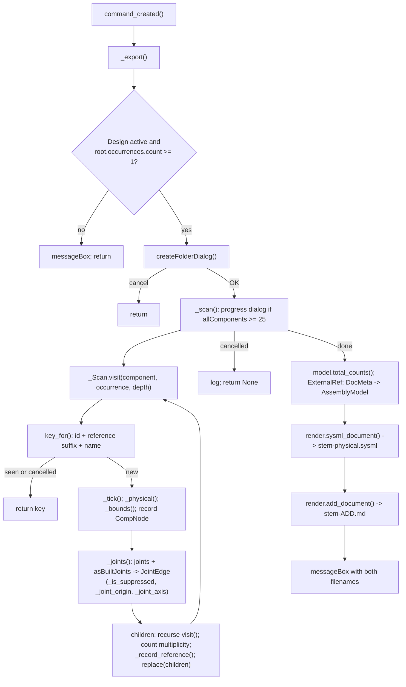

# Export SysML Architecture Document — Architecture

[← Export SysML Architecture Document guide](../Export%20SysML.md)

| | |
|---|---|
| **Command ID** | `PTE_exportsysml` (`CMD_NAME = "Export SysML Architecture Document..."`) |
| **Registry** | group `exports` (`Exports`); enabled by default |
| **UI location** | QAT **File** dropdown via [`ptutil.get_qat_file_dropdown()`](architecture.md#ui_utils), `controls.addCommand(cmd_def, "ExportCommand", True)` — directly before Fusion's **Export**, beside the other two exports; no icon folder (that menu renders text) |
| **Files** | `commands/exportsysml/entry.py` (all Fusion contact), `model.py` (`adsk`-free records and derivations), `render.py` (`adsk`-free SysML v2 and Markdown renderers) |
| **Shared helpers** | [`ptutil.get_qat_file_dropdown`, `ptutil.remove_from_qat_file_dropdown`](architecture.md#ui_utils), [`ptutil.add_handler`](architecture.md#event_utils), [`ptutil.log`, `ptutil.handle_error`, `ptutil.require_document`](architecture.md#general_utils) |
| **Tests** | `tests/test_exportsysml_entry.py`, `tests/test_exportsysml_model.py`, `tests/test_exportsysml_render.py`, `tests/test_assemblybuilder_sysml_import.py` (round trip); `tests/test_command_contract.py`, `tests/test_command_abort.py` |

## Purpose

Writes the active design as an Architecture Design Document on the 4+1 View Model (`<name>-ADD.md`) plus its Physical View as a SysML v2 textual model (`<name>-physical.sysml`), both into a folder the user picks. One `part def` per unique component with part number, material, body count, mass, volume, area, centre of mass and envelope; one usage per parent/child edge with multiplicity; one `connection` per expressible joint with kind, degrees of freedom, origin and axis; linked documents in the Development View; everything unreadable in an appendix of notes. The shaping constraint is that the output is a claim about someone's design consumed by tools that reject a malformed file: nothing is guessed, absent values stay absent, every user-authored string is escaped, and the model must parse.

## How it is wired

- `start()`: reuses or creates the button definition, registers `command_created` on `commandCreated` (global handler list), and adds the control to the File dropdown before `ExportCommand` only if it is not already there.
- `stop()`: `ptutil.remove_from_qat_file_dropdown(CMD_ID)`, then deletes the definition.
- `command_created(args)`: the entire command — `_export()` inside one `try` routed to `ptutil.handle_error(CMD_NAME, show_message_box=True)`. No inputs are built and **no `execute` or `destroy` handler is registered**, so Fusion's auto-execute is a no-op and the `_command_abort` flag is unnecessary ([pattern](architecture.md#acting-from-commandcreated-when-there-are-no-inputs)). `tests/test_exportsysml_entry.py::test_no_execute_handler_is_registered` pins this, because the repo-wide guard in `tests/test_command_abort.py` only inspects `commandCreated` bodies.
- `_export()`, in order:
  1. `ptutil.require_document(CMD_NAME, "design")`; `None` -> return (it shows "Export SysML Architecture Document needs a design open. Open or create a design, then retry."; see [Document preconditions](architecture.md#document-preconditions)).
  2. `root.occurrences.count < 1` -> "This design has no child components." message box, log, return.
  3. `document_name = design.parentDocument.name` or `"Untitled"`.
  4. Folder dialog **before** the scan, so a cancelled dialog costs nothing; cancel -> return.
  5. `_scan(design, root, document_name)` -> `model.AssemblyModel` or `None` (cancelled -> return, nothing written).
  6. `stem = render.safe_filename(os.path.basename(document_name))`; writes `stem + "-physical.sysml"` (`render.sysml_document`) then `stem + "-ADD.md"` (`render.add_document(assembly, sysml_name)`), each with `encoding="utf-8", newline="\n"`.
  7. Confirmation message box naming both files and the folder.
- Every Fusion property is read through `_read(getter, default=None)`, which returns the default on any exception: a partial document that says which values are missing beats an aborted export.

### The scan (`_Scan`)

`_scan` shows a cancellable `ui.createProgressDialog()` only when `design.allComponents.count >= PROGRESS_THRESHOLD` (25); `show()` is called with minimum 0 and `progressValue` set afterwards. It then runs `_Scan.visit(root, None, 0)` under `try/finally: progress.hide()`. `visit(component, occurrence, depth)`:

1. `key = key_for(component, occurrence)`; return if already in `nodes` or cancelled.
2. `_tick(label)` advances the progress bar and reads `wasCancelled`; no events are pumped inside the loop.
3. Reads `bRepBodies.count`, `_physical()` (`getPhysicalProperties(LowCalculationAccuracy)` -> mass, volume, area, centre of mass), `_bounds()` (`boundingBox` min/max corners, cm).
4. Records a frozen `model.CompNode` **before** recursing, so a self-containing or twice-reached component terminates; `_joints()` collects `component.joints` and `component.asBuiltJoints` as `model.JointEdge`s owned by this key.
5. `depth >= model.MAX_DEPTH` (64) -> note and return without children.
6. Walks `_occurrences(component)`, recursing into each child component, counting multiplicity per child key in first-appearance order (so output follows the browser and is stable between exports), and `_record_reference()` for referenced children; then `dataclasses.replace(node, children=...)`.

After the walk `_scan` emits one aggregated note for referenced occurrences whose document could not be named, computes `model.total_counts`, builds `model.ExternalRef`s (label, version, out-of-date flag, instance count) and `model.DocMeta` (design type, `defaultLengthUnits` string, ISO timestamp, `dataFile.versionNumber`), logs the counts and returns the `AssemblyModel`.

## Data and state

- No module-level mutable state; each run builds a fresh `_Scan` (nodes, notes, joints, references, `_id_names`, `_unidentified_refs`, `cancelled`).
- Output files: `<stem>-ADD.md`, `<stem>-physical.sysml` in the chosen folder; `render.safe_filename` replaces `<>:"/\|?*` and control characters, strips path separators, caps the stem at `MAX_FILENAME_STEM` (120). Nothing else touches disk. No settings keys, caches or custom events.

## Identity is `Component.id` + reference suffix + name

`_Scan.key_for` builds `"<Component.id><@fileId:version>|<name>"`. `entityToken` is not used: its documentation says the token for one entity can differ between reads and must never be compared, which as a dictionary key would emit a component twice and evaluate its properties per instance. `Component.id` is persistent and documented unique within one design, but may collide across externally referenced designs that are revisions or copies of one another, so a referenced component's key carries its source document id and version (`_reference_suffix`). The suffix is not sufficient on its own: a component copied from another inside a referenced document carries the original's `id`, differing only in `revisionId`, and `Occurrence.documentReference` raises for anything nested inside a referenced subassembly, so the suffix is empty exactly where it is most needed. The name completes the key; `revisionId` would also separate them but changes on every edit and would make an unchanged structure export differently. When one id carries two names the scan records a note (a rename in the source design would merge them). An empty `id` falls back to `name:<name>` and records a note.

## The walk is over the component graph, not the occurrence tree

A `part def` is emitted once per unique component, so each component is expanded once regardless of how many occurrences reference it: cost proportional to distinct components plus distinct parent-child edges, one physical-property evaluation per component by construction, and termination on a self-referential graph without a separate cycle set. Quantities are arithmetic over edge multiplicities — `model.total_counts` multiplies down the graph — rather than a second pass over `allOccurrences`. `model.classify` labels a node `part` (bodies, no children), `subassembly` (children, no bodies), `hybrid` (both) or `empty`; the hybrid class exists because `exportbomcsv` drops such rows. `model.definition_order` emits children before parents, each once.

## Joints

**Read per component, not from `allJoints`.** `Component.allJoints` returns proxies "in the context of" the caller whose end occurrences do not correspond to the native children recorded while walking; a connection is emitted inside the owning component's definition, so the ends must be nameable in that scope, which `Component.joints` and `asBuiltJoints` give.

**Placement.** `model.usage_path(model, owner_key, target_key)` finds the chain of child usages from the owner to an end breadth-first (shortest path, stable between exports). A joint becomes a `connect` when both ends are descendants of its owner and it is not suppressed; `render.dotted_path` spells a nested end as `a.b.c`. Everything else is reported with `model.unplaced_reason` — in the ADD's interface table and as comments in the model — never dropped or emitted as a dangling reference.

**Suppression has three signals** (`_Scan._is_suppressed`): `Joint.isSuppressed`; `Joint.healthState == SuppressedFeatureHealthState` (exact value only — a warning or error state is still a built joint); `joint.timelineObject.isSuppressed`. Any one suffices, cheapest first, and the second and third record a note saying which answered. `isLightBulbOn` is not consulted and `isVisible` is not read.

**Kind, degrees of freedom, axis.** The kind comes from `jointMotion.jointType` through `_JOINT_TYPE_NAMES` (all eight `JointTypes`; an as-built joint with no motion defaults to `Rigid`, an ordinary one to `Unknown`). `model.JOINT_DOF` gives `(rotational, translational)` for the seven fixed kinds; `Inferred` and `Unknown` are absent and `model.joint_dof` returns `None`, so the definition omits the counts rather than claiming rigidity. `model.JOINT_AXIS` maps kind -> `(JointMotion property, role)`: `rotationAxisVector` for Revolute, Cylindrical and PinSlot, `slideDirectionVector` for Slider, `normalDirectionVector` for Planar, `pitchDirectionVector` for Ball; Rigid and Inferred get no axis. `entry._joint_axis` is one `getattr`; `model.unit_vector` normalises and returns `None` for a zero-length vector. Only the primary axis is exported; `axisRole` names it.

**Origin.** `_joint_origin` casts `geometryOrOriginOne` / `Two` (a `Joint`) or `geometry` (an `AsBuiltJoint`) as `JointGeometry` or `JointOrigin` and takes the first end that yields a point. As-built joints carry no origin by construction — they are defined by the position their components already had — and the Process View says so in prose when any are present. Origins are in the **owning component's frame**: the value is written onto a `part def` shared by every instance, so a world coordinate would be right for one instance and wrong for the rest; `component.joints` returns native objects that carry no assembly context. Two origins under different definitions are not comparable without composing the occurrence transforms between them.

## SysML modelling decisions (`render.py`)

- **Local schema, no library.** Joint kinds are `connection def <Kind>Joint :> FusionJoint`; `FusionJoint`'s two ends are typed by a locally declared `abstract part def FusionComponent` that every component definition specialises. Typing against `SpatialItems::SpatialItem` would import the geometry domain library — the same trade rejected for ISQ. Both names go through `_unclashed` against every *emitted* component name (`render.schema_names`), because SysML treats `'FusionJoint'` and `FusionJoint` as one name. The base is emitted only when at least one joint is connectable; only used joint kinds are declared. Degrees of freedom and the placement attributes (`originXMm`… , axis, `axisRole`, frame statement) are declared once on `FusionJoint` and redefined per connection; a connection with nothing to place stays a one-line statement.
- **Connector ends are positional**: `connect a to b`, no `occurrenceOne references` binding and no `end [1]` cross multiplicity (which would assert each component takes part in exactly one connection of that kind). The comment on each connection records the occurrence names Fusion gave its ends.
- **Definition names deduplicated case-sensitively** (`render.definition_names`): two components with one display name become `'Bracket'` and `'Bracket (2)'`, and every usage referencing them is rewritten through the same map. Case-sensitive because SysML namespaces are; the counter only allocates a suffix when the unsuffixed name is taken, so Fusion's own `Model (1)` / `Model (2)` coexist with it. `test_every_part_def_name_is_unique_in_the_worked_example` asserts the invariant because CI has no SysML parser.
- **Usage identifiers assigned once** (`render.usage_names`: `{(parent key, child key): identifier}`) before anything is emitted, since each is needed twice — to declare the usage and to spell a dotted path through it — and `render.identifier` disambiguates same-named children with a numeric suffix and avoids `RESERVED` words.
- **Plain `ScalarValues`, not ISQ.** Attributes are `Real` and `String` with the unit in the name (`massKg`, `bboxLengthMm`); `ScalarValues` is kernel and always resolves, ISQ needs the systems library. Scalars only — no collection literals for centre of mass or envelope. `UNIT_NOTE` states the convention in both outputs.
- **Everything user-authored is escaped**, four contexts, four functions — the same reasoning as `_csv_cell` in `exportbomcsv`, except a bad value here corrupts a model file:

  | Function | Context | Guards against |
  |---|---|---|
  | `quoted_name` | a declared or referenced SysML name (always quoted; control characters stripped) | keyword collisions, spaces, quotes, backslashes, a second line |
  | `sysml_string` | a double-quoted attribute value | an unescaped `"` |
  | `comment_text` | inside `//` or `/* */` | `*/` closing the block early, `/*` opening one, a newline |
  | `md_cell` | a Markdown table cell | `\|` breaking the table, `[..](..)` injecting a link |

- **Absent values are absent, never zero.** Every physical field is optional; the SysML omits the attribute and the ADD prints an em dash. `render.number` prefers fixed point and falls back to exponent form only for a value too small for six decimals (a 1e-7 kg part is a real reading). `render.coordinate` additionally snaps `|x| < GEOMETRY_EPSILON` (1e-9) to `0` and is used for origins and axis components only — a joint origin comes out of a transform multiply and arrives as picometre noise that would otherwise read as a measurement and diff between exports. `model.extents_cm` treats an all-zero bounding box as absent (Fusion returns a degenerate box for a component that encloses nothing) but keeps a single zero dimension (a shim is flat).

## What the ADD says about the figures

`Component.physicalProperties` and `boundingBox` include children: a bodiless subassembly reports the envelope of everything inside it, and the root's mass is the assembly total. The ADD therefore names the root figures as the assembly total and envelope, computes no roll-up, and states under the component inventory that its Mass column is **not additive** — every subassembly already contains its parts — quoting the root mass and the naive column sum for the design in hand (`render._mass_sums`; omitted when the root has no mass). The Development View lists only occurrences whose `documentReference` resolves to a name or id, aggregated by document with an instance count; the rest are counted into one collection note, because Fusion marks the *contents* of a referenced subassembly as referenced too and then refuses `documentReference` for them. Of the five views, the Logical View and Scenarios carry only a heading and a verbatim statement that they must be authored: a Fusion design records decomposition, not intent.

## Diagram

The command path with the scan's per-component step; every box is a function in `entry.py` unless prefixed `model.` / `render.`.

```mermaid
flowchart TD
    CC["command_created()"] --> EX["_export()"]
    EX --> D{"Design active and<br/>root.occurrences.count >= 1?"}
    D -- no --> M1["messageBox; return"]
    D -- yes --> FD["createFolderDialog()"]
    FD -- cancel --> R0["return"]
    FD -- OK --> SC["_scan(): progress dialog if allComponents >= 25"]
    SC --> V["_Scan.visit(component, occurrence, depth)"]
    V --> K["key_for(): id + reference suffix + name"]
    K -- "seen or cancelled" --> RK["return key"]
    K -- new --> P["_tick(); _physical(); _bounds(); record CompNode"]
    P --> J["_joints(): joints + asBuiltJoints -> JointEdge<br/>(_is_suppressed, _joint_origin, _joint_axis)"]
    J --> CH["children: recurse visit(); count multiplicity;<br/>_record_reference(); replace(children)"]
    CH --> V
    SC -- cancelled --> R1["log; return None"]
    SC -- done --> AM["model.total_counts(); ExternalRef; DocMeta -> AssemblyModel"]
    AM --> W1["render.sysml_document() -> stem-physical.sysml"]
    W1 --> W2["render.add_document() -> stem-ADD.md"]
    W2 --> OK["messageBox with both filenames"]
```

## Tests

- `tests/test_exportsysml_entry.py` (27) — command identity and registry/docs/README contract; no `execute` handler registered and no `doExecute` anywhere; `model.py` / `render.py` import no `adsk`; `_JOINT_TYPE_NAMES` / `_DESIGN_TYPE_NAMES` cover every enum member; distinct output suffixes; `_read` swallows failures; `key_for` keeps two components sharing an id distinct and notes it, falls back to the name; every `open()` pins `encoding="utf-8"` and `newline="\n"`; `_record_reference` records resolvable references, drops unnameable ones, aggregates instances per document; `_is_suppressed` on each of the three signals, the timeline route consulted only after the joint says no, an unhealthy joint not treated as suppressed.
- `tests/test_exportsysml_model.py` (46) — `classify` over every combination; `total_counts` (root is one, multiply down, shared subassembly sums across parents, missing child skipped); termination on self-reference, mutual recursion and the depth cap; `walk` and `definition_order`; joint placement (siblings, unresolved end, suppressed, dotted path across a subassembly, end not below owner, owner not recorded); `usage_path` (direct child, unreachable, owner itself, missing key, shortest route, cycle, depth cap); `JOINT_DOF` / `JOINT_AXIS` coverage and mutual consistency; `unit_vector`; `extents_cm` (largest first, straddling origin, malformed corner, degenerate box absent, flat component kept, bodiless envelope).
- `tests/test_exportsysml_render.py` (93) — the four escaping functions; `number` and `coordinate` (tiny mass kept, float noise snapped, mass not snapped); `identifier` (bare lowerCamel, never reserved, collisions suffixed); `safe_filename`; unit conversion; the worked example's exact structure and brace balance; one definition per component, multiplicity only when not one, absent measurements omitted; joint schema, dotted-path connections, positional ends without cross multiplicity, suppressed joints commented, unresolved ends never dangling, unplaced reasons listed, placement attributes and frame statement; deterministic rendering; hostile document names; definition-name deduplication (case-sensitive, referenced correctly); the ADD's five views in order, verbatim undeliverable-view notes, root figure as total, em dashes, the non-additive warning, provenance banner, no stray pipes, as-built prose agreeing in number.
- `tests/test_assemblybuilder_sysml_import.py` — feeds `render.sysml_document` output through the Assembly Builder importer and checks the graph round-trips.
- `tests/test_command_contract.py`, `tests/test_command_abort.py` — the registry-wide contract and `doExecute` guard.

`entry.py`'s Fusion contact — the property reads, joint collection, progress dialog and `wasCancelled` without pumped events, folder dialog and the writes — is not exercised by the suite; the pure `_Scan` methods above are tested on fakes under the `adsk` stub. Not verified on `g16win.local`: that the `.sysml` lands with LF, a non-ASCII document name through the folder dialog and filename, and a destination pushing the path past 260 characters (stem 120 + 15-character suffix). No icon set exists to pin.

## Learnings

- **A green validator is necessary and not sufficient; open the file in the tool the output is for.** Named connector ends (`connect occurrenceOne references a to occurrenceTwo references b`) parse and link in `sysml-validate` yet stopped a SysML viewer showing joints as relationships (2026-09-09). Positional ends carry the same information (`BinaryConnectorPart` is `ConnectorEndMember 'to' ConnectorEndMember`).
- **Duplicate display names produce `RES017` ("already declared in this namespace").** A 118-component espresso machine declared `part def 'Connector'` twice; caught only by running `sysml-validate`, which CI cannot (npm, not stdlib), hence the uniqueness test in `test_exportsysml_render.py`. To repeat: `npm install sysml-validate && ./node_modules/.bin/sysml-validate *.sysml`. Established by probe there: SysML is case-sensitive, and a definition and a usage may share a name.
- **`Component.id` collides inside one referenced design.** `Rear Hub ASSY R`: `CVD Pivot Pin` and `CVD Drive Pin` share `012331ee-63d2-46b6-b607-e74d637af56e`; keyed on id alone the model had 16 definitions for 17 components and joint `Rigid 5` was emitted against the wrong pin — a wrong connection, not a missing one. The name suffix fixed it (17 definitions, correct `connect cvdDrivePin to dogBoneRear`).
- **`Joint.isSuppressed` is not what the browser's Suppress sets.** With `Rigid 10` suppressed on a live Rear Hub: `isSuppressed=False`, `healthState=3` (`SuppressedFeatureHealthState`), `timelineObject.isSuppressed=True`; `isVisible` *raises* on a suppressed joint; `isLightBulbOn` is `False` for every joint. Reading only the flag published a switched-off joint as a live connection, the only visible sign being its origin falling back to the unjointed position.
- **`rootComponent.allJoints` raised on a real design**, reinforcing the per-component read. The joint-frame question was settled by moved subassemblies instead (`PTJointFrameProbe`, outside the repo): the Controls joint origin `(0.02, -1.90, 1.16)` cm is 2 cm from its owner, versus the owner's `(0, -11.78, 6.81)` translation — component-local, not world.
- **Physical properties and bounding boxes include children** — confirmed on live designs, not the API reference: bodiless `Water Tank` reports 285 x 127 x 66 mm; espresso root 8.667 kg vs leaf sum 8.630 kg (the difference is the root's own body); summing the inventory column gives 23.629 kg, a 2.7x over-count — hence the non-additive warning. Two components exported as `0 x 0 x 0 mm` led to the degenerate-box rule.
- **Requiring joint ends to be direct children dropped a third of two-ended joints** in a real hub; descendants with dotted paths raised `Overall Assembly` from 21 to 118 expressible of 178 (the remaining 60 anchor to geometry owned by no occurrence or are unreachable from the owner).
- **`Occurrence.documentReference` raises for anything nested inside a referenced subassembly** (`RuntimeError: 3 : Cannot get allDocumentReferences of a non-top-level document`). Listing those by occurrence name gave 14 Development View rows for 8 documents; only resolvable references are listed now.
- **Float noise in coordinates** (`5.68989e-15`) reached a real export and made unchanged designs diff; `coordinate` snaps below 1e-9, mass does not.
- Constructs the OMG BNF made look doubtful but a real parser accepts: `abstract connection def`, `connection def X :> Y`, `attribute :>> n = 1`, a body on a connection usage after `connect`, and `end part occurrenceOne : FusionComponent;`.

---

*Copyright © 2026 IMA LLC. All rights reserved.*
