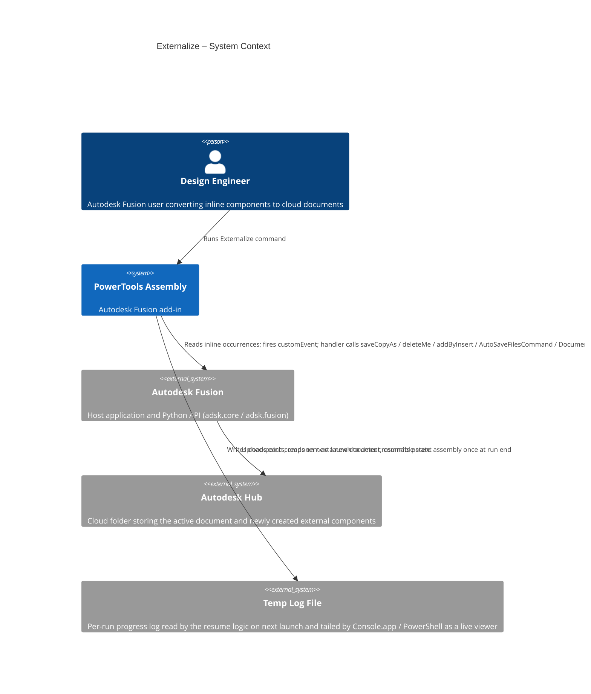
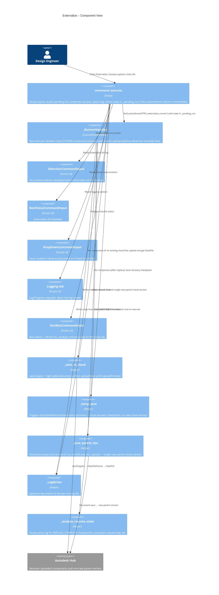

# Externalize — Architecture
[← Externalize guide](../Externalize.md)

## Architecture

The actual save/replace work runs **outside** `command_execute`, in a Fusion `CustomEvent` handler that the command fires before returning. This is required because `Component.saveCopyAs`'s upload pipeline does not advance while `command_execute` holds the main thread (Autodesk forum [11164467](https://forums.autodesk.com/t5/fusion-api-and-scripts-forum/datafilefuture-uploadstate-is-not-updating-when-commandinputs/td-p/11164467)). In a custom-event handler, the same call completes in a few seconds.

### System context



### Component view



### Per-run sequence

```mermaid
sequenceDiagram
  autonumber
  participant U as User
  participant Cmd as command_execute
  participant H as _RunnerHandler
  participant Save as _save_to_cloud
  participant API as Fusion API
  participant Hub as Autodesk Hub

  U->>Cmd: OK
  Cmd->>Cmd: read inputs, build pending list, write log header
  Cmd->>API: app.fireCustomEvent('PTAT_externalize_runner')
  Cmd-->>U: dialog closes
  Note over Cmd,H: command_execute returns; handler runs in customEvent context

  H->>API: design.activeProduct, root.occurrences
  loop for each component in pending list
    H->>API: _find_existing_cloud_file(folder, name)
    alt file already exists
      API-->>H: DataFile (reused)
    else upload needed
      H->>Save: saveCopyAs(component, folder, name)
      Save->>API: component.saveCopyAs(...)
      API-->>Save: DataFileFuture (uploadState=Processing)
      loop tight adsk.doEvents() spin
        Save->>API: future.uploadState
      end
      Save-->>H: DataFile
    end
    H->>API: occurrence.deleteMe()
    H->>API: addByInsert(DataFile, transform, isReferenced=True)
    H->>API: AutoSaveFilesCommand.execute() (local recovery save)
    H->>H: log CHECKPOINT|REPLACE_COMPLETE|...
  end
  H->>API: parent_doc.save('Externalize: N components replaced')
  API->>Hub: upload new parent version
  H-->>U: summary message box
```

### Why customEvent

A direct `saveCopyAs` from inside `command_execute` returns a `DataFileFuture` whose `uploadState` never transitions away from `Processing` — Fusion's upload pipeline does not advance while a command with CommandInputs holds the main thread. Cancelling the command makes the queued uploads land on the server, which is the smoking-gun observation behind the architecture. Moving the loop into a `CustomEvent` handler — fired from `command_execute`, executed *after* the dialog closes — gets us into a context where the same call completes in a few seconds. This was validated with an isolation spike before the refactor.

`AutoSaveFilesCommand` between iterations creates a local recovery save (no new cloud version) so a crash mid-run doesn't lose the in-progress replacements. The single `Document.save` at the end commits exactly one new parent assembly version, regardless of how many components were externalized.
