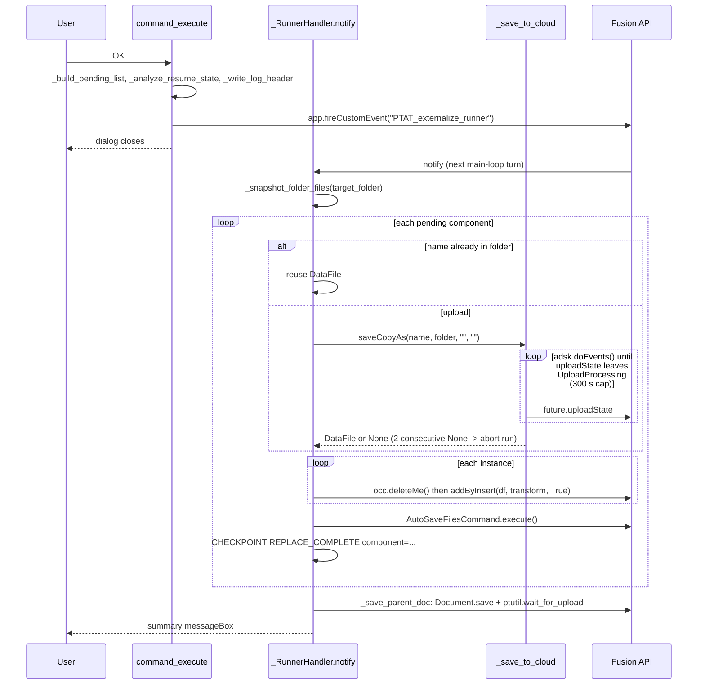

# Externalize — Architecture

[← Externalize guide](../Externalize.md)

| | |
|---|---|
| **Command ID** | `PTAT_externalize` |
| **Registry** | group `assembly` (`Assembly`); enabled by default |
| **UI location** | Power Tools panel (`config.my_panel_id`, Design workspace, Tools tab) via [`_ui_bootstrap.get_power_tools_panel`](architecture.md#_ui_bootstrap); not promoted. Two-tab command dialog (Main, Logging); the run itself reports through the status-bar `ui.progressBar` |
| **Files** | `commands/externalize/entry.py`; `resources/` PNG set |
| **Shared helpers** | [`ptutil.add_handler`](architecture.md#event_utils); [`ptutil.log`, `handle_error`, `require_document`, `document_required_message`](architecture.md#general_utils); [`ptutil.capture_selections`, `picked_one`](architecture.md#selection_utils); [`ptutil.wait_for_upload`](architecture.md#upload_utils); [`default_log_directory`, `open_live_log_viewer`](architecture.md#log_utils) |
| **Tests** | `tests/test_externalize_upload.py` |

## Purpose

Turns local (in-document) first-level components of the active assembly into
external cloud documents: each component is uploaded with `saveCopyAs`, its
occurrences are deleted and re-inserted by reference at their original
transforms, and the parent is saved once at the end. The shaping constraint is
that `Component.saveCopyAs`'s upload pipeline does not advance while
`command_execute` holds the main thread, so all of the work runs in a custom
event handler fired from `command_execute`, after the dialog has closed.

## How it is wired

- `start()`: `addButtonDefinition(CMD_ID, …)`, `commandCreated -> command_created`,
  control added to the Power Tools panel; the custom event `PTAT_externalize_runner`
  is unregistered-then-registered and `_RunnerHandler` attached (kept in
  `_event_handler` for the life of the add-in). `stop()`: removes the control
  and definition, unregisters the event.
- `command_created`: `cmd.isExecutedWhenPreEmpted = False`; computes the resume
  plan from `_snapshot_local_component_names()` (names of first-level
  occurrences whose `component.parentDesign` is the active design) and
  `_analyze_resume_state(_default_log_path(), app.version, names)`; builds the
  dialog; registers `inputChanged -> command_input_changed`,
  `execute -> command_execute`, `destroy -> command_destroy`.
  - **Main**: `occurrence_sel` (`SelectionCommandInput`, filter `Occurrences`,
    limits 1..1); `externalize_all`; `replace_all_instances` (on by default);
    `save_location` dropdown with `Same as Document` (selected) and
    `Create Sub-folder`; read-only `resume_status` text box.
  - **Logging**: `enable_log` (on), read-only `log_path` prefilled with
    `_default_log_path()`, `browse_log` momentary button, `open_log_view` (on).
- `command_input_changed`: first captures the pick with
  `ptutil.capture_selections(inputs, _picks, "occurrence_sel")` on every change
  (this command defers its work past the dialog, so the selection cannot be
  read later). `externalize_all` on hides and disables the selector (limits
  0..1) and forces `replace_all_instances` on and disabled; off restores both.
  `enable_log` toggles the three logging inputs; `browse_log` resets itself
  and opens a save dialog (`*.log` first) into `log_path`.
- `command_execute`: refuses when `_pending_run` is set (a run is in
  progress); needs a saved `Design` (`ptutil.require_document(CMD_NAME,
  "design", saved=True)`, see
  [Document preconditions](architecture.md#document-preconditions)) and
  `activeDocument.dataFile`, whose absence shows the same "Externalize needs a
  saved design. Save the design, then retry." message;
  resolves the target folder — `Create Sub-folder` →
  `_get_or_create_subfolder(parentFolder, dataFile.name)`, otherwise an existing
  sub-folder of that name if present (`_find_existing_subfolder`) else the
  document's own folder; `_build_pending_list`; re-runs
  `_analyze_resume_state` against the chosen log path and computes the skip
  set (empty, and log mode `w`, when the previous run completed); writes the
  header with `_write_log_header`; creates `_LogWriter`; opens the live viewer;
  stores everything in `_pending_run`; `app.fireCustomEvent(EVENT_ID)` — the
  return value is logged, not acted on — and returns so the dialog closes.
- `_RunnerHandler.notify` (main thread, next turn): takes and clears
  `_pending_run`, shows `ui.progressBar`, runs `_run_loop` then `_finalize`,
  reports a crash in the log and a `messageBox`, hides the bar.
- `command_destroy`: clears `local_handlers`, `resume_plan`, `_picks`.

### The pending list

`_build_pending_list(design, externalize_all, replace_all_instances)` returns
entries `{"component", "comp_name", "instances": [(occ, occ.transform2), …]}`
grouped by component name, in first-encounter order (`_group_local_occurrences`):

- `externalize_all` → every local first-level component, all occurrences.
- Otherwise the pick from `ptutil.picked_one(_picks, "occurrence_sel")`
  (an `Occurrence`, or an entity's `assemblyContext`); a component whose
  `parentDesign` is not the active design is already external (message, empty
  list); `replace_all_instances` → every first-level occurrence of that
  component, else just the picked one.

### The run loop

`_run_loop` snapshots the target folder once with `_snapshot_folder_files`
(`{name: DataFile}`), then per entry: reuse the existing `DataFile` of that
name, or `_save_to_cloud(component, name, folder)`; on `None` count a
consecutive failure and skip (no checkpoint, so the next run retries it), and
abort the loop at `MAX_CONSECUTIVE_UPLOAD_FAILURES = 2`; otherwise record the
upload in the map, then for every instance `occ.deleteMe()` and
`root.occurrences.addByInsert(df, transform, True)`; `_temp_save` (Fusion's
`AutoSaveFilesCommand`, a local recovery checkpoint that creates no cloud
version); write `CHECKPOINT|REPLACE_COMPLETE|component=<name>|index=<n>`.
Per-entry exceptions are logged and the loop continues.

`_finalize`: when anything was replaced, `_save_parent_doc` — one
`Document.save("Externalize: N components replaced")` awaited with
`ptutil.wait_for_upload` — then the footer line (`Externalize completed
successfully` only when `replaced == total`; that string is the marker the
resume check looks for) and a summary `messageBox`.

This sequence shows one run from OK to the summary.

```mermaid
sequenceDiagram
    participant U as User
    participant C as command_execute
    participant H as _RunnerHandler.notify
    participant S as _save_to_cloud
    participant F as Fusion API
    U->>C: OK
    C->>C: _build_pending_list, _analyze_resume_state, _write_log_header
    C->>F: app.fireCustomEvent("PTAT_externalize_runner")
    C-->>U: dialog closes
    F->>H: notify (next main-loop turn)
    H->>H: _snapshot_folder_files(target_folder)
    loop each pending component
        alt name already in folder
            H->>H: reuse DataFile
        else upload
            H->>S: saveCopyAs(name, folder, "", "")
            loop adsk.doEvents() until uploadState leaves UploadProcessing (300 s cap)
                S->>F: future.uploadState
            end
            S-->>H: DataFile or None (2 consecutive None -> abort run)
        end
        loop each instance
            H->>F: occ.deleteMe() then addByInsert(df, transform, True)
        end
        H->>F: AutoSaveFilesCommand.execute()
        H->>H: CHECKPOINT|REPLACE_COMPLETE|component=...
    end
    H->>F: _save_parent_doc: Document.save + ptutil.wait_for_upload
    H-->>U: summary messageBox
```

## Data and state

- Module state: `_pending_run` (set by `command_execute`, cleared by the
  handler; doubles as the busy flag), `_event_handler`, `resume_plan`, `_picks`
  (selection capture store), `local_handlers`.
- Custom event: `PTAT_externalize_runner`.
- Run log: `_default_log_path()` =
  `ptutil.default_log_directory()/<document>_externalize.log` (OS temp directory
  on macOS and Windows, `~/Documents` elsewhere), or the browsed path. Header:
  `Fusion client version:`, active document, target folder, options,
  `Pending order:` with `[done]` markers, then `Externalize log:`.
- Constants: `UPLOAD_TIMEOUT_SECONDS = 300.0` (equal to
  `ptutil.upload_utils.DEFAULT_UPLOAD_TIMEOUT_SECONDS`),
  `MAX_CONSECUTIVE_UPLOAD_FAILURES = 2`.
- No settings keys.

## Why the work runs in a custom event

A `saveCopyAs` issued inside `command_execute` returns a `DataFileFuture` whose
`uploadState` stays `UploadProcessing` for as long as the command holds the main
thread (Autodesk forum thread 11164467); the queued uploads land only when the
command ends. A `CustomEvent` handler fired from `command_execute` runs on the
main thread after the dialog has closed, and there the same call completes in
seconds. See [Deferring work to a later main-loop turn](architecture.md#deferring-work-to-a-later-main-loop-turn).
`AutoSaveFilesCommand` between iterations keeps the replacements crash-safe
without a cloud version each; the single `Document.save` at the end commits one
new parent version regardless of how many components were externalized.

## Why the upload spin is tight and bounded

`_save_to_cloud` is a fork of `ptutil.upload_utils._wait_via_upload_state`, not
a caller of it: the shared helper sleeps through `pump_events_for()` between
polls, and that pause is what stops this pipeline from draining, so the fork
calls `adsk.doEvents()` back to back (heartbeat every 5 s). Fusion can leave a
future in `UploadProcessing` indefinitely and nothing can abort it —
`DataFileFuture` exposes only `dataFile` and `uploadState`, the status-bar
progress bar has no cancel affordance, and inside a custom event there is no
command to terminate — so two bounds apply:

| Bound | Constant | Behaviour |
|---|---|---|
| Per upload | `UPLOAD_TIMEOUT_SECONDS` (300 s) | return `None`; the component is skipped without a checkpoint and retried next run |
| Per run | `MAX_CONSECUTIVE_UPLOAD_FAILURES` (2) | break out of the loop; `_finalize` still commits what succeeded and resume stays available |

## Why the folder snapshot is best-effort

The `{name: DataFile}` map makes the per-component "already in the cloud?"
check O(1) instead of a linear scan of a folder that grows every iteration, and
it doubles as a duplicate guard. It is never a correctness requirement, so
`_snapshot_folder_files` degrades to a smaller map rather than raising:
`DataFiles.asArray()` is tried first (one native call, no index arithmetic);
if it raises, an indexed walk guards each `item(i)` on its own — `count` is a
server-side number and `item(i)` can raise
`RuntimeError: 2 : InternalValidationError : item` for an index Fusion has not
materialised.

| Failure | Result |
|---|---|
| `folder.dataFiles` raises | empty map, warning |
| `asArray()` raises | indexed walk |
| `item(i)` raises, or an entry's `name` is unreadable | skip that entry, warning |
| every index raises | empty map, warning |

A missed name means that component is uploaded again, creating a duplicate
cloud file; every degraded path logs a warning that names that consequence.

## Why instances are grouped per component

The component name is the cloud-file identity everywhere in this command
(snapshot lookup, resume checkpoints). Grouping every occurrence of a component
into one entry makes the checkpoint atomic: `REPLACE_COMPLETE` is written only
after all instances are replaced, so a resumed run never skips a half-replaced
component.

## Tests

- `tests/test_externalize_upload.py` — `_save_to_cloud`: a wedged upload gives
  up at the deadline, the timeout is honoured exactly, a healthy upload returns
  its `DataFile`, a non-positive timeout disables the bound, the constant
  matches the shared helper's default, and the breaker threshold is small;
  `_snapshot_folder_files`: `asArray()` preferred, bad index skipped, indexed
  fallback, all-failing walk and unreadable folder yield an empty map, an
  unreadable name is skipped, first match per name wins.
- The dialog, `_RunnerHandler`, `_build_pending_list` and `_save_parent_doc`
  are Fusion-bound and not exercised by the suite; nothing here is verified in
  Fusion on this branch except by the AST guards in
  `tests/test_command_contract.py` (which also allows the custom-event id) and
  `tests/test_command_abort.py`, which import it under the `adsk` stub. The icon
  set is not pinned in `tests/test_command_icons.py`.

## Learnings

- **`saveCopyAs` uploads do not advance while `command_execute` holds the main
  thread.** The smoking gun was that cancelling the command made the queued
  uploads land; an isolation spike (`command_test_customevent_save`) took a
  component stuck indefinitely to 5.9 s inside a custom event, and the loop was
  moved there (forum 11164467).
- **A forked wait loop must keep the original's timeout.** The fork of
  `_wait_via_upload_state` dropped `DEFAULT_UPLOAD_TIMEOUT_SECONDS`; a
  75-component run wedged on component 34 and was still spinning after 430 s
  with force-quit as the only exit. Without the run-level breaker the remaining
  41 components would each have burned the full 300 s.
- **`DataFiles.count` and `item(i)` can disagree.** An unguarded indexed walk,
  run before the per-component `try`, raised
  `InternalValidationError : item` moments after 33 files landed in the folder
  and discarded a queued 42-component run before any work; a retry 43 s later
  succeeded, so the condition is transient. Prefer `asArray()` and guard every
  index.

---

*Copyright © 2026 IMA LLC. All rights reserved.*
