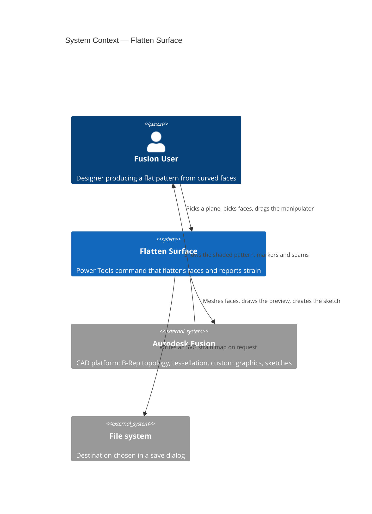
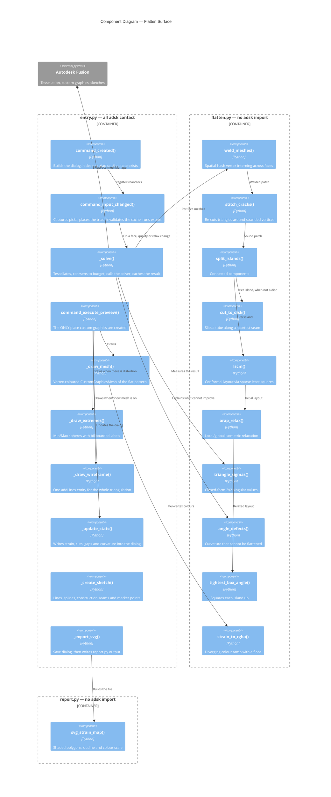
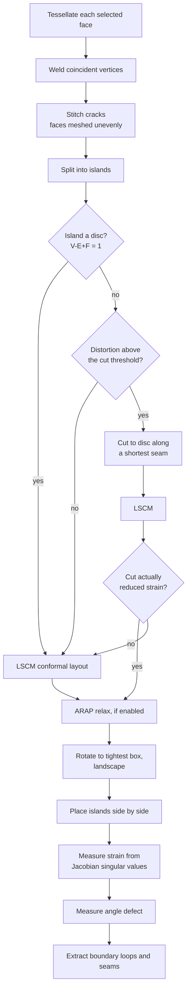
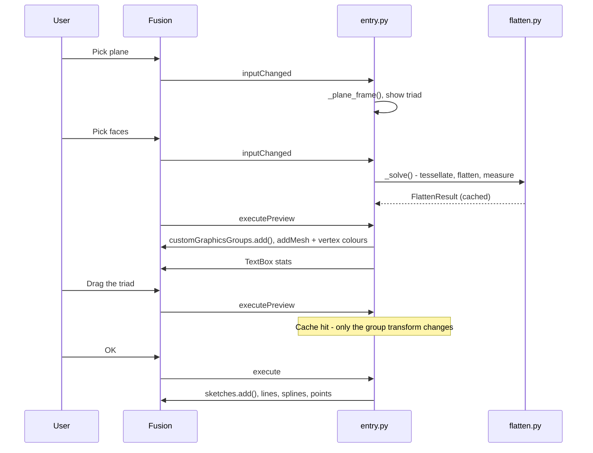

# Flatten Surface — Architecture

[← Flatten Surface guide](../Flatten%20Surface.md) ·
[Solver internals](../dev/Flatten%20Surface%20solver.md)

| | |
|---|---|
| **Command ID** | `PTPM_flattensurface` |
| **Registry group** | `partmodeling` (beta) |
| **Location** | The shared **Power Tools** panel, design **Tools** tab |
| **Modules** | `commands/flattensurface/entry.py`, `flatten.py`, `report.py` |
| **Tests** | `tests/test_flattensurface_flatten.py`, `_cracks.py`, `_report.py`, `_entry.py` |

The command tessellates the selected B-Rep faces, lays the resulting mesh flat,
measures the distortion that survives, previews it as a colour-shaded mesh on a
chosen plane, and on OK writes the outline into a sketch.

## Architecture

### System context

### Component diagram

The split is the repo's usual one: every Fusion call lives in `entry.py`, and
everything that can be reasoned about without Fusion lives in modules that import
no `adsk`, so they are unit-tested directly.

### The pipeline

Every stage below runs on plain tuples. Each is individually testable, and each
exists because of a specific failure it prevents.

Two decisions in that flow are made on **measured outcome rather than topology**,
because topology alone gives the wrong answer:

| Decision | Why it cannot be decided structurally |
|---|---|
| Whether to cut a non-disc | A closed tube and a flat washer are both annuli. The tube has no flat form; the washer is already flat. Cutting is kept only when it lowers strain. |
| Whether to report curvature | A patch can be non-planar everywhere and still flatten exactly (any developable). Only the angle defect distinguishes that from a genuine corner. |

### Preview and commit

The triad drag path is the reason the solve is cached: re-tessellating and
re-solving on every drag event would make the manipulator unusable. The cache key
is the face set plus the two solver settings, and it is safe because model
geometry cannot change while a command dialog is open.

## Implementation notes

### Custom graphics

The command follows
[Custom graphics that stay painted](../dev/Custom%20graphics%20that%20stay%20painted.md):
graphics are created **only** inside `executePreview`, and `isValidResult` is left
`False` so `execute` still runs and creates the sketch.

The mesh uses `CustomGraphicsVertexColorEffect` with a flat RGBA byte array on
`CustomGraphicsCoordinates.colors`. The wireframe overlay needs its **own**
coordinates object: reusing the mesh's would inherit those per-vertex colours and
paint the wireframe the exact colour of the surface beneath it. Depth priorities
order the layers — mesh, wireframe (1), seams (2), markers (3), labels (4).

### The triad

`TriadCommandInput.isVisible` governs the input's **row in the dialog**, not the
manipulator in the viewport. `hideAll()` at creation is what keeps the handles off
screen until a plane is picked; without it a full triad sits at the world origin
and visibly reshapes itself on the first plane selection.

### Coordinate spaces

Selections are captured in `inputChanged` via `ptutil.capture_selections`, because
a `SelectionCommandInput` cannot be read reliably from `execute` (see
`lib/ptAddInUtils/selection_utils.py`).

The solver works in plain centimetres in root space. Sketch geometry is built in
model space from the placement plane's frame and then passed through
`sketch.modelToSketchSpace()`, rather than being written as sketch coordinates
directly — Fusion chooses the sketch's own axes, and they need not match the
frame, so writing directly can mirror or rotate the pattern.

### Performance

The solver is pure Python because Fusion's bundled interpreter has no pip, so
triangle count is the whole performance story. `_MAX_TRIANGLES` caps a solve at
roughly a second; past it the mesh is coarsened and the dialog says so. Mesh
fineness is expressed as a fraction of the selection's bounding-box diagonal, so
one quality setting behaves the same on a watch case and a boat hull.

The side-length cap matters as much as the sag tolerance: sag alone leaves a
planar face as two enormous triangles at any setting, which both conditions the
solver badly and leaves too few nodes along that face's edges to weld against a
finely meshed curved neighbour.

## Scope and limits

- **Closed shells are not handled.** A sphere has no open end for a seam to run
  between, so `cut_to_disk` cannot open it. Expect a poor pattern and no usable
  outline.
- **The outline follows the mesh**, not the exact B-Rep edge, so a finer mesh
  gives a closer fit. Runs between detected corners become lines when straight
  and fitted splines otherwise.
- **Distortion is a property of the surface.** Relaxation typically halves the
  average strain on a doubly-curved face; nothing removes it.
- **Only the sketch reaches the timeline.**

### Still unverified in Fusion

Each has a logged fallback rather than an exception.

| Item | Fallback |
|---|---|
| Placing onto a plane inside an occurrence | Proxy geometry reads in root coordinates while the sketch resolves against its parent component; documented as the least-tested path |
| `SketchFittedSpline.isClosed` on a corner-free loop | Logged; the spline stays open and visually closed |
| `CustomGraphicsBillBoard` for the Min/Max labels | Label still placed, orientation view-dependent |
| Whether `TriangleMeshCalculator` conforms across shared edges | `stitch_cracks` repairs it either way and reports what it closed |

---

*Copyright © 2026 IMA LLC. All rights reserved.*
