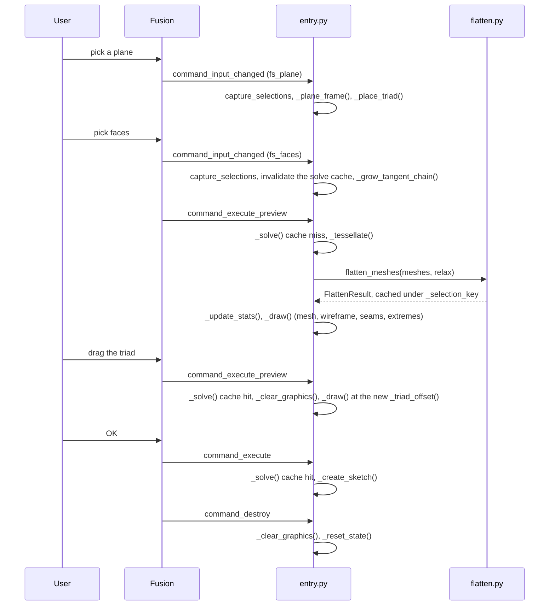

# Flatten Surface — Architecture

[← Flatten Surface guide](../Flatten%20Surface.md) ·
[Solver internals](../dev/Flatten%20Surface%20solver.md)

| | |
|---|---|
| **Command ID** | `PTPM_flattensurface` |
| **Registry** | group `partmodeling` (`Part Modeling`); **beta**. Its `enabled` flag defaults to true, but a beta command is started only when the Preferences beta toggle (`general.beta_mode`, default off) is on. |
| **UI location** | The shared **Power Tools** panel on the design **Tools** tab, obtained from [`_ui_bootstrap.get_power_tools_panel`](architecture.md#_ui_bootstrap); appended, not promoted. |
| **Files** | `commands/flattensurface/entry.py` (all Fusion contact); `flatten.py` (solver, no `adsk`); `report.py` (SVG strain map, no `adsk`); `resources/generate_icons.py` and the PNGs it produces |
| **Shared helpers** | [`_ui_bootstrap.get_power_tools_panel`](architecture.md#_ui_bootstrap); [`ptutil.capture_selections`, `picked`, `picked_one`](architecture.md#selection_utils); [`ptutil.add_handler`](architecture.md#event_utils); [`ptutil.log`, `handle_error`, `require_document`](architecture.md#general_utils) |
| **Tests** | `tests/test_flattensurface_flatten.py`, `_segments.py`, `_cracks.py`, `_report.py`, `_entry.py`; icon set pinned in `tests/test_command_icons.py` |

## Purpose

Tessellates the selected B-Rep faces, lays the mesh flat, measures the stretch and gather that survive, previews the pattern as a strain-coloured mesh on a chosen plane that the user positions with a triad, and on OK writes the outline into a sketch as lines, arcs, circles and splines. The strain map can also be exported as an SVG. The shaping constraint is that the solver is pure Python running inside Fusion's interpreter, so triangle count is the whole performance story and one solve has to be reused across every preview cycle.

## How it is wired

- `start()`: `addButtonDefinition(...)`; `ptutil.add_handler(cmd_def.commandCreated, command_created)`; `_ui_bootstrap.get_power_tools_panel()` → `controls.addCommand(cmd_def)`, `isPromoted = False`.
- `stop()`: `_clear_graphics()`; deletes the control from the Power Tools panel and the definition.
- `command_created(args)`: if [`ptutil.require_document(CMD_NAME, "design")`](architecture.md#document-preconditions) is `None` (it shows "Flatten Surface needs a design open. Open or create a design, then retry."), return with no inputs. No abort flag is set: the control exists only in the Design workspace, so `activeProduct` is a Design whenever the button is reachable and the guard is defensive. Otherwise `_reset_state()`, caches `_cmd_inputs`, and builds in order: `fs_plane` (selection; `ConstructionPlanes`, `PlanarFaces`; limits 1,1 — first, because nothing can be previewed until there is somewhere to draw), `fs_triad` (`addTriadCommandInput` with an identity matrix, then `hideAll()` and `isVisible = False`), `fs_chain` (checkbox, off), `fs_faces` (selection; `Faces`; limits 1,0), `fs_quality` (dropdown Coarse / Medium / Fine, Medium selected), `fs_relax` (checkbox, on), `fs_wireframe` (checkbox, off), `fs_export` (`addBoolValueInput` with `isCheckBox=False`, which renders as a text button), `fs_stats` (three rows, full width). Registers `execute`, `executePreview`, `inputChanged` and `destroy`.
- `command_input_changed(args)`: always `ptutil.capture_selections(args.inputs, _picks, INPUT_FACES, INPUT_PLANE)`. `fs_faces`, `fs_quality`, `fs_relax` or `fs_chain` → invalidate the solve cache. `fs_faces` or `fs_chain` → `_grow_tangent_chain(inputs)`. `fs_plane` → `_frame = _plane_frame(picked_one(_picks, INPUT_PLANE))` and `_place_triad(inputs)`. `fs_export` → reset the button to false (momentary) and `_export_svg()`. It never draws.
- `command_execute_preview(args)`: `_clear_graphics()`; `result, coarsened = _solve()`; `_update_stats(result, coarsened)`; if there is a result and a frame, `_draw(result)` and `viewport.refresh()`. `isValidResult` is never set, so it stays false and `execute` still runs.
- `command_execute(args)`: `_solve()` (a cache hit); message boxes for "Nothing to flatten." or a missing plane; `_create_sketch(result)`.
- `command_destroy(args)`: `_clear_graphics()`, then `local_handlers = []` and `_reset_state()` in a `finally`.

## Data and state

Module globals: `_picks` (captured selections), `_solve_cache_key`, `_solve_cache`, `_frame` (`(origin, x_axis, y_axis, normal)` of the placement plane), `_cmd_inputs`, `_chaining`, `_face_count`, `local_handlers`. Custom graphics group id `PTPM_flattensurface_gfx`. Tunables: `_QUALITY` (sag tolerance and longest side as fractions of the selection diagonal: Coarse 0.014/0.16, Medium 0.006/0.09, Fine 0.0025/0.05), `_MAX_TRIANGLES` 4000, `_COARSEN_ATTEMPTS` 3, `_SIMPLIFY_FRACTION` 0.0015. The only file written is the SVG at a path the user chooses in a save dialog. No settings keys, no custom events.

## The solve and its cache

`_solve()` collects the `BRepFace`s from `_picks`, reads `_current_quality()` and `_current_relax()`, and returns the cached `(FlattenResult, coarsened)` when `_selection_key(faces, quality, relax)` — face `entityToken`s (falling back to `id()`), quality name, relax flag — matches. Otherwise `_tessellate(faces, quality)` meshes each face with `face.meshManager.createMeshCalculator()` (`surfaceTolerance` and `maxSideLength` from the `_QUALITY` fractions of `_selection_diagonal`, floored at 1e-4 and 1e-3 cm), and when the total exceeds `_MAX_TRIANGLES` both controls are multiplied by the square root of the overshoot and the pass repeats, up to `_COARSEN_ATTEMPTS` times; the meshes go to `flatten.flatten_meshes(meshes, relax=relax)` and the result is cached with the elapsed time logged.

The cache is what makes the triad usable: re-tessellating and re-solving on every drag would stall the dialog. It is safe because model geometry cannot change while a command dialog is open, so only the face set and the two solver settings can invalidate it. The graphics are *not* cached — every preview clears and redraws them from the cached result at the current triad offset.

The side-length cap matters as much as the sag tolerance: sag alone leaves a planar face as two enormous triangles at any setting, which conditions the solver badly and leaves too few nodes along that face's edges to weld against a finely meshed curved neighbour. Expressing both as fractions of the bounding-box diagonal makes one quality setting behave the same on a watch case and a boat hull.

## Placement plane and triad

`_plane_frame(entity)` takes the plane geometry of a `ConstructionPlane` or a planar `BRepFace`, projects whichever world axis leans least on the normal into the plane as X, and completes Y with a cross product. The frame is computed here rather than taken from the eventual sketch because the manipulator must be positioned before any sketch exists. `_place_triad` sets `triad.transform` with `Matrix3D.setWithCoordinateSystem`, then `hideAll()` and re-enables only the X, Y and XY-plane translation handles, because the pattern is flat and lives on the chosen plane. `_triad_offset()` reads `triad.transform.translation` and dots the displacement from the frame origin with the frame axes to get `(du, dv)`; `_to_model(u, v, du, dv)` maps a flattened point onto the plane.

`TriadCommandInput.isVisible` governs the input's **row in the dialog**, not the manipulator in the viewport; `hideAll()` at creation is what keeps the handles off screen until a plane is picked (`test_the_manipulator_starts_hidden`).

## Preview graphics

`_draw(result)` is called only from `executePreview` ([Custom graphics that stay painted](../dev/Custom%20graphics%20that%20stay%20painted.md)). It adds one group with `isSelectable = False` (so the preview never intercepts a pick aimed at the plane beneath it), then layers by `depthPriority`:

| Layer | Function | Mechanism | Depth |
|---|---|---|---|
| Shaded pattern | `_draw` | `CustomGraphicsCoordinates.create(flat xyz)`, `coords.colors = RGBA per vertex` from `flatten.strain_to_rgba(strain, flatten.strain_limit(...))`, `group.addMesh(coords, indices, [], [])`, `CustomGraphicsVertexColorEffect` | 0 |
| Wireframe (`fs_wireframe`) | `_draw_wireframe` | One `addLines` over `flatten.mesh_edges` on a **fresh** coordinates object | 1 |
| Seams between faces | `_draw_seams` | One `addCurve(Line3D)` per seam edge, `_COLOR_SEAM` | 2 |
| Min / Max markers | `_draw_extremes` → `_draw_marker` | `TemporaryBRepManager.createSphere`, drawn only when `flatten.is_measurable(stats)` | 3 |
| Marker labels | `_billboard_text` | `addText` with a `ScreenBillBoardStyle` billboard anchored on the label's own point | 4 |

Marker and label sizes come from `_px_per_cm`, which samples the projected length of unit offsets near the point, so they hold their screen size at any zoom. `_update_stats` writes the headline into `fs_stats`: stretch/gather extremes and average, or "Flattens exactly." when nothing is measurable, plus piece count, seams slit, gaps closed, corners holding unavoidable curvature (`stats.bent_points`, `stats.worst_defect`), "Mesh coarsened" and a folded-triangle warning.

## Tangent chaining

`BRepFace.tangentiallyConnectedFaces` reports only a face's **immediate** smooth neighbours, so `tangent_closure(seeds)` walks outward until the run ends, keyed by `_face_key` (`entityToken`, or a bounding-box string when a face has none) because Fusion returns a fresh wrapper on every access. `_grow_tangent_chain` runs from `inputChanged` under two guards: `_chaining` stops the walk re-entering itself, since `picker.addSelection` fires `inputChanged` again; and it runs only when `selectionCount` has **grown** past `_face_count`, so deselecting a face is not instantly undone. Neighbours are re-proxied into the first seed's `assemblyContext` with `_in_context`, because a proxied face's neighbours may come back native and would be measured in the wrong space. After adding, `_picks` is re-captured.

## Sketch commit

`_create_sketch(result)` adds a sketch on the picked plane entity in `design.activeComponent or rootComponent`, names it `Flatten Surface pattern`, and sets `isComputeDeferred` for the duration because thousands of curve additions would each trigger a solve. Each boundary loop and each seam chain goes through `_add_chain`: `flatten.split_at_corners` cuts the polyline at corners so a corner stays sharp, then `flatten.segment_curve(run, tolerance, closed=whole_loop)` classifies each run and `_add_segment` draws it — `circle` via `flatten.fit_circle` → `sketchCircles.addByCenterRadius`, `arc` → `sketchArcs.addByThreePoints`, `line` → `sketchLines.addByTwoPoints`, anything else thinned with `flatten.simplify_loop` and fitted with `sketchFittedSplines.add` (or a line when only two points remain). Seams are construction geometry; `_mark_extremes` drops a sketch point on the Min and Max vertices. `tolerance` is `_pattern_tolerance`: `_SIMPLIFY_FRACTION` of the pattern's larger extent.

Every point is built in model space with `_to_model` and passed through `sketch.modelToSketchSpace`, never written as sketch coordinates directly: Fusion chooses the sketch's own axes, which need not match the frame, and writing directly could mirror or rotate the pattern. A placement plane belonging to an occurrence is proxied, so its geometry reads in root coordinates while the sketch resolves against its parent component; that is the case to check first if a pattern lands somewhere unexpected (code docstring).

## Export

`_export_svg()` reuses the cached solve, builds a safe filename from the document name, shows `ui.createFileDialog()` with an SVG filter, and writes `report.svg_strain_map(uvs, tris, colors, boundary, limit, flatten.strain_to_rgba, title)` to the chosen path. `report.py` fills each triangle with the mean of its corner colours and strokes it in the same colour (unstroked triangles show hairline anti-aliasing cracks), flips Y so the pattern is not mirrored, draws the outline and a nine-stop legend labelled with signed percentages, and takes the ramp as a callable so it has no dependency of its own.

## The solver

`flatten.py` receives `(coords, triangles)` tuples in centimetres and returns a `FlattenResult` (`uvs`, `tris`, `strain`, `boundary`, `seams`, `stats`). Its stages — `weld_meshes`, `stitch_cracks`, `split_islands`, `euler_characteristic` / `rings_a_hole` / `cut_to_disk`, `lscm`, `arap_relax`, `tightest_box_angle`, `triangle_sigmas` / `vertex_strain`, `angle_defects`, `strain_limit` / `strain_to_rgba`, and the outline recognisers `split_at_corners`, `segment_curve`, `fit_circle`, `simplify_loop` — and the reasoning behind each threshold are documented in [the solver note](../dev/Flatten%20Surface%20solver.md), with the method background in [Flatten Surface research](../dev/Flatten%20Surface%20research.md). This note does not repeat them.

## Scope and limits

- **Closed shells are not handled.** A sphere has no open end for a seam to run between, so `cut_to_disk` cannot open it.
- **The outline follows the mesh**, not the exact B-Rep edge, so a finer mesh gives a closer fit.
- **Distortion is a property of the surface.** Relaxation redistributes it; nothing removes it.
- **Only the sketch reaches the timeline.** The preview is custom graphics and the SVG is a file.

### Fallbacks not exercised in Fusion on this branch

| Item | Fallback in code |
|---|---|
| Placing onto a plane inside an occurrence | None beyond the docstring; documented as the least-tested path |
| `CustomGraphicsBillBoard` for the Min/Max labels | Logged; label still placed, orientation view-dependent |
| Whether `TriangleMeshCalculator` conforms across shared edges | `flatten.stitch_cracks` repairs it either way and `stats.cracks_stitched` reports what it closed |

## Diagram

The preview and commit sequence, showing where the solve runs and what a triad drag actually costs:

```mermaid
sequenceDiagram
    participant U as User
    participant F as Fusion
    participant E as entry.py
    participant C as flatten.py
    U->>F: pick a plane
    F->>E: command_input_changed (fs_plane)
    E->>E: capture_selections, _plane_frame(), _place_triad()
    U->>F: pick faces
    F->>E: command_input_changed (fs_faces)
    E->>E: capture_selections, invalidate the solve cache, _grow_tangent_chain()
    F->>E: command_execute_preview
    E->>E: _solve() cache miss, _tessellate()
    E->>C: flatten_meshes(meshes, relax)
    C-->>E: FlattenResult, cached under _selection_key
    E->>E: _update_stats(), _draw() (mesh, wireframe, seams, extremes)
    U->>F: drag the triad
    F->>E: command_execute_preview
    E->>E: _solve() cache hit, _clear_graphics(), _draw() at the new _triad_offset()
    U->>F: OK
    F->>E: command_execute
    E->>E: _solve() cache hit, _create_sketch()
    F->>E: command_destroy
    E->>E: _clear_graphics(), _reset_state()
```

## Tests

- `tests/test_flattensurface_flatten.py`: the solver on shapes with known answers — a tube unrolls to its true circumference, a flat patch and a cylinder patch show no strain, a sphere cap cannot flatten cleanly and relaxation reduces its area distortion, a washer is left uncut and a disc is never cut, welding, islands, the conjugate-gradient solver, mesh edges, seam chains, boundary loops and holes, strain sigmas, the colour ramp and its limit, and corner splitting.
- `tests/test_flattensurface_segments.py`: outline recognition — circles, rectangles, stadiums, fillets and lines come back as the geometry they are; wavy curves and ellipses stay one spline; segments cover the chain in order within tolerance; a doubly-curved outline is stable across mesh density; a primitive must fit far better than tolerance while exact geometry still comes through.
- `tests/test_flattensurface_cracks.py`: planes and cylinders joined edge to edge flatten with no strain; unevenly meshed faces leave a phantom hole that stitching closes, without being asked and without disposing of real curvature; hole rims turn through a full circle while tube ends barely turn; formed and domed rings keep their holes while tubes and cone walls are still cut.
- `tests/test_flattensurface_report.py`: the SVG is well-formed XML, draws one polygon per triangle plus the outline, labels the legend with signed percentages, escapes a markup-like title, flips Y, and survives an empty pattern.
- `tests/test_flattensurface_entry.py`: imports `entry.py` as `PowerTools.commands.flattensurface.entry` under the `adsk` stub and pins `CMD_ID`/`CMD_NAME`, the registry entry, quality levels running coarse to fine with a side cap, `_selection_diagonal` spanning every face and never returning zero, `_selection_key` changing with every input that changes the result and surviving a tokenless face, the dialog order (plane first, triad hidden with `hideAll`, every control present, ids unique) by running `command_created` against a recording fake, the triangle budget, and `tangent_closure` walking a whole run, starting mid-run, stopping at a sharp edge, terminating on a loop, merging runs from several seeds, and surviving a face that refuses to report neighbours.
- `tests/test_command_icons.py` pins the generated icon set (`IconSet("flattensurface", THEME_VARIANTS, None)`).
- Not covered: everything in `entry.py` that touches Fusion — tessellation, graphics, the triad, sketch creation, the file dialog — is not exercised by the suite; nothing there is verified in Fusion on this branch except by the AST guards in `tests/test_command_contract.py` and `tests/test_command_abort.py` and the dialog-order test above.

## Learnings

**Write the SVG to a chosen local path; do not upload it.** The cloud upload this replaced had to be polled to completion, and polling from inside a command handler locks Fusion up (code comment in `_export_svg`; see [waiting without freezing Fusion](architecture.md#waiting-without-freezing-fusion)).

**A `TriadCommandInput` hides with `hideAll()`, not `isVisible`.** `isVisible` only removes the input's row from the dialog; without `hideAll()` a full triad sits at the world origin and visibly reshapes itself on the first plane selection.

**A wireframe overlay needs its own `CustomGraphicsCoordinates`.** Reusing the mesh's object inherits its per-vertex colours and paints the wireframe the exact colour of the surface beneath it, leaving it invisible.

---

*Copyright © 2026 IMA LLC. All rights reserved.*
