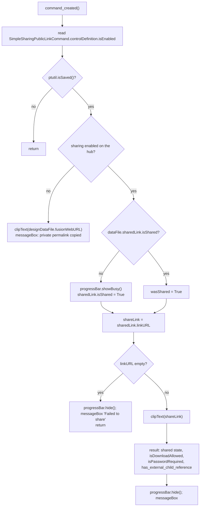

# Get a Share Link — Architecture

[← Get a Share Link guide](../Get%20a%20Share%20Link.md)

| | |
|---|---|
| **Command ID** | `PTSHD_sharedocument` |
| **Registry** | group `share` (`Share Document`); enabled by default |
| **UI location** | the `shareDropMenu` ("Share Menu") flyout on the right Quick Access Toolbar (`QATRight`); this control is appended (`addCommand(cmd_def, "", False)`) |
| **Files** | `commands/shareDocument/entry.py`; `resources/` (16/32 light and dark, 64 light PNGs) — also the flyout's icon when this command creates it |
| **Shared helpers** | [`ptutil.add_handler`](architecture.md#event_utils); [`ptutil.isSaved`, `clipText`, `log`, `handle_error`](architecture.md#general_utils); [`ptutil.remove_from_qat_right_flyout`](architecture.md#ui_utils); [`config`](architecture.md#config) (workspace/panel constants are imported but unused) |
| **Tests** | none beyond `tests/test_command_contract.py` |

## Purpose

Turns sharing on for the active document if it is off, copies the public share link to the clipboard and tells the user what the link allows (download, password, external references). When the hub administrator has disabled sharing it copies the document's private Fusion Team permalink instead. The constraint: the share state lives on `DataFile.sharedLink`, so the document must be saved.

## How it is wired

- `start()`: `addButtonDefinition`; `commandCreated` → `command_created`; then the flyout: `ui.toolbars.itemById("QATRight")`; if `controls.itemById("shareDropMenu")` is `None`, `controls.addDropDown("Share Menu", ICON_FOLDER, "shareDropMenu", "FeaturePacksCommand", True)` — before Fusion's built-in `FeaturePacksCommand` control, with this command's icon folder; otherwise the existing flyout. Then `dropDown.controls.addCommand(cmd_def, "", False)` (appended). All six `share` commands run this same find-or-create block, so whichever starts first (registry order puts this one first) creates the flyout.
- `stop()`: [`ptutil.remove_from_qat_right_flyout(CMD_ID, "shareDropMenu")`](architecture.md#ui_utils) removes the control and deletes the flyout only when its last child is gone; then the definition.
- `command_created(args)`: wires `destroy` → `command_destroy`, then runs the whole command inline. No inputs and no `execute` handler: the Share Menu is live with no document open, where Fusion never raises `execute` (issue #16; [pattern](architecture.md#acting-from-commandcreated-when-there-are-no-inputs)).
- The body (formerly `command_execute`), in order:
  1. `isShareAllowed = ui.commandDefinitions.itemById("SimpleSharingPublicLinkCommand").controlDefinition.isEnabled` (the hub's sharing policy).
  2. [`ptutil.isSaved()`](architecture.md#general_utils) false → return (it shows the "Please Save" prompt).
  3. `not isShareAllowed` → `clipText(app.activeDocument.designDataFile.fusionWebURL)`, message "Sharing is not allowed … A private perma-link was copied", return.
  4. `shareState = app.activeDocument.dataFile.sharedLink`; `wasShared = shareState.isShared`. Not shared → `ui.progressBar.showBusy("Generating Share Link")`, `shareState.isShared = True`.
  5. `shareLink = shareState.linkURL`; empty → log, `progressBar.hide()`, message "Failed to share the document.", `return` (issue #9 replaced an `exit(0)` here).
  6. `clipText(shareLink)`; builds an HTML result: already shared / now shared, the link, then `shareState.isDownloadAllowed` and `shareState.isPasswordRequired` notes; when `app.activeProduct.productType == "DesignProductType"` and `has_external_child_reference(rootComponent)` (recursive over `occurrences`, true on any `isReferencedComponent`), a note whose wording depends on whether download is allowed. `progressBar.hide()`, `ui.messageBox(resultString, "Share Document", 0, 2)`.
  7. Any exception → `ptutil.handle_error(CMD_NAME)`.
- `command_destroy(args)`: resets `local_handlers`.

## Data and state

None. Clipboard writes go through `ptutil.clipText` (`clip.exe` on Windows, `pbcopy` otherwise).

## Diagram

The branches in `command_created`; every other share command is linear.

## Key API surface

| API element | Purpose |
|---|---|
| `ui.commandDefinitions.itemById("SimpleSharingPublicLinkCommand").controlDefinition.isEnabled` | Whether the hub allows public sharing |
| `app.activeDocument.dataFile.sharedLink` | `SharedLink`: `isShared` (read and set), `linkURL`, `isDownloadAllowed`, `isPasswordRequired` |
| `app.activeDocument.designDataFile.fusionWebURL` | Private permalink copied when sharing is disabled |
| `app.activeProduct.rootComponent` / `Occurrence.isReferencedComponent` | External-reference detection in `has_external_child_reference` |
| `ui.progressBar.showBusy` / `hide` | Busy indicator while the link is generated |

## Tests

- `tests/test_command_contract.py` — registry/doc/description contract; `PTSHD_sharedocument` is checked against the ID shape.

Not covered: `entry.py` is Fusion-bound and is not exercised by the suite; nothing here is verified in Fusion on this branch except by the AST guards in `tests/test_command_contract.py` and `tests/test_command_abort.py`, which import it under the `adsk` stub. The icon set is not pinned in `tests/test_command_icons.py`.

---

*Copyright © 2026 IMA LLC. All rights reserved.*
