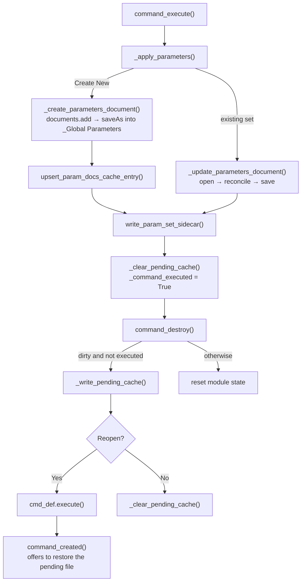

# Global Parameters — Architecture

[← Global Parameters guide](../Global%20Parameters.md)

| | |
|---|---|
| **Command ID** | `PTAT_globalParameters` |
| **Registry** | group `assembly` (`Assembly`); enabled by default. Lead of the `COMMAND_SETS` entry that also gates Link Global Parameters and Refresh Global Parameters Cache — the three share one Preferences checkbox ([settings_store](architecture.md#settings_store)) |
| **UI location** | Shared **Power Tools** panel (`config.my_panel_id`, Tools tab of the Design workspace), obtained from [`_ui_bootstrap.get_power_tools_panel`](architecture.md#_ui_bootstrap); appended with no anchor, `isPromoted = False` |
| **Files** | `commands/globalParameters/entry.py`; `resources/` (button icons) |
| **Shared helpers** | [`cache_utils`](architecture.md#cache_utils): `get_active_project`, `list_param_docs`, `find_global_params_folder`, `write_global_params_folder_cache`, `upsert_param_docs_cache_entry`, `write_param_set_sidecar`, `safe_activate`, `CACHE_FOLDER`, `GLOBAL_PARAMS_FOLDER_NAME`; [`ptutil.add_handler`](architecture.md#event_utils); [`ptutil.log`, `handle_error`, `perf_timer`](architecture.md#general_utils); `config.DEBUG` ([config](architecture.md#config)) |
| **Tests** | `tests/test_settings_command_sets.py` |

## Purpose

Creates and edits a project-wide parameter set: a dedicated Fusion design document, saved in the `_Global Parameters` folder at the project root, whose user parameters carry the values. Link Global Parameters later derives that document into consuming designs. The shaping constraint is that every read or write of a parameter set means opening a second Fusion document from the Hub while the dialog is up, so the command keeps its own state in module globals, restores the active document after each open, and persists an unsaved table to disk so a cancelled session is not lost.

## How it is wired

- `start()`: deletes any stale `PTAT_globalParameters` definition, calls `addButtonDefinition` with the `resources/` icon folder, attaches `command_created` to `commandCreated`, and adds the control to the Power Tools panel. `stop()` removes the control from that panel and deletes the definition.
- `command_created(args)`:
  1. [`cache_utils.get_active_project`](architecture.md#cache_utils). With no project it adds a single read-only text box (`gp_error`), attaches only `command_destroy`, and returns; the dialog then shows the message and OK does nothing.
  2. Resets the module state, then calls `cache.list_param_docs(project, CMD_NAME)`. This always enumerates the `_Global Parameters` folder on the Hub (the folder itself is resolved through the `gp_folder` cache first) and rewrites `gp_docs_<key>.json`.
  3. Builds the inputs: `gp_project_name` (read-only), the `gp_mode` dropdown (`Create New` plus one entry per parameter document), `gp_param_set_name` (defaults to the active document's name), the five-column table `gp_param_table` (`1:3:2:2:4`: checkbox, Name, Value, Unit, Comment) with `gp_add_row_btn` / `gp_del_row_btn` as table toolbar buttons, a frozen header row and one blank data row.
  4. If `<safe-doc-id>_pending.json` exists it asks (Yes/No message box) whether to restore it. Yes selects and **disables** the cached mode, seeds the name field (read-only unless the mode was `Create New`), replaces the blank row with the cached rows and marks the table dirty. The pending file is deleted either way.
  5. Adds the `gp_status` text box and attaches `command_execute`, `command_input_changed`, `command_validate_input` and `command_destroy`.
- `command_input_changed(args)`:
  - `gp_mode`: clears the data rows. `Create New` re-enables the name field and adds a blank row; an existing set makes the name read-only and calls `_load_parameters_from_doc`, which opens the parameter document with `app.documents.open(data_file, False)`, copies its user parameters into rows (numeric part of `expression`, unit if it is one of `UNIT_OPTIONS`, comment with the `PT-globparm` tag stripped), closes it with `close(False)` and re-activates the original via [`cache_utils.safe_activate`](architecture.md#cache_utils). After the first change the dropdown is disabled for the rest of the session.
  - `gp_add_row_btn` appends a blank row; `gp_del_row_btn` deletes every checked row (adding a blank one if none remain); a `gp_chk_*` change updates the Delete button's enabled state; any `gp_name_* / gp_val_* / gp_cmnt_* / gp_unit_*` edit marks the table dirty. Dirty state is mirrored into `gp_status` by `_update_status`.
- `command_validate_input(args)`: `_validate_and_reason` requires a parameter-set name, then per non-blank row checks the name against `_PARAM_NAME_RE` (`^[A-Za-z][A-Za-z0-9_"$°µ]*$`) and the case-sensitive `_RESERVED_UNITS` set, rejects duplicates and non-numeric values. The reason is written to `gp_status` as `Cannot save: …` and `args.areInputsValid` is set accordingly.
- `command_execute(args)`: `_apply_parameters` collects the rows and branches on the mode:
  - **Create New** → `_create_parameters_document`: resolves or creates the `_Global Parameters` folder (`cache.find_global_params_folder`, else `rootFolder.dataFolders.add`), writes the folder cache, creates a new design with `app.documents.add`, sets `ParametricDesignType`, adds each user parameter with `isFavorite = True`, calls `saveAs(name, folder, "Global Parameters — PowerTools", "")`, writes the `gp_params_<safe-doc-id>.json` sidecar and re-activates the original document. Back in `_apply_parameters` the new `{name, id}` is upserted into `gp_docs_<key>.json` and the in-memory map, then the new document is closed.
  - **Existing set** → `_update_parameters_document`: opens the document, deletes user parameters whose names are no longer in the table (`deleteMe`; a refusal is logged and the parameter left in place), upserts the rest in place through `_upsert_user_param` so parameter identity survives for downstream derives, saves, writes the sidecar, closes and re-activates.
  - On success `_command_executed` is set and the pending file deleted. Failures go to [`ptutil.handle_error`](architecture.md#general_utils) with a message box.
- `command_destroy(args)`: if the table is dirty and execute did not succeed, it snapshots mode, name and rows to `<safe-doc-id>_pending.json` (`_write_pending_cache`) and asks whether to reopen the dialog. Yes calls `ui.commandDefinitions.itemById(CMD_ID).execute()` as the last statement of the handler, starting a fresh invocation that finds the pending file in step 4 above; No deletes the pending file. All module state and `local_handlers` are reset.
- `_write_params_to_active` (writes rows straight into the active document's user parameters) is defined but has no caller.

## Data and state

- Module globals, reset in `command_created` and `command_destroy`: `_param_doc_map` (name → `DataFile`), `_param_doc_names`, `_active_doc_ref`, `_active_project_ref`, `_row_counter` (monotonic, so rebuilt rows never reuse an input id), `_table_dirty`, `_command_executed`, `local_handlers`.
- Files under `cache/` (`cache_utils.CACHE_FOLDER`):
  - `gp_folder_<project-key>.json` — `_Global Parameters` folder id; written on every resolve.
  - `gp_docs_<project-key>.json` — `[{name, id}]`; rewritten by `list_param_docs` on every dialog open and upserted after Create New.
  - `gp_params_<safe-doc-id>.json` — sidecar with the saved rows; read by Link Global Parameters to preview without opening the document.
  - `<safe-active-doc-id>_pending.json` — unsaved dialog state; only written for a saved active document (`doc.dataFile` present).
- Settings keys: none. `config.DEBUG` gates the per-input log line; `config.PERF_TRACE` gates the `perf_timer` blocks around every Hub call.
- Custom events, temp files: none.

## Parameter document model

One Fusion design document per parameter set. Every parameter the command writes gets `isFavorite = True` and a comment prefixed with `PT-globparm` (the user's comment follows the tag); both are what Link Global Parameters relies on — `isIncludeFavoriteParameters` selects the favorites, and the tag is stripped again for display. Units offered in the dialog are `in, ft, mm, cm, m`; a document parameter in any other unit is shown as `mm` when loaded.

## Reconcile rules (existing set)

| Name | Action |
|---|---|
| In dialog and in document | Update `expression`, `comment`, `isFavorite` in place |
| In dialog only | `userParameters.add` |
| In document only | `deleteMe`; if Fusion refuses (still referenced) the parameter stays and the refusal is logged |

## Diagram

The execute and destroy paths, including the reopen loop that a cancelled-but-dirty dialog takes.

## Tests

- `tests/test_settings_command_sets.py` — pins `globalParameters` as the lead of the set with `linkGlobalParameters` and `refreshGlobalParametersCache`; members start and stop on the lead's enabled flag and still honour the group gate.

`entry.py` is Fusion-bound and is not exercised by the suite; nothing here is verified in Fusion on this branch except by the AST guards in `tests/test_command_contract.py` and `tests/test_command_abort.py`, which import it under the `adsk` stub. The name validator, the reconcile rules and the pending-cache round trip have no unit tests. The icon set is not pinned in `tests/test_command_icons.py`.

## Learnings

- **Enumerate the Hub folder on every dialog open; use the docs cache only as a fast path for other readers.** Building the dropdown from `gp_docs_<key>.json` alone left deleted or renamed parameter documents in the list indefinitely, because nothing else ever invalidated the file. `command_created` now calls `list_param_docs`, which scans the folder and rewrites the cache; only the folder id is trusted from disk.

---

*Copyright © 2026 IMA LLC. All rights reserved.*
