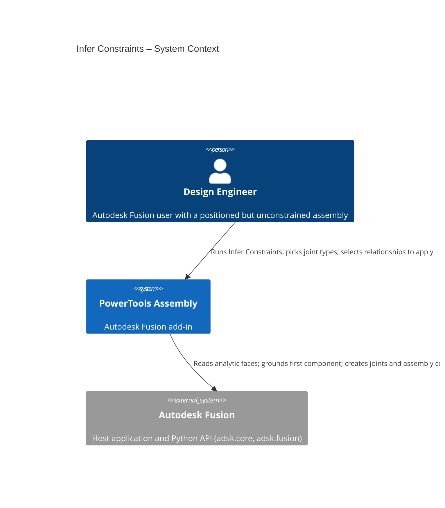
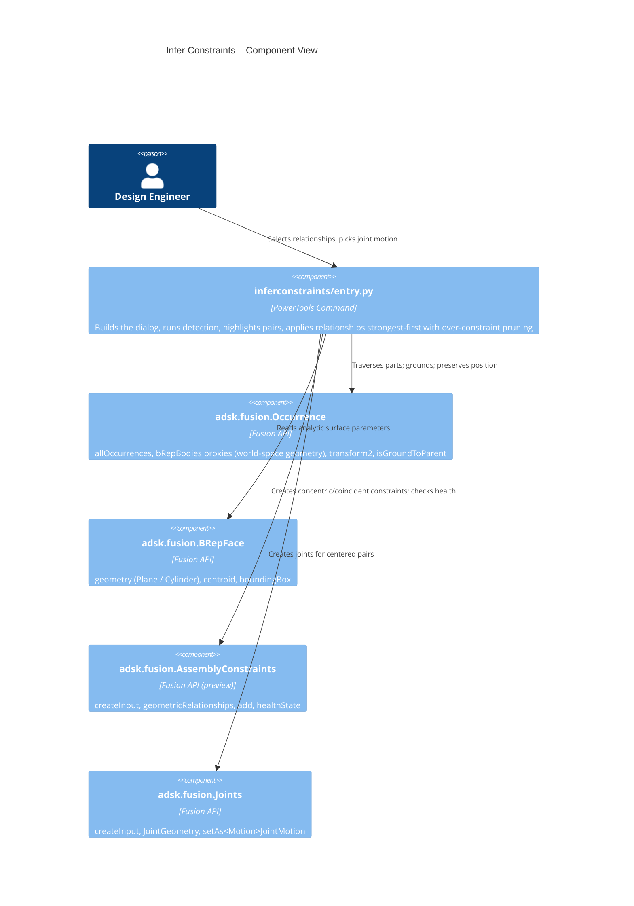

# Infer Constraints — Architecture
[← Infer Constraints guide](../Infer%20Constraints.md)

## How it works

When the command opens, it traverses every leaf occurrence (and any root-level solid bodies) and collects analytic faces using occurrence **body proxies**, whose geometry is reported in the root component's (world) coordinate system. Each planar and cylindrical face is recorded with its world-space parameters.

Detection runs in two phases:

- **Broad phase** — faces are grouped by type (planar/cylindrical, since cross-type pairs never mate) and each group is sorted by bounding-box min-x and swept: the inner loop stops once a later face starts beyond the current face's x-extent plus the linear tolerance. Surviving pairs are confirmed with a full three-axis bounding-box overlap test (using bounds cached as plain floats on each face record to avoid per-pair API reads) so only nearby faces are tested in detail. This keeps the candidate set identical to an exhaustive all-pairs scan while bringing the practical cost well below O(n²). The collected faces are cached for the life of the dialog, so changing a tolerance and re-scanning re-runs only the inference, not the geometry collection.
- **Narrow phase** — the analytic surface parameters are compared:
  - *Concentric:* both cylinder axes are parallel (within the angular tolerance) and collinear (axis-to-axis distance within the linear tolerance). Differing radii are allowed and reported as shaft-in-hole. Applied as a **coincident assembly constraint** between the cylindrical faces.
  - *Coincident:* both plane normals are parallel and the signed gap along the normal is within the linear tolerance. Applied as a **coincident assembly constraint** (which leaves the in-plane sliding free).
  - *Centered (Joint):* a coincident pair whose face centroids also coincide is applied as a **Joint** with both inputs on the face centers, using the motion type chosen in the row's dropdown (Rigid by default). For a planar-face joint the motion axis is the face normal.

Each candidate gets a confidence score from its angular and positional residuals, and only the strongest candidate is kept per pair of parts and relationship type.

**Applying without moving parts.** Before anything is created, the command captures the current pose (the API equivalent of *Capture Position*). The first selected relationship grounds the first browser component to its parent (`Occurrence.isGroundToParent`), fixing a reference for everything that follows. The "first browser component" is taken from the timeline (parametric designs) because `root.occurrences` is not in browser order. For each relationship the command tries the small set of offset/flip (and joint isFlipped) options, measures how far the affected components move — translation **and** rotation — and keeps the option that preserves position. On typical positioned assemblies this is zero movement.

**Avoiding over-constraint.** Relationships are always applied **strongest-first** (rigid joints, then concentric, then coincident). After each one is applied, Fusion's own solver can be asked whether it is healthy; a relationship that adds no independent constraint is marked over-constrained ("sick"). What happens next depends on the **Redundant constraints** dropdown:

- **Keep all** — health state is never read; every selected relationship is applied and kept, so the result may be over-constrained.
- **Smart** (default) — the command tracks the relationships already kept on each **part-pair** and drops a sick relationship only when it is a *true DOF overlap*: it has the **same family** (concentric/coincident) **and a parallel principal direction** (axis for concentric, normal for coincident) as one already applied to that pair — for example a second coincident plane parallel to the first, or a second collinear concentric. A sick relationship is **kept** when it is between a **new** pair (an *inter-pair loop closure* — its parts are already indirectly connected through a chain, so it closes a kinematic loop such as the fourth link of a four-bar), a **different family** (concentric + a perpendicular coincident = a revolute), or a **different direction** (two coincident faces with different normals = a slider). This matters because Fusion can flag a genuinely independent constraint over-constrained; the geometric guard means the sick flag alone is never enough to drop a relationship. This is the middle ground between the two extremes.
- **Aggressive** — every sick relationship is dropped. Using the solver as the rank oracle this way keeps the largest non-redundant set — a spanning structure plus the independent extra relationships that further locate parts — which mirrors the spanning-tree / degree-of-freedom approach from the underlying research, but it can also remove legitimate loop closures.

In every mode that prunes, order matters: applying the strongest relationships first keeps them healthy and lets the redundant weaker ones drop, rather than the reverse. Pruning is always **incremental** (checked and dropped one relationship at a time); the command never batches a deferred `computeAll()` health sweep, which previously let over-constrained relationships pile up and crash the solver.

> **Parametric vs. direct designs:** the over-constraint check reads each relationship's health state, which Fusion only reports in **parametric** designs. In a **direct** design there is no timeline, so relationships report an *Unknown* health state and the redundancy check cannot prune them — everything selected is applied. Grounding and position preservation work in both.

The Assembly Constraints creation API is a Fusion preview capability. To keep the dependency contained, all relationship creation lives in `_apply_candidate` (and its joint/constraint helpers) in `commands/inferconstraints/entry.py`; detection and the preview UI do not depend on it.

## Architecture

The following diagrams show how the Infer Constraints command interacts with Autodesk Fusion.





### User flow

```mermaid
sequenceDiagram
  autonumber
  actor User
  participant Panel as Utilities › Power Tools
  participant Cmd as Infer Constraints
  participant API as Fusion API

  User->>Panel: Click "Infer Constraints"
  Panel->>Cmd: command_created fires
  Cmd->>API: Traverse parts, read analytic faces
  Cmd->>Cmd: Broad phase + narrow phase + scoring + Ground row
  Cmd-->>User: Show preview table (ranked candidates)
  opt Inspect / adjust
    User->>Cmd: Click a Components button
    Cmd->>API: Highlight that pair in the graphics
    User->>Cmd: Change tolerance / Re-scan, pick joint types
    Cmd->>API: Re-run detection
    Cmd-->>User: Refresh table
  end
  User->>Cmd: Check rows, click OK
  Cmd->>API: Capture position; ground first component
  loop Each selected relationship (strongest first)
    Cmd->>API: Create joint or assembly constraint (position-preserving)
    API-->>Cmd: healthState
    Cmd->>API: Delete it if over-constrained (Smart: same-pair DOF overlap; Aggressive: any)
  end
  Cmd-->>User: Report created / skipped-redundant / moved
```
