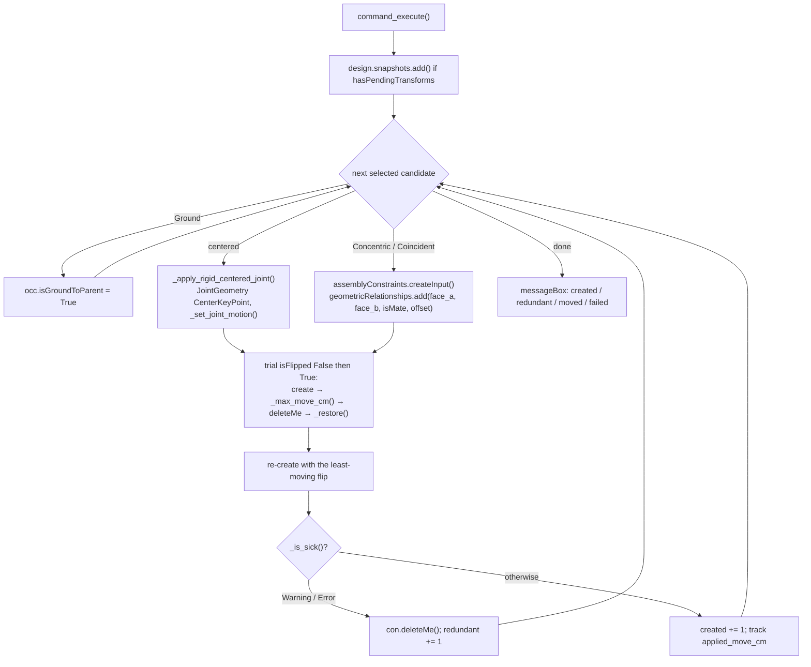

# Infer Constraints — Architecture

[← Infer Constraints guide](../Infer%20Constraints.md)

| | |
|---|---|
| **Command ID** | `PTAT_inferConstraints` |
| **Registry** | group `assembly` (`Assembly`); **beta** — starts only when `general.beta_mode` is on ([command_registry](architecture.md#command_registry), [commands/__init__](architecture.md#commands__init__)) |
| **UI location** | Shared **Power Tools** panel ([`_ui_bootstrap.get_power_tools_panel`](architecture.md#_ui_bootstrap)), appended with no anchor, `isPromoted = False` |
| **Files** | `commands/inferconstraints/entry.py`; `resources/` (button icons) and `resources/joints/<JointRigid…JointBall>/` (dropdown icons) |
| **Shared helpers** | [`ptutil.add_handler`](architecture.md#event_utils); [`ptutil.log`, `handle_error`, `require_document`](architecture.md#general_utils) |
| **Tests** | none |

## Purpose

Scans an assembly whose components already sit in their final pose but carry no relationships — typically a STEP import — and proposes concentric (coaxial cylinders) and coincident (flush planes) relationships from the geometry that is already mating, with a confidence score per pair. On OK it grounds the first browser component and applies the selected rows without moving anything, dropping any relationship Fusion's own solver reports as over-constrained. The shaping constraint is that assembly-constraint creation is a Fusion **preview** API, so all of it is confined to `_apply_candidate` and its helpers; detection and the preview table use only released API.

## How it is wired

- `start()`: `addButtonDefinition` with the `resources/` icon folder, attaches `command_created`, adds the control to the Power Tools panel. `stop()` removes the control and deletes the definition.
- `command_created(args)`: [`ptutil.require_document(CMD_NAME, "design")`](architecture.md#document-preconditions); with no design it shows "Infer Constraints needs a design open. Open or create a design, then retry." and returns before attaching handlers or building inputs (Fusion ends the input-less command; no [abort helper](architecture.md#_command_abort) is used). Otherwise it attaches `command_execute`, `command_input_changed`, `command_destroy` and builds:
  - `ic_lin_tol` (mm, default `DEFAULT_LIN_TOL_CM` = 0.01 cm) and `ic_ang_tol` (deg, default 0.5°) value inputs;
  - `ic_rescan`, a momentary bool button;
  - `ic_preview_sel`, a `SelectionCommandInput` filtered to `Occurrences` with limits `(0, 0)`. It is never read; it exists because `SelectionCommandInput.addSelection` highlights entities in the viewport while a dialog is open and `ui.activeSelections` does not;
  - `ic_table`, four columns `2:3:7:2` (Apply, Type, Components, Conf.), `hasGrid = False` because joint rows are taller than constraint rows, with a read-only header row;
  - `ic_summary`, a four-line text box.
  It then runs the first `_rescan(design, inputs)` inside a `try`; a failure is written into the summary.
- `_rescan(design, inputs)`: reads the tolerances, shows a busy indicator with `_begin_scan_progress` (`ui.progressBar.showBusy` followed by exactly **one** `adsk.doEvents()` so the bar paints before the blocking scan), collects faces through `_collect_faces_cached`, and if the face count is at least `FACE_CONFIRM_COUNT` (4000) and the user has not yet confirmed this session, hides the bar and asks with a Yes/No message box (No clears the table and writes a "Scan skipped" summary). It then calls `_infer`, hides the bar in a `finally`, rebuilds the rows with `_add_candidate_row` and writes the diagnostic summary (occurrences, root bodies, face counts, pairs tested, matches).
- `_add_candidate_row(inputs, table, cand)`: per row a checkbox `ic_chk_<n>` (checked when `default_checked`), a Type cell — a `LabeledIconDropDownStyle` dropdown `ic_jt_<n>` over `JOINT_TYPES` for centered rows, otherwise read-only text — a momentary `ic_comp_<n>` button labelled with the pair, and a read-only confidence cell. The candidate dict remembers its input ids and table row.
- `command_input_changed(args)`: a `ic_table` change highlights the selected row's pair (`_highlight_selected_row`); a change on any row's checkbox, joint dropdown or Components button resets the button and highlights that candidate (`_highlight_candidate` → `clearSelection` + `addSelection` of the occurrences from `face.assemblyContext`); a change to either tolerance or `ic_rescan` re-runs `_rescan`. Errors go to [`ptutil.handle_error`](architecture.md#general_utils) with a message box.
- `command_execute(args)`: re-acquires the design with `ptutil.require_document(CMD_NAME, "design")`; collects the checked candidates, reading the chosen motion off the joint dropdown for centered rows; with none selected it reports and returns. It then captures position (`design.snapshots.add()` when `hasPendingTransforms`) and, in table order, calls `_apply_candidate`; a returned constraint that `_is_sick` reports as Warning/Error health is deleted and counted as redundant. The closing message box reports created, redundant, moved (movement above `POS_TOL_CM` = 0.001 cm) and failed counts.
- `command_destroy(args)`: clears `local_handlers`, `_candidates`, `_large_scan_confirmed`, `_faces_cache`, `_stats_cache`.

## Data and state

- Module globals, reset in `command_destroy`: `_candidates` (list of candidate dicts), `_row_counter`, `_large_scan_confirmed`, `_faces_cache` / `_stats_cache` (faces collected once per dialog; a rescan re-runs only the inference), `local_handlers`.
- No files, settings keys, custom events or temp files.

## Detection

**Face collection** (`_collect_faces`). Leaf occurrences that are visible (`childOccurrences.count == 0`, `isVisible`) contribute the faces of their `bRepBodies` proxies, whose geometry is reported in the root component's coordinate system, so no transform math is needed; solid bodies directly in the root are added under the key `root::body::<i>` so two root bodies can pair but one body cannot pair with itself. Each planar or cylindrical face becomes a `_FaceRec` with origin, unit direction (normal or axis), radius, area and its bounding box cached as six plain floats.

**Broad phase** (`_infer`). Faces are grouped by type (a plane never mates a cylinder), each group sorted by `min_x` and swept: the inner loop breaks once a later face starts beyond the current face's `max_x + lin_tol`, faces on the same `src` are skipped, and `_bbox_near` (three-axis overlap on the cached scalars) gates every surviving pair. The candidate set is identical to an all-pairs scan; the practical cost is far below O(n²).

**Narrow phase.**
- `_test_concentric`: axes parallel within the angular tolerance (`|a × b| ≤ sin(ang_tol)`) and collinear within the linear tolerance (perpendicular axis-to-axis distance). Differing radii are allowed and labelled `shaft-in-hole`.
- `_test_coincident`: normals parallel and the signed gap along A's normal within the linear tolerance. If the two face centroids also lie within the tolerance the pair is marked **centered**. `is_flipped` records whether the normals oppose; `offset_cm` records the gap.
- Confidence is `0.5 · angular score + 0.5 · positional score`, each `1 − residual/tolerance`, clamped to `[0, 1]`. Rows at or above `AUTO_CHECK_CONF` (0.6) are pre-checked.

**Ranking.** Only the best candidate per `(sorted part pair, type)` survives. Candidates are sorted by `_candidate_strength` (centered = 3, Concentric = 2, Coincident = 1) then confidence, descending, and a `Ground` row from `_ground_candidate` is inserted at the top. `_first_browser_occurrence` takes the first top-level occurrence in **timeline** order for a parametric design, because `root.occurrences` is not in browser order, and falls back to `root.occurrences.item(0)` in a direct design.

## Applying without moving parts

`_apply_candidate(root, cand)`:

- **Ground** → `occ.isGroundToParent = True`; returns `None` (nothing to health-check).
- **Centered coincident** → `_apply_rigid_centered_joint`: `JointGeometry.createByPlanarFace(face, None, CenterKeyPoint)` for both faces, `joints.createInput`, `_set_joint_motion` for the dropdown choice (`Rigid` default; Revolute/Slider/Cylindrical/Planar about the face normal, Pin-Slot and Ball with the X axis as secondary), `joints.add`.
- **Everything else** → `root.assemblyConstraints.createInput()`, `geometricRelationships.add(face_a, face_b, isMate, ValueInput.createByReal(offset))`, `rel.isFlipped`, `assemblyConstraints.add`. The offset is the measured gap for Coincident and `0` for Concentric.

For joints and constraints alike the `isFlipped` value that preserves position is not derivable from the face normals, so both values are trialled: the affected occurrences' `transform2` matrices are saved, the relationship is created, `_max_move_cm` measures the worst displacement of four probe points (origin plus three at the part's bounding radius, so rotation counts as movement), the relationship is deleted and the transforms restored, and the trial stops early at the first value that moves nothing. The least-moving value is then applied for real and the residual stored in `cand["applied_move_cm"]`.

## Avoiding over-constraint

After each applied constraint `_is_sick` reads `healthState` and treats only `WarningFeatureHealthState` and `ErrorFeatureHealthState` as sick; a sick constraint adds no independent degree-of-freedom reduction (it closes a cycle already covered) and `command_execute` deletes it. Using the solver as the rank oracle keeps the maximal non-redundant set without computing a constraint Jacobian. Ordering matters: strongest-first keeps the joints healthy and lets the weaker redundant constraints drop rather than the reverse. Pruning is incremental — one relationship checked and dropped at a time.

> **Parametric vs. direct designs.** Health is only reported in parametric designs. In a direct design there is no timeline, every constraint reports `Unknown`, `_is_sick` returns `False`, and everything selected is applied. Grounding and position preservation work in both.

## Diagram

The apply loop in `command_execute`, with the three relationship kinds and the flip trial.

```mermaid
flowchart TD
  EX["command_execute()"] --> SNAP["design.snapshots.add() if hasPendingTransforms"]
  SNAP --> LOOP{"next selected candidate"}
  LOOP -->|Ground| G["occ.isGroundToParent = True"]
  LOOP -->|centered| J["_apply_rigid_centered_joint()<br/>JointGeometry CenterKeyPoint, _set_joint_motion()"]
  LOOP -->|"Concentric / Coincident"| C["assemblyConstraints.createInput()<br/>geometricRelationships.add(face_a, face_b, isMate, offset)"]
  J --> T["trial isFlipped False then True:<br/>create → _max_move_cm() → deleteMe → _restore()"]
  C --> T
  T --> K["re-create with the least-moving flip"]
  K --> H{"_is_sick()?"}
  H -->|"Warning / Error"| D["con.deleteMe(); redundant += 1"]
  H -->|otherwise| OK["created += 1; track applied_move_cm"]
  G --> LOOP
  D --> LOOP
  OK --> LOOP
  LOOP -->|done| MSG["messageBox: created / redundant / moved / failed"]
```

## Tests

None. `entry.py` is Fusion-bound and is not exercised by the suite; nothing here is verified in Fusion on this branch except by the AST guards in `tests/test_command_contract.py` and `tests/test_command_abort.py`, which import it under the `adsk` stub. The broad phase, the two narrow-phase tests and the scoring live in `entry.py` next to the API calls, so they have no `adsk`-free module and no unit tests (see [the pure-logic split](architecture.md#the-pure-logic-split)). The icon sets are not pinned in `tests/test_command_icons.py`. The `isMate` / `isFlipped` / offset semantics of the preview API are marked `VERIFY AT RUNTIME` in the source.

## Learnings

- **Prune incrementally; never batch a deferred `computeAll()` health sweep.** Letting several over-constrained relationships accumulate before checking health crashed the solver. Each relationship is now checked and, if sick, deleted before the next one is created.
- **One `adsk.doEvents()` to paint the busy bar, never one per iteration.** Per-iteration `doEvents` inside a command handler is the re-entrancy crash vector removed in `ce4e768`; `_begin_scan_progress` calls it exactly once, during a read-only phase, and the scan loop never does ([rule 2](../dev/lessons.md)).
- **`Unknown` health is not sickness.** A direct design has no timeline, so a perfectly valid constraint reports `Unknown` rather than `Healthy`; `_is_sick` keys off Warning and Error only, and never reads `errorOrWarningMessage`, which can itself raise.
- **The published preview-API docs were incomplete.** The call shape that works on a live build is `createInput()` with no arguments followed by `geometricRelationships.add(entityOne, entityTwo, isMate, offsetOrAngle)` and `rel.isFlipped`; it is recorded in the `_apply_candidate` docstring.

---

*Copyright © 2026 IMA LLC. All rights reserved.*
