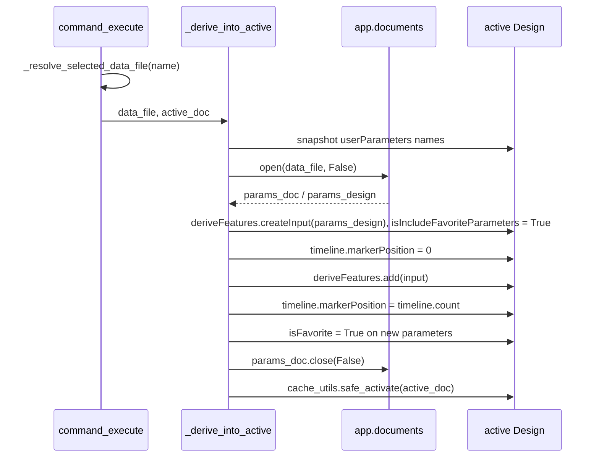

# Link Global Parameters — Architecture

[← Link Global Parameters guide](../Link%20Global%20Parameters.md)

| | |
|---|---|
| **Command ID** | `PTAT_linkGlobalParameters` |
| **Registry** | group `assembly` (`Assembly`); enabled by default. Member of the `globalParameters` `COMMAND_SETS` entry, so it starts on Global Parameters' enabled flag and has no checkbox of its own ([settings_store](architecture.md#settings_store)) |
| **UI location** | Shared **Power Tools** panel ([`_ui_bootstrap.get_power_tools_panel`](architecture.md#_ui_bootstrap)), inserted directly after `PTAT_globalParameters` (`addCommand(cmd_def, "PTAT_globalParameters", False)`), `isPromoted = False` |
| **Files** | `commands/linkGlobalParameters/entry.py`; `resources/` (button icons) |
| **Shared helpers** | [`cache_utils`](architecture.md#cache_utils): `get_active_project`, `list_param_docs`, `read_param_set_sidecar`, `safe_activate`; [`ptutil.add_handler`](architecture.md#event_utils); [`ptutil.log`, `handle_error`, `perf_timer`, `require_document`](architecture.md#general_utils) |
| **Tests** | `tests/test_settings_command_sets.py` |

## Purpose

Derives a parameter set created by Global Parameters into the active design as a Derive feature that carries only the set's favourite parameters, so the values are available in expressions and in the Favorites section of the Parameters dialog. The constraint that shapes it is that `DeriveFeatures.createInput` needs the source `Design`, which means the parameter document has to be opened from the Hub inside the running command and kept open until the feature is added; everything else in the dialog is arranged to avoid that open until OK is pressed.

## How it is wired

- `start()`: deletes any stale definition, `addButtonDefinition` with the `resources/` icon folder, attaches `command_created`, adds the control after `PTAT_globalParameters` on the Power Tools panel. `stop()` removes the control and deletes the definition.
- `command_created(args)`:
  1. If [`ptutil.require_document(CMD_NAME, saved=True)`](architecture.md#document-preconditions) is `None` (it shows "Link Global Parameters needs a saved document. Save the document, then retry.", or the no-document message) it sets `args.isCancelled = True` and returns — the command never opens.
  2. [`cache_utils.get_active_project`](architecture.md#cache_utils); with none it adds the `lgp_error` text box, attaches only `command_destroy` and returns.
  3. Calls `cache.list_param_docs(project, CMD_NAME)` — a Hub enumeration of the `_Global Parameters` folder on every open (folder id from the `gp_folder` cache when valid); the result populates `_param_doc_map` and `_param_doc_entries` and rewrites `gp_docs_<key>.json`. An empty result adds an `lgp_error` text box pointing at Global Parameters and returns with only `command_destroy` attached.
  4. Builds `lgp_project_name` (read-only), the `lgp_source` dropdown (first entry selected) and the read-only four-column preview table `lgp_preview_table` (`3:4:2:4`: Name, Expression, Unit, Comment), then pre-loads the preview for the first entry with `_load_preview`.
  5. Attaches `command_execute`, `command_input_changed`, `command_validate_input`, `command_destroy`.
- `_load_preview(data_file, inputs, table)`: clears the data rows, then
  - **fast path** — [`cache_utils.read_param_set_sidecar`](architecture.md#cache_utils) returns the rows Global Parameters wrote at save time (`gp_params_<safe-doc-id>.json`), and the table is filled without touching the Hub;
  - **fallback** (no sidecar, e.g. a set made outside the add-in) — `app.documents.open(data_file, False)`, read `userParameters`, `close(False)`. The original document is not re-activated on this path. Any exception becomes a red `lgp_warn_<row>` text box inside the table.
  - `_populate_preview_table` strips the `PT-globparm` tag from comments and uses `_row_counter` for unique input ids.
- `command_input_changed(args)`: on `lgp_source` it resolves the selected name with `_resolve_selected_data_file` — the in-memory map first, otherwise `_refresh_param_doc_map` re-runs `list_param_docs` and retries — and calls `_load_preview`.
- `command_validate_input(args)`: valid when the dropdown has a selected item.
- `command_execute(args)`: resolves the selected `DataFile` the same way and calls `_derive_into_active(data_file, _active_doc_ref or app.activeDocument)`:
  1. Snapshots the active design's existing user-parameter names.
  2. `app.documents.open(data_file, False)` and casts its `DesignProductType` product.
  3. `active_design.rootComponent.features.deriveFeatures.createInput(params_design)` with `isIncludeFavoriteParameters = True`; nothing is added to `sourceEntities` or `excludedEntities`.
  4. Moves `timeline.markerPosition` to `0`, calls `deriveFeatures.add`, then sets the marker to `timeline.count` — the derive is always the first timeline entry.
  5. Marks every user parameter that did not exist before the derive `isFavorite = True` (derived parameters do not inherit the flag, and chained derives and the Favorites panel need it).
  6. `finally`: `close(False)` on the parameter document and [`cache_utils.safe_activate`](architecture.md#cache_utils) on the original.
  Exceptions go to [`ptutil.handle_error`](architecture.md#general_utils) with a message box.
- `command_destroy(args)`: clears `local_handlers` and all module state.

## Data and state

- Module globals: `_param_doc_map` (name → `DataFile`), `_param_doc_entries` (`[{name, id}]` mirroring the dropdown), `_active_doc_ref`, `_active_project_ref`, `_row_counter`, `local_handlers`.
- Files read under `cache/`: `gp_folder_<project-key>.json` (through `list_param_docs`), `gp_params_<safe-doc-id>.json` (preview). Written: `gp_docs_<project-key>.json` (through `list_param_docs`). The command never reads `gp_docs` itself.
- Settings keys, custom events, temp files: none. `config.PERF_TRACE` gates the `perf_timer` blocks around each open/derive.

## Diagram

The OK path: which document is open at each step, and where the original is restored.

## Tests

- `tests/test_settings_command_sets.py` — `linkGlobalParameters` is a member of the `globalParameters` set: it is registered in the same group, follows the lead's enabled flag over its own stale flag, and `commands._should_start` gates it on the lead.

`entry.py` is Fusion-bound and is not exercised by the suite; nothing here is verified in Fusion on this branch except by the AST guards in `tests/test_command_contract.py` and `tests/test_command_abort.py`, which import it under the `adsk` stub. The sidecar preview, the derive sequence and the favourite marking have no unit tests. The icon set is not pinned in `tests/test_command_icons.py` (`tests/test_release_build.py` only references the folder's `fusion_icon_resources` files as release-zip exclusions).

## Learnings

- **Read the preview from the sidecar, not by opening the document.** `app.documents.open` switches the active document and is unreliable while a command dialog is up; Global Parameters therefore writes `gp_params_<safe-doc-id>.json` on every save so this command can show the rows without an open. The open remains only as the fallback for sets created outside the add-in.
- **Derive API rules established by debugging** (recorded in the `_derive_into_active` docstring): `createInput` takes a `Design`, not a `DataFile`; `deriveFeatures` lives on `rootComponent.features`; `isIncludeFavoriteParameters = True` alone limits the derive to parameters; the source document must stay open until the feature has been added.

---

*Copyright © 2026 IMA LLC. All rights reserved.*
