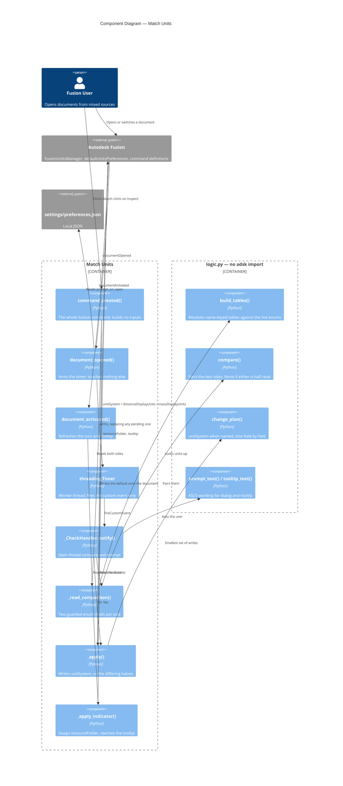

# Match Units — Architecture

[← Match Units guide](../Match%20Units.md)

| | |
|---|---|
| **Command ID** | `PTND_matchunits` |
| **Registry group** | `document` (enabled by default) |
| **Location** | Every Inspect panel of every design-product workspace |
| **Modules** | `commands/matchunits/entry.py`, `commands/matchunits/logic.py`, `commands/matchunits/mfg.py` |
| **Shared** | `commands/_inspect_panels.py` (with Measure Path), `config.resolve_manufacture_workspace_id()` |
| **Settings** | `command_settings.matchunits.prompt_on_open`, `.prompt_on_manufacture` (both default `False`) |
| **Tests** | `tests/test_matchunits_logic.py`, `tests/test_matchunits_mfg_logic.py`, `tests/test_config_workspaces.py`, `tests/test_command_icons.py` |

Two independent comparisons live here. The **design** check (`logic.py`) reads
the document's design units against the application default and can change the
document. The **Manufacture** check (`mfg.py`) reads the Manufacture
workspace's active unit system against the document's design units and can
change Manufacture. They share only `UnitTables.distance` and the two label
helpers; see "Why the two comparisons do not share a type" below.

## Which API tells the truth about units

Two reads, both on enums:

| Side | Property |
|---|---|
| Document | `Design.fusionUnitsManager.distanceDisplayUnits` / `.massDisplayUnits` |
| Application default | `app.preferences.defaultUnitsPreferences.itemByName("Design").distanceDisplayUnits` / `.massDisplayUnits` |

`UnitsManager.defaultLengthUnits` — the string form used by `roundsketchdimensions` and `sketchcirclecenterpoint` — is **not** usable for a comparison. The API reference states it is reshaped by the user's abbreviation and symbol preferences, so inches come back as `inch`, `in` or `"`, and it points at `distanceDisplayUnits` as "a consistent way of determining the current length unit". There is no string equivalent for mass at all.

### The Manufacture side has no API at all

| Side | Read | Write |
|---|---|---|
| Design product | `fusionUnitsManager.distanceDisplayUnits` / `.massDisplayUnits` | both settable |
| Manufacture product | `unitsManager.defaultLengthUnits` (string, length only) | **nothing** |

`adsk.cam.CAM` does not override `Product.unitsManager`, so it returns the base
`core.UnitsManager`, whose only unit property is the read-only
`defaultLengthUnits`. There is no `CAMDefaultUnitsPreferences` and no
`CAMUnitsManager` — the only `UnitsManager` subclasses in the entire API are
`FusionUnitsManager` (Design) and `SimUnitsManager` (Simulation, read-helpers
only), and the sole unit setter anywhere in `adsk/cam` is an unrelated
multi-axis feedrate property. `app.preferences.defaultUnitsPreferences` has a
`Manufacture` page in the UI, but the collection hands back a bare
`DefaultUnitsPreferences`, which exposes only `.name`.

So both directions go through **text commands**, which act on the **active
asset** — which is why the check only runs while Manufacture is the active
workspace:

```python
app.executeTextCommand("UnitSystems.List")                   # read
app.executeTextCommand("UnitSystems.Activate MmMKS")         # write: metric
app.executeTextCommand("UnitSystems.Activate InchImperial")  # write: imperial
```

`UnitSystems.Activate` takes **no target argument**. That is the sharpest hazard
in this command: both the timer delay and the modal prompt give the user time to
switch back to Design, and firing it there would rewrite the *design* units
instead — the exact thing this command offers to do deliberately, happening by
accident. Hence `_apply_manufacture` re-checks the active workspace immediately
before the write and verifies afterwards that Manufacture moved **and** that the
design did not.

Writing the design side back has two shapes, and `logic.change_plan` picks
between them:

- `FusionUnitsManager.unitSystem = <UnitSystems value>` when the target pair is one of the five Fusion names (mm/g, cm/g, m/kg, in/oz, ft/lb). One assignment, and **Document Settings** shows the named system.
- `distanceDisplayUnits` and/or `massDisplayUnits`, for anything else. Each assignment is documented to flip `unitSystem` to `Custom`, which is correct when the default itself is a custom pair. Only the halves that differ are written.

`DistanceUnits`, `MassUnits` and `UnitSystems` all live in `adsk.fusion`, not `adsk.core`.

## Why the tables are keyed by enum name

`logic.py` imports no `adsk` module, so it cannot reference the enums directly, and hardcoding their integers would mislabel every unit if Autodesk ever renumbered one. Instead the tables are keyed by enum **member name** and resolved against the live classes once in `start()`:

```python
_tables = logic.build_tables(
    adsk.fusion.DistanceUnits, adsk.fusion.MassUnits, adsk.fusion.UnitSystems
)
```

A name this build does not carry is dropped and reported in `UnitTables.unknown_names`, which `start()` logs. The affected unit then shows as `unknown` / `an unrecognized unit` rather than as a plausible wrong one — this command's whole output is a claim about which units a document is in, and it is about to rewrite that document on the strength of it (c8c0382).

`tests/test_matchunits_logic.py` stands the enums in with plain classes, because the test harness fabricates `adsk` as a `MagicMock` whose attributes answer with mocks rather than integers. That also lets the tests remove a member and assert the table degrades instead of raising.

## Probed in Fusion

Everything about the Manufacture side is undocumented, so it was established by
hand in the Text Commands window on **`ADSKMVG91G2F5W`, 2026-09-12** (channel
not pinned — two instances were open, one of them production `4fcc3ec8`):

| Question | Answer |
|---|---|
| Is `UnitSystems.List` per product? | **Yes.** The CAM product declares two systems (`MmMKS`, `InchImperial`); the Design product declares six (`CmMKS`, `MmMKS`, `MMKS`, `InchImperial`, `Imperial`, `Custom`). |
| Does `UnitSystems.Activate` scope to the active product? | **Yes**, verified: with Manufacture active it moves Manufacture and leaves the design alone. |
| Does the Manufacture system stick to the document? | **Yes** — persisted across save, close and reload. It is a document setting, not an application preference. |

Two details from that output shape the parser:

- The active system is reported by **name**, not by id (`The active unit system
  is inch modeling length with imperial (...) units`), so the name has to be
  looked back up among the header lines to get the id that `Activate` takes.
- Those names are **not stable across products**: the same `MmMKS` is named
  `...second, celsius) units` under CAM but `...second, Celsius) units` under
  Design. So a name is only ever matched against header lines from the *same*
  output, never against a literal. `tests/test_matchunits_mfg_logic.py` keeps
  both captures verbatim as fixtures for exactly this reason.

The Design product's six systems are why `mfg.SYSTEM_FAMILY` is wider than
`mfg.MFG_SYSTEMS`: the latter is what Manufacture can be switched *to*, the
former what it might be found *on*. Reading a foot-based `Imperial` as
"unrecognized" would silently miss a real mismatch. `Custom` is deliberately
unclassifiable — an arbitrary pair of units has no family, and guessing one in
front of a document rewrite is the `c8c0382` mistake.

## Compare families, not units

Manufacture offers two systems; Design offers eleven length units. Comparing a
design *unit* against a Manufacture *system* gives a check that **can never be
satisfied**: a centimetre design wants `MmMKS`, sees `MmMKS`, still reads as
different, and prompts again on every workspace switch, forever — for 9 of the
11 design units. So both sides reduce to a family, metric or imperial, and
`MfgComparison.matches` compares families rather than ids.
`test_every_design_unit_reaches_a_satisfied_state` and
`test_activating_the_target_always_reaches_a_match` hold that line.

## Why the two comparisons do not share a type

`logic.UnitsState.is_known` requires **both** a length and a mass, and
`logic.compare` returns `None` unless both sides are complete. That is the
invariant stopping the design *write* path from acting on a half-read, and
`test_a_half_read_side_cannot_be_compared` exists to guarantee it. A
length-only Manufacture comparison pushed through those types would have to
fabricate a mass value, which `differences`, `change_plan` and `tooltip_text`
would then all report on.

The two checks also agree on nothing else: different trigger, different read
mechanism, different write mechanism, opposite direction, and a failure signal
that is a `-1` return rather than an exception. Shared surface is
`UnitTables.distance` plus `short_label` / `long_label` — three things, which
`mfg.py` imports. AGENTS.md #13 is satisfied by a second `adsk`-free module
just as well as by a bloated first one.

## Execution flow

### The button

```
Inspect panel click
  -> command_created
       -> _active_design()                    -- absent: message, return
       -> _read_comparison(design)            -- incomplete: message, return
       -> comparison.matches                  -- report, refresh icon, return
       -> _apply(design, comparison)
            -> logic.change_plan
            -> unitSystem  OR  distance/mass
            -> _refresh_indicator()           -- re-read, do not assume
       -> messageBox(logic.applied_text)
  -> Command.isAutoExecute terminates the command
```

This is the **only** path that raises a confirmation dialog, and the reason is
that it is the only one with nothing to confirm against: the button takes no
answer from the user, so without a dialog a click would appear to do nothing.
Both prompted paths — the open-time check and the Manufacture check — log the
outcome and stay quiet, because the user answered Yes a moment earlier and the
viewport already reads in the new unit. Failure still speaks up on every path,
since that is the outcome the user cannot see.

**All the work is in `command_created`, and no command inputs are built.** With no document open `execute` never fires at all, and nothing raises to say so (f18b911, 11cfc51). `Command.isAutoExecute` defaults true, so Fusion executes and terminates an input-less command by itself. `args.command.doExecute()` is never called here: that callback runs inside `CommandDefinition::createCommand`, so either argument re-enters the command manager on a half-built command and segfaults Fusion (14871d7).

Same launcher shape as `commands/closealldocuments`, and for the same reason there is **no `execute` or `destroy` handler** — and therefore no `_command_abort` flag. `abort_before_dialog` exists so that `consume_abort` in `execute` can skip a run that was abandoned; with no execute handler the flag would be set and never consumed, and `was_aborted` would see it forever. There is no per-invocation module state for it to protect: `_tables` is immutable configuration and `_indicator_folder` is a cache of what the UI already shows.

### The open-time watcher

```
app.documentOpened
  -> prompt_on_open off?  return
  -> threading.Timer(1.5s)                    -- worker thread
       -> app.fireCustomEvent(PTND_matchunits_check)   -- and nothing else
            -> _CheckHandler.notify           -- main thread, later turn
                 -> re-read prompt_on_open
                 -> app.activeDocument, check isValid
                 -> Design.cast(app.activeProduct)
                 -> _read_comparison -> _apply_indicator
                 -> matches? return
                 -> messageBox Yes/No
                 -> re-acquire design, _apply
```

Three constraints are encoded in that chain:

1. **Nothing modal or model-touching happens inside `documentOpened`.** A `messageBox` raised there blocks Fusion's own open pipeline, and reading or writing the design model from an application event races Fusion's background saver — the shape behind the `_AutoSaveTask` → `std::terminate` crash in the Assembly Palette notes. The event only arms the timer.
2. **The worker thread calls `app.fireCustomEvent` and nothing else** — not `ptutil.log`, which calls `Application.log`. Its return value is ignored because Fusion returns `False` even when the event fires (c440ad3, 266e2c2).
3. **No handle is held across the wait.** The `Document` the event carried is not used; the deferred turn re-reads `app.activeDocument` and checks `isValid`, because a stale handle faults natively rather than raising (a1d22e1). The design is re-acquired a second time after the prompt, which pumped the UI while it was up.

The preference is read twice — once to decide whether to arm the timer, once in the deferred turn — so switching it off while a check is pending cancels it.

### The Manufacture watcher

```
ui.workspaceActivated
  -> _refresh_indicator()                   -- every workspace, always
  -> id != resolved Manufacture id?  return
  -> prompt_on_manufacture off?      return
  -> threading.Timer(3.0s)                   -- own timer, NOT the open check's
       -> app.fireCustomEvent(PTND_matchunits_mfg_check)
            -> _run_mfg_check()               -- main thread
                 -> _applying? return         -- re-entrancy guard
                 -> still in Manufacture?     -- the user had 3s to leave
                 -> activeDocument.isValid
                 -> _active_design()          -- by product type
                 -> CAM product exists?       -- first entry creates it
                 -> UnitSystems.List -> active id
                 -> cross-check vs evaluateExpression("1") scale
                 -> mfg.compare -> matches? return
                 -> declined this session? return
                 -> messageBox Yes/No
                 -> _apply_manufacture()
                      -> still in Manufacture? (re-check)
                      -> UnitSystems.Activate <target>
                      -> re-read: Manufacture moved AND design did not
```

Four things in that chain are load-bearing:

1. **Its own timer and event id.** `_schedule_check` cancels any pending timer,
   so sharing one would mean opening a document and switching to Manufacture
   inside the delay silently destroyed whichever armed first. `stop()` cancels
   both timers and unregisters both event ids.
2. **A longer delay (3.0s vs 1.5s).** The first entry into Manufacture *creates*
   the CAM product and loads tool libraries, so the product may not exist when
   the workspace event fires. The handler bails quietly in that case rather than
   re-arming; the next switch in catches it.
3. **A cross-check before offering anything.** The id parsed out of
   `UnitSystems.List` is corroborated against `cam.unitsManager.evaluateExpression("1")`,
   which returns one display unit in internal units (0.1 for mm, 2.54 for inch).
   On disagreement the check logs loudly and says nothing. Note that
   `evaluateExpression` signals failure by **returning -1**, not by raising, so
   `mfg.system_for_scale` rejects any non-positive value — otherwise a failed
   read would compare as "differs" and prompt a rewrite.
4. **A declined memo.** Unlike the open-time prompt, a workspace-activated
   prompt does *not* fire once per document, so a "No" has to be remembered.
   It is keyed on `dataFile.id` (falling back to the name for an unsaved
   document) **plus** the system Manufacture was on, so a genuine change of
   state can still prompt. In-memory only, cleared in `stop()`. It is
   deliberately not keyed on the `Document` object, which the API does not
   guarantee is identifiable across two calls.

The workspace handler is held in `_workspace_handler` and detached with
`ui.workspaceActivated.remove(...)` in `stop()`. Clearing a `local_handlers`
list only drops the Python reference — it never calls `event.remove()`, which
would leave Fusion holding a freed handler on a long-lived UI event.

`_timer` is cancelled and replaced on every open, so a burst of opens produces one check rather than a queue of prompts, and `stop()` cancels it. The timer is a daemon: a pending check never holds Fusion open.

## The state indicator

Two committed icon sets, and a swap:

| State | Folder | Glyph |
|---|---|---|
| Units match | `resources/` | Ruler |
| Units differ | `resources/mismatch/` | Ruler, retreated, with an exclamation beside it |

`_apply_indicator` writes `CommandDefinition.resourceFolder` — documented as settable — only when the verdict changes, and rewrites `.tooltip` every time with `logic.tooltip_text`. The tooltip is the part that carries the detail: a badge can say *something* differs, only text can say *what*. `_reset_indicator` returns to the plain icon and the static `CMD_Description` when there is nothing to compare, so the badge never claims a mismatch nobody established.

`documentActivated` and `workspaceActivated` both drive the refresh. `start()` also refreshes directly, but only when `app.isStartupComplete` — during launch there is no active product to read.

**The indicator was stale outside Design, and that was a bug in `9c19b2c`.** `_refresh_indicator` resolved the design with `Design.cast(app.activeProduct)`, which returns `None` in *any* non-Design workspace, because `activeProduct` is then that workspace's product. So switching document tabs while in Manufacture fired `documentActivated`, the cast failed, and a genuine mismatch verdict was repainted as neutral — and coming back to Design fired nothing, leaving the button claiming "units match" on a document that did not. A stale verdict on screen is worse than an error (`c8c0382`).

Fixed two ways, both of which this change needed anyway: `_active_design()` asks for the design by product type — `doc.products.itemByProductType("DesignProductType")`, the pattern `commands/animationnamedview/entry.py:175-187` documents — so the verdict is computed from the design regardless of active workspace; and the new `workspaceActivated` handler repaints on the way back into Design. All three design lookups in the module now go through that helper, so `_reset_indicator` fires only for a document that genuinely has no design, which is what its docstring always claimed.

The Manufacture state gets **no** icon. `commands/_inspect_panels.py:40-48` admits only design-product workspaces, so the button does not exist in Manufacture at all — its icon and tooltip are invisible there — and one `resourceFolder` cannot carry two independent verdicts anyway. That check reports through its prompt and the DEBUG log only.

Colour cannot carry the state. `tools/icons/iconkit.py` paints one flat colour per variant (Fusion picks `-dark` and `-disabled` by filename), so the two sets differ geometrically. The badge is drawn **in ink** with the ruler pulled back to clear it, not knocked out of a disc the way the `teamaddins` sync badge is: a hole that thin closes up, and at 32px the first attempt read as a plain dot. The 16px variants are redrawn rather than scaled, with every edge on a whole pixel — a 4-unit stroke centred at `4k + 2` fills pixel `k` exactly (e263d4e).

**Verified in Fusion:** reassigning `resourceFolder` on a `CommandDefinition` whose control is *already placed* on a panel does repaint that control — the swap needs no re-created control and no panel rebuild. Confirmed on `ADSKMVG91G2F5W`, 2026-09-11; the channel was not pinned at the time of the check (two instances were open, one of them production `4fcc3ec8`), so a Windows or pre-production difference has not been ruled out.

## Component diagram



## Attempted and parked

- **Disabling the button when the units already match**, so Fusion draws its own `-disabled` variant and the state came for free. Rejected: a greyed control cannot be told apart from one greyed because no design is open, and the two states mean opposite things to the user. The command stays enabled and reports "already matching" on a click.
- **A "stop asking for this document" answer**, the way `componentwarn` offers "stop warning". Not built for the *open-time* prompt: it is already opt-in and fires once per open, so a third button would buy little. The Manufacture prompt needed the equivalent anyway, and got it implicitly — a "No" there is remembered for the session, because a workspace switch is repeatable in a way a document open is not.
- **`documentActivated` prompting as well as refreshing.** Rejected: switching tabs in a mixed-unit assembly would prompt repeatedly for documents the user has already declined. Note that `workspaceActivated` *does* prompt, which is the same class of user-driven repeatable event — the difference is that it carries a declined memo, which is mandatory rather than optional for that reason.
- **Reusing `logic.Comparison` for the Manufacture check.** Rejected on the invariant: see "Why the two comparisons do not share a type".
- **Reading the Manufacture side from `cam.unitsManager.defaultLengthUnits`.** That string is reshaped by the user's abbreviation preferences, and it is length-only with no id in the vocabulary `UnitSystems.Activate` speaks. It survives as the *cross-check* via `evaluateExpression("1")`, which yields a number instead of a string.
- **Prompting to change the Design side to match Manufacture.** That is the one edit the API can make directly, and it was considered when the Manufacture write looked impossible. Rejected once `UnitSystems.Activate` was confirmed: it reverses what the user asked for, and the design is the authority.

---

[← Match Units guide](../Match%20Units.md)

*Copyright © 2026 IMA LLC. All rights reserved.*
