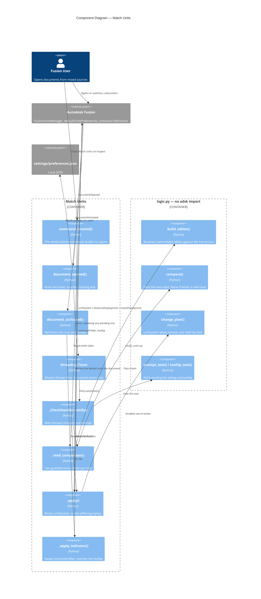

# Match Units — Architecture

[← Match Units guide](../Match%20Units.md)

| | |
|---|---|
| **Command ID** | `PTND_matchunits` |
| **Registry group** | `document` (enabled by default) |
| **Location** | Every Inspect panel of every design-product workspace |
| **Modules** | `commands/matchunits/entry.py`, `commands/matchunits/logic.py` |
| **Shared** | `commands/_inspect_panels.py` (with Measure Path) |
| **Settings** | `command_settings.matchunits.prompt_on_open` (default `False`) |
| **Tests** | `tests/test_matchunits_logic.py`, `tests/test_command_icons.py` |

## Which API tells the truth about units

Two reads, both on enums:

| Side | Property |
|---|---|
| Document | `Design.fusionUnitsManager.distanceDisplayUnits` / `.massDisplayUnits` |
| Application default | `app.preferences.defaultUnitsPreferences.itemByName("Design").distanceDisplayUnits` / `.massDisplayUnits` |

`UnitsManager.defaultLengthUnits` — the string form used by `roundsketchdimensions` and `sketchcirclecenterpoint` — is **not** usable for a comparison. The API reference states it is reshaped by the user's abbreviation and symbol preferences, so inches come back as `inch`, `in` or `"`, and it points at `distanceDisplayUnits` as "a consistent way of determining the current length unit". There is no string equivalent for mass at all.

Writing back has two shapes, and `logic.change_plan` picks between them:

- `FusionUnitsManager.unitSystem = <UnitSystems value>` when the target pair is one of the five Fusion names (mm/g, cm/g, m/kg, in/oz, ft/lb). One assignment, and **Document Settings** shows the named system.
- `distanceDisplayUnits` and/or `massDisplayUnits`, for anything else. Each assignment is documented to flip `unitSystem` to `Custom`, which is correct when the default itself is a custom pair. Only the halves that differ are written.

`DistanceUnits`, `MassUnits` and `UnitSystems` all live in `adsk.fusion`, not `adsk.core`.

## Why the tables are keyed by enum name

`logic.py` imports no `adsk` module, so it cannot reference the enums directly, and hardcoding their integers would mislabel every unit if Autodesk ever renumbered one. Instead the tables are keyed by enum **member name** and resolved against the live classes once in `start()`:

```python
_tables = logic.build_tables(
    adsk.fusion.DistanceUnits, adsk.fusion.MassUnits, adsk.fusion.UnitSystems
)
```

A name this build does not carry is dropped and reported in `UnitTables.unknown_names`, which `start()` logs. The affected unit then shows as `unknown` / `an unrecognized unit` rather than as a plausible wrong one — this command's whole output is a claim about which units a document is in, and it is about to rewrite that document on the strength of it (c8c0382).

`tests/test_matchunits_logic.py` stands the enums in with plain classes, because the test harness fabricates `adsk` as a `MagicMock` whose attributes answer with mocks rather than integers. That also lets the tests remove a member and assert the table degrades instead of raising.

## Execution flow

### The button

```
Inspect panel click
  -> command_created
       -> Design.cast(app.activeProduct)      -- absent: message, return
       -> _read_comparison(design)            -- incomplete: message, return
       -> comparison.matches                  -- report, refresh icon, return
       -> _apply(design, comparison)
            -> logic.change_plan
            -> unitSystem  OR  distance/mass
            -> _apply_indicator(now matching)
       -> messageBox(logic.applied_text)
  -> Command.isAutoExecute terminates the command
```

**All the work is in `command_created`, and no command inputs are built.** With no document open `execute` never fires at all, and nothing raises to say so (f18b911, 11cfc51). `Command.isAutoExecute` defaults true, so Fusion executes and terminates an input-less command by itself. `args.command.doExecute()` is never called here: that callback runs inside `CommandDefinition::createCommand`, so either argument re-enters the command manager on a half-built command and segfaults Fusion (14871d7).

Same launcher shape as `commands/closealldocuments`, and for the same reason there is **no `execute` or `destroy` handler** — and therefore no `_command_abort` flag. `abort_before_dialog` exists so that `consume_abort` in `execute` can skip a run that was abandoned; with no execute handler the flag would be set and never consumed, and `was_aborted` would see it forever. There is no per-invocation module state for it to protect: `_tables` is immutable configuration and `_indicator_folder` is a cache of what the UI already shows.

### The open-time watcher

```
app.documentOpened
  -> prompt_on_open off?  return
  -> threading.Timer(1.5s)                    -- worker thread
       -> app.fireCustomEvent(PTND_matchunits_check)   -- and nothing else
            -> _CheckHandler.notify           -- main thread, later turn
                 -> re-read prompt_on_open
                 -> app.activeDocument, check isValid
                 -> Design.cast(app.activeProduct)
                 -> _read_comparison -> _apply_indicator
                 -> matches? return
                 -> messageBox Yes/No
                 -> re-acquire design, _apply
```

Three constraints are encoded in that chain:

1. **Nothing modal or model-touching happens inside `documentOpened`.** A `messageBox` raised there blocks Fusion's own open pipeline, and reading or writing the design model from an application event races Fusion's background saver — the shape behind the `_AutoSaveTask` → `std::terminate` crash in the Assembly Palette notes. The event only arms the timer.
2. **The worker thread calls `app.fireCustomEvent` and nothing else** — not `ptutil.log`, which calls `Application.log`. Its return value is ignored because Fusion returns `False` even when the event fires (c440ad3, 266e2c2).
3. **No handle is held across the wait.** The `Document` the event carried is not used; the deferred turn re-reads `app.activeDocument` and checks `isValid`, because a stale handle faults natively rather than raising (a1d22e1). The design is re-acquired a second time after the prompt, which pumped the UI while it was up.

The preference is read twice — once to decide whether to arm the timer, once in the deferred turn — so switching it off while a check is pending cancels it.

`_timer` is cancelled and replaced on every open, so a burst of opens produces one check rather than a queue of prompts, and `stop()` cancels it. The timer is a daemon: a pending check never holds Fusion open.

## The state indicator

Two committed icon sets, and a swap:

| State | Folder | Glyph |
|---|---|---|
| Units match | `resources/` | Ruler |
| Units differ | `resources/mismatch/` | Ruler, retreated, with an exclamation beside it |

`_apply_indicator` writes `CommandDefinition.resourceFolder` — documented as settable — only when the verdict changes, and rewrites `.tooltip` every time with `logic.tooltip_text`. The tooltip is the part that carries the detail: a badge can say *something* differs, only text can say *what*. `_reset_indicator` returns to the plain icon and the static `CMD_Description` when there is nothing to compare, so the badge never claims a mismatch nobody established.

`documentActivated` drives the refresh. `start()` also refreshes directly, but only when `app.isStartupComplete` — during launch there is no active product to read.

Colour cannot carry the state. `tools/icons/iconkit.py` paints one flat colour per variant (Fusion picks `-dark` and `-disabled` by filename), so the two sets differ geometrically. The badge is drawn **in ink** with the ruler pulled back to clear it, not knocked out of a disc the way the `teamaddins` sync badge is: a hole that thin closes up, and at 32px the first attempt read as a plain dot. The 16px variants are redrawn rather than scaled, with every edge on a whole pixel — a 4-unit stroke centred at `4k + 2` fills pixel `k` exactly (e263d4e).

**Verified in Fusion:** reassigning `resourceFolder` on a `CommandDefinition` whose control is *already placed* on a panel does repaint that control — the swap needs no re-created control and no panel rebuild. Confirmed on `ADSKMVG91G2F5W`, 2026-09-11; the channel was not pinned at the time of the check (two instances were open, one of them production `4fcc3ec8`), so a Windows or pre-production difference has not been ruled out.

## Component diagram



## Attempted and parked

- **Disabling the button when the units already match**, so Fusion draws its own `-disabled` variant and the state came for free. Rejected: a greyed control cannot be told apart from one greyed because no design is open, and the two states mean opposite things to the user. The command stays enabled and reports "already matching" on a click.
- **A "stop asking for this document" answer**, the way `componentwarn` offers "stop warning". Not built: the prompt is already opt-in and fires once per open, so the third button would buy little and the yes/no question reads cleaner.
- **`documentActivated` prompting as well as refreshing.** Rejected: switching tabs in a mixed-unit assembly would prompt repeatedly for documents the user has already declined.

---

[← Match Units guide](../Match%20Units.md)

*Copyright © 2026 IMA LLC. All rights reserved.*
