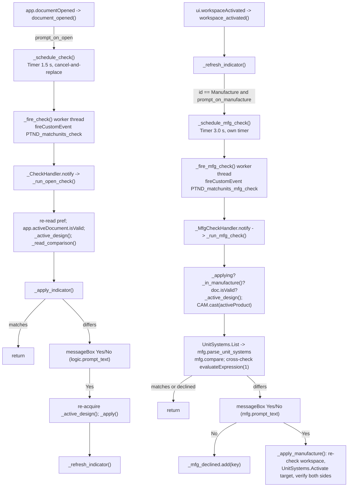

# Match Units — Architecture

[← Match Units guide](../Match%20Units.md)

| | |
|---|---|
| **Command ID** | `PTND_matchunits` |
| **Registry** | group `document` (`Document Tools`), `settings=True`; enabled by default |
| **UI location** | every Inspect panel of every design-product workspace, placed by [`_inspect_panels.add_to_inspect_panels`](architecture.md#_inspect_panels) (`IS_PROMOTED = False`); no button in Manufacture |
| **Files** | `commands/matchunits/entry.py`, `logic.py` (design comparison, `adsk`-free), `mfg.py` (Manufacture comparison, `adsk`-free), `resources/` + `resources/mismatch/` (two icon sets, `generate_icons.py`) |
| **Shared helpers** | [`_inspect_panels`](architecture.md#_inspect_panels), [`config.resolve_manufacture_workspace_id`](architecture.md#config), [`settings_store.command_setting`](architecture.md#settings_store), [`ptutil.add_handler`](architecture.md#event_utils), [`ptutil.log`, `ptutil.handle_error`](architecture.md#general_utils) |
| **Tests** | `tests/test_matchunits_logic.py`, `tests/test_matchunits_mfg_logic.py`, `tests/test_config_workspaces.py`, `tests/test_command_icons.py` |

## Purpose

Keeps a document's units consistent in three places: a button that changes the active design's length and mass units to the application's Default Units in one click; an optional prompt on `documentOpened` offering the same; and an optional prompt on entering the Manufacture workspace offering to bring Manufacture's unit system into line with the design. The button's icon and tooltip carry the design verdict at all times. The shaping constraint is that the command is about to rewrite a document on the strength of its own reading, so every read is guarded, nothing is guessed, and a half-read compares as "cannot compare", never as "differs".

Two independent comparisons live here. The **design check** (`logic.py`) reads the document's units against the application default and writes the document. The **Manufacture check** (`mfg.py`) reads the Manufacture product's active unit system against the document's design length unit and writes Manufacture. They share only `UnitTables.distance` (passed in) and the four names `mfg.py` imports from `logic.py` (`short_label`, `long_label`, `UNKNOWN_SHORT`, `UNKNOWN_LONG`).

## How it is wired

- `start()`, in order:
  1. `_tables = logic.build_tables(adsk.fusion.DistanceUnits, MassUnits, UnitSystems)`; any `unknown_names` are logged.
  2. `ui.commandDefinitions.addButtonDefinition(CMD_ID, ..., MATCH_ICON_FOLDER)`; `command_created` registered on `commandCreated` (global handler list — no `local_handlers`).
  3. `_inspect_panels.add_to_inspect_panels(cmd_def, CMD_NAME, IS_PROMOTED)`.
  4. `_register_check_event()` — unregister then `app.registerCustomEvent("PTND_matchunits_check")`, handled by `_CheckHandler`.
  5. `app.documentOpened` -> `document_opened`, `app.documentActivated` -> `document_activated` (both in `local_handlers`).
  6. `_start_manufacture_watch()` — `_families = mfg.build_families(DistanceUnits)`, `_mfg_workspace_id = config.resolve_manufacture_workspace_id()`; if `None` the Manufacture check is off and nothing else is registered. Otherwise `_register_mfg_check_event()` (`PTND_matchunits_mfg_check`, `_MfgCheckHandler`) and `ui.workspaceActivated` -> `workspace_activated`, whose handler object is kept in `_workspace_handler`.
  7. `_refresh_indicator()` only if `app.isStartupComplete` — during launch there is no active product to read.
- `stop()`: cancels both timers, unregisters both custom events, `ui.workspaceActivated.remove(_workspace_handler)`, clears `_mfg_declined`, `_inspect_panels.remove_from_inspect_panels(CMD_ID, CMD_NAME)`, deletes the definition, `local_handlers.clear()`, resets `_tables` and `_indicator_folder`.

### The button

`command_created` is the entire command: it calls `_match_active_document()` inside a `try` that routes to `ptutil.handle_error(CMD_NAME, show_message_box=True)`. No inputs are built, so `Command.isAutoExecute` ends the command when the handler returns; there is no `execute`, `destroy`, or `_command_abort` flag (see [acting from commandCreated](architecture.md#acting-from-commandcreated-when-there-are-no-inputs)). `_match_active_document()`:

1. `_active_design()` — absent: message box, return.
2. `_read_comparison(design)` — `None` (a half-read): message box, return.
3. `comparison.matches` — `_apply_indicator`, "already matching" message box, return.
4. `_apply(design, comparison)` — `logic.change_plan` -> one `unitSystem` assignment or the differing `distanceDisplayUnits` / `massDisplayUnits` halves via `_set()`; then `_refresh_indicator()` re-reads rather than assuming; a partial write returns `False` and reports failure.
5. Message box with `logic.applied_text`.

This is the only path that raises a confirmation dialog, because it is the only one with nothing to confirm against: the button takes no answer from the user. Both prompted paths log the outcome and stay quiet after a Yes; failure still speaks up on every path.

### The open-time watcher

`document_opened` reads `command_setting("matchunits", "prompt_on_open", False)` and, when true, `_schedule_check()`: cancel any pending `_timer`, arm a daemon `threading.Timer(1.5, _fire_check)`. `_fire_check` runs on the worker thread and calls only `app.fireCustomEvent("PTND_matchunits_check")`, ignoring the return value ([deferral pattern](architecture.md#deferring-work-to-a-later-main-loop-turn)). `_CheckHandler.notify` -> `_run_open_check()` on the main thread:

1. re-reads `prompt_on_open` (switching it off while a check is pending cancels it);
2. `app.activeDocument`, must be truthy and `isValid` — the `Document` the event carried is never used;
3. `_active_design()`, `_read_comparison`, `_apply_indicator`; `matches` -> return;
4. Yes/No `ui.messageBox(logic.prompt_text(...))`;
5. re-acquires the design (the prompt pumped the UI) and `_apply()`.

Nothing modal or model-touching happens inside `documentOpened` itself: it only arms the timer. Cancel-and-replace means a burst of opens yields one check, not a queue of prompts.

### The Manufacture watcher

`workspace_activated` fires for every workspace: it always calls `_refresh_indicator()` (this is how returning to Design gets a fresh verdict), then returns unless `args.workspace.id == _mfg_workspace_id` and `prompt_on_manufacture` is set, in which case `_schedule_mfg_check()` arms its own daemon `threading.Timer(3.0, _fire_mfg_check)` -> `fireCustomEvent("PTND_matchunits_mfg_check")` -> `_MfgCheckHandler.notify` -> `_run_mfg_check()`:

1. `_applying` set -> return (re-entrancy guard around the write); tables missing -> return; re-read `prompt_on_manufacture`.
2. `_in_manufacture()` (`ui.activeWorkspace.id == _mfg_workspace_id`) — the user had three seconds to leave.
3. `app.activeDocument` valid; `_active_design()`; `adsk.cam.CAM.cast(app.activeProduct)` — `None` means the CAM product does not exist yet (first entry into Manufacture creates it); log and return without re-arming.
4. `_read_manufacture_system()` — `app.executeTextCommand("UnitSystems.List")` parsed by `mfg.parse_unit_systems`; `mfg.compare(_families, design_distance, active_id)`; `None` -> log, return.
5. Cross-check: `mfg.system_for_scale(cam.unitsManager.evaluateExpression("1"))`; if its family disagrees with the parsed id's family, log loudly and say nothing.
6. `matches` -> return; `(_document_key(doc), comparison.active_id)` in `_mfg_declined` -> return.
7. Yes/No message box; No adds the key to `_mfg_declined`.
8. `_apply_manufacture(comparison)`: re-check `_in_manufacture()`; read the design distance unit `before` (unreadable -> refuse to write, since the write could not be verified); set `_applying`; `UnitSystems.Activate <target_id>`; verify `_read_manufacture_system()` moved to the target family **and** the design distance unit is unchanged; any failure returns `False` and a message box is shown.

The two watchers have separate timers and event ids because each `_schedule_*` cancels its own pending timer; sharing one would let a document open and a workspace switch inside the delay silently cancel each other. The Manufacture delay is longer because the first entry into Manufacture creates the CAM product and loads tool libraries.

### The state indicator

`_refresh_indicator()` (from `start`, `document_activated`, `workspace_activated`, and after every `_apply`) re-reads the design and calls `_apply_indicator(comparison)`, or `_reset_indicator()` when there is no design or the read is incomplete. It never prompts, writes or raises. `_apply_indicator` writes `CommandDefinition.resourceFolder` only when the verdict changes (`_indicator_folder` caches the current folder) and rewrites `.tooltip` with `logic.tooltip_text` every time. `_reset_indicator` returns to `resources/` and the static `CMD_Description`, so the badge never claims a mismatch nobody established.

| State | Folder | Glyph |
|---|---|---|
| Units match, or nothing to compare | `resources/` | ruler |
| Units differ | `resources/mismatch/` | ruler, retreated, with an exclamation badge |

The Manufacture verdict gets no icon: `_inspect_panels` admits only design-product workspaces, so the button does not exist in Manufacture, and one `resourceFolder` cannot carry two verdicts. That check reports through its prompt and the log only.

## Data and state

- Module-level: `_tables` (`logic.UnitTables`), `_families` (`DistanceUnits` value -> family), `_mfg_workspace_id`, `_indicator_folder`, `_timer` / `_mfg_timer`, `_check_event_handler` / `_mfg_check_event_handler`, `_workspace_handler`, `_applying`, `_mfg_declined` (set of `(document key, active system id)`, session only), `local_handlers`.
- Settings (`settings_store.COMMAND_SETTING_DEFAULTS["matchunits"]`): `prompt_on_open`, `prompt_on_manufacture`, both default `False`; rendered inline under the command's row in the Preferences palette. Each is read twice per check — once to arm, once in the deferred turn.
- Custom events: `PTND_matchunits_check`, `PTND_matchunits_mfg_check`.
- `_document_key(doc)`: `dataFile.id` where there is one, else `doc.name` — never the `Document` object, which the API does not guarantee to be identifiable across two calls.
- No files on disk.

## Which API tells the truth about units

| Side | Read | Write |
|---|---|---|
| Document (Design product) | `Design.fusionUnitsManager.distanceDisplayUnits` / `.massDisplayUnits` (enums) | `unitSystem`, or the two properties |
| Application default | `app.preferences.defaultUnitsPreferences.itemByName("Design").distanceDisplayUnits` / `.massDisplayUnits` | not written |
| Manufacture product | `UnitSystems.List` text command, parsed; corroborated by `cam.unitsManager.evaluateExpression("1")` | `UnitSystems.Activate <id>` text command |

`UnitsManager.defaultLengthUnits` — the string form — is not usable for a comparison: the API reference states it is reshaped by the user's abbreviation and symbol preferences (inches come back as `inch`, `in` or `"`) and points at `distanceDisplayUnits` as the consistent answer. There is no string equivalent for mass at all. `DistanceUnits`, `MassUnits` and `UnitSystems` live in `adsk.fusion`.

The Manufacture side has no API. `adsk.cam.CAM` does not override `Product.unitsManager`, so it returns the base `core.UnitsManager`, whose only unit property is the read-only `defaultLengthUnits`; there is no `CAMUnitsManager`, and `defaultUnitsPreferences` hands back a bare `DefaultUnitsPreferences` (only `.name`) for Manufacture. Both directions therefore go through text commands, which act on the **active product** — which is why the check runs only while Manufacture is the active workspace, and why `_apply_manufacture` re-checks the workspace immediately before the write and verifies both sides after it: `UnitSystems.Activate` takes no target argument, and fired in Design it would rewrite the design units.

Writing the design side has two shapes, and `logic.change_plan` picks: `FusionUnitsManager.unitSystem = <UnitSystems value>` when the target pair is one of the five named systems (`mm/g`, `cm/g`, `m/kg`, `in/oz`, `ft/lb` — `logic.UNIT_SYSTEMS`), so Document Settings shows the named system; otherwise the differing halves individually, each of which flips `unitSystem` to `Custom` — correct when the default itself is a custom pair. `CustomUnitSystem` is never a target.

## Why the tables are keyed by enum name

`logic.py` and `mfg.py` import no `adsk` module, so they cannot reference the enums, and hardcoding integers would mislabel every unit if one were renumbered. `logic.DISTANCE_UNITS` (11 entries), `MASS_UNITS` (6), `UNIT_SYSTEMS` (5) and `mfg.DISTANCE_FAMILY` are keyed by enum **member name** and resolved once against the live classes in `start()` (`logic.build_tables`, `mfg.build_families`). A name this build does not carry is dropped and reported in `UnitTables.unknown_names`; the affected unit then shows as `unknown` / `an unrecognized unit` rather than as a plausible wrong one. The tests stand the enums in with plain classes, because the harness fabricates `adsk` as a `MagicMock` whose attributes answer with mocks rather than integers; that also lets them remove a member and assert the table degrades instead of raising.

## Compare families, not units

Manufacture offers two systems (`mfg.MFG_SYSTEMS`: `MmMKS`, `InchImperial`); Design offers eleven length units. Comparing a design *unit* against a Manufacture *system* can never be satisfied for 9 of the 11 — a centimetre design wants `MmMKS`, sees `MmMKS`, still reads as different, and prompts on every workspace switch forever. So both sides reduce to a family, metric or imperial (`mfg.DISTANCE_FAMILY`, `mfg.SYSTEM_FAMILY`), and `MfgComparison.matches` compares families. `SYSTEM_FAMILY` is wider than `MFG_SYSTEMS` (`CmMKS`, `MmMKS`, `MMKS`, `InchImperial`, `Imperial`): the latter is what Manufacture can be switched *to*, the former what it might be found *on*, because `UnitSystems.List` run against the Design product declares six systems. `Custom` is deliberately absent from `SYSTEM_FAMILY` — an arbitrary pair has no family, so `mfg.compare` returns `None` and the check stays silent.

Two facts about `UnitSystems.List` output shape `mfg.parse_unit_systems`: the active system is reported by **name**, not id, so the name is looked up among the header lines of the *same* output to recover the id `Activate` takes; and names are not stable across products (the same `MmMKS` is `...celsius) units` under CAM and `...Celsius) units` under Design), so a name is never matched against a literal. `tests/test_matchunits_mfg_logic.py` keeps both captures verbatim as fixtures.

`evaluateExpression` signals failure by returning `-1`, not by raising, so `mfg.system_for_scale` rejects any non-positive value; otherwise a failed read would compare as "differs" and prompt a rewrite. `MFG_SYSTEM_SCALE` maps `MmMKS` -> 0.1 and `InchImperial` -> 2.54 (one display unit in Fusion's internal centimetres).

## Why the two comparisons do not share a type

`logic.UnitsState.is_known` requires **both** a length and a mass, and `logic.compare` returns `None` unless both sides are complete. That invariant stops the design write path acting on a half-read (`test_a_half_read_side_cannot_be_compared`). A length-only Manufacture comparison pushed through those types would have to fabricate a mass value, which `differences`, `change_plan` and `tooltip_text` would then all report on. The two checks also differ in trigger, read mechanism, write mechanism, direction, and failure signal (a `-1` return rather than an exception), so `mfg.MfgComparison` is a sibling type in a second `adsk`-free module.

## Diagram

The two deferred watchers and the handles each turn re-acquires; the button path is the left column of `_run_open_check` without the timer and prompt.

```mermaid
flowchart TD
    DO["app.documentOpened -> document_opened()"] -->|prompt_on_open| SC["_schedule_check()<br/>Timer 1.5 s, cancel-and-replace"]
    SC --> FC["_fire_check() worker thread<br/>fireCustomEvent PTND_matchunits_check"]
    FC --> CH["_CheckHandler.notify -> _run_open_check()"]
    CH --> RD["re-read pref; app.activeDocument.isValid;<br/>_active_design(); _read_comparison()"]
    RD --> AI["_apply_indicator()"]
    AI -->|matches| END1["return"]
    AI -->|differs| PR["messageBox Yes/No (logic.prompt_text)"]
    PR -->|Yes| RA["re-acquire _active_design(); _apply()"]
    RA --> RI["_refresh_indicator()"]

    WA["ui.workspaceActivated -> workspace_activated()"] --> RI2["_refresh_indicator()"]
    RI2 -->|"id == Manufacture and prompt_on_manufacture"| SM["_schedule_mfg_check()<br/>Timer 3.0 s, own timer"]
    SM --> FM["_fire_mfg_check() worker thread<br/>fireCustomEvent PTND_matchunits_mfg_check"]
    FM --> MH["_MfgCheckHandler.notify -> _run_mfg_check()"]
    MH --> G1["_applying? _in_manufacture()? doc.isValid?<br/>_active_design(); CAM.cast(activeProduct)"]
    G1 --> RS["UnitSystems.List -> mfg.parse_unit_systems<br/>mfg.compare; cross-check evaluateExpression(1)"]
    RS -->|"matches or declined"| END2["return"]
    RS -->|differs| PM["messageBox Yes/No (mfg.prompt_text)"]
    PM -->|No| DM["_mfg_declined.add(key)"]
    PM -->|Yes| AM["_apply_manufacture(): re-check workspace,<br/>UnitSystems.Activate target, verify both sides"]
```

## Tests

- `tests/test_matchunits_logic.py` — `build_tables` coverage of every documented unit, unknown-name degradation (reported, not guessed; table order), `compare` (identical, each half, both halves, half-read -> `None`, zero-valued enum is a real reading), `change_plan` (no writes when matching, one `unitSystem` assignment for a named pair chosen by the target, field-by-field for a custom pair leaving the agreeing half alone, every named system reachable), and the prompt/tooltip/log strings (name both sides, state which verdict, ASCII only).
- `tests/test_matchunits_mfg_logic.py` — every distance unit has a family and resolves against the live enum; `parse_unit_systems` on verbatim CAM and Design captures (name punctuation, active resolved by name not position, unknown active name, third system, unparseable input, missing active line, mass choice does not displace length); `system_for_scale` (each system, float tolerance, `-1` sentinel, unmatched scale); `compare` and `MfgComparison.matches` by family (every design unit reaches a satisfied state; activating the target always reaches a match; foot-based `Imperial` is a real mismatch; `Custom`, unrecognized and unreadable systems cannot be compared); labels and ASCII text.
- `tests/test_config_workspaces.py` — `config.resolve_manufacture_workspace_id()`: pinned `CAMEnvironment` wins, display-name fallback, case-insensitive.
- `tests/test_command_icons.py` — pins both icon sets (`matchunits` and `matchunits/mismatch`, all variants) against `resources/generate_icons.py`.
- `tests/test_command_contract.py`, `tests/test_command_abort.py` — import `entry.py` under the stub; pin `PTND_matchunits_check` and `PTND_matchunits_mfg_check` as known custom-event literals; the `doExecute` guard.

`entry.py` is Fusion-bound and is not exercised by the suite; nothing here is verified in Fusion on this branch except by the AST guards above, which import it under the `adsk` stub. In particular the timer/custom-event chains, the `resourceFolder` swap, the `UnitSystems.*` text commands and the `evaluateExpression` cross-check are Fusion-only behaviour.

## Learnings

- **`Design.cast(app.activeProduct)` returns `None` in every non-Design workspace, so an indicator computed from it goes stale outside Design.** Switching document tabs in Manufacture fired `documentActivated`, the cast failed, and a genuine mismatch was repainted as neutral; coming back to Design fired nothing. `_active_design()` asks by product type (`doc.products.itemByProductType("DesignProductType")`), and `workspaceActivated` repaints on the way back in (`9c19b2c`; stale verdict is worse than an error, `c8c0382`).
- **Clearing a `local_handlers` list does not detach a handler from a long-lived UI event.** It only drops the Python reference; Fusion keeps calling a freed handler. The `workspaceActivated` handler is held in `_workspace_handler` and removed with `event.remove()` in `stop()`.
- **`UnitSystems.List` / `UnitSystems.Activate` are per product and act on the active product; the Manufacture system persists with the document.** Established in the Text Commands window on `ADSKMVG91G2F5W`, 2026-09-12 (channel not pinned; one open instance was production `4fcc3ec8`). `UnitSystems.List` under CAM declares two systems, under Design six.
- **Reassigning `CommandDefinition.resourceFolder` repaints a control that is already placed on a panel** — no re-created control, no panel rebuild. Confirmed on `ADSKMVG91G2F5W`, 2026-09-11 (channel not pinned); Windows and pre-production not ruled out.
- **Colour cannot carry icon state.** `tools/icons/iconkit.py` paints one flat colour per variant (Fusion picks `-dark` / `-disabled` by filename), so the two sets differ geometrically. The badge is drawn in ink with the ruler pulled back — a knocked-out disc that thin closes up, and at 32 px read as a plain dot; the 16 px variants are redrawn on whole pixels (`e263d4e`).
- Dead ends, rejected: disabling the button when units match (a greyed control cannot be told from one greyed for "no design open"); a "stop asking for this document" button on the open-time prompt (already opt-in and once per open; the Manufacture prompt got the equivalent as the session memo instead); prompting from `documentActivated` (would re-prompt on every tab switch in a mixed-unit assembly); reusing `logic.Comparison` for the Manufacture check (see above); reading the Manufacture side from `defaultLengthUnits` (preference-shaped string, no id in the `Activate` vocabulary — it survives only as the numeric cross-check); prompting to change the *design* to match Manufacture (reverses what the user asked for; the design is the authority).

---

*Copyright © 2026 IMA LLC. All rights reserved.*
