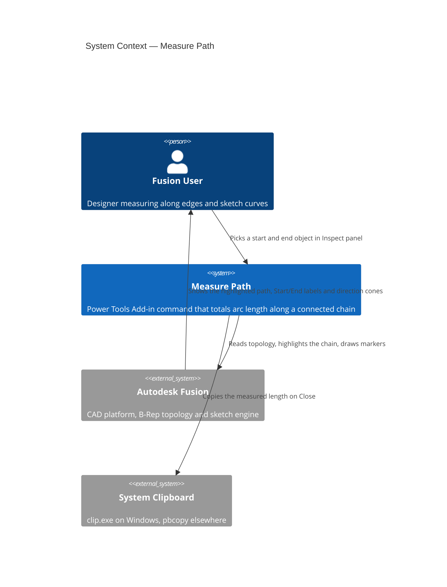
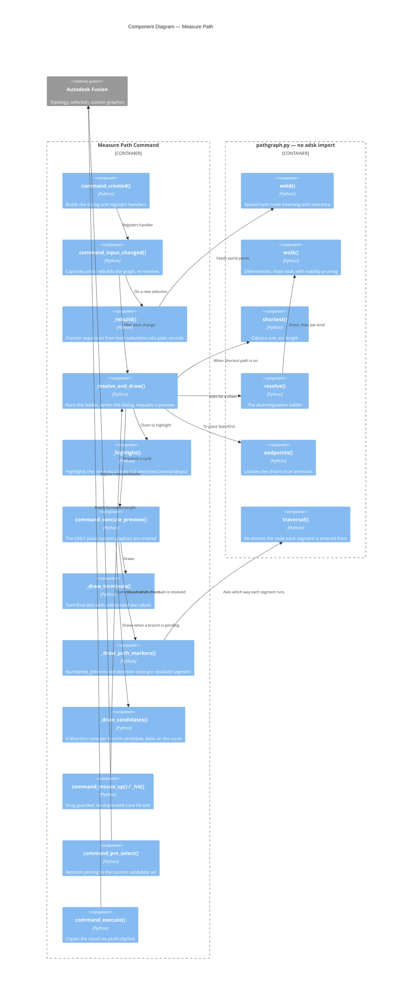
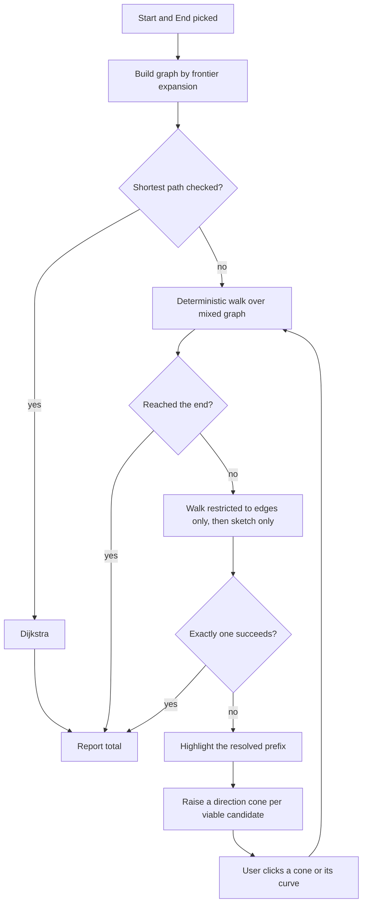

# Measure Path — Architecture

[← Measure Path guide](../Measure%20Path.md)

| | |
|---|---|
| **Command ID** | `PTPM_measurepath` |
| **Registry group** | `partmodeling` (enabled by default) |
| **Location** | Every Inspect panel of every design-product workspace |
| **Modules** | `commands/measurepath/entry.py`, `commands/measurepath/pathgraph.py` |
| **Tests** | `tests/test_measurepath_pathgraph.py` |

## Architecture

### System context

### Component diagram

### Resolution ladder

## Design decisions

### The graph is keyed on coordinates, not entities

A node is a **welded world coordinate**, not a Fusion entity. `BRepVertex` has no
identity stable across calls — Fusion returns a fresh Python wrapper on each
property access, so `id()` is useless, and `tempId` is unique only within one body.
More importantly entity identity *cannot* express what the command needs: a sketch
point coincident with a vertex on a different body must become **one** node. Welding
at `DEFAULT_WELD_TOL` (1e-4 cm) solves node identity, cross-body unification and the
sketch↔edge boundary in one mechanism.

Segment keys prefer `entityToken`, which distinguishes occurrence proxies from one
another. The fallback is **geometric** (rounded endpoints plus length), never `id()` —
an identity-based fallback would let one edge enter the graph twice under two names.

### Ambiguity is O(V+E), not path enumeration

"A single deterministic chain" means: every node reached has exactly one unvisited
continuation. That is a linear walk, not a count of simple paths, so it cannot blow
up on a dense graph.

Two refinements carry most of the usability:

- **Viability pruning.** At a fork, candidates that cannot reach an end node are
  discarded first. If one survives it is taken silently — this is what implements
  "continue until the next branch point *or a single path to the end*", and it means
  cones never point down dead ends.
- **Homogeneity fallback.** When the mixed graph is ambiguous, an edges-only and then
  a sketch-only walk are tried. Accepted only if **exactly one** succeeds, so the
  command never silently picks between two valid answers.

A restriction that the start seed or end tail violates is skipped rather than
answered, otherwise a mixed chain gets reported as homogeneous with a terminal
silently dropped.

### Both terminal selections contribute their length

Picking a curve or edge rather than a point counts its **full** length, at either end:

| Selection | Mechanism |
|---|---|
| Start curve | `seed` — forced as the walk's first step, out of whichever end reaches onward |
| End curve | `tail` — appended by `_arrive()` when the walk touches either of its ends |

Without the tail the walk finishes the moment it touches an end segment's endpoint,
dropping that segment from both the total and the breakdown. Both guards skip a
segment already in the chain, so a curve picked as *both* start and end counts once.

The reported **Length** is therefore always exactly the sum of the **Segments** rows.
`tests/test_measurepath_pathgraph.py::test_total_always_equals_the_sum_of_the_breakdown`
brute-forces that invariant over every start/end/seed/tail combination.

### Per-segment markers are derived, not stored

`Seg` is deliberately undirected: `a` and `b` are two node indices with no sense
between them, and traversal order lives only in a list's ordering. The per-segment
cones need to know which way each segment runs, so `traversal()` re-derives it by
chaining forward from the origin `endpoints()` found, returning `(seg, entry_node)`
pairs. It returns **empty** when the chain does not chain cleanly, rather than
guessing a sense that would then be drawn backwards.

Each cone is built from two `_point_along()` calls straddling the arc-length midpoint,
so it follows a curved segment instead of chording it, and its base-to-apex sense is
the direction of travel. The colour ramp runs between `_COLOR_START` and `_COLOR_END` —
the terminal dot colours — so the markers read as part of the same annotation rather
than an unrelated palette, and the number on each is its row in the Segments table.

Markers are drawn only for a **resolved** chain: `_set_markers()` populates
`_path_segs` only when `resolved`, because numbering a chain that is about to change
would mislead. They are kept out of `_hit_targets` and `_marker_gfx` — those drive the
branch manipulator, and a resolved chain has nothing left to pick. The two cone
families can never coexist: `_path_segs` is non-empty only when `_candidates` is empty,
and vice versa.

`_MAX_PATH_MARKERS` caps the count at 250, and `_marker_note()` says so in the status
box when it bites, so a silently unannotated path cannot be mistaken for a short one.

### Custom graphics only in `executePreview`

**This is the load-bearing constraint of the whole command.** Fusion builds everything
constructed during a preview in one transaction and aborts that transaction — "the
equivalent of an undo" — when the next preview fires. Custom graphics created from
`inputChanged` or a mouse handler are therefore undone almost immediately: they flash
and vanish, with no error.

So `command_execute_preview()` is the only function that creates graphics, and it
redraws from state on every cycle. Consequences threaded through the design:

- The **chain highlight uses no custom graphics at all** — a `SelectionCommandInput`
  with `setSelectionLimits(0, 0)` and `addSelection()`. Selection state is outside the
  transaction, so it cannot be undone. (`ui.activeSelections` does not highlight while
  a dialog is open; this input does.)
- **Hover recolours in place** rather than rebuilding, because delete-and-re-add per
  mouse move is itself a flicker source.
- `isValidResult` is deliberately left **False**. Setting it True would make Fusion
  skip `execute`, which is where the clipboard copy happens.
- `validateInputs` is **not** registered. Gating it would suppress the preview and
  with it the graphics.

Full write-up, including the fix this implies for `sketchcirclecenterpoint`:
[Custom graphics that stay painted](../dev/Custom%20graphics%20that%20stay%20painted.md).

### Branch picking has two independent routes

There is **no `CustomGraphics` selection filter** in Fusion, so a cone can only be
picked through raw mouse events — and `Command.mouseClick` is documented as unreliable
on some builds. The structural mitigation: each cone's **base sits on its own candidate
curve**, so a click on the cone is geometrically a click on that curve and Fusion's
native picking resolves the choice even if no mouse event ever arrives.

| Route | Mechanism | Fails how |
|---|---|---|
| Click the cone | `mouseUp` + `mouseClick`, hit-tested by projecting the cone midpoint with `modelToViewSpace` against `viewportPosition` | Degrades to route 2 |
| Click the curve | `mp_branch_pick` selection input, filtered by `preSelect` to the candidate set | Native; no coordinate maths |

`mouseUp` and `mouseClick` are both bound because either may be the one that fires;
`_handle_click` de-duplicates by rounded cursor position so one physical click cannot
consume two choices. A press-to-release travel of more than `_DRAG_PX_SLOP` is treated
as an orbit or pan, not a click.

### Coordinate spaces

`MouseEventArgs.viewportPosition` is viewport-local, the same space
`Viewport.modelToViewSpace()` returns, so hit testing compares them directly. This
deliberately avoids the window-space calibration that `RadialHoleCircle` needs, which
arises only from using `MouseEventArgs.position` instead.

Sketch point world positions go through `sketch.sketchToModelSpace()`, **not**
`worldGeometry`, which is documented in this repo as silently returning the origin for
some sketch point types — a wrong world point mis-welds nodes and yields a wrong total
with no error.

Marker sizes are computed from a sampled px-per-cm rather than
`CustomGraphicsViewScale`, which has no proven use in this add-in.

### Placement is discovered, not listed

`_inspect_panels()` walks every design-product workspace and collects each panel whose
id contains `inspect`, deduplicated by id. Which tabs exist — Solid, Surface, Mesh,
Sheet Metal, Plastic — varies with the Fusion version and the user's entitlements, so
a hardcoded tab list would miss panels on one build and log "not found" noise on
another. `productType` is matched loosely because its exact value is undocumented,
falling back to `config.design_workspace`.

Every one of these panels is **built-in**: `stop()` removes only the controls and the
command definition, never a panel.

## Scope and limits

- Expansion is frontier-driven from the two selections through real connectivity, so
  the graph is the connected component containing them, not the whole assembly.
  `_MAX_EXPANSION_STEPS` is a runaway backstop.
- Full circles and ellipses have no endpoints and cannot join a chain; they are
  excluded from the graph and rejected as selections with a specific message.
- `SketchPoint.connectedEntities` also reports circles, arcs and ellipses that use the
  point as their **centre**. Those are filtered by an endpoint-coincidence test, or
  every circle centre would become a phantom branch.

### Still unverified in Fusion

Each has a logged fallback rather than an exception:

| Item | Fallback |
|---|---|
| `CustomGraphicsBillBoard` behaviour | Label still placed, orientation view-dependent |
| `createCylinderOrCone` with a sliver apex radius | Returns null → cone skipped |
| `doExecutePreview()` from a mouse handler | Input-driven changes get their own preview |
| Occurrence-proxy `vertex.geometry` being root-space | Logged for diagnosis |
| Per-segment marker cost at the 250-segment cap | Cap plus a status note; typical paths are an order of magnitude smaller |

---

*Copyright © 2026 IMA LLC. All rights reserved.*
