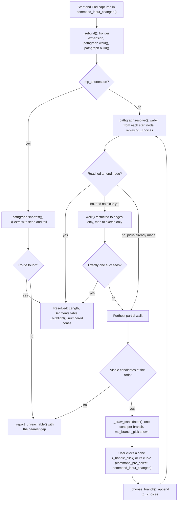
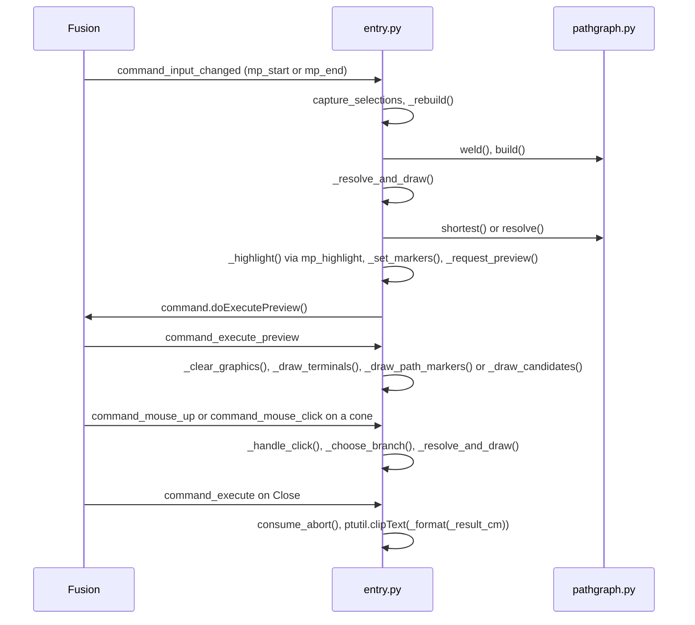

# Measure Path — Architecture

[← Measure Path guide](../Measure%20Path.md)

| | |
|---|---|
| **Command ID** | `PTPM_measurepath` |
| **Registry** | group `partmodeling` (`Part Modeling`); enabled by default |
| **UI location** | Every **Inspect** panel of every design-product workspace (Solid, Surface, Mesh, Sheet Metal, Plastic …), discovered at runtime by [`_inspect_panels.add_to_inspect_panels`](architecture.md#_inspect_panels); appended, not promoted. The panels are built in and are never created or deleted. |
| **Files** | `commands/measurepath/entry.py` (all Fusion contact); `pathgraph.py` (graph, walk, Dijkstra, resolution ladder; no `adsk`); `resources/generate_icons.py` and the PNGs it produces |
| **Shared helpers** | [`_inspect_panels.add_to_inspect_panels`, `remove_from_inspect_panels`](architecture.md#_inspect_panels); [`abort_before_dialog`, `consume_abort`, `clear_abort`](architecture.md#_command_abort); [`ptutil.capture_selections`, `picked_one`](architecture.md#selection_utils); [`ptutil.add_handler`](architecture.md#event_utils); [`ptutil.log`, `handle_error`, `perf_timer`, `clipText`, `require_document`](architecture.md#general_utils) |
| **Tests** | `tests/test_measurepath_pathgraph.py`; icon set pinned in `tests/test_command_icons.py` |

## Purpose

Measures the cumulative arc length of a connected chain of sketch curves and model edges between two picked objects, shows the chain highlighted with Start/End dots and numbered direction cones, breaks it down per segment, resolves forks either by shortest path or by letting the user click a direction cone, and copies the length to the clipboard on Close. The load-bearing constraint is Fusion's preview transaction: custom graphics survive only when created inside `executePreview`, and every other design choice follows from that.

## How it is wired

- `start()`: `addButtonDefinition(...)`; `ptutil.add_handler(cmd_def.commandCreated, command_created)`; `_inspect_panels.add_to_inspect_panels(cmd_def, CMD_NAME, IS_PROMOTED)`, which walks every design-product workspace and adds the control to each panel whose id contains `inspect`, deduplicated by id.
- `stop()`: `_inspect_panels.remove_from_inspect_panels(CMD_ID, CMD_NAME)`; deletes the definition.
- `command_created(args)`: if [`ptutil.require_document(CMD_NAME, "design")`](architecture.md#document-preconditions) is `None` (it shows "Measure Path needs a design open. Open or create a design, then retry."), `abort_before_dialog(CMD_ID, CMD_NAME, "no open design")`, return with no inputs ([aborting a command before its dialog](architecture.md#aborting-a-command-before-its-dialog)). Otherwise `_reset_state()`, `okButtonText = "Close"`, `isExecutedWhenPreEmpted = False`, caches `_active_command` and `_cmd_inputs`, and builds: `mp_start` and `mp_end` (selection inputs; filters `SketchPoints`, `Vertices`, `ConstructionPoints`, `SketchCurves`, `Edges`; limits 0,1), `mp_shortest` (checkbox, on), `mp_branch_pick` (selection; `SketchCurves`, `Edges`; limits 0,1; hidden), `mp_undo_branch` (`addBoolValueInput` with `isCheckBox=False` and no resource folder, which renders as a text button; hidden), `mp_result` (read-only text), `mp_status` (two rows, full width), `mp_segments` (table, three columns `3:2:3`, 1–10 visible rows, hidden), `mp_highlight` (selection; `SketchCurves`, `Edges`; limits 0,0). Registers `execute`, `executePreview`, `inputChanged`, `preSelect`, `mouseMove`, `mouseDown`, `mouseUp`, `mouseClick` and `destroy`. `validateInputs` is deliberately not registered: gating it would suppress the preview and with it the graphics.
- `command_input_changed(args)`: `mp_branch_pick` with one selection → `_seg_key` → `clearSelection()` → `_choose_branch(key)`. `mp_undo_branch` → pop `_choices` → `_resolve_and_draw`. `mp_shortest` → `_resolve_and_draw`. `mp_start`/`mp_end` → `ptutil.capture_selections(inputs, _picks, INPUT_START, INPUT_END)`, reset `_choices`; with both picks present, a closed curve (`_closed_pick`) is refused with a status message; otherwise `_rebuild(start, end)` runs under `ptutil.perf_timer("measurepath.rebuild")`, a failure clears the graph and says the geometry could not be read, and `_resolve_and_draw(inputs)` follows either way.
- `_rebuild(start, end)`: `_collect` expands a frontier from each pick — an edge yields its two vertices, a vertex its `edges`, a sketch curve its two sketch points, a sketch point those `connectedEntities` whose ends actually touch it — into `(key, pa, pb, length, kind, entity)` records, bounded by `_MAX_EXPANSION_STEPS`. All endpoints plus the two picks' anchor points go through `pathgraph.weld`; the records become `pathgraph.Seg`s in a `pathgraph.build` graph; `_start_nodes`/`_end_nodes` are the welded anchors; a curve picked as Start becomes a `_seeds` entry, one picked as End becomes `_tail`.
- `_resolve_and_draw(inputs)`: with `mp_shortest` on, `pathgraph.shortest(graph, starts, ends, seed, tail)`; off, `pathgraph.resolve(graph, starts, ends, HOMOGENEOUS_ORDER, _choices, _seeds, _tail)`. Writes `mp_result` (`_format` via `unitsManager.formatValue`), `mp_status`, the table (`_fill_table`), the native highlight (`_highlight`), the terminal and per-segment marker state (`_set_markers`), shows `mp_branch_pick` and caches `_candidates`/`_pending_node` when a fork is pending, and ends with `_request_preview()`, which calls `_active_command.doExecutePreview()` because Fusion fires a preview by itself only after an *input* changes, not after a mouse click.
- `command_execute_preview(args)`: the only place graphics are created. `_clear_graphics()`, clear `_hit_targets` and `_marker_gfx`, `_draw_terminals()`, then either `_draw_path_markers(_path_segs)` (resolved chain) or `_draw_candidates(_pending_node, _candidates)` (pending fork), then `viewport.refresh()`. `isValidResult` is never set, so it stays false and `execute` still runs.
- `command_pre_select(args)`: while candidates are pending and `args.activeInput` is `mp_branch_pick` (or is unavailable), sets `isSelectable = False` for any entity that is not a candidate.
- `command_mouse_move(args)`: `_hit(args)` tests `args.viewportPosition` against the projected cone midpoints in `_hit_targets` within `_HIT_PX_SLOP`; a change of hovered key runs `_apply_hover`, which recolours the live cone graphics in place.
- `command_mouse_down` records `_press_xy`; `command_mouse_up` and `command_mouse_click` both call `_handle_click`, which ignores non-left buttons, treats travel above `_DRAG_PX_SLOP` (4 px) as an orbit or pan, de-duplicates by rounded cursor position so one click cannot consume two choices, and calls `_choose_branch(hit)` → append to `_choices` → `_resolve_and_draw`.
- `command_execute(args)`: `consume_abort` first; if `_result_cm > 0`, `ptutil.clipText(_format(_result_cm))` (`clip.exe` on Windows, `pbcopy` elsewhere).
- `command_destroy(args)`: `clear_abort(CMD_ID)`, `_clear_graphics()`, refresh, `_reset_state()`.

## Data and state

Module globals only: `_graph`, `_node_coords`, `_seg_entities` (key → Fusion entity, for highlighting and curve evaluation), `_start_nodes`, `_end_nodes`, `_seeds`, `_tail`, `_choices`, `_candidates`, `_pending_node`, `_hit_targets`, `_marker_gfx`, `_hover_key`, `_marker_start`, `_marker_end`, `_path_segs`, `_result_cm`, `_picks`, `_cmd_inputs`, `_active_command`, `_press_xy`, `_last_pick_xy`, `_cell_serial`, `_preview_pending`. Custom graphics group id `PTPM_measurepath_gfx`. Tunables: `DEFAULT_WELD_TOL` 1e-4 cm, `_MAX_EXPANSION_STEPS` 200 000, `_MAX_PATH_MARKERS` 250, `_HIT_PX_SLOP` 15 px, `_DRAG_PX_SLOP` 4 px. No settings keys, no files, no custom events.

## The graph is keyed on coordinates, not entities

A node is a **welded world coordinate**. `BRepVertex` has no identity stable across calls — Fusion returns a fresh Python wrapper on each property access, so `id()` is useless, and `tempId` is unique only within one body. Entity identity also cannot express what the command needs: a sketch point coincident with a vertex on a different body must be **one** node. `pathgraph.weld` at `DEFAULT_WELD_TOL` (1 µm) settles node identity, cross-body unification and the sketch/edge boundary in one mechanism, using a spatial hash that probes the 27 surrounding cells so two points either side of a cell boundary still merge.

Segment keys (`_token`) prefer `entityToken`, which distinguishes occurrence proxies from one another. The fallback (`_geom_key`) is **geometric** — rounded endpoints plus length — never `id()`; an identity-based fallback would let one edge enter the graph twice under two names. `_seg_key` builds the key exactly as `_collect` does, or the branch-pick lookup and the curve seed would silently miss.

Sketch point world positions come from `sketch.sketchToModelSpace(point.geometry)` followed by `assemblyContext.transform2`, not from `worldGeometry`, which can return the origin for some point types; a wrong world point mis-welds nodes and yields a plausible wrong total with no error. `BRepVertex.geometry` is used as is.

## Ambiguity is O(V+E), not path enumeration

"A single deterministic chain" means every node reached has exactly one unvisited continuation, which `pathgraph.walk` checks in a linear pass rather than by counting simple paths. Two refinements carry most of the usability:

- **Viability pruning.** At a fork, `can_reach` discards candidates that cannot reach an end node. If one survives it is taken silently — that is what implements "continue until the next branch point *or* a single path to the end", and it means cones never point down dead ends. If none survives the walk stops and reports where the trail went cold.
- **Homogeneity fallback.** When the mixed graph is ambiguous and the user has not yet picked a direction, `pathgraph.resolve` retries with an edges-only and then a sketch-only walk (`HOMOGENEOUS_ORDER`) and accepts the result only if **exactly one** succeeds, so it never silently chooses between two valid answers. A restriction the seed or tail violates is skipped rather than answered, or a mixed chain would be reported as homogeneous with a terminal dropped.

Segments whose two ends weld to the same node are dropped by `Graph.add`: a closed loop can never move the walk and would otherwise pose as a branch candidate.

## Both terminal selections contribute their length

| Selection | Mechanism |
|---|---|
| Start curve | `seed` — forced as the walk's first step, out of whichever of its ends reaches onward; `shortest` tries both ends because they cost the same and only one may have the cheaper continuation |
| End curve | `tail` — appended by `_arrive` (and at the end of `shortest`) when the walk touches either of its ends |

Without the tail the walk finishes the moment it touches an end segment's endpoint and drops that segment from both the total and the breakdown. Both guards skip a segment already in the chain, so a curve picked as *both* Start and End counts once. The reported **Length** is therefore always the sum of the **Segments** rows; `test_total_always_equals_the_sum_of_the_breakdown` brute-forces that over every start/end/seed/tail combination.

## Per-segment markers are derived, not stored

`Seg` is undirected: `a` and `b` carry no sense, and traversal order lives only in a list. `pathgraph.traversal` re-derives the entry node of each segment by chaining forward from the origin that `pathgraph.endpoints` finds, and returns **empty** when the list does not chain cleanly, rather than guessing a sense that would be drawn backwards. `endpoints` itself tries every start candidate and accepts the one that chains all the way through, which also rejects a mis-ordered list.

`_draw_path_markers` builds each cone from two `_point_along` calls straddling the arc-length midpoint (via `curve.evaluator.getParameterAtLength`), so it follows a curved segment rather than chording it, with base-to-apex as the direction of travel. `_ramp` interpolates the colour between `_COLOR_START` and `_COLOR_END`, the terminal dot colours, and `_billboard_text` numbers each cone with its row in the Segments table. `_set_markers` fills `_path_segs` only for a **resolved** chain of at most `_MAX_PATH_MARKERS` segments (`_marker_note` says so in the status box when the cap bites); the markers are kept out of `_hit_targets` and `_marker_gfx` because a resolved chain has nothing to pick. `_path_segs` and `_candidates` are never both non-empty.

While a chain is still partial, `_set_markers` labels the origin (or every start anchor) Start and every *target* end anchor End, so the viewport shows where the measurement is heading, not only where it has got to.

## Custom graphics only in `executePreview`

Fusion builds everything constructed during a preview in one transaction and aborts it — "the equivalent of an undo" — when the next preview fires, so graphics created from `inputChanged` or a mouse handler flash and vanish with no error. `command_execute_preview` is the only function that creates graphics, and it redraws from module state on every cycle. Consequences threaded through the design:

- The **chain highlight uses no custom graphics**: `_highlight` clears `mp_highlight` (a `SelectionCommandInput` with limits 0,0) and `addSelection`s each segment's entity. Selection state is outside the transaction, so it cannot be undone; `ui.activeSelections` does not highlight while a dialog is open, this input does.
- `_request_preview` forces a cycle with `doExecutePreview()` after a mouse-driven change, since only input changes trigger one by themselves.
- **Hover recolours in place** (`_apply_hover` sets `marker.color` on the live entities in `_marker_gfx`) because delete-and-re-add per mouse move is itself a flicker source.
- `isValidResult` is left false; setting it true would make Fusion skip `execute`, where the clipboard copy happens.
- The graphics group has `isSelectable = False` so the overlay cannot intercept picks aimed at the candidate curves beneath it.

Full recipe: [Custom graphics that stay painted](../dev/Custom%20graphics%20that%20stay%20painted.md).

## Branch picking has two independent routes

There is no `CustomGraphics` selection filter in Fusion, so a cone can only be picked through raw mouse events, and `Command.mouseClick` is documented as unreliable on some builds. The structural mitigation: each cone's **base sits on its own candidate curve** (`_draw_candidates` places it `_CONE_PX_OFFSET` pixels along the curve, clamped between `_MARKER_MIN_FRAC` and `_MARKER_MAX_FRAC` of the segment), so a click on the cone is geometrically a click on that curve and Fusion's native picking resolves the choice even if no mouse event arrives.

| Route | Mechanism | Fails how |
|---|---|---|
| Click the cone | `mouseUp` and `mouseClick` both bound → `_handle_click` → `_hit` projects each cone midpoint with `modelToViewSpace` and compares it with `viewportPosition` | Degrades to the curve route |
| Click the curve | `mp_branch_pick`, filtered by `command_pre_select` to the candidate set, handled in `command_input_changed` | Native; no coordinate maths |

## Coordinate spaces and sizing

`MouseEventArgs.viewportPosition` is viewport-local, the same space `Viewport.modelToViewSpace()` returns, so hit testing compares them directly; this is what spares the command the window-space calibration that Radial Hole Circle needs by using `MouseEventArgs.position`. Marker and label sizes are converted from pixels with `_px_per_cm`, which samples the projected length of unit offsets along X, Y and Z near the point and takes the largest, rather than relying on `CustomGraphicsViewScale`. When no usable projection exists (a segment near-parallel to the view axis) sizes fall back to fractions of the segment length. `_billboard_text` anchors the `CustomGraphicsBillBoard` on the label's own offset point, not the node, or the label would orbit the dot as the camera turns.

## Placement is discovered, not listed

Which design tabs exist varies with the Fusion version and the user's entitlements, so a hardcoded tab list would miss panels on one build and log "not found" noise on another. `commands/_inspect_panels.design_inspect_panels` walks every workspace whose id is `config.design_workspace` or whose `productType` contains `design`, collects every panel whose id contains `inspect`, and deduplicates by id because one panel can be reached through several tabs. The same module places Match Units.

## Scope and limits

- Expansion is frontier-driven from the two selections through real connectivity, so the graph is the connected component containing them, never the whole assembly; `_MAX_EXPANSION_STEPS` is a runaway backstop.
- Full circles and ellipses have no endpoints, cannot join a chain, and are refused as picks with a specific status message. `SketchPoint.connectedEntities` also reports curves that merely use the point as their **centre**; `_touches` filters those, or every circle centre would become a phantom branch.
- `SketchPoint.connectedEntities` can be `None` and property reads can raise; `_iter_collection` absorbs both so one flaky point costs its neighbours, not the whole measurement.
- `_fill_table` derives cell ids from a monotonic `_cell_serial`, never the row index: `TableCommandInput.clear()` removes rows but leaves the cell inputs alive, so a reused id throws on the second rebuild.
- On failure `_report_unreachable` quotes `_nearest_gap`, the smallest distance between a start-side and an end-side node, because "not connected" is usually two endpoints just outside tolerance.

### Fallbacks not exercised in Fusion on this branch

| Item | Fallback in code |
|---|---|
| `CustomGraphicsBillBoard` behaviour | Label still placed; orientation view-dependent |
| `createCylinderOrCone` with a sliver apex radius (`_CONE_APEX_FRAC`) | Returns null → cone skipped |
| `doExecutePreview()` from a mouse handler | Logged; an input-driven change gets its own preview |
| `BRepVertex.geometry` on an occurrence proxy being root-space | None; a wrong space would surface as "not connected" with a nearest-gap figure |
| Per-segment marker cost near the 250-segment cap | The cap plus a status note |

## Diagram

The resolution ladder, as `_resolve_and_draw` drives `pathgraph`:

```mermaid
flowchart TD
    S["Start and End captured in command_input_changed()"] --> G["_rebuild(): frontier expansion, pathgraph.weld(), pathgraph.build()"]
    G --> SP{"mp_shortest on?"}
    SP -->|yes| DIJ["pathgraph.shortest(), Dijkstra with seed and tail"]
    DIJ --> R1{"Route found?"}
    R1 -->|yes| DONE["Resolved: Length, Segments table, _highlight(), numbered cones"]
    R1 -->|no| UNR["_report_unreachable() with the nearest gap"]
    SP -->|no| W["pathgraph.resolve(): walk() from each start node, replaying _choices"]
    W --> R{"Reached an end node?"}
    R -->|yes| DONE
    R -->|"no, and no picks yet"| H["walk() restricted to edges only, then to sketch only"]
    H --> H1{"Exactly one succeeds?"}
    H1 -->|yes| DONE
    H1 -->|no| B["Furthest partial walk"]
    R -->|"no, picks already made"| B
    B --> C2{"Viable candidates at the fork?"}
    C2 -->|no| UNR
    C2 -->|yes| CONE["_draw_candidates(): one cone per branch, mp_branch_pick shown"]
    CONE --> P["User clicks a cone (_handle_click) or its curve (command_pre_select, command_input_changed)"]
    P --> CH["_choose_branch(): append to _choices"]
    CH --> W
```

One measurement, showing where the preview cycle is forced and where the graphics are drawn:

```mermaid
sequenceDiagram
    participant F as Fusion
    participant E as entry.py
    participant P as pathgraph.py
    F->>E: command_input_changed (mp_start or mp_end)
    E->>E: capture_selections, _rebuild()
    E->>P: weld(), build()
    E->>E: _resolve_and_draw()
    E->>P: shortest() or resolve()
    E->>E: _highlight() via mp_highlight, _set_markers(), _request_preview()
    E->>F: command.doExecutePreview()
    F->>E: command_execute_preview
    E->>E: _clear_graphics(), _draw_terminals(), _draw_path_markers() or _draw_candidates()
    F->>E: command_mouse_up or command_mouse_click on a cone
    E->>E: _handle_click(), _choose_branch(), _resolve_and_draw()
    F->>E: command_execute on Close
    E->>E: consume_abort(), ptutil.clipText(_format(_result_cm))
```

## Tests

- `tests/test_measurepath_pathgraph.py` loads `pathgraph.py` by file path and pins: `weld` merging within tolerance, splitting outside it, merging across a grid-cell boundary, rejecting a non-positive tolerance; a self-loop never being a branch candidate; a straight chain resolving directly; a fork with two reachable ends being ambiguous while a fork whose other arm is a dead end needs no choice; a replayed choice steering the walk; disjoint components not resolving; a sketch curve bridging to an edge within tolerance and not beyond it; the homogeneity fallback picking the only edge chain, skipping a restriction the tail violates, and failing a restricted walk with a wrong-kind seed; the end segment, the start segment, and a segment that is both being counted exactly once; `shortest` taking the cheap arm of a diamond, trying both ends of a start segment, counting seed and tail, and returning nothing when unreachable; `endpoints` on a chain, a non-chaining candidate, an empty chain and a chain that doubles back; `traversal` reporting entry nodes, running round a circuit, and returning empty for an unchainable list; and `test_total_always_equals_the_sum_of_the_breakdown`, which brute-forces Length == sum of rows over every start/end/seed/tail combination.
- `tests/test_command_icons.py` pins the generated icon set (`IconSet("measurepath", THEME_VARIANTS, None)`).
- Not covered: `entry.py` is Fusion-bound and is not exercised by the suite; nothing here is verified in Fusion on this branch except by the AST guards in `tests/test_command_contract.py` and `tests/test_command_abort.py`, which import it under the `adsk` stub.

## Learnings

**Collections can be `None` instead of empty, and a stale result on screen is worse than an error.** `SketchPoint.connectedEntities` returned `None` for some points; the frontier expansion raised and the graph was never built, but the *previous* selection's length stayed on screen next to the new picks and read as their answer. `_iter_collection` absorbs `None` and raising accessors, and a failed rebuild clears the dialog and says the geometry could not be read (`c8c0382`).

**Make the bug you fixed impossible by construction and brute-force the invariant in tests.** Three plausible-wrong-number bugs — dropped end-segment length, Dijkstra trying one end of a start segment only, a kind-restricted walk accepting a wrong-kind seed — are each closed structurally in `pathgraph.py` and pinned by a test that checks Length == sum of the Segments rows over every combination (`b3bed5f`).

**Dijkstra must not carry paths in the heap.** Copying `path + [seg]` per relaxation made the search quadratic in path length; `shortest` records a predecessor per settled node and rebuilds the route only on arrival, refusing only the seed by key because the node it was entered from has no `best` entry (code comment in `pathgraph.shortest`).

---

*Copyright © 2026 IMA LLC. All rights reserved.*
