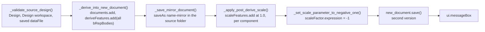

# Create Mirrored Design — Architecture

[← Create Mirrored Design guide](../MirrorDerive.md)

| | |
|---|---|
| **Command ID** | `PTPM_createmirrordesign` (the module folder is `mirrorderive`; the id does not follow the folder name) |
| **Registry** | group `partmodeling` (`Part Modeling`); enabled by default |
| **UI location** | Design workspace, **Solid** tab (`SolidTab`), **Create** panel (`SolidCreatePanel`), anchored directly after Fusion's Derive control with `addCommand(cmd_def, "FusionInsertDeriveCommand", False)`; not promoted. Both containers are built in; `start()` finds the tab through `ui.allToolbarTabs` and `stop()` removes only the control and the definition. |
| **Files** | `commands/mirrorderive/entry.py`; `resources/` holds `16x16-normal.png`, `32x32-normal.png`, `64x64-normal.png` (no dark variants) |
| **Shared helpers** | [`ptutil.add_handler`](architecture.md#event_utils); [`ptutil.log`, `ptutil.handle_error`](architecture.md#general_utils); [`config.design_workspace`](architecture.md#config) |
| **Tests** | none module-specific (see [Tests](#tests)) |

## Purpose

Derives every solid body of the active, saved design into a new document, saves it as `<name>-mirror` in the source's folder, and applies a uniform scale of −1 to each component's bodies so the copy is a mirror image of the source through its origin, without touching the source. The derive stays associative. The shaping constraint is that Fusion's scale feature does not accept a negative factor at creation time, so the feature is created at 1 and its parameter expression is edited to `-1` afterwards.

## How it is wired

- `start()`: `addButtonDefinition(...)`; `ptutil.add_handler(cmd_def.commandCreated, command_created)`; `ui.allToolbarTabs.itemById("SolidTab")` → `toolbarPanels.itemById("SolidCreatePanel")` → `controls.addCommand(cmd_def, "FusionInsertDeriveCommand", False)`, `isPromoted = False`. A missing tab or panel is logged and the definition is left without a control.
- `stop()`: deletes the control and the definition.
- `command_created(args)`: registers `execute` → `command_execute` and `destroy` → `command_destroy`. No inputs are built, so Fusion's default `isAutoExecute` runs the command immediately; the Solid tab is only reachable with a design open, so `execute` does fire ([why that matters](architecture.md#acting-from-commandcreated-when-there-are-no-inputs)).
- `command_execute(args)`, in order — every step raises `RuntimeError` with a user-facing message on failure, caught at the bottom by `ptutil.handle_error(CMD_NAME)` plus `ui.messageBox(str(e))`:
  1. `_validate_source_design()`: `app.activeProduct` casts to a Design; `ui.activeWorkspace.id == config.design_workspace`; `app.activeDocument.dataFile` exists (the design is saved). Returns `(design, data_file)`.
  2. `mirror_name = f"{app.activeDocument.name}-mirror"`.
  3. `_derive_into_new_document(source_design)`: `app.documents.add(FusionDesignDocumentType)` (the new document becomes active, so `app.activeProduct` is now the target design); `rootComponent.features.deriveFeatures.createInput(source_design)`; `sourceEntities = _collect_source_bodies(source_design)` — every `bRepBodies` entry of every `allComponents` entry — and the derive is added; `_count_bodies_in_root` (root bodies plus every occurrence's bodies) must be non-zero.
  4. `_save_mirror_document(new_document, source_data_file, mirror_name)`: `new_document.saveAs(mirror_name, source_data_file.parentFolder, "Mirrored derived design", "")`.
  5. `_apply_post_derive_scale(target_design)`: the root component plus each occurrence's component, deduplicated by `entityToken`; for each with bodies, `_add_scale_feature(component.features.scaleFeatures, bodies, component.originConstructionPoint, ValueInput.createByReal(1.0))` then `_set_scale_parameter_to_negative_one(feature)`, which sets `feature.scaleFactor.expression = "-1"` (a `ModelParameter` edit). At least one component must be scaled.
  6. `new_document.save("Created scale features at 1 and edited scale parameters to -1")` — the second version of the mirror file.
  7. `ui.messageBox(f"Created mirrored design: {mirror_name}", ...)` with OK button and information icon.
- `command_destroy(args)`: clears `local_handlers`.

## Data and state

None beyond `local_handlers`. Output is a new cloud document `<source name>-mirror` in the source's parent folder, saved twice (once after the derive, once after the scale edits). No settings keys, no temp files, no custom events.

## Two saves, and why the scale is edited rather than created at −1

`saveAs` runs *before* the scale features exist so the mirror file is established in the right folder with the derive alone; the scale pass then follows and the second `save` versions it. Each scale feature is created with a factor of 1.0 and its `scaleFactor` parameter expression is then set to `-1`, which is the parametric "scale by −1 through the origin" mirror the user guide names the Lockwood manoeuvre. The features remain editable in the mirror's timeline, and because the derive is associative the mirror follows later changes to the source.

Scaling is per component about `component.originConstructionPoint`, so every occurrence's bodies are mirrored through their own component origin, and a component reached through several occurrences is scaled once.

## Diagram

The execute pipeline, which is the only non-trivial order in the command:

## Tests

- No module-specific test. `tests/test_command_contract.py` imports `entry.py` under the `adsk` stub and checks the `CMD_ID` shape, `CMD_Description`, the registered doc filename, this note, the arch index row and the README row; `tests/test_command_abort.py` scans `command_created` for `doExecute` calls.
- `entry.py` is Fusion-bound and is not otherwise exercised by the suite; nothing here is verified in Fusion on this branch except by those AST guards. The icon set is not pinned in `tests/test_command_icons.py`.

---

*Copyright © 2026 IMA LLC. All rights reserved.*
