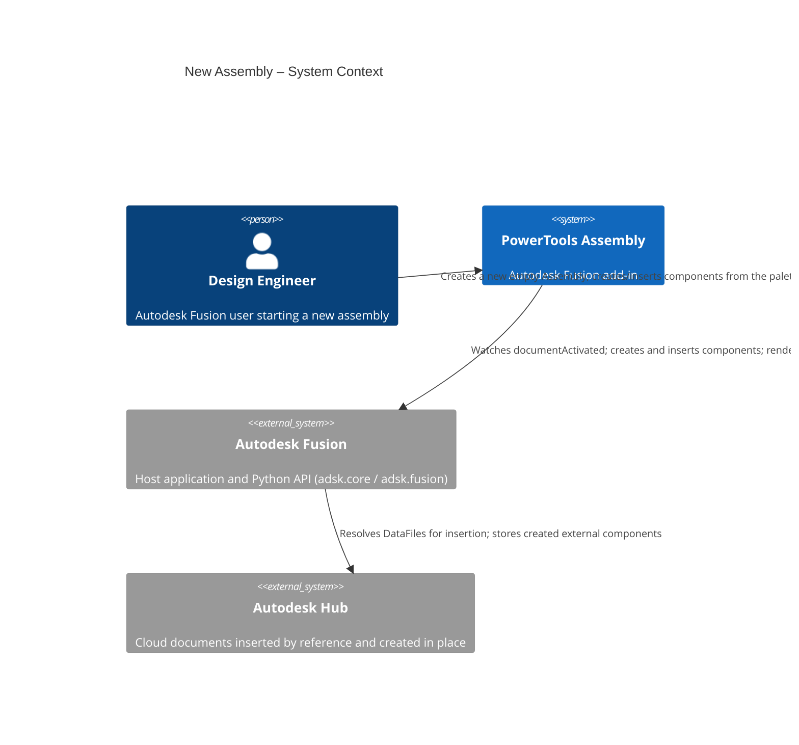
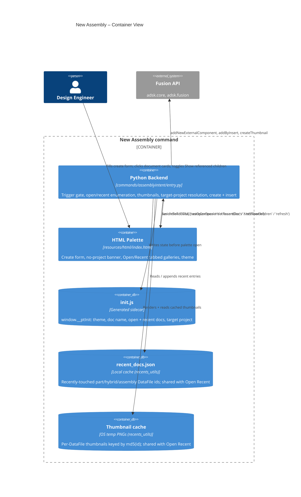
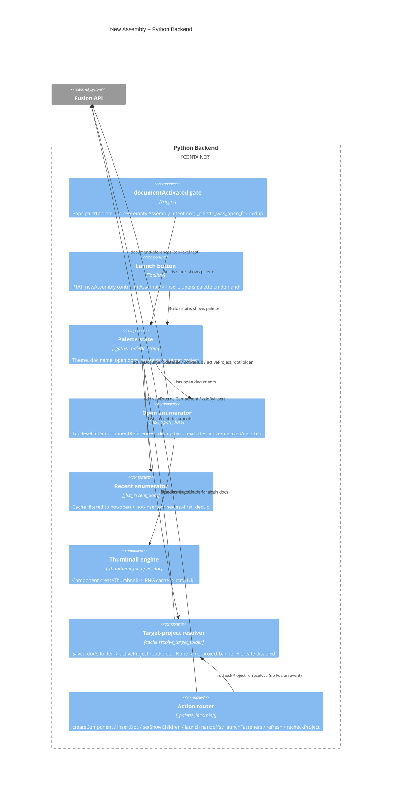

# New Assembly — Architecture
[← New Assembly guide](../New%20Assembly.md)

## Architecture

New Assembly bridges an HTML/JS palette (running in Fusion's QT WebEngine) and the Fusion Python API. The palette hosts the three quick-start sections; the Python backend watches for new empty Assembly documents, enumerates open and recent documents, renders thumbnails, and performs component creation and insertion.







### User flow

```mermaid
sequenceDiagram
    autonumber
    actor User
    participant Fusion
    participant Trigger as documentActivated gate
    participant Python as Python Backend
    participant Palette as HTML Palette

    User->>Fusion: File > New Design (Assembly intent)
    Fusion->>Trigger: documentActivated
    Trigger->>Trigger: Empty + unsaved + Assembly? not already shown?
    Trigger->>Python: _show_palette()
    Python->>Python: _gather_palette_state() (open + recent docs, thumbnails, target project)
    Python->>Palette: write init.js + palettes.add()

    opt No target project (activeProject raises id.size())
        Palette->>Palette: Show "no target project" banner + disable New Component
        User->>Palette: Select project in Data Panel; return to palette (focus) or click Re-check
        Palette->>Python: fusionSendData('recheckProject')
        Python->>Palette: sendInfoToHTML('setTargetProject') (clears banner, enables Create)
    end

    alt Create a component
        User->>Palette: Name + intent + New Component
        Palette->>Python: fusionSendData('createComponent')
        Python->>Python: cache.resolve_target_folder()
        Python->>Fusion: addNewExternalComponent + designIntent
    else Insert an open / recent document
        opt Show referenced children
            User->>Palette: Toggle checkbox
            Palette->>Python: fusionSendData('setShowChildren')
            Python->>Palette: sendInfoToHTML('setOpenDocs')
        end
        User->>Palette: Click document card
        Palette->>Python: fusionSendData('insertDoc', dataFileId)
        Python->>Fusion: occurrences.addByInsert(dataFile)
    else Hand off
        User->>Palette: Assembly Builder… / Global Parameters…
        Palette->>Python: fusionSendData('launch…')
        Python->>Fusion: commandDefinition.execute()
    else Fasteners
        User->>Palette: Fasteners ↗
        Palette->>Python: fusionSendData('launchFasteners')
        Python->>Fusion: itemById('FusionFastenersCommand').controlDefinition.isEnabled
        alt Enabled
            Python->>Fusion: commandDefinition.execute()
        else Disabled for this document
            Python->>User: messageBox explaining why
        end
    end

    Python->>Palette: sendInfoToHTML refresh (open + recent)
```

## Design decisions

### Why `documentActivated` instead of `documentOpened`?
`documentOpened` is not reliably emitted for **File > New** across Fusion builds (notably on macOS), while `documentActivated` fires consistently. It also fires on every tab switch, so a `_palette_was_open_for` gate (compared by Python object identity, not `id()`) suppresses re-popping the palette for a document it already handled. `documentOpened` is attached as a harmless backup when the running build exposes it.

### Why doesn't an insert continue into Move/Copy? (parked)
Fusion's own **Insert Component** is not one command but a chain: `FusionImportCommand` → `CommitCommand` → `SelectCommand` → `FitCommand` → `FusionMoveCommand`. `addByInsert` is only the import and commit, so a palette insert lands the component unselected at the origin and the user positions it themselves.

Replicating the remaining three steps was attempted (`_finish_insert_like_fusion`, plus `_end_active_command` to keep back-to-back inserts safe while the Move/Copy dialog stayed open) and **did not behave as expected in practice**. Both call sites are commented out and the implementation is kept, unreferenced, as the starting point for a second attempt. The three API calls are individually correct and `CommandDefinition.execute` is used the same way by the Fasteners handoff, which works — so the suspects are contextual: running the chain from inside the palette's `incomingFromHTML` handler, and the full palette refresh the caller performs immediately afterwards, which may disturb the selection Move/Copy reads. The `customEvent` deferral documented in `commands/externalize/entry.py` is the next thing to try.

One finding from that work is **retained and live**: `addByInsert` is documented to return **null** rather than raise when the insert fails — most often because the DataFile is in a different project than the host document. That previously read as success, so the palette recorded a recents entry and hid the document from both galleries for the session. The occurrence is now checked and the real reason reported.

### How are top-level documents told apart from referenced children?
Fusion answers this directly and instantly: `Document.documentReferences` raises *"Cannot get documentReferences of a non-top-level document"* for a reference-loaded child and returns the reference collection for a top-level document. The Open tab uses that in-memory check (no cloud round-trip) to show only the documents you opened directly. **Show referenced children** simply skips the filter.

### Why a generated `init.js` instead of a message handshake?
As with Assembly Builder, the palette loads asynchronously and `palettes.add()` rejects a query string on the URL. Writing `resources/html/init.js` (theme, document name, open docs, recent docs) **before** creating the palette lets the page read `window.__ptInit` synchronously and apply the correct theme before the first paint. A reopened palette is refreshed via `sendInfoToHTML` instead.

### Why render thumbnails with `Component.createThumbnail`?
The DataFile-backed cloud thumbnail did not resolve reliably in the target build. Rendering the live root component is dependable while a document is open, so thumbnails are generated for open documents and cached on disk (keyed by `md5(dataFileId)` in the OS temp folder). The Recent gallery — whose documents are closed and cannot be rendered — reuses whatever PNG was cached while the document was last open, falling back to a placeholder.

### Why is the recents cache shared with Open Recent?
The recents cache (`cache/recent_docs.json`) and the per-document thumbnail store were originally private to this command. The [Open Recent](./Open%20Recent.md) File-menu flyout surfaces the same list, so the data layer — cache format/location, thumbnail key scheme and rendering, and the `read`/`write`/`touch`/`list`/`remember` helpers — was extracted into `lib/ptAddInUtils/recents_utils` (mirroring how `cache_utils` owns the Global Parameters cache formats). New Assembly now delegates its recents helpers to that module, keeping one source of truth so the palette gallery and the File-menu flyout can never drift.

### Why a "no target project" banner (and manual re-check)?
A new external component needs a target `DataFolder` for its eventual save. The backend resolves one via `cache.resolve_target_folder()` — the active document's own folder when it is already saved, otherwise `app.data.activeProject.rootFolder`. That `activeProject` access raises `InternalValidationError('id.size()')` when the Data Panel has no project in context. Because a raise inside the palette's `incomingFromHTML` handler is swallowed by the `DEBUG`-gated `handle_error()`, this previously read to the user as **nothing happening** on *New Component*. The palette now surfaces an unresolved project as a banner and disables *New Component* until one is available. Fusion exposes **no active-project-changed event** (`Data.activeProject` is a plain property with no event), so the palette can't observe the user picking a project: it re-checks on demand instead — via a **Re-check** button on the banner and automatically when the palette page regains focus (a lightweight `recheckProject` message that re-resolves only the target folder). The same resolver and banner back the Assembly Builder's *Create Assembly* gate.

### Why does the Fasteners link execute a native command id, and why the `isEnabled` check?
Fasteners has no public insert API — `FastenerOccurrenceDefinition` is a preview class exposing only `updateSize()` / `isSizeUpToDate` for occurrences that already exist — so the only route is executing Fusion's own command definition. Its id, `FusionFastenersCommand`, is the button Fusion itself places in the `InsertAssemblePanel` (confirmed in Fusion's shipped `Resources/Toolbar/TabToolbars.xml` and `Resources/CommandDefinitions/CommandDefinitions.xml`); the editing variants use a bare `Fasteners*` prefix instead, so the naming is not symmetric and the insert id should not be guessed from them. Unlike the two PowerTools handoffs, this command is often legitimately **present but disabled** — Fusion blocks it for part-intent and direct-modeling designs, in the Form environment, for library and AnyCAD-derived components, and off-hub. `execute()` on a disabled definition is a silent no-op, which reads as a dead link, so `controlDefinition.isEnabled` is read first and the palette is left open with an explanation when it is false. The check is wrapped in `try/except` and defaults to *enabled* so a build that does not expose the control definition still lets Fusion make the call.

### Why a per-session "inserted" filter?
A document inserted from the palette is not "open in a tab," so the next refresh would re-list it under Recent and a second click would silently add a duplicate occurrence. Inserted DataFile ids are tracked for the current palette session and hidden from both galleries; the set is cleared each time the palette is opened so deliberate re-insertion is still possible in a fresh session.
