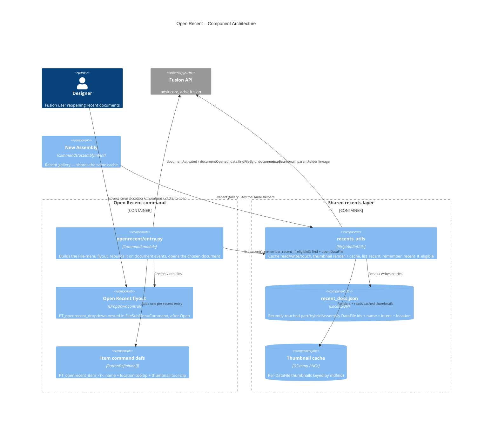
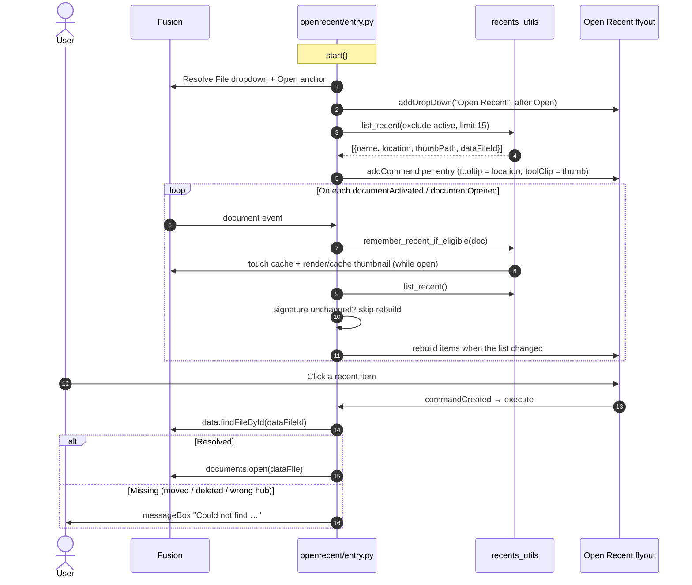

# Open Recent — Architecture
[← Open Recent guide](../Open%20Recent.md)

## Overview

**Open Recent** adds a `DropDownControl` flyout to the QAT **File** dropdown
(`FileSubMenuCommand`), positioned directly after Fusion's native **Open**
command. The flyout is populated dynamically with one button per entry in the
shared PowerTools recents cache; selecting a button opens that document.

The command owns no cache logic of its own. The recents list, the on-disk
thumbnail store, and the record/list/render helpers all live in the shared
`lib/ptAddInUtils/recents_utils` module, which is also used by the
[New Assembly](./New%20Assembly.md) palette. This keeps a single source of truth
for the recents format so the two surfaces can never drift.

### Command / control IDs

| Element | ID |
|---|---|
| Flyout (DropDownControl) | `PT_openrecent_dropdown` |
| Per-item command definitions | `PT_openrecent_item_<index>` |
| Empty-state placeholder | `PT_openrecent_empty` |

### Anchor resolution

Fusion has renamed the File-menu **Open** control across releases, so the flyout
resolves its anchor by probing a candidate list and inserting *after* the first
match, with graceful fallbacks (the same best-effort pattern Favorites and
Scripts and Add-ins use for File-menu placement):

1. after **Open** — `OpenCommand` (confirmed on the current build), then `OpenDocumentCommand`, `FusionOpenDocumentCommand`, `OpenClientCommand`, `OpenFromMyComputerCommand`, `open` as fallbacks for other releases;
2. else after **New** — `NewDocumentCommand`, `new`;
3. else before **PowerTools Preferences** — `PT_preferences` (always present; it is infrastructure);
4. else appended to the File dropdown.

A DEBUG build logs the File dropdown's actual control IDs on `start()`
(`_dump_file_menu_ids`) so the correct anchor can be confirmed on any given
Fusion version.

`addDropDown(text, resourceFolder, id, positionID, isBefore)` is documented as
`isBefore=True` → before / `False` → after, but that flag's effective direction
proved unreliable for controls added into the built-in File dropdown (the flyout
came out on the wrong side of **Open** in testing). Rather than hard-code an
assumption, `_add_flyout_positioned` **places the control, checks its actual
index relative to the anchor, and recreates it with the opposite flag if it
landed on the wrong side** — so the flyout ends up directly after **Open**
regardless of how a given Fusion build interprets the flag. `_resolve_open_anchor`
therefore returns a placement *intent* (`want_after`), not the raw flag.

## Data model

The recents cache (`cache/recent_docs.json`, owned by `recents_utils`) is a JSON
list, oldest-first:

```json
[
  {
    "dataFileId": "urn:adsk.wipprod:dm.lineage:…",
    "name": "1.5 TC Sample Valve",
    "intent": "hybrid",
    "location": "Acme > Valves > Sampling"
  }
]
```

- `dataFileId` — the document's lineage URN, used both as the dedup key and to resolve the `DataFile` for `documents.open()`.
- `name` — display text for the menu item.
- `intent` — `part` / `hybrid` / `assembly`.
- `location` — folder lineage captured while the document was open, shown in the tooltip. Absent on entries written before this field existed (tooltip degrades to name-only).

Thumbnails are cached separately as PNGs under the OS temp dir, keyed by
`md5(dataFileId)`, rendered from the live root component with
`Component.createThumbnail` while the document is open. The menu item's tooltip
tool-clip (`CommandDefinition.toolClipFilename`) points at that PNG.

## Component diagram



## Execution flow



## Design decisions

### Why a shared `recents_utils` module?
The recents cache and thumbnail store were previously private to
`commands/assemblyintent`. Surfacing the same list on the File menu meant either
duplicating that logic (two definitions of the cache path, format, thumbnail key
scheme, and limit that would inevitably drift) or extracting it. Following the
`cache_utils` precedent — "this module owns the format so it stays in sync" — the
data and thumbnail layer moved to `lib/ptAddInUtils/recents_utils`. New Assembly
now delegates to it (behavior-preserving), and Open Recent uses it directly.

### Why record recents in Open Recent too?
Open Recent registers its own `documentActivated` / `documentOpened` handlers and
calls `recents.remember_recent_if_eligible()`. This means the list (and the
thumbnail cache) keeps growing even when the Assembly command group is disabled —
Open Recent has no hard dependency on any other command. Recording is idempotent
(`touch` dedups by id) and thumbnail rendering short-circuits on the disk cache,
so having both commands record the same document costs a single render.

### Why rebuild the flyout on document events?
Fusion exposes no "menu about to open" event for a `DropDownControl`, so a
static menu would go stale. The flyout is rebuilt on document events instead
(the same approach Favorites uses to react to hub changes). Because
`documentActivated` fires on every tab switch, a cheap signature of the visible
list guards the rebuild: the command definitions are only torn down and
recreated when the visible recents actually change.

### Why capture `location` at record time?
Resolving a `DataFile`'s folder lineage requires a cloud round-trip, which is far
too expensive to do for every item on every rebuild. The lineage is instead
captured once, from the open document's `dataFile.parentFolder` chain (available
in memory for free), and stored in the cache — so the tooltip renders instantly
with no network access.

### Why open in the `execute` handler?
Each item is a button command definition. Its `commandCreated` handler registers
an `execute` handler that resolves the `DataFile` and calls `documents.open()`,
so the item's own command lifecycle completes cleanly before the document
switch — the standard launcher pattern used by PowerTools Preferences and
Scripts and Add-ins.

---

*Copyright © 2026 IMA LLC. All rights reserved.*
