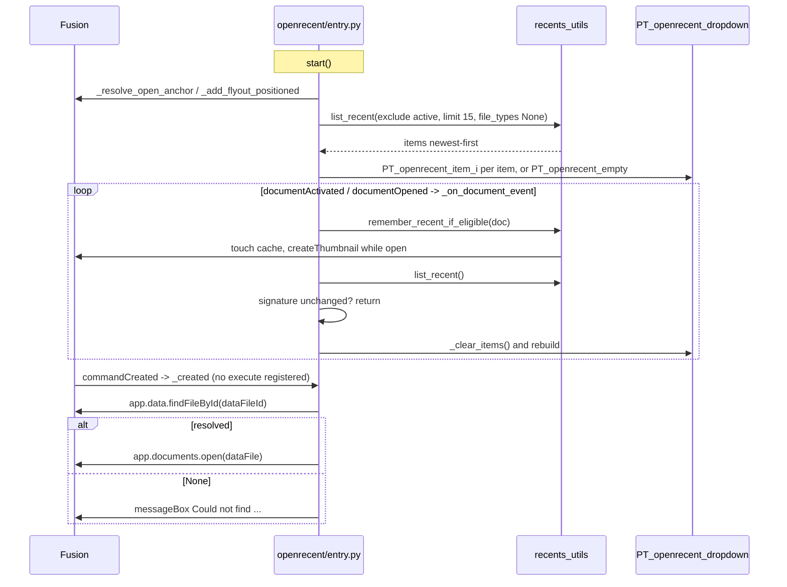

# Open Recent — Architecture

[← Open Recent guide](../Open%20Recent.md)

| | |
|---|---|
| **Command ID** | none — the control is a `DropDownControl`, `DROPDOWN_ID = "PT_openrecent_dropdown"` (listed in `KNOWN_NO_CMD_ID` in `tests/test_command_contract.py`). Per-item button definitions `PT_openrecent_item_<i>` (`ITEM_ID_PREFIX`); empty-state placeholder `PT_openrecent_empty` (`EMPTY_ITEM_ID`) |
| **Registry** | group `document` (`Document Tools`); enabled by default |
| **UI location** | flyout inside the QAT **File** dropdown (`FileSubMenuCommand`), directly after the native **Open** control; anchor ladder below |
| **Files** | `commands/openrecent/entry.py` (Fusion-bound; owns the ids, label/tooltip fallbacks and the signature fields as `SLOTS`, `item_label`, `item_tooltip`, `menu_signature`); the keep/remove rule is the shared adsk-free [`commands/_menu_plan.py`](architecture.md#_menu_plan) (`MenuSlots.plan_menu(count) -> (keep, remove)`, also used by Favorites); `ICON_FOLDER = ""` (default menu glyph, no resources folder) |
| **Shared helpers** | [`_menu_plan`](architecture.md#_menu_plan); [`recents_utils`](architecture.md#recents_utils) (`list_recent`, `remember_recent_if_eligible`, thumbnail cache), which itself overlays [`fusion_recents`](architecture.md#fusion_recents); [`ptutil.add_handler`](architecture.md#event_utils), [`ptutil.log`, `ptutil.handle_error`](architecture.md#general_utils) |
| **Tests** | `tests/test_openrecent_menu.py` (pure `_menu_plan` cases with this command's `SLOTS` plus `_rebuild_menu` driven against fakes that refuse `deleteMe()` and raise on a duplicate id); `tests/test_command_contract.py`, `tests/test_command_abort.py` |

## Purpose

Adds an **Open Recent** flyout to the File menu with one button per recently used document (name as the label, Data Panel location as the tooltip, cached thumbnail as the tool-clip); clicking one opens that document. The command owns no data: the list, its ordering and the thumbnail store live in the shared `recents_utils` module also used by [Assembly Palette](Assembly%20Palette.md), so the two surfaces cannot drift. The shaping constraint is that a recents menu matters most on the start screen, where no document is open — so an item must act from `commandCreated`, not `execute`.

## How it is wired

- `start()`, in order:
  1. `_qat_file_dropdown()` — `ui.toolbars.itemById("QAT").controls.itemById("FileSubMenuCommand")` cast to `DropDownControl` (a local helper, not `ptutil.get_qat_file_dropdown`); `None` -> log and return.
  2. `_dump_file_menu_ids(file_dd)` logs every control id in the File dropdown (visible only with `.debug`).
  3. Deletes any stale `DROPDOWN_ID` control.
  4. `_resolve_open_anchor(file_dd)` -> `(anchor_id, want_after)`; with an anchor, `_add_flyout_positioned(...)`; without, `file_dd.controls.addDropDown(CMD_NAME, "", DROPDOWN_ID)` (appended).
  5. `_last_signature = None`, then `_rebuild_menu()`.
  6. `_on_document_event` registered on `app.documentActivated`, and on `app.documentOpened` when that attribute exists (`getattr` + `try`).
- `stop()`: `_clear_items()` sweeps the full id range the flyout can ever own (`SLOTS.all_ids()`), deleting control then definition and re-querying rather than trusting the bool; then deletes the flyout control and resets `_dropdown`, `_item_targets`, `_leftover_ids`, `_last_signature`, `local_handlers`.
- `_on_document_event(args)`: `recents.remember_recent_if_eligible(args.document)` (records a saved part/hybrid/assembly document with its folder lineage and renders its thumbnail while it is open), then `_rebuild_menu()`. Errors go to `ptutil.handle_error`.
- `_rebuild_menu()`: `recents.list_recent(exclude_ids={active dataFile id}, limit=MENU_LIMIT (15), file_types=None)` — every file type, since opening a drawing from the File menu is as reasonable as a design. Builds a signature `(dataFileId, name, location, version, bool(thumbPath))` per item and returns early when it equals `_last_signature` and the flyout is non-empty, because `documentActivated` fires on every tab switch. Otherwise `_last_signature` is cleared first (so a mid-rebuild exception cannot freeze a half-built menu behind the fast path), `SLOTS.plan_menu` splits the id range into `keep` and `remove`, and each kept slot `i` goes through `_ensure_definition` -- reuse the owned definition in place (`name`, `tooltip`, `toolClipFilename` are writable), adopt or recreate a foreign one, never `addButtonDefinition` for an id that is still present -- and `_ensure_control`, which adds the control only if missing, positioned after the previous slot. `_remove_item` handles the complement; an id Fusion refuses to delete (its command is in flight) goes into `_leftover_ids`, which disables the fast path until it is gone. The signature is stored only after the build completes.
- `_make_open_handler(cmd_id)` returns `_created`, registered once per definition for its lifetime; at click time it reads the slot's current target from `_item_targets` and calls `_open_recent(df_id, name)` directly from `commandCreated` ([pattern](architecture.md#acting-from-commandcreated-when-there-are-no-inputs)): `_find_data_file_by_id` (`app.data.findFileById`, guarded) -> `app.documents.open(data_file)`; an unresolved id shows "Could not find ..." (moved, deleted or wrong hub), an exception shows "Unable to open ...". No `execute` handler is registered anywhere in the module.

### Anchor resolution

`_resolve_open_anchor` returns a placement *intent* (`want_after`), not a raw `isBefore` flag:

1. after **Open** — first present of `OpenCommand`, `OpenDocumentCommand`, `FusionOpenDocumentCommand`, `OpenClientCommand`, `OpenFromMyComputerCommand`, `open`;
2. else after **New** — `NewDocumentCommand`, `new`;
3. else before **PowerTools Preferences** — `PT_preferences` (infrastructure, always present);
4. else `("", True)` — appended.

`_add_flyout_positioned(file_dd, anchor_id, want_after)` tries `isBefore = not want_after` (the documented mapping) and then the opposite: after each `addDropDown`, `_control_index` reads the real indices of anchor and flyout, keeps the control if it landed on the requested side, otherwise `deleteMe()` and retries. If neither flag verifies, it adds once more with the documented flag so the flyout is at least present. The direction actually used is logged.

## Data and state

- Module-level: `_dropdown`, `_item_targets` (slot -> current `(dataFileId, name)`), `_leftover_ids`, `_last_signature`, `local_handlers`. One `commandCreated` handler per definition for its lifetime; released together in `stop()`.
- Read and written through `recents_utils` (paths owned there): `cache/recent_docs.json` (`RECENT_CACHE_PATH`, a JSON list oldest-first, at most `RECENT_LIMIT = 300` entries) and the thumbnail directory (`THUMB_DIR`, `cache/thumbs` when writable, PNGs keyed by `md5(dataFileId)`; reads also consider the legacy temp-dir location). This command writes to both through `remember_recent_if_eligible`; Assembly Palette is the other writer.
- No settings keys, custom events or temp files of its own.

## Data model

`list_recent` returns items newest-first, deduped by DataFile id: `{dataFileId, name, intent, location, thumbPath, version}`. Fusion's own recents list (`fusion_recents`) is the source of the entries and their order; the PowerTools cache is overlaid on top for the two things Fusion's file lacks — the design intent and the thumbnail — and is the sole source when no native list is readable. The cache entry itself is:

```json
{
  "dataFileId": "urn:adsk.wipprod:dm.lineage:…",
  "name": "1.5 TC Sample Valve",
  "intent": "hybrid",
  "location": "Acme > Valves > Sampling"
}
```

- `dataFileId` — lineage URN; the dedup key and the argument to `findFileById`.
- `name` — the button label.
- `intent` — `part` / `hybrid` / `assembly` (`recents_utils.DESIGN_INTENTS`).
- `location` — folder lineage captured from the open document's `dataFile.parentFolder` chain at record time, because resolving it later would cost a cloud round-trip per item on every rebuild. Absent on older entries; the tooltip then degrades to the generic text.
- `version` is part of the rebuild signature so a re-saved document refreshes its tool-clip.

## Diagram

The rebuild loop and the click path, with the handles each step touches.


```mermaid
sequenceDiagram
    participant Fusion
    participant Entry as openrecent/entry.py
    participant Recents as recents_utils
    participant Flyout as PT_openrecent_dropdown

    Note over Entry: start()
    Entry->>Fusion: _resolve_open_anchor / _add_flyout_positioned
    Entry->>Recents: list_recent(exclude active, limit 15, file_types None)
    Recents-->>Entry: items newest-first
    Entry->>Flyout: PT_openrecent_item_i per item, or PT_openrecent_empty

    loop documentActivated / documentOpened -> _on_document_event
        Entry->>Recents: remember_recent_if_eligible(doc)
        Recents->>Fusion: touch cache, createThumbnail while open
        Entry->>Recents: list_recent()
        Entry->>Entry: signature unchanged? return
        Entry->>Flyout: _clear_items() and rebuild
    end

    Fusion->>Entry: commandCreated -> _created (no execute registered)
    Entry->>Fusion: app.data.findFileById(dataFileId)
    alt resolved
        Entry->>Fusion: app.documents.open(dataFile)
    else None
        Entry->>Fusion: messageBox Could not find ...
    end
```

## Tests

- `tests/test_command_contract.py` — imports `entry.py` under the `adsk` stub; checks `CMD_Description` and the registry/doc/README contract; pins `openrecent` as one of exactly three modules without a `CMD_ID` and `PT_openrecent_dropdown` / `PT_openrecent_item_` / `PT_openrecent_empty` as known non-command ids.
- `tests/test_command_abort.py` — the `doExecute` AST guard; pins that the `_created` closure returned by `_make_open_handler` is found by the registration walk.

- `tests/test_openrecent_menu.py` -- `_menu_plan` buckets and bounds with this command's `SLOTS`, the signature and label fallbacks; and `_rebuild_menu` against fake `commandDefinitions`/controls that raise on a duplicate id and refuse `deleteMe()` for a locked id: ordered first build, unchanged-list no-op, the logged in-flight-slot sequence (reused, no second add, one handler), grow/shrink, placeholder, mid-rebuild exception retried, foreign definition adopted once, refused deletion retried despite an unchanged signature, click opens the slot's current target, `_clear_items` sweeps ghosts.

The anchor ladder, `isBefore` probing and `findFileById` are still Fusion-only behaviour and are not exercised by the suite. No icon set is pinned in `tests/test_command_icons.py`. The anchor ladder, the `isBefore` probing and `findFileById` are Fusion-only behaviour; the shared layer is covered separately by `tests/test_recents_utils.py` and `tests/test_fusion_recents.py`.

## Learnings

- **Items open from `commandCreated`, never from `execute`.** Fusion runs commands through a document-scoped pipeline: with no document open, `commandCreated` fires but the command terminates without raising `execute`. An `execute`-based open therefore did nothing on the start screen — the one place a recents menu matters most. These items have no `CommandInputs`, so there is nothing for `execute` to commit. Same fix as Preferences (`f18b911`, `11cfc51`).
- **`addDropDown(..., positionID, isBefore)` is not trusted for the built-in File dropdown.** Documented as `True` -> before / `False` -> after, but the flyout came out on the wrong side of **Open** in testing. `_add_flyout_positioned` verifies the landed index and retries with the opposite flag rather than hard-coding either reading.
- **Fusion has renamed the File-menu Open control across releases.** `OpenCommand` is the id confirmed on the current build; the rest of `_OPEN_ANCHOR_CANDIDATES` are fallbacks, and `_dump_file_menu_ids` exists so the real ids can be read off a DEBUG log on any build instead of guessed.

---

*Copyright © 2026 IMA LLC. All rights reserved.*
