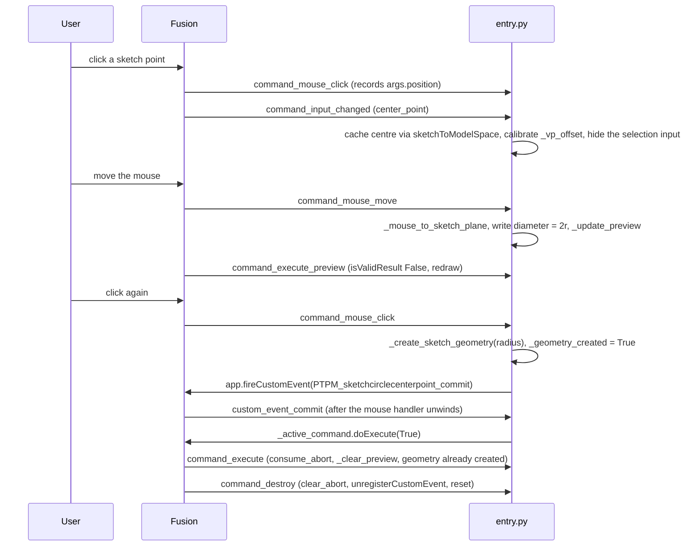

# Radial Hole Circle — Architecture

[← Radial Hole Circle guide](../RadialHoleCircle.md)

| | |
|---|---|
| **Command ID** | `PTPM_sketchcirclecenterpoint` |
| **Registry** | group `partmodeling` (`Part Modeling`); **beta** and in [`DEFAULT_DISABLED_COMMANDS`](architecture.md#settings_store), so it starts only when beta mode is on *and* the user has enabled it |
| **UI location** | Design workspace, **Sketch** tab (`SketchTab`), **Create** panel (`SketchCreatePanel`); appended, not promoted. Both are built in; `start()` finds the tab through `ui.allToolbarTabs` and `stop()` removes only the control and the definition. |
| **Files** | `commands/sketchcirclecenterpoint/entry.py`; `resources/` holds only `16x16-normal.png` and `32x32-normal.png` (no 64 px, no dark variants) |
| **Shared helpers** | [`abort_before_dialog`, `consume_abort`, `clear_abort`](architecture.md#_command_abort); [`ptutil.add_handler`](architecture.md#event_utils); [`ptutil.log`](architecture.md#general_utils) |
| **Tests** | none module-specific (see [Tests](#tests)) |

## Purpose

In an active sketch, pick a sketch point or vertex as centre, drag to size a construction circle with a live preview, and click (or type a diameter and press Create) to commit. The commit adds the circle, a coincident constraint to the picked point, a diameter dimension, a sketch point at the top of the circle constrained onto it, and a vertical construction line from centre to that point. The shaping constraint is that the whole interaction runs on raw mouse events, so the command has to map window pixels to the sketch plane itself and defer its own close through a custom event.

## How it is wired

- `start()` / `stop()`: definition with `commandCreated` → `command_created`; control appended to `SketchCreatePanel`; `stop()` deletes the control and the definition.
- `command_created(args)`: if `app.activeProduct` is not a Design whose `activeEditObject` is a `Sketch`, shows a message box, calls `abort_before_dialog(CMD_ID, CMD_NAME, "no active sketch")` and returns with no inputs ([aborting a command before its dialog](architecture.md#aborting-a-command-before-its-dialog)). Otherwise sets `okButtonText = "Create"`, caches `_active_command` and `_cmd_inputs`, and builds `center_point` (selection input; filters `SketchPoints`, `Vertices`; limits 1,1) and `diameter` (value input in `unitsManager.defaultLengthUnits`, initial `ValueInput.createByReal(2.5)` = 25 mm). Registers `execute`, `executePreview`, `validateInputs`, `inputChanged`, `mouseMove`, `mouseClick` and `destroy`; then `app.registerCustomEvent("PTPM_sketchcirclecenterpoint_commit")` and binds `custom_event_commit` to it. The event is registered per invocation and unregistered in `command_destroy`.
- `command_mouse_click(args)`: fires for every click. A left click always records `args.position` in `_selection_click_pos` (window coordinates), so the click that selects the centre is available for calibration. Once a centre exists: `_mouse_to_sketch_plane(args)` → radius; writes `diameter = 2r`; if `_geometry_created` return; else `_create_sketch_geometry(radius)`, set `_geometry_created`, and `app.fireCustomEvent(_COMMIT_EVENT_ID)`.
- `command_input_changed(args)` (only `center_point`): with one selection, caches `_preview_sketch` and `_preview_selected_entity`; the world centre is `sketch.sketchToModelSpace(Point3D(sk_pt.geometry.x, .y, 0))` for a `SketchPoint` and `entity.geometry` for a vertex; calibrates `_vp_offset_x/y = _selection_click_pos − viewport.modelToViewSpace(centre)`; then hides the selection input so Fusion stops routing mouse events through selection and `mouseMove` flows freely. A cleared selection resets the state and calls `_clear_preview()`.
- `command_mouse_move(args)`: requires a centre; `_mouse_to_sketch_plane(args)` → radius; writes `diameter = 2r` into the input (which itself triggers `executePreview`), then also calls `_update_preview(radius, hit)` directly and refreshes the viewport. See [Learnings](#learnings) for why that direct draw matters.
- `command_execute_preview(args)`: sets `args.isValidResult = False` and, if a centre exists and `diameter > 0`, redraws with `_update_preview(diameter / 2)`.
- `command_validate(args)`: OK is enabled when `_preview_center_model` and `_preview_sketch` are set and `diameter > 0`; it reads module state because the selection input is hidden after the pick.
- `custom_event_commit(args)`: runs after the mouse handler has unwound and calls `_active_command.doExecute(True)`. This is one of the three deliberate `doExecute` sites in the add-in: it is outside `commandCreated` (the only callback rule 20 bans), and it is deferred because Fusion raises `RuntimeError` for `doExecute` called from inside any command event handler.
- `command_execute(args)`: `consume_abort` first; `_clear_preview()`; return if `_geometry_created`; otherwise the OK/Enter fallback creates the geometry from the current `diameter` value.
- `command_destroy(args)`: `clear_abort(CMD_ID)`, `_clear_preview()`, `unregisterCustomEvent`, and every module global reset.

## Data and state

Module globals: `_preview_center_model`, `_preview_sketch`, `_preview_selected_entity`, `_cmd_inputs`, `_active_command`, `_selection_click_pos`, `_vp_offset_x`, `_vp_offset_y`, `_geometry_created`, `local_handlers`. Custom event id `PTPM_sketchcirclecenterpoint_commit`; custom graphics group id `PTPM_sketchcirclecenterpoint_preview`. No settings keys, no files. `WORKSPACE_ID = config.design_workspace` is defined but not referenced.

## Coordinate spaces

`MouseEventArgs.position` is in **application-window** pixels, while `Viewport.modelToViewSpace()` returns **viewport-local** pixels. They share a scale and differ by a constant offset (the viewport's top-left corner in the window). The offset is calibrated once, at the moment the centre is selected, when both the click position and the projected centre are known, and subtracted on every `mouseMove`.

`_mouse_to_sketch_plane(args)` avoids camera maths entirely: it projects the centre and two points 1 cm along sketch X and sketch Y through `modelToViewSpace`, giving a 2×2 screen basis (pixels per centimetre along each sketch axis), then solves that system for the cursor's offset from the projected centre to get sketch-local `(a, b)` in centimetres and returns `sketch.sketchToModelSpace(centre + (a, b))`. A determinant near zero (sketch edge-on) returns `None`, so the preview freezes rather than jumps. Measure Path sidesteps the calibration by using `MouseEventArgs.viewportPosition` instead of `position`.

Sketch point positions go through `sketch.sketchToModelSpace()`, never `SketchPoint.worldGeometry`, which can return the origin for some point types (code comment; the same pipeline Measure Path uses).

## Preview graphics

`_update_preview(radius, hit)` calls `_clear_preview()` (walks `rootComponent.customGraphicsGroups` in reverse deleting every group whose `id` is the tag, rather than trusting a cached reference), then adds a group with that id containing a white 1-weight `Circle3D.createByCenter(centre, normal, radius)` and, when a cursor hit is given, a crosshair whose arms are 8 px long in model units sized from the sampled pixels-per-centimetre at the hit (fallback 4 mm).

## What the commit creates

`_create_sketch_geometry(radius)` maps the centre to sketch space and adds, in order: (1) `sketchCircles.addByTwoPoints(left, right)` with `isConstruction = True`; (2) `addCoincident(circle.centerSketchPoint, picked entity)`; (3) `addDiameterDimension` with its text at 0.75 r up-right; (4) `sketchPoints.add(top)`; (5) `addCoincident(point, circle)`; (6) `sketchLines.addByTwoPoints(centre, point)` as construction; (7) `addVertical(line)`. Positions are computed in sketch space and converted with `sketchToModelSpace`.

## Diagram

The click-to-commit sequence, including the custom-event deferral that lets `doExecute` run outside the mouse handler:

## Tests

- No module-specific test. `tests/test_command_contract.py` imports `entry.py` under the `adsk` stub and checks the `CMD_ID` shape, `CMD_Description`, the registered doc filename, this note, the arch index row and the README row; `tests/test_command_abort.py::test_no_command_created_calls_do_execute` scans `command_created` and passes because the `doExecute` call sits in `custom_event_commit`.
- `entry.py` is Fusion-bound and is not otherwise exercised by the suite; nothing here is verified in Fusion on this branch except by those AST guards. The icon set is not pinned in `tests/test_command_icons.py`.

## Learnings

**Custom graphics drawn outside `executePreview` flash and vanish, and this command still does it.** `command_mouse_move` writes the diameter into the value input, which triggers a preview that redraws, and *then* calls `_update_preview` directly; the direct draw is built outside the preview transaction and is aborted by the next cycle, so the two fight and the circle flickers. That is the reason the command ships disabled. Removing the direct call is the suspected fix, not yet exercised in Fusion ([Custom graphics that stay painted](../dev/Custom%20graphics%20that%20stay%20painted.md#known-outstanding-sketchcirclecenterpoint), `b3bed5f`).

**`doExecute` cannot be called from inside a command event handler, and never from `commandCreated`.** From a mouse handler Fusion raises `RuntimeError`, so the commit is deferred through `fireCustomEvent` → `custom_event_commit`. From `commandCreated` it segfaults Fusion, so the no-sketch path uses `abort_before_dialog` instead ([lessons](../dev/lessons.md), `14871d7`).

**`SketchPoint.worldGeometry` can return the origin.** Both this command and Measure Path go through `sketch.sketchToModelSpace(sketchPoint.geometry)` instead.

---

*Copyright © 2026 IMA LLC. All rights reserved.*
