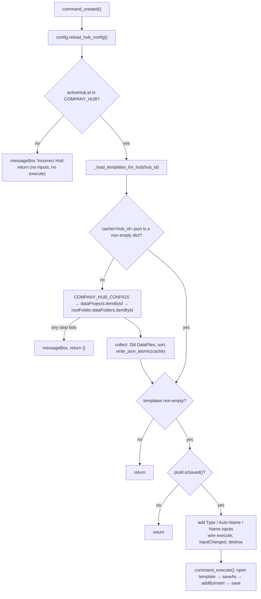

# Create Related Data — Architecture

[← Create Related Data guide](../Related%20Data.md)

| | |
|---|---|
| **Command ID** | `f"{config.COMPANY_NAME}_{config.ADDIN_NAME}_cmdDialog"`, which resolves to `IMA LLC_PowerTools_cmdDialog` when the add-in folder is named `PowerTools`. The space breaks rule 9 (Fusion IDs use `_` only); the module is allowlisted in `KNOWN_NONLITERAL_CMD_IDS` in `tests/test_command_contract.py`, and the ID is not fixed because renaming a `CMD_ID` orphans users' QAT pins. |
| **Registry** | group `related` (`Related Data`); enabled by default |
| **UI location** | Design workspace `FusionSolidEnvironment` → tab `SolidTab` → panel `SolidCreatePanel`, promoted (`IS_PROMOTED = True`); appended, no anchor |
| **Files** | `commands/relateddata/entry.py`; `resources/` (16/32/64 light, dark, disabled PNGs); `Sample data.json` (`{"PROJECT_ID": "TODO…", "FOLDER_ID": "TODO…"}` — read by nothing; it is tracked, so it ships in the release zip, and `tests/test_release_build.py` pins that it does) |
| **Shared helpers** | [`config`](architecture.md#config) (`COMPANY_HUB`, `COMPANY_HUB_CONFIGS`, `reload_hub_config`, `CACHE_PATH`); [`ptutil.add_handler`](architecture.md#event_utils); [`ptutil.read_json`, `write_json_atomic`](architecture.md#json_utils); [`ptutil.isSaved`, `ptutil.log`](architecture.md#general_utils) |
| **Tests** | `tests/test_relateddata_cache.py`, `tests/test_command_contract.py`, `tests/test_release_build.py` |

## Purpose

Creates a new document from a template held in the hub's configured templates folder, saves it next to the active document as `<active name> ‹+› <template name>`, and inserts the active document into it as an external reference. The constraint that shapes it: the template list is read from the hub once per hub and cached on disk, so after the first run the dialog opens with no hub round-trip. Which hub, project and folder to read comes from `cache/hub.json`, written by [Select Related Data Folder](Select%20Related%20Data%20Folder.md).

## How it is wired

- `start()`: reuses the button definition if `ui.commandDefinitions.itemById(CMD_ID)` already exists (an unclean dev reload), otherwise `addButtonDefinition`; wires `commandCreated` → `command_created` with [`ptutil.add_handler`](architecture.md#event_utils); looks up `SolidTab` and `SolidCreatePanel` (both built-in, so the `add` fallbacks never run); deletes every stale control with `CMD_ID` in the panel, then `controls.addCommand` and `isPromoted = True`.
- `stop()`: deletes every control with `CMD_ID` in `SolidCreatePanel`, then the definition.
- `command_created(args)`, in order:
  1. `config.reload_hub_config()` so a hub configured since start-up is visible; `_active_hub_id = app.data.activeHub.id`.
  2. `_active_hub_id not in config.COMPANY_HUB` → "Incorrect Hub" message box, return.
  3. `my_DocsDictSorted = _load_templates_for_hub(_active_hub_id)` (see below); empty → return, the loader has already shown its message.
  4. [`ptutil.isSaved()`](architecture.md#general_utils) false → return (it shows the "Please Save" prompt).
  5. Adds the inputs: drop-down `dropDownCommandInput` ("Type", `LabeledIconDropDownStyle`) — every template is added with `isSelected=True`, so the last template in sorted order is the initial selection and seeds `docTitle` / `docURN`; boolean `boolvalueInput_` ("Auto-Name", on); string `stringValueInput_` ("Name", disabled, pre-filled with `docTitle`).
  6. Wires `execute` → `command_execute`, `inputChanged` → `command_input_changed`, `destroy` → `command_destroy`.

  Every early return happens before any input is added and before `execute` is wired, so the command terminates without running anything.
- `command_input_changed(args)`: on `dropDownCommandInput`, finds the template whose values contain the selected name, sets `docURN` and rewrites the Name field to `docSeed + " ‹+› " + <template name>`; on `boolvalueInput_`, disables the Name field when Auto-Name is on and enables it when off.
- `command_execute(args)`: `app.data.findFileById(docURN)`; `docSeed` is the active document's name with the trailing ` vN` version token stripped (`rsplit(" ", 1)[0]`); reads the Name field; `app.documents.open(template)`; `docNew.saveAs(name, docActive.dataFile.parentFolder, "Auto created by related data add-in", "")`; casts the new document's design and calls `rootComponent.occurrences.addByInsert(docActive.dataFile, identity Matrix3D, True)`; `docNew.save("Auto saved by related data add-in")`. The new document stays open and active.
- `command_destroy(args)`: resets `local_handlers`.

## Data and state

- Module globals: `_active_hub_id`, `docSeed`, `docTitle`, `docURN`, `my_DocsDictSorted`, `local_handlers`. All are repopulated in `command_created`.
- `cache/<hub_id>.json` (`config.CACHE_PATH`): `{"<template name>dict": {"name": ..., "urn": <DataFile.id>}, ...}`, keys sorted. Written once on a miss by `_load_templates_for_hub`; nothing in the add-in deletes or refreshes it, so a template added to the hub folder later is not seen until the file is removed by hand.
- `cache/hub.json`: read through `config.loadHub` / `reload_hub_config` into `COMPANY_HUB` (list of hub ids) and `COMPANY_HUB_CONFIGS` (`hub_id → {name, project_id, project_name, folder_id, folder_name}`).
- Settings keys: none. Custom events: none.

## Template resolution

`_load_templates_for_hub(hub_id)`:

1. `_load_templates_from_cache(cache/<hub_id>.json)` — `read_json` result must be a non-empty `dict`; a missing, unreadable, corrupt, empty or non-dict file is a miss, never an exception inside the handler.
2. On a miss, `config.COMPANY_HUB_CONFIGS[hub_id]` must exist and carry both `project_id` and `folder_id`; then `app.data.activeHub.dataProjects.itemById(project_id)` and `project.rootFolder.dataFolders.itemById(folder_id)` must both resolve. Each failure shows its own message box ("Hub Not Configured", "Incomplete Hub Config", "Project Not Found", "Folder Not Found") and returns `{}`.
3. Every `DataFile` in the folder with `fileExtension == "f3d"` becomes `{"name", "urn"}`; the dict is sorted by key and written with `write_json_atomic`.

The folder lookup is `rootFolder.dataFolders.itemById`, so the templates folder must be a direct child of the project root.

## Diagram

The gate sequence in `command_created`, with the cache branch inside `_load_templates_for_hub`:

## Tests

- `tests/test_relateddata_cache.py` — `_load_templates_from_cache` treats a missing, corrupt, empty or non-dict file as a miss and returns a valid dict unchanged.
- `tests/test_release_build.py` — `commands/relateddata/Sample data.json` is among the tracked paths asserted to ship in the release zip (`test_runtime_paths_ship`).
- `tests/test_command_contract.py` — registry/doc/description contract; pins `relateddata` in `KNOWN_NONLITERAL_CMD_IDS` and asserts the resolved `CMD_ID` still violates the ID shape.

Not covered: `entry.py` is Fusion-bound and is not exercised by the suite; nothing here is verified in Fusion on this branch except by the AST guards in `tests/test_command_contract.py` and `tests/test_command_abort.py`, which import it under the `adsk` stub. The icon set is not pinned in `tests/test_command_icons.py`.

---

*Copyright © 2026 IMA LLC. All rights reserved.*
