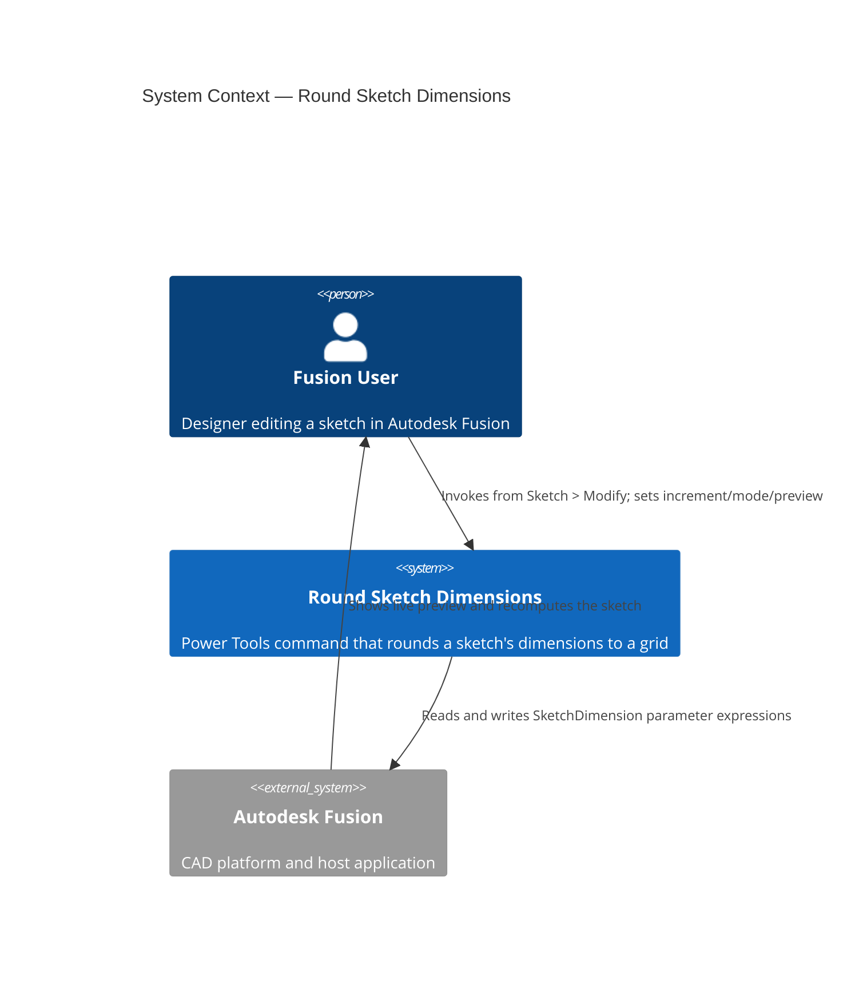
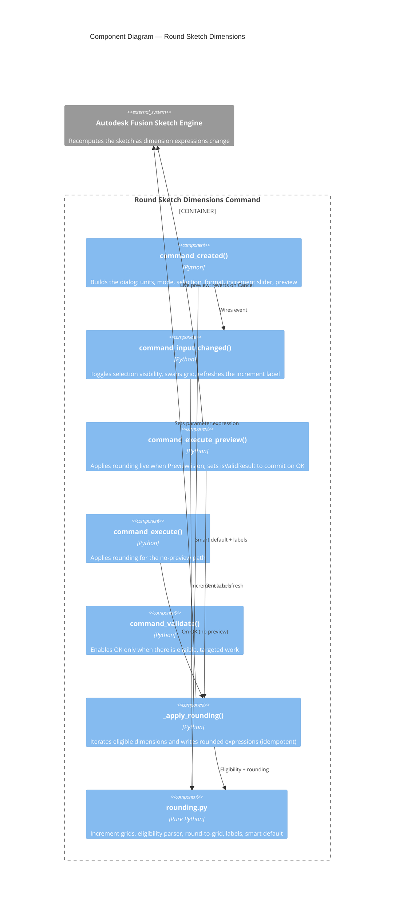

# Round Sketch Dimensions — Architecture

[← Round Sketch Dimensions guide](../Round%20Sketch%20Dimensions.md)

## Command identity

- **CMD_ID:** `PTPM-roundsketchdimensions`
- **Location:** Design workspace → **Sketch** tab → **Modify** panel (`SketchTab` / `SketchModifyPanel`).
- **Module:** `commands/roundsketchdimensions/` — `entry.py` (Fusion wiring + apply) and `rounding.py` (pure math).

## Design decisions

- **Pure/impure split.** All value math — increment grids, plain-numeric-expression detection, rounding, label formatting, and the smart-default heuristic — lives in `rounding.py`, which imports no `adsk` and no sibling module, so it is unit-tested outside Fusion (`tests/test_roundsketchdimensions_rounding.py`). `entry.py` holds only the command lifecycle, dialog, and the sketch read/write.
- **Idempotent apply.** `_apply_rounding` reads each dimension's *current* value and snaps it, so re-running it (as happens on every preview refresh) never compounds. This is what makes the preview/rollback model robust.
- **Parametric-intent preservation.** Only dimensions whose expression is a plain constant are rounded; formula/parameter-driven expressions and read-only (driven/reference) parameters are skipped. Read-only writes are additionally guarded by try/except.
- **Fixed-length increment grids.** For imperial documents the Fractions and Decimal grids share a length, so the increment slider is created once (min/max never change) and only its index interpretation and label change when the format is toggled.
- **Grid unit.** Metric documents round on a millimetre grid; imperial documents round on an inch grid. Values are read from the parameter in internal centimetres and converted with a fixed `cm-per-unit` factor, avoiding a dependency on `unitsManager.convert`.

### System context

### Component diagram

