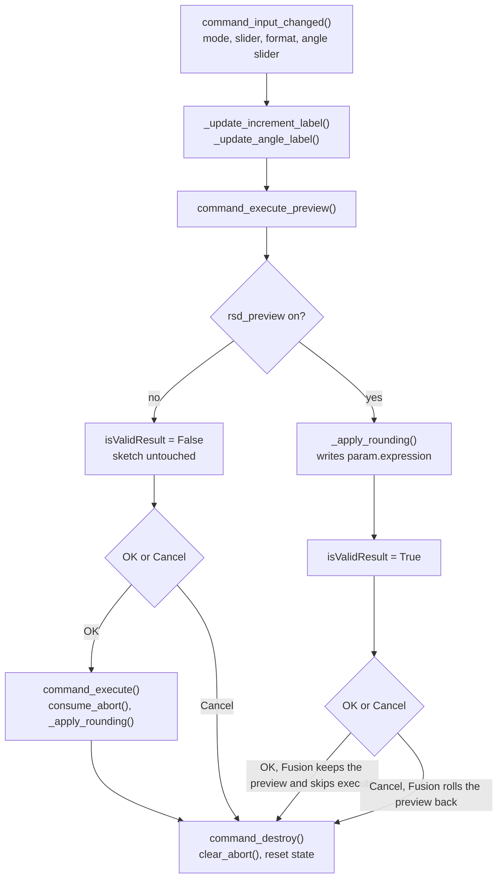

# Round Sketch Dimensions — Architecture

[← Round Sketch Dimensions guide](../Round%20Sketch%20Dimensions.md)

| | |
|---|---|
| **Command ID** | `PTPM_roundsketchdimensions` |
| **Registry** | group `partmodeling` (`Part Modeling`); enabled by default |
| **UI location** | Design workspace, **Sketch** tab (`SketchTab`), **Modify** panel (`SketchModifyPanel`); appended at the end of the panel, not promoted. Both containers are built in; `start()` finds the tab through `ui.allToolbarTabs`, and `stop()` removes only the control and the definition. |
| **Files** | `commands/roundsketchdimensions/entry.py` (Fusion wiring, eligibility, apply); `rounding.py` (pure math, no `adsk`, no relative imports); `resources/` PNG icons (16/32/64, light and dark) |
| **Shared helpers** | [`abort_before_dialog`, `consume_abort`, `clear_abort`](architecture.md#_command_abort); [`ptutil.add_handler`](architecture.md#event_utils); [`ptutil.log`](architecture.md#general_utils) |
| **Tests** | `tests/test_roundsketchdimensions_rounding.py` |

## Purpose

Snaps the length and angular dimensions of the sketch being edited to a chosen grid: millimetres for metric documents, fractional or decimal inches for imperial ones, degrees for angles in every document. A smart default sizes the grid to the sketch, the scope can be narrowed to selected dimensions or everything except them, and a live preview applies the rounding as the slider moves, reverting on Cancel and committing on OK. Formula-driven and driven (reference) dimensions are never touched, so parametric intent survives. The shaping constraint is that the preview *edits the sketch*, so the apply step has to be idempotent.

## How it is wired

- `start()`: `addButtonDefinition(...)`; `ptutil.add_handler(cmd_def.commandCreated, command_created)`; `ui.allToolbarTabs.itemById("SketchTab")` → `toolbarPanels.itemById("SketchModifyPanel")` → `controls.addCommand(cmd_def)`, `isPromoted = False`. A missing tab or panel is logged, not message-boxed.
- `stop()`: deletes the control and the definition only.
- `command_created(args)`: if `app.activeProduct` is not a Design whose `activeEditObject` is a `Sketch`, shows a message box, calls `abort_before_dialog(CMD_ID, CMD_NAME, "no active sketch")` and returns with no inputs ([aborting a command before its dialog](architecture.md#aborting-a-command-before-its-dialog)). Otherwise caches `_cached_sketch` and `_is_imperial` (`unitsManager.defaultLengthUnits in ("in", "ft")`), chooses the length grid (`rounding.fraction_increments()` or `rounding.MM_INCREMENTS`), computes `_eligible_magnitudes` and `_eligible_angle_magnitudes`, and picks both default slider indices with `rounding.smart_default_index`. Sets `okButtonText = "Round"` and builds, in order: `rsd_units` (read-only text), `rsd_mode` dropdown (`Round all dimensions` selected, `Only round selected dimensions`, `Ignore selected dimensions`), `rsd_selection` (selection input, no filter because Fusion has none for sketch dimensions, limits 0,0, hidden), `rsd_format` dropdown (`Fractions` selected, `Decimal`; visible only when imperial and there are length dimensions), `rsd_slider` (integer slider over the length grid), `rsd_incr_label`, `rsd_angle_slider` (over `rounding.DEG_INCREMENTS`), `rsd_angle_label`, `rsd_preview` (checkbox, on). Labels are filled by `_update_increment_label` and `_update_angle_label`. Registers `execute`, `executePreview`, `validateInputs`, `inputChanged` and `destroy`.
- `command_input_changed(args)`: `rsd_mode` shows or hides `rsd_selection` (clearing it for *all*) and sets its tooltip; `rsd_slider` or `rsd_format` refreshes the length label; `rsd_angle_slider` refreshes the angle label.
- `command_validate(args)`: in a selection mode at least one pick is required; then OK is enabled only if `_count_length_eligible + _count_angle_eligible > 0`.
- `command_execute_preview(args)`: if `rsd_preview` is off, `args.isValidResult = False` and return. Otherwise `_apply_rounding(inputs)` and `args.isValidResult = True`, so OK keeps the previewed edits (Fusion then skips `execute`) and Cancel rolls them back.
- `command_execute(args)`: `consume_abort(CMD_ID, CMD_NAME)` first; then `_apply_rounding(inputs)` — reached only when the preview was off, or when `isValidResult` was never set true.
- `command_destroy(args)`: `clear_abort(CMD_ID)`; clears `local_handlers`, `_cached_sketch`, `_is_imperial`.

## Data and state

Module globals `_cached_sketch`, `_is_imperial`, `local_handlers`. No settings keys, no files, no custom events. `WORKSPACE_ID = config.design_workspace` is defined but not referenced.

## The pure/impure split

Everything that can be reasoned about without Fusion lives in `rounding.py` ([the pure-logic split](architecture.md#the-pure-logic-split)):

- Grids: `MM_INCREMENTS` (0.05–50 mm), `INCH_FRACTION_DENOMS` (64…1, i.e. 1/64–1 in), `INCH_DECIMAL_INCH` (0.005–1 in), `DEG_INCREMENTS` (0.1–45°). All ascending.
- `is_plain_numeric_expression(expr, unit_tokens)`: strips the longest matching trailing unit token, then accepts only a bare number or a simple `a/b` fraction. `width/2`, `d1`, `sin(30 deg)` all fail, which is what protects parametric intent. `LENGTH_UNIT_TOKENS` is the default; `ANGLE_UNIT_TOKENS` is passed for angular dimensions.
- `round_to_increment(value, increment)`: nearest multiple; non-positive increment is a no-op; idempotent.
- `smart_default_index(magnitudes, increments)`: median magnitude, target 5 % of it, largest increment not exceeding the target; middle of the list when there is nothing to size against; index 0 when every step is too coarse.
- `format_value_expression`, `decimal_increment_label`, `fraction_increment_label`: compact decimal text such as `12.5 mm` or `1/16 in`.

`entry.py` holds what needs Fusion: eligibility (`dim.isDriving`, `param.unit`, `param.expression`), reading values, and writing expressions.

## Eligibility and the apply step

`_is_length_eligible` and `_is_angle_eligible` require a driving dimension with a parameter whose unit token places it (a `deg`/`rad` unit means angular) and whose expression passes `rounding.is_plain_numeric_expression`. Every property read is wrapped so a failure makes the dimension ineligible rather than aborting the pass.

`_apply_rounding(inputs)` reads each eligible dimension's **current** `param.value` — internal centimetres for lengths, radians for angles — converts it to the grid unit with the fixed `CM_PER_UNIT` table (`mm` 0.1, `in` 2.54) or `math.degrees`, snaps it, skips it when it is already on the grid (`abs(rounded − value) < step × 1e-9`, avoiding a needless recompute), and writes `param.expression = rounding.format_value_expression(rounded, unit)`. A write that raises (a read-only parameter) is skipped. Because it always starts from the current value, running it on every preview refresh never compounds. Include/exclude matching uses `param.name` (`d1`, `d2`, …), which is unique per design and stable across the preview cycle; non-dimension picks in `rsd_selection` are ignored by `_selected_param_names`.

## Fixed-length imperial grids

`INCH_FRACTION_DENOMS` and `INCH_DECIMAL_INCH` are the same length (seven entries, pinned by `test_imperial_lists_are_equal_length`). The slider is therefore built once with a fixed range, and toggling `rsd_format` changes only how the index is interpreted (`_current_increment`) and labelled. Metric documents use `MM_INCREMENTS` and never show the format dropdown.

## Diagram

Preview and commit paths, showing where `isValidResult` decides whether `execute` runs:

```mermaid
flowchart TD
    IC["command_input_changed()<br/>mode, slider, format, angle slider"] --> LBL["_update_increment_label()<br/>_update_angle_label()"]
    LBL --> EP["command_execute_preview()"]
    EP --> PV{"rsd_preview on?"}
    PV -->|no| NV["isValidResult = False<br/>sketch untouched"]
    PV -->|yes| AP["_apply_rounding()<br/>writes param.expression"]
    AP --> VR["isValidResult = True"]
    NV --> OK1{"OK or Cancel"}
    VR --> OK2{"OK or Cancel"}
    OK1 -->|OK| EX["command_execute()<br/>consume_abort(), _apply_rounding()"]
    OK1 -->|Cancel| D["command_destroy()<br/>clear_abort(), reset state"]
    OK2 -->|"OK, Fusion keeps the preview and skips execute"| D
    OK2 -->|"Cancel, Fusion rolls the preview back"| D
    EX --> D
```

## Tests

- `tests/test_roundsketchdimensions_rounding.py` loads `rounding.py` by file path and pins: plain-numeric acceptance (value with unit, bare number, fraction, longest-unit-first stripping, angle tokens) and rejection (formulas, parameter references, angle formulas); `round_to_increment` snapping, idempotence, zero and negative values, non-positive no-op, exactness on the fraction grid; `smart_default_index` on empty input, medium metric, tiny values, the fraction grid and the degree grid; label and expression formatting; equal-length imperial grids; ascending grids.
- Not covered: `entry.py` is Fusion-bound and is not exercised by the suite; nothing here is verified in Fusion on this branch except by the AST guards in `tests/test_command_contract.py` and `tests/test_command_abort.py`, which import it under the `adsk` stub. The icon set is not pinned in `tests/test_command_icons.py`.

## Learnings

**An aborted `command_created` still reaches `command_execute`.** Fusion auto-executes an input-less command, so after `abort_before_dialog` the execute handler would call `_apply_rounding` on inputs that do not exist and report a traceback on top of the message the user already saw. `consume_abort` at the top of `command_execute` and `clear_abort` in `command_destroy` bound the flag to one invocation. This command was one of the seven that used to segfault Fusion by calling `doExecute` from `command_created` instead ([lessons](../dev/lessons.md), `14871d7`).

**Preview-driven edits must be idempotent.** The preview writes real sketch dimensions on every refresh; reading the current value and snapping it, rather than accumulating deltas, is what keeps repeated refreshes from drifting (`e6b80ba`).

---

*Copyright © 2026 IMA LLC. All rights reserved.*
