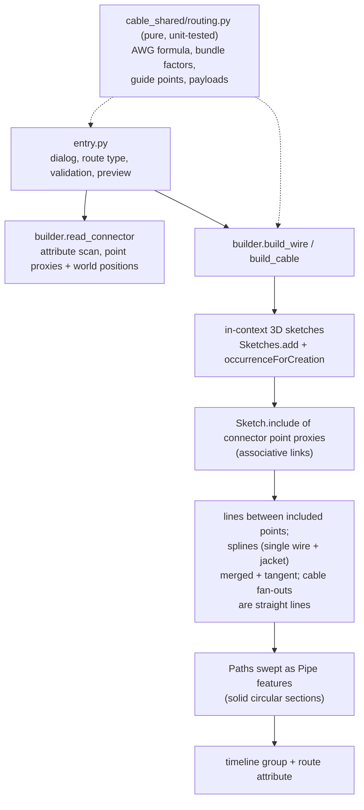

# Route Wire — Architecture
[← Route Wire guide](../Route%20Wire.md)

## Purpose

The build half of the cable family: consume the `PowerTools.Cable`
attributes written by [Define Wires](./Define%20Wires.md) from *assembly*
context and build real wire and cable geometry from them ([Update
Wire](./Update%20Wire.md) rebuilds it; [Wire Report](./Wire%20Report.md)
reports it). The family's shared modules live in `commands/cable_shared/`
(the `partnumber_shared` precedent): `schema.py` stays the single source
of truth for the attribute schema (imported as `schema`), the pure routing
logic (AWG math, gauge intersection and packing factors, spline guide
points, route payloads, result notes) is `routing.py` with tests in
`tests/test_cable_routing.py`, and the Fusion-side construction is
`builder.py`.



## How connector data is read (and why not findAttributes)

Whether `design.findAttributes` reaches into referenced (XRef) documents was
left an open question by Define Wires. Route Wire sidesteps it: the user
*selects* the two occurrences, so the command scans just those components
directly — every construction point and sketch point of `occurrence.component`
is checked for attributes in the `PowerTools.Cable` group
(`builder.read_connector` in `commands/cable_shared/builder.py`, shared
with Update Wire). This works identically for referenced and local
components.
Only **complete** wires (all three roles present, non-empty pin) are offered
for routing.

Each wire point is carried two ways: its occurrence **proxy**
(`entity.createForAssemblyContext(occ)`, used for the associative includes)
and its **world position** (`.geometry` for construction points,
`.worldGeometry` for sketch points — both root space, however deeply the
occurrence is nested; used for the preview and fallbacks).

## Geometry construction (associative)

All geometry building lives in `commands/cable_shared/builder.py` (shared
with Update Wire). New components use identity transforms, so
component-local coordinates equal root (world) coordinates.

**Associativity model.** Each routing sketch is created in root context
(`Sketches.add` with `occurrenceForCreation` — the API analog of the UI's
active occurrence) and the wire points are brought in with
`Sketch.include()` of the connector-point *proxies*. The lines are drawn
`addByTwoPoints` **between the included points**, so they are fully DEFINED
by connector geometry: the solver has no freedom on them, and they follow
when connectors move. Proxies captured at dialog time can go **stale** by
the time later sketches build (each occurrence/feature added can invalidate
them — the cable build does far more work before its wire sketches than the
single-wire build), so a failed include is retried once with a fresh proxy
recreated from the native entity (`read_connector` carries both). Only then
is the point baked at its world position and `isFixed` (so the lines stay
deterministic), counted in the build result and reported in the summary.
Connector swap/edit breaking the include links is accepted — Update Wire is
the recovery path.

- **Conductor** component — one 3D sketch (`Wire <name> conductor paths`)
  with a start-to-strip line per connector; each line becomes a Path
  (`Features.createPath(line, False)`) swept as a solid circular **Pipe**
  feature at the bare AWG diameter (`logic.conductor_diameter_mm`, the
  standard `0.127 mm * 92^((36-AWG)/39)` formula).
- **Sheath** component — one 3D sketch (`Wire <name> sheath path`): line
  strip1-to-exit1, line strip2-to-exit2, and an exit1-to-exit2 fitted spline.
  The spline's endpoints are **merged** into the lines' exit endpoints with
  `SketchPoint.merge` (the API's "drag one point onto another" join), and
  tangent constraints are added at both shared points. (`addCoincident`
  DOES document point-to-point support — its entity argument is "The
  SketchPoint or sketch curve that the point will be made coincident to" —
  contrary to an earlier note here; this merge recipe predates that
  finding and demonstrably works, so it is left alone.)
  Because the lines are fully defined by their endpoints, tangency
  deterministically bends only the spline — including on recompute when
  connectors move. If a step still refuses, the command falls back to an
  unconstrained spline shaped by directional guide points
  (`logic.spline_guide_points`: interior fit points continuing each
  strip-to-exit direction past the exit by 25% of the exit-to-exit span)
  and says so in the completion summary.
  The three curves are collected into one Path
  (`createPath(ObjectCollection, False)` — endpoint-connected curves) and
  swept as a Pipe at the user's sheath diameter.

### Cable routes (multi-conductor)

`builder.build_cable` builds the `Cable <name>` component (owning the
jacket body) with one nested `Wire <pin>` component per paired wire:

- **Jacket** — a fitted spline between the two included cable points
  (`cablepoint` attribute from Define Wires), fully associative: per side
  a CONSTRUCTION direction line runs from the first paired wire's included
  exit point to the included cable point, and the spline (ends merged into
  the cable points) is tangent to those lines — the same recipe as the
  single-wire exit spline, so it re-solves when connectors move. (An
  earlier baked-guide-point shape kinked and failed the pipe recompute
  after moves; baked guides remain only as the constraint fallback,
  flagged in the summary.) Swept as a Pipe at the cable diameter.
- **Per wire, per end** — a conductor stub (start-to-strip line, AWG
  diameter) and a sheathed end segment built from **two straight lines**:
  strip-to-exit and exit-to-cable-point, both drawn with
  `addByTwoPoints` directly between the included points, swept together
  as one Pipe at the wire diameter — 4 bodies per wire, grouped in that
  wire's component. The mid-run between cable points is represented by
  the jacket only. Lines between included points are the one construction
  that reliably follows connector moves.
  **Why not a smooth fan-out spline — the full record:** an early
  misdiagnosis ("point-to-point `addCoincident` is unsupported") drove a
  series of `SketchPoint.merge` recipes — a bare included point raised
  `InternalValidationError`; a persistent exit-to-cable anchor formed a
  two-curve loop that made the tangency unsolvable; a temporary anchor
  left the cable end silently detached after its deletion; fitting the
  spline THROUGH the included points (`SketchFittedSplines.add` with
  existing SketchPoints) never created a binding; the permanent
  construction helper line + merged ends *built without error* but left
  most fan-outs behind on a real connector move; so did explicit
  point-to-point coincident constraints with `addTangent`; and so did
  the geometrically IDEAL construction — the spline's **tangent handle**
  (`activateTangentHandle(fitPoint)` returns the handle as a real
  `SketchLine`; a collinear constraint pins it along the exit line — see
  git history). Every recipe built cleanly; a **Fusion recompute defect**
  left most constrained fan-out splines behind when a connector actually
  moved. Straight lines sidestep the defect entirely; revisit the
  tangent-handle spline when Autodesk fixes spline-constraint recompute
  (`logic.fanout_guide_points` and its tests are retained for that
  return).
- **Sizing** — `logic.cable_od_mm(wire_od, count)`: bundle OD = wire OD x
  per-count packing factor (standard cable-design table: 2 -> 2.0,
  3 -> 2.155, 4 -> 2.414, ... , `1.155*sqrt(n)` beyond 12), x1.03 lay
  allowance, + 2 x 0.6 mm jacket walls. Shown as the editable Cable
  diameter default.
- Pins pair in `logic.sort_pins` order (numeric-aware); counts must match;
  one AWG (`logic.awg_overlap_many` across every paired wire) governs all.
- **Build order: wires first, jacket last** — every operation before a
  sketch's includes is a chance for dialog-time proxies to stale, so the
  many per-wire includes run with the least prior mutation and the
  jacket's four (with their guide-point fallback) absorb the most.

**Pipe instead of manual sweep.** The described "sweep a circle along the
path" is implemented with `PipeFeatures` (path + solid circular section),
Fusion's native feature for exactly this — it removes the
plane-profile-alignment failure surface of a manual sweep.
**VERIFY AT RUNTIME:** `PipeFeatureInput.sectionSize` is assumed to be the
section **diameter** (matching the UI's "Section Size"); the API docs do not
specify radius vs diameter. If pipes come out double/half size, halve/double
the `ValueInput` in `entry._add_pipe`.

## Structure, naming, timeline

```text
Root
  Wire <name>     component, stamped with the route attribute
    Conductor     bodies "Wire <name> conductor 1|2"
    Sheath        body  "Wire <name> sheath"

Root
  Cable <name>    component, stamped with the route attribute; owns the
                  jacket body "Cable <name> jacket"
    Wire <pin>    per pair: bodies "Cable <name> wire <pin> conductor 1|2"
                  and "... sheath 1|2"
```

Every child component the builder creates is additionally stamped with a
**member** attribute (`PowerTools.Cable` / `member`, JSON
`{"schema": 1, "role": "conductor"|"sheath"|"wire", "pin": ...}` — pin on
wire members only, built by `schema.build_member_payload`). The Wire
Report identifies and labels children by these stamps instead of display
names, which users can rename and Fusion suffixes for uniqueness; name
matching survives only as its fallback for assemblies built before the
stamps existed.

`design.timeline.markerPosition` is captured before any creation; afterwards
everything from that index on is grouped via `timelineGroups.add` and the
group is named `Wire <name>` / `Cable <name>`. (True `CustomFeature` API
packaging —
definition registration plus compute handlers — was judged out of scope for a
prove-out; the timeline group delivers the "one named unit in the timeline"
behavior.) Grouping requires a parametric design, which command_created
enforces.

## Route attribute (schema v1 addition)

Stamped on the `Wire <name>` component: group `PowerTools.Cable`, name
`route`, JSON value:

```json
{"schema": 1, "name": "PWR1", "awg": 22, "od_mm": 1.54,
 "ends": [
   {"connector_id": "ConnA-3f9a2b1c", "wire_id": "7c1d2e3f", "pin": "1",
    "occ_token": "..."},
   {"connector_id": "ConnB-9ab04d12", "wire_id": "55aa66bb", "pin": "4",
    "occ_token": "..."}
 ]}
```

This makes routed wires enumerable later (which pins are already consumed,
re-route/update flows) without parsing geometry. `occ_token` is the
occurrence's `entityToken`, so Update Wire can re-resolve the exact instance
even when several occurrences of the same connector exist; `connector_id` is
its fallback when the token dies (see the Update Wire architecture notes).

Cable routes use `"kind": "cable"`, add `"cable_od_mm"`, and their ends
carry the whole pin set instead of a single wire:

```json
{"connector_id": "ConnA-3f9a2b1c", "occ_token": "...",
 "pins": ["1", "2", "3"], "wire_ids": ["7c1d2e3f", "9ab04d12", "55aa66bb"]}
```

(Single-wire payloads carry `"kind": "single"`; older payloads without the
field parse as single.)

## Known limitations (accepted for the prove-out)

- Associativity depends on the include links: connector **swap, re-insert,
  or redefined wire points** break them (accepted by design). The recovery
  path is [Update Wire](./Update%20Wire.md), which rebuilds from the route
  attribute.
- Pins already consumed by an existing route are still offered.
- The preview is a straight line (exit-to-exit for single wires,
  cable-point-to-cable-point for cables), not the final spline shape.
- Cable fan-out pipes overlap the jacket where they converge (no trim), and
  one gauge governs every wire in a cable.
- Icons are placeholders copied from `roundsketchdimensions`.

---

[← Route Wire guide](../Route%20Wire.md)
