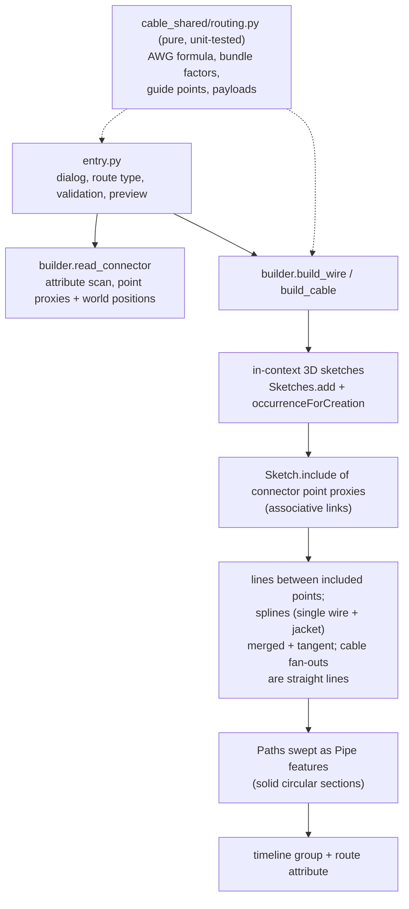

# Route Wire — Architecture
[← Route Wire guide](../Route%20Wire.md)

## Purpose

The build half of the cable family: consume the `PowerTools.Cable`
attributes written by [Define Wires](./Define%20Wires.md) from *assembly*
context and build real wire and cable geometry from them ([Update
Wire](./Update%20Wire.md) rebuilds it; [Wire Report](./Wire%20Report.md)
reports it). The family's shared modules live in `commands/cable_shared/`
(the `partnumber_shared` precedent): `schema.py` stays the single source
of truth for the attribute schema (imported as `schema`), the pure routing
logic (AWG math, gauge intersection and packing factors, spline guide
points, route payloads, result notes) is `routing.py` with tests in
`tests/test_cable_routing.py`, and the Fusion-side construction is
`builder.py`.



## How connector data is read (and why not findAttributes)

Whether `design.findAttributes` reaches into referenced (XRef) documents was
left an open question by Define Wires. Route Wire sidesteps it: the user
*selects* the two occurrences, so the command scans just those components
directly — every construction point and sketch point of `occurrence.component`
is checked for attributes in the `PowerTools.Cable` group
(`builder.read_connector` in `commands/cable_shared/builder.py`, shared
with Update Wire). This works identically for referenced and local
components.
Only **complete** wires (all three roles present, non-empty pin) are offered
for routing.

Each wire point is carried two ways: its occurrence **proxy**
(`entity.createForAssemblyContext(occ)`, used for the associative includes)
and its **world position** (`.geometry` for construction points,
`.worldGeometry` for sketch points — both root space, however deeply the
occurrence is nested; used for the preview and fallbacks).

## Geometry construction (associative)

All geometry building lives in `commands/cable_shared/builder.py` (shared
with Update Wire). New components use identity transforms, so
component-local coordinates equal root (world) coordinates.

**Associativity model.** Each routing sketch is created in root context
(`Sketches.add` with `occurrenceForCreation` — the API analog of the UI's
active occurrence) and the wire points are brought in with
`Sketch.include()` of the connector-point *proxies*. The lines are drawn
`addByTwoPoints` **between the included points**, so they are fully DEFINED
by connector geometry: the solver has no freedom on them, and they follow
when connectors move. Proxies captured at dialog time can go **stale** by
the time later sketches build (each occurrence/feature added can invalidate
them — the cable build does far more work before its wire sketches than the
single-wire build), so a failed include is retried once with a fresh proxy
recreated from the native entity (`read_connector` carries both). Only then
is the point baked at its world position and `isFixed` (so the lines stay
deterministic), counted in the build result and reported in the summary.
Connector swap/edit breaking the include links is accepted — Update Wire is
the recovery path.

- **Conductor** component — one 3D sketch (`Wire <name> conductor paths`)
  with a start-to-strip line per connector; each line becomes a Path
  (`Features.createPath(line, False)`) swept as a solid circular **Pipe**
  feature at the bare AWG diameter (`logic.conductor_diameter_mm`, the
  standard `0.127 mm * 92^((36-AWG)/39)` formula).
- **Sheath** component — one 3D sketch (`Wire <name> sheath path`): line
  strip1-to-exit1, line strip2-to-exit2, and an exit1-to-exit2 fitted spline.
  The spline's endpoints are **merged** into the lines' exit endpoints with
  `SketchPoint.merge` (the API's "drag one point onto another" join), and
  tangent constraints are added at both shared points. (`addCoincident`
  DOES document point-to-point support — its entity argument is "The
  SketchPoint or sketch curve that the point will be made coincident to" —
  contrary to an earlier note here; this merge recipe predates that
  finding and demonstrably works, so it is left alone.)
  Because the lines are fully defined by their endpoints, tangency
  deterministically bends only the spline — including on recompute when
  connectors move. If a step still refuses, the command falls back to an
  unconstrained spline shaped by directional guide points
  (`logic.spline_guide_points`: interior fit points continuing each
  strip-to-exit direction past the exit by 25% of the exit-to-exit span)
  and says so in the completion summary.
  The three curves are collected into one Path
  (`createPath(ObjectCollection, False)` — endpoint-connected curves) and
  swept as a Pipe at the user's sheath diameter.

### Cable routes (multi-conductor)

`builder.build_cable` takes two equal-length lists of
`(side_data, wire_record)` tuples (index-paired across the ends; a list's
side may repeat when the end spans connectors) and builds the
`Cable <name>` component (owning the jacket body) with one nested
`Wire <label>` component per paired wire:

- **End anchors** — an end whose wires all sit on ONE connector anchors on
  its published cable point (`cablepoint` attribute from Define Wires,
  associative include). An end spanning SEVERAL connectors gets an
  **implied anchor**: the centroid of those connectors' cable points,
  pulled `routing.CABLE_END_PULL` (10%) of the way toward the midpoint of
  the segment joining the two ends' base points (published points never
  move) — `routing.cable_end_anchors`, pure and unit-tested. Implied
  anchors are **static fixed sketch points by design** (an averaged
  position is not expressible as an associative include); the build result
  counts them in `implied_ends` (informational — NOT `baked_points`,
  which means an associativity *failure*) and the summary tells the user
  to run Update Wire after moving those connectors. Only Import
  Connectivity can author multi-connector ends; Route Wire's dialog stays
  two-connector.
- **Jacket** — a fitted spline between the two end anchors, per end: a
  CONSTRUCTION direction line runs from the exit to the anchor (published
  end: the first paired wire's included exit point to the included cable
  point, fully associative; implied end: a static point at the centroid of
  that end's exits to the static anchor), and the spline (ends merged into
  the anchors) is tangent to those lines — the same recipe as the
  single-wire exit spline, so published ends re-solve when connectors
  move. (An earlier baked-guide-point shape kinked and failed the pipe
  recompute after moves; baked guides remain only as the constraint
  fallback, flagged in the summary.) Swept as a Pipe at the cable
  diameter.
- **Per wire, per end** — a conductor stub (start-to-strip line, AWG
  diameter) and a sheathed end segment built from **two straight lines**:
  strip-to-exit and exit-to-cable-point, both drawn with
  `addByTwoPoints` directly between the included points, swept together
  as one Pipe at the wire diameter — 4 bodies per wire, grouped in that
  wire's component. The exit-to-anchor line lands on the included cable
  point (published end) or that wire sketch's own static copy of the
  implied anchor. The mid-run between the anchors is represented by the
  jacket only. Lines between included points are the one construction
  that reliably follows connector moves.
  **Why not a smooth fan-out spline — the full record:** an early
  misdiagnosis ("point-to-point `addCoincident` is unsupported") drove a
  series of `SketchPoint.merge` recipes — a bare included point raised
  `InternalValidationError`; a persistent exit-to-cable anchor formed a
  two-curve loop that made the tangency unsolvable; a temporary anchor
  left the cable end silently detached after its deletion; fitting the
  spline THROUGH the included points (`SketchFittedSplines.add` with
  existing SketchPoints) never created a binding; the permanent
  construction helper line + merged ends *built without error* but left
  most fan-outs behind on a real connector move; so did explicit
  point-to-point coincident constraints with `addTangent`; and so did
  the geometrically IDEAL construction — the spline's **tangent handle**
  (`activateTangentHandle(fitPoint)` returns the handle as a real
  `SketchLine`; a collinear constraint pins it along the exit line — see
  git history). Every recipe built cleanly; a **Fusion recompute defect**
  left most constrained fan-out splines behind when a connector actually
  moved. Straight lines sidestep the defect entirely; revisit the
  tangent-handle spline when Autodesk fixes spline-constraint recompute
  (`logic.fanout_guide_points` and its tests are retained for that
  return).
- **Sizing** — `logic.cable_od_mm(wire_od, count)`: bundle OD = wire OD x
  per-count packing factor (standard cable-design table: 2 -> 2.0,
  3 -> 2.155, 4 -> 2.414, ... , `1.155*sqrt(n)` beyond 12), x1.03 lay
  allowance, + 2 x 0.6 mm jacket walls. Shown as the editable Cable
  diameter default.
- Pins pair in `logic.sort_pins` order (numeric-aware) in Route Wire, or
  row by row from the CSV in Import Connectivity; counts must match; one
  AWG (`logic.awg_overlap_many` across every paired wire) governs all.
- **Wire labels** — every cable wire has a display label, unique within
  the cable and defaulting to its end-A pin (pins can collide across a
  multi-connector end: J3 pin 1 and J4 pin 1). The label names the wire
  component, rides the member stamp and the payload's `wire_labels`, and
  is the CSV `Wire` column on export/import.
- **Build order: wires first, jacket last** — every operation before a
  sketch's includes is a chance for dialog-time proxies to stale, so the
  many per-wire includes run with the least prior mutation and the
  jacket's four (with their guide-point fallback) absorb the most.

**Pipe instead of manual sweep.** The described "sweep a circle along the
path" is implemented with `PipeFeatures` (path + solid circular section),
Fusion's native feature for exactly this — it removes the
plane-profile-alignment failure surface of a manual sweep.
**VERIFY AT RUNTIME:** `PipeFeatureInput.sectionSize` is assumed to be the
section **diameter** (matching the UI's "Section Size"); the API docs do not
specify radius vs diameter. If pipes come out double/half size, halve/double
the `ValueInput` in `entry._add_pipe`.

## Structure, naming, timeline

```text
Root
  Wire <name>     component, stamped with the route attribute
    Conductor     bodies "Wire <name> conductor 1|2"
    Sheath        body  "Wire <name> sheath"

Root
  Cable <name>    component, stamped with the route attribute; owns the
                  jacket body "Cable <name> jacket"
    Wire <label>  per pair: bodies "Cable <name> wire <label> conductor
                  1|2" and "... sheath 1|2" (label = end-A pin unless the
                  CSV assigned one)
```

Every child component the builder creates is additionally stamped with a
**member** attribute (`PowerTools.Cable` / `member`, JSON
`{"schema": 1, "role": "conductor"|"sheath"|"wire", "pin": ..., "label":
...}` — pin and cable-unique label on wire members only, built by
`schema.build_member_payload`). The Wire
Report identifies and labels children by these stamps instead of display
names, which users can rename and Fusion suffixes for uniqueness; name
matching survives only as its fallback for assemblies built before the
stamps existed.

`design.timeline.markerPosition` is captured before any creation; afterwards
everything from that index on is grouped via `timelineGroups.add` and the
group is named `Wire <name>` / `Cable <name>`. (True `CustomFeature` API
packaging —
definition registration plus compute handlers — was judged out of scope for a
prove-out; the timeline group delivers the "one named unit in the timeline"
behavior.) Grouping requires a parametric design, which command_created
enforces.

## Colors and appearances

Bodies are colored with design-local appearances resolved in `builder.py`
(`_appearance_libraries` through `_conductor_appearance`) — always
best-effort, a build never fails over a missing appearance:

- **Wire colors** — the 12-color palette lives in
  `cable_shared/routing.py` (`WIRE_COLORS`; the tuple order IS the cable
  assignment sequence, cycling past twelve wires). Each color becomes a
  design-local appearance named `PowerTools Wire <key>` via the documented
  recipe: `Appearances.addByCopy` of a library paint appearance
  ("Paint - Enamel Glossy (Yellow)", with fallbacks — paint appearances
  carry a plain modifiable `Color` `ColorProperty`; not all appearance
  types do), then setting that property. Created once per design and
  reused by name on later builds.
- **Conductors are copper**: the library's real copper
  ("Copper - Polished", candidate-name ladder) copied into the design; a
  copper-tinted paint appearance is the fallback.
- **Cable jackets** use the black wire appearance.
- The appearance library is found by name ("Fusion Appearance Library",
  with the older "Fusion 360 Appearance Library" as fallback, then a scan
  of every installed library) — library and appearance names are
  localization-sensitive, hence the ladders.
- The chosen color(s) are stored in the route payload (`color` /
  `colors`, additive v1 fields) so Update Wire rebuilds with the original
  colors; legacy routes without them rebuild with defaults.

## Route attribute (schema v1 addition)

Stamped on the `Wire <name>` component: group `PowerTools.Cable`, name
`route`, JSON value:

```json
{"schema": 1, "name": "PWR1", "awg": 22, "od_mm": 1.54,
 "ends": [
   {"connector_id": "ConnA-3f9a2b1c", "wire_id": "7c1d2e3f", "pin": "1",
    "occ_token": "..."},
   {"connector_id": "ConnB-9ab04d12", "wire_id": "55aa66bb", "pin": "4",
    "occ_token": "..."}
 ]}
```

This makes routed wires enumerable later (which pins are already consumed,
re-route/update flows) without parsing geometry. `occ_token` is the
occurrence's `entityToken`, so Update Wire can re-resolve the exact instance
even when several occurrences of the same connector exist; `connector_id` is
its fallback when the token dies (see the Update Wire architecture notes).

Cable routes use `"kind": "cable"`, add `"cable_od_mm"` and
`"wire_labels"` (display labels, index-paired with `pins`/`colors`), and
their ends carry the whole pin set instead of a single wire. A
single-connector end keeps the legacy flat shape:

```json
{"connector_id": "ConnA-3f9a2b1c", "occ_token": "...",
 "pins": ["1", "2", "3"], "wire_ids": ["7c1d2e3f", "9ab04d12", "55aa66bb"]}
```

An end spanning several connectors lists them, with a per-wire index into
that list — and deliberately OMITS the top-level identity keys, so an old
add-in build skips the route with a note instead of misreading it as
two-connector:

```json
{"connectors": [{"connector_id": "ConnA-...", "occ_token": "..."},
                {"connector_id": "ConnB-...", "occ_token": "..."}],
 "pins": ["1", "1"], "wire_ids": ["7c1d2e3f", "55aa66bb"],
 "wire_connectors": [0, 1]}
```

Both shapes are emitted by `routing.cable_route_end` and read back through
the normalizing helpers `routing.end_connectors` /
`routing.end_wire_connectors` (legacy ends read as the one-connector
case), which Update Wire, Wire Report, and Export/Import Connectivity all
share. (Single-wire payloads carry `"kind": "single"`; older payloads
without the field parse as single.)

## Known limitations (accepted for the prove-out)

- Associativity depends on the include links: connector **swap, re-insert,
  or redefined wire points** break them (accepted by design). The recovery
  path is [Update Wire](./Update%20Wire.md), which rebuilds from the route
  attribute.
- Pins already consumed by an existing route are still offered.
- The preview is a straight line (exit-to-exit for single wires,
  cable-point-to-cable-point for cables), not the final spline shape.
- Cable fan-out pipes overlap the jacket where they converge (no trim), and
  one gauge governs every wire in a cable.
- Implied (multi-connector) end anchors are static computed points: moving
  one of those connectors deforms the fan-out lines (their connector-side
  points are still included) but leaves the anchor and jacket in place
  until Update Wire rebuilds the cable.

---

[← Route Wire guide](../Route%20Wire.md)
